# How do I install and use a SmartLynq in a Linux VM on a ZCU102?

This post shows how to install and use a SmartLynq on a ZCU102 from Vivado 2019.1 running on a Ubuntu 16.04.5 VM managed by VMWare Workstation 14 Player running on Windows 10 Pro.

I also demonstrate that using a SmartLynq results in a 3x speed up over using the JTAG-to-USB device from Digilent.

**<u>Assumptions</u>**

You've install Vivado 2019.1 onto a Ubuntu 16.04.5 VM managed by VMWare Workstation 14 Player running on Windows 10 Pro

**<u>Steps</u>**

Step [#1](https://www.centennialsoftwaresolutions.com/blog/hashtags/1): Connect the SmartLynq USB cable

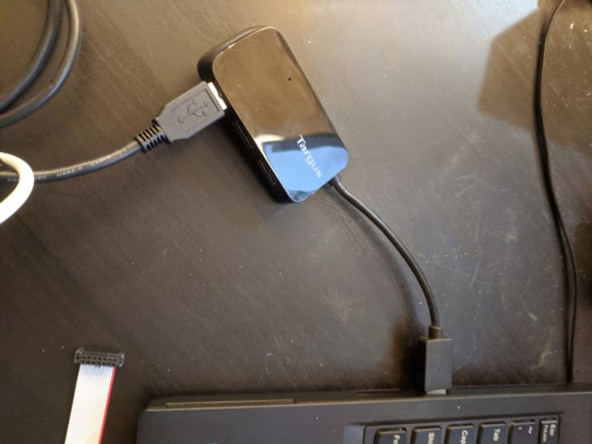

You should see something like:

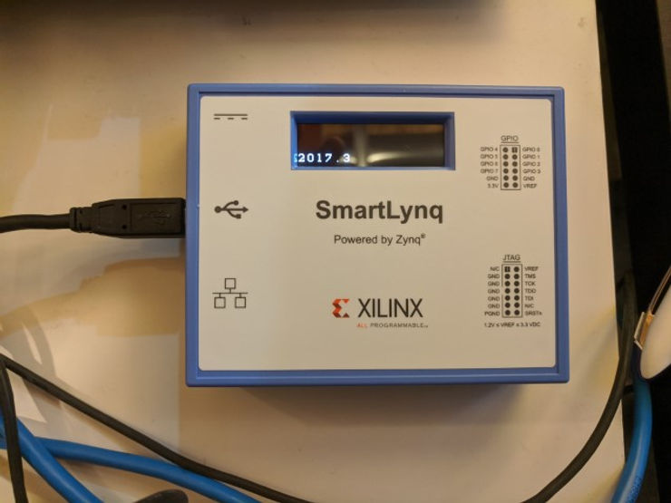

Step [#2](https://www.centennialsoftwaresolutions.com/blog/hashtags/2): Connect to the Xilinx Smart JTAG Cable

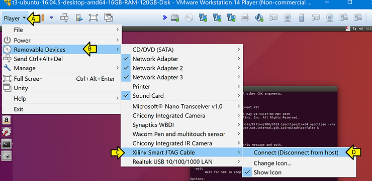

Step [#3](https://www.centennialsoftwaresolutions.com/blog/hashtags/3): Run Vivado

Step [#4](https://www.centennialsoftwaresolutions.com/blog/hashtags/4): Click **Open Hardware Manager**

Step [#5](https://www.centennialsoftwaresolutions.com/blog/hashtags/5): Click **Open target**

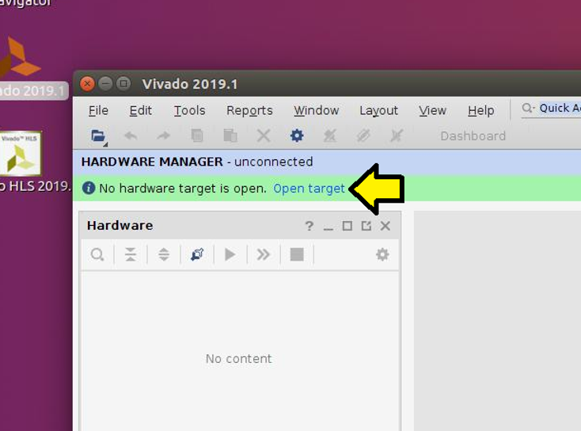

Step [#6](https://www.centennialsoftwaresolutions.com/blog/hashtags/6): Click **Open New Target...**

Step [#7](https://www.centennialsoftwaresolutions.com/blog/hashtags/7): Click **Next >**

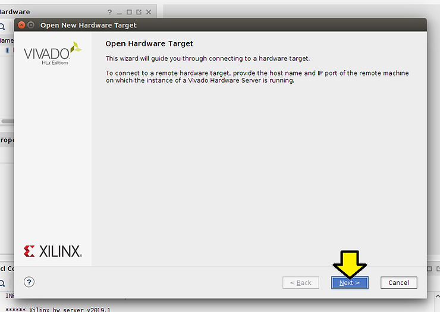

Step [#8](https://www.centennialsoftwaresolutions.com/blog/hashtags/8): (A) Select **Remote server**, (B) use 10.0.0.2 as shown on the SmartLynq, and (C) click Next >

Step [#9](https://www.centennialsoftwaresolutions.com/blog/hashtags/9): Click OK to update if you see this

You should see:

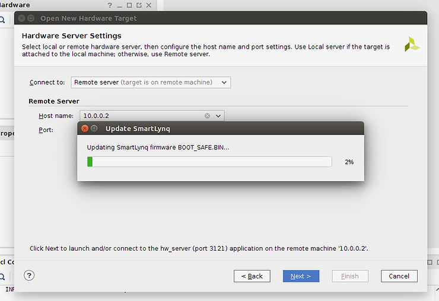

...and:

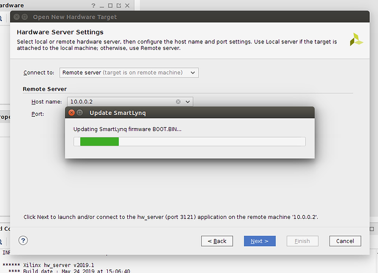

...and on the SmartLynq:

Step [#10](https://www.centennialsoftwaresolutions.com/blog/hashtags/10): Connect the SmartLynq to the ZCU102

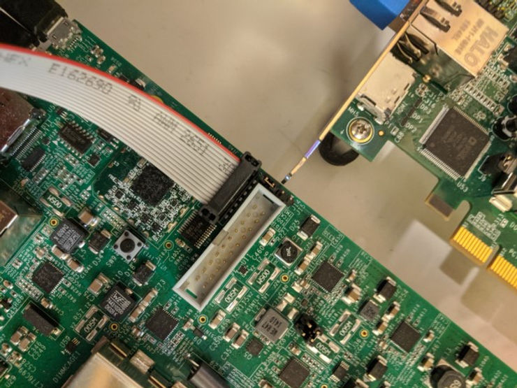

Step [#11](https://www.centennialsoftwaresolutions.com/blog/hashtags/11): Note the **Hardware server** address

Step [#12](https://www.centennialsoftwaresolutions.com/blog/hashtags/12): (A) Select **60000000 (7 0's)** then you should be able to (B) **click Next >**

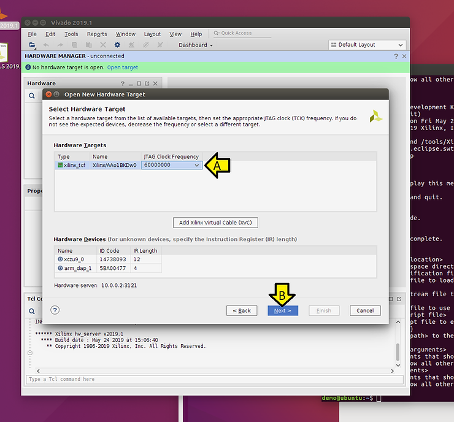

Step [#13](https://www.centennialsoftwaresolutions.com/blog/hashtags/13): Click **Finish**

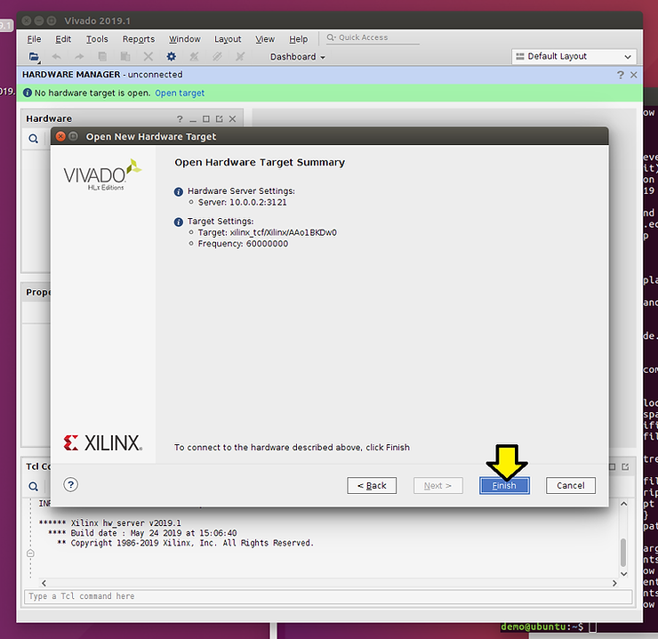

You should see:

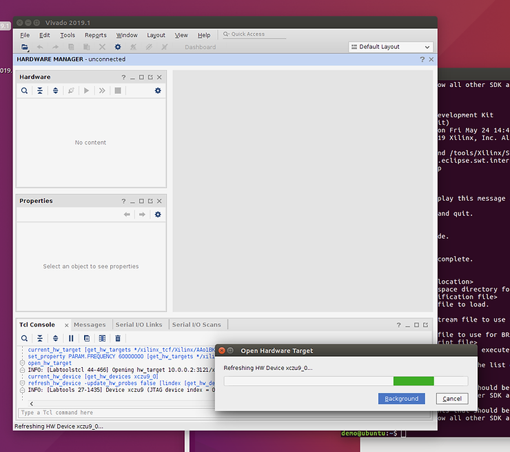

...and finally:

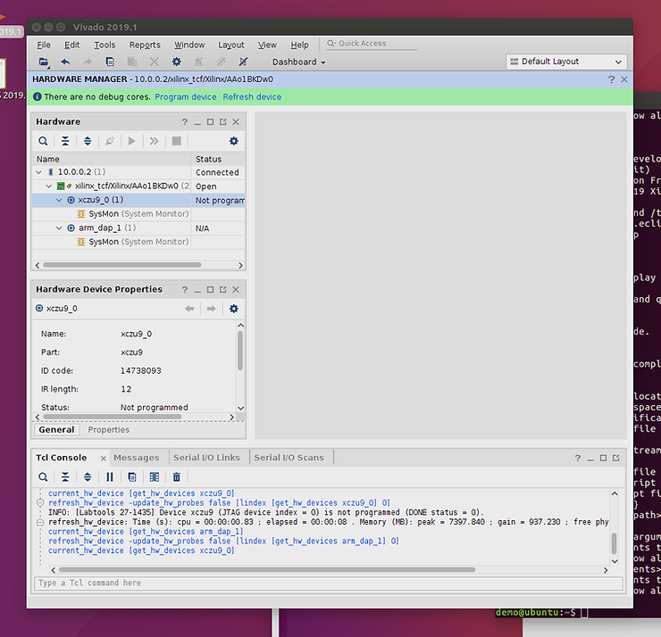

Step [#14](https://www.centennialsoftwaresolutions.com/blog/hashtags/14): Test using a PetaLinux ZCU102 load:

Step #: Install PetaLinux 2019.1

mkdir -p $HOME/petalinux

cd ~/Downloads

./petalinux-v2019.1-final-installer.run $HOME/petalinux/2019.1

Step #: Build the xilinx-zcu102-v2019.1-final.bsp

mkdir -p ~/plxprjs

cd ~/plxprjs

source ~/petalinux/2019.1/settings.sh

petalinux-create -t project -s ~/Downloads/xilinx-zcu102-v2019.1-final.bsp

cd xilinx-zcu102-2019.1/

petalinux-build

petalinux-boot --qemu --kernel

Step #: Load it

time petalinux-boot --jtag --kernel --hw\_server-url 10.0.0.2:3121

I got:

**real 0m51.708s**

user 0m3.221s

sys 0m4.290s

**<u>Test Using the JTAG-to-USB Connection</u>**

Step [#1](https://www.centennialsoftwaresolutions.com/blog/hashtags/1): Disconnect the SmartLynq

Step [#2](https://www.centennialsoftwaresolutions.com/blog/hashtags/2): Connect the UART-to-USB and JTAG-to-USB

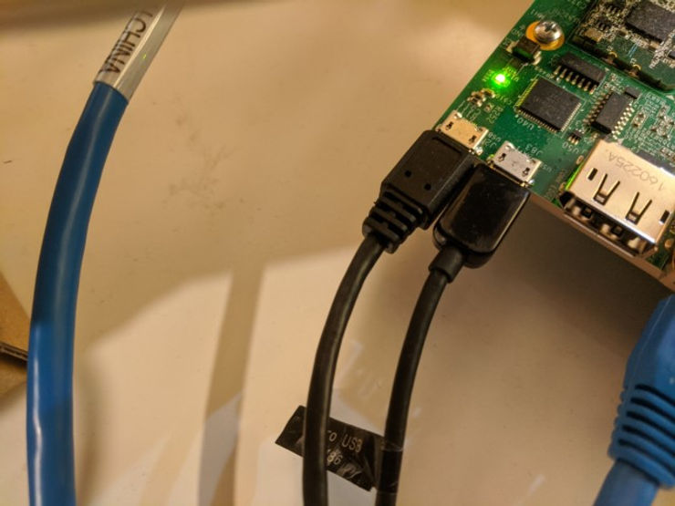

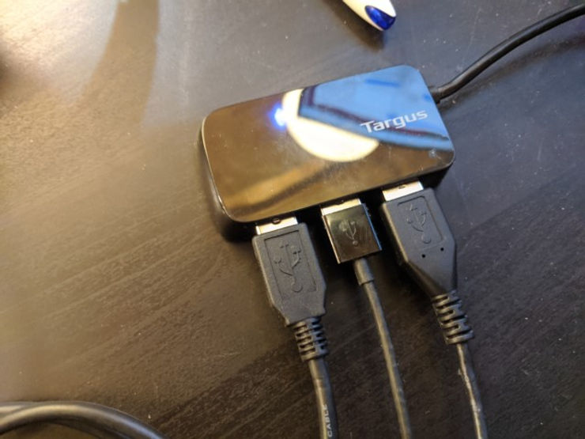

Step [#3](https://www.centennialsoftwaresolutions.com/blog/hashtags/3): Click OK

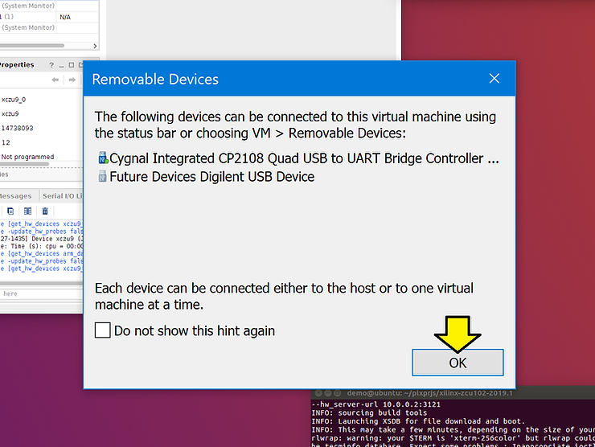

Step [#4](https://www.centennialsoftwaresolutions.com/blog/hashtags/4): Select **Future Device Digilent USB Device**

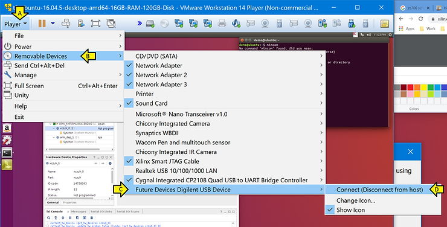

Step [#5](https://www.centennialsoftwaresolutions.com/blog/hashtags/5): Click **Open New Target...**

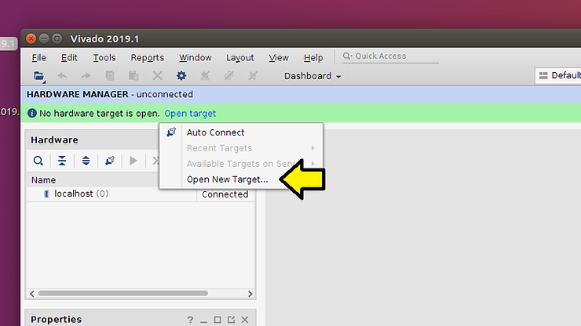

Step [#6](https://www.centennialsoftwaresolutions.com/blog/hashtags/6) Click **Next >**

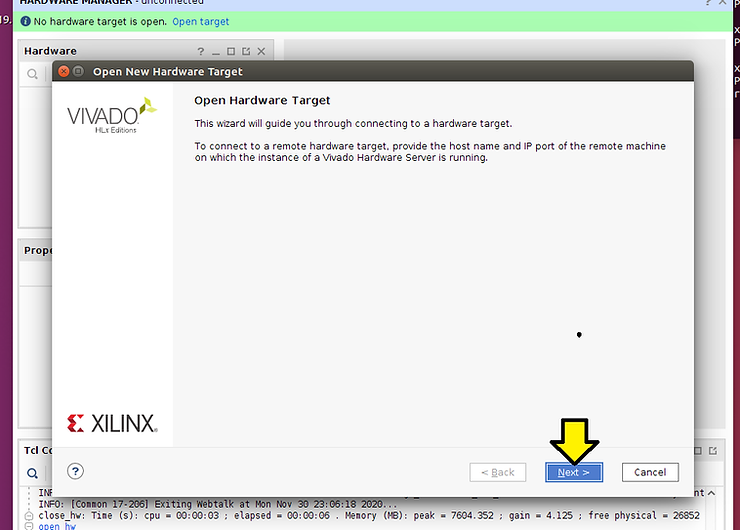

Step [#7](https://www.centennialsoftwaresolutions.com/blog/hashtags/7): (1) Select **Local server** and (2) click **Next >**

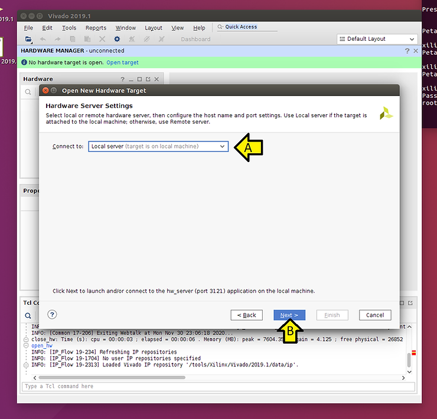

You should see:

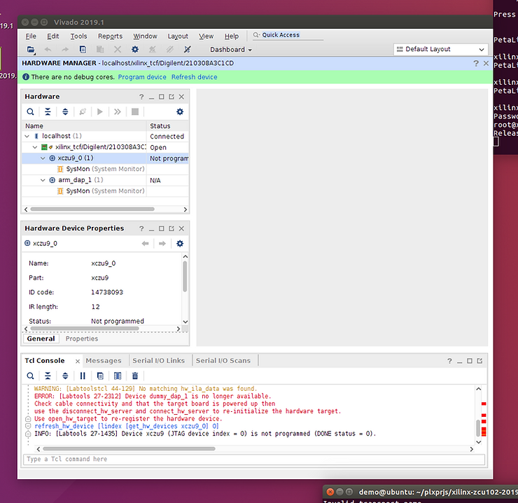

Step [#8](https://www.centennialsoftwaresolutions.com/blog/hashtags/8): Run:

**time petalinux-boot --jtag --kernel**

I see:

**real 3m15.098s**

user 0m2.742s

sys 0m1.524s

**<u>References</u>**

-   Used [<u>https://www.bricelam.net/ImageResizer/</u>](https://www.bricelam.net/ImageResizer/) to batch resize pictures
    
-   The Xilinx graphic is from \[[link](http://pbs.twimg.com/profile_images/535545777020338176/pEWdIYq__400x400.png)\]