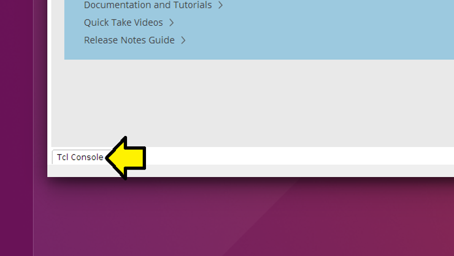
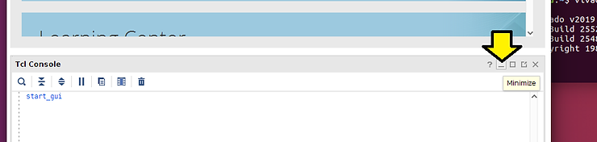
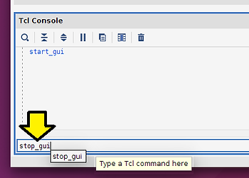
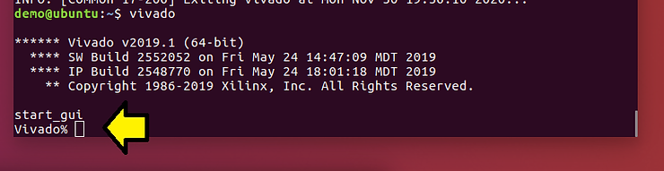

# How do I run Vivado 2019.1 from the command line on Linux?

This post shows how to run Vivado 2019.1 from the command line. It also shows you how to run Vivado in non-GUI mode and in batch mode.

**Steps**

Step [#1](https://www.centennialsoftwaresolutions.com/blog/hashtags/1): Open a terminal

Step [#2](https://www.centennialsoftwaresolutions.com/blog/hashtags/2): Figure out whether you're running csh or bash by typing:

**ps -p $$**

You should see something like:

   PID TTY          TIME CMD

  2729 pts/1    00:00:00 bash

Step [#3](https://www.centennialsoftwaresolutions.com/blog/hashtags/3): Find settings64.sh or settings64.csh

**find / -name "settings\*sh"**

You should see something like:

/tools/Xilinx/Vivado/2019.1/settings64.sh

/tools/Xilinx/Vivado/2019.1/settings64.csh

Step [#4](https://www.centennialsoftwaresolutions.com/blog/hashtags/4): If you're running bash type:

**source /tools/Xilinx/Vivado/2019.1/settings64.sh**

**vivado**

...or csh type:

**source /tools/Xilinx/Vivado/2019.1/settings64.csh**

**vivado**

You can also use:

**vivado -mode gui**  

...and to get helpL

**vivado -help** 

You should see something like:

****** Vivado v2019.1 (64-bit)

  **** SW Build 2552052 on Fri May 24 14:47:09 MDT 2019

  **** IP Build 2548770 on Fri May 24 18:01:18 MDT 2019

​    ** Copyright 1986-2019 Xilinx, Inc. All Rights Reserved.

start_gui

...and then see the GUI pop up.

**Stop the GUI from the GUI**

If you'd like to stop the GUI from the GUI

Step [#1](https://www.centennialsoftwaresolutions.com/blog/hashtags/1): Click **Tcl Console**

Note: you can minimize the console by clicking:

Step [#2](https://www.centennialsoftwaresolutions.com/blog/hashtags/2): type **stop\_gui** in the console

You'll see a Vivado prompt:

- Note 2: Type **start_gui** to restart the GUI.

  **Run Vivado without a GUI**

  To run Vivado without the GUI type:

  **vivado -mode tcl** 

  ^^^ from page 4 of [[UG835 v2019.1 Tcl Command Reference Guide](https://www.xilinx.com/support/documentation/sw_manuals/xilinx2019_1/ug835-vivado-tcl-commands.pdf)]

  **Run Vivado in Batch Mode, i.e. Just Run a TCL Script**

  **vivado -mode batch -source <your_Tcl_script>** 

  ^^^ also from page 4 of [[UG835 v2019.1 Tcl Command Reference Guide](https://www.xilinx.com/support/documentation/sw_manuals/xilinx2019_1/ug835-vivado-tcl-commands.pdf)]

  **References**

  - How do I check which shell I am using? [[link](https://askubuntu.com/questions/590899/how-do-i-check-which-shell-i-am-using)]
  - UG835 (v2019.1) May 22, 2019 **Tcl Command Reference Guide** [[link](https://www.xilinx.com/support/documentation/sw_manuals/xilinx2019_1/ug835-vivado-tcl-commands.pdf)]
  - UG973 (v2019.1) June 7, 2019 **Vivado Design Suite 2019.1 Release Notes** [[link](https://www.xilinx.com/support/documentation/sw_manuals/xilinx2019_1/ug973-vivado-release-notes-install-license.pdf)]
  - UG894 (v2019.1) May 22, 2019 **Using Tcl Scripting** [[link](https://www.xilinx.com/support/documentation/sw_manuals/xilinx2019_1/ug894-vivado-tcl-scripting.pdf)]
  - The Xilinx graphic is from [[link](http://pbs.twimg.com/profile_images/535545777020338176/pEWdIYq__400x400.png)] 

   