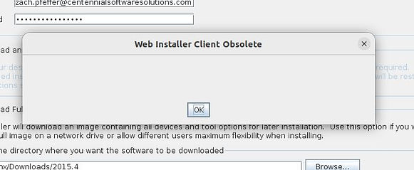
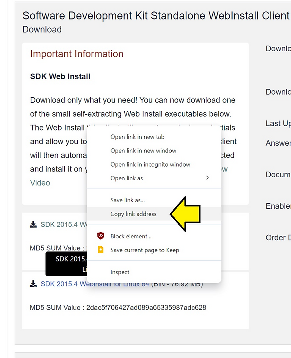

# How do I workaround the Web Installer Client Obsolete error?

This post answers, "How do I workaround the "Web Installer Client Obsolete" error?" You may get this error when trying to install a Xilinx/AMD tool via the webinstaller that's more than 3 years old. These steps were created and verified on July 8th, 2024.

## Workaround Web Installer Client Obsolete

If you try to use a Web Installer older than three years (3 years quoted from [<u>link</u>](https://support.xilinx.com/s/question/0D52E00006hpLfVSAU/install-sdk-20154-fails?language=en_US)), you'll get an error message:

So, web install links won't work. However, you will need the filename from the link.

Don't click on the link; copy **the link address**

For Windows its:

https://www.xilinx.com/member/forms/download/xef.html?filename=Xilinx_SDK_2015.4_1118_2_Win64.exe

For Linux its:

[https://www.xilinx.com/member/forms/download/xef.html?filename=](https://www.xilinx.com/member/forms/download/xef.html?filename=Xilinx_SDK_2015.4_1118_2_Lin64.bin)[Xilinx_SDK_2015.4_1118_2](https://www.xilinx.com/member/forms/download/xef.html?filename=Xilinx_SDK_2015.4_1118_2_Lin64.bin)[_Lin64.bin](https://www.xilinx.com/member/forms/download/xef.html?filename=Xilinx_SDK_2015.4_1118_2_Lin64.bin)

Now take the first part of the filename [Xilinx_SDK_2015.4_1118_2](https://www.xilinx.com/member/forms/download/xef.html?filename=Xilinx_SDK_2015.4_1118_2_Lin64.bin) and construct this link:

[https://www.xilinx.com/member/forms/download/xef.html?filename=](https://www.xilinx.com/member/forms/download/xef.html?filename=Xilinx_Vivado_SDK_2015.4_1118_2.tar.gz)[Xilinx_Vivado_SDK_2015.4_1118_2](https://www.xilinx.com/member/forms/download/xef.html?filename=Xilinx_Vivado_SDK_2015.4_1118_2.tar.gz)[.tar.gz](https://www.xilinx.com/member/forms/download/xef.html?filename=Xilinx_Vivado_SDK_2015.4_1118_2.tar.gz)

This file ^^^ has both the Windows and Linux installer and is 10.4 GB.

Or use the AMD link:

https://account.amd.com/en/forms/downloads/xef.html?filename=Xilinx_SDK_2015.4_1118_2.tar.gz