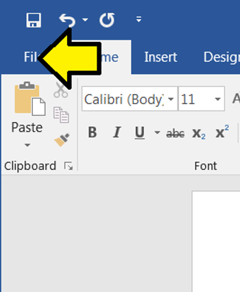
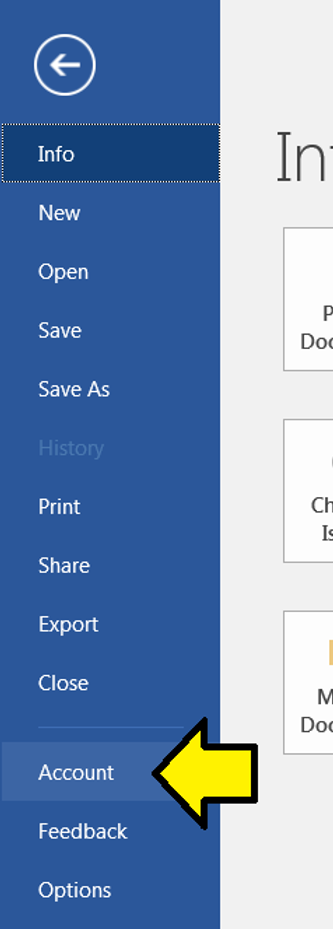
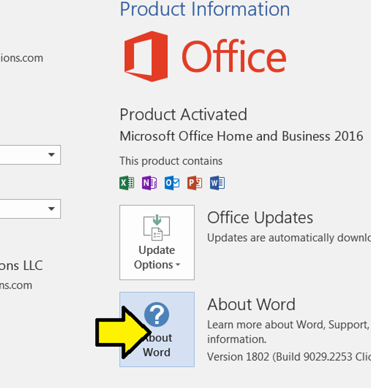

# How To Find Which Version of Word You're Using

This post shows you how to figure out which version of Word you're using.

The steps worked on Word 2016 MSO (16.0.9029.2253) 32-bit

1\. Click **File**

2\. Click **Account**

3\. Click **About Word**

**References**

Word image from [link](http://www.microsoft.com/en-us/store/d/word-2016/cfq7ttc0k5d7?activetab=pivot%3aoverviewtab)