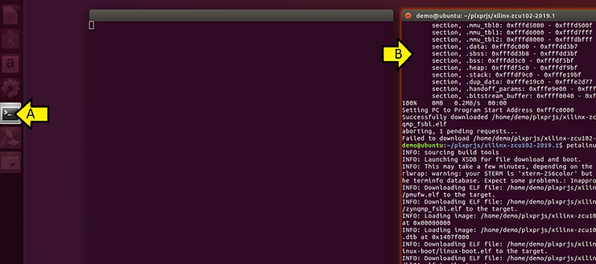
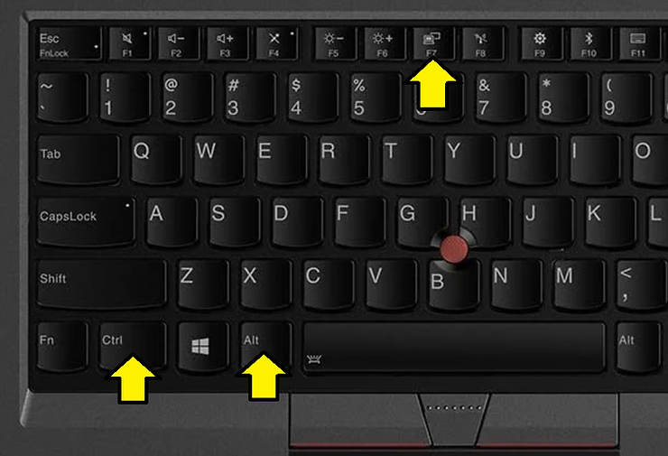

# How to Get a Window Back on Your Ubuntu 16.04.5 Desktop on a Thinkpad P52 with Ctrl and Fn Switched

This post shows how to get an "off-screen" window back on your Ubuntu 16.04.5 desktop.

**<u>Steps</u>**

Step [#1](https://www.centennialsoftwaresolutions.com/blog/hashtags/1): A) Click the program group. B) Click the "off-screen" window

Step [#2](https://www.centennialsoftwaresolutions.com/blog/hashtags/2): Press Fn Alt F7 at the same time:

Step [#3](https://www.centennialsoftwaresolutions.com/blog/hashtags/3): Use the **cursor keys** to move the window until you see it. Using the cursor keys tends to work **better than the mouse** which may not work.

**<u>References</u>**

Pic of the keyboard from \[[<u>link</u>](https://g.co/kgs/SCH4hV)\]

Ubuntu logo from \[[<u>link</u>](https://images.app.goo.gl/9noUQtrr3PFafCAv9)\]