# How to Permanently Mount an External Drive as a Folder on Windows 10

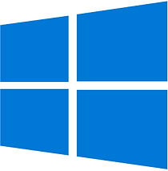

This post shows screenshots corresponding to the steps to permanently mount an external drive as a folder on Windows 10.

## Steps

\# **"Create an empty folder**. You need to create a new empty folder and store it on an NTFS or ReFS drive."

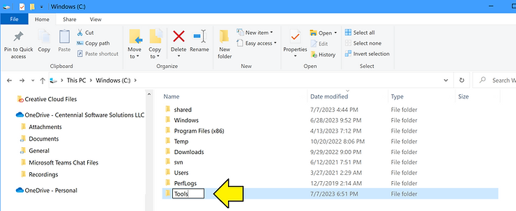

\# "In the search box on the taskbar, enter Computer Management..."

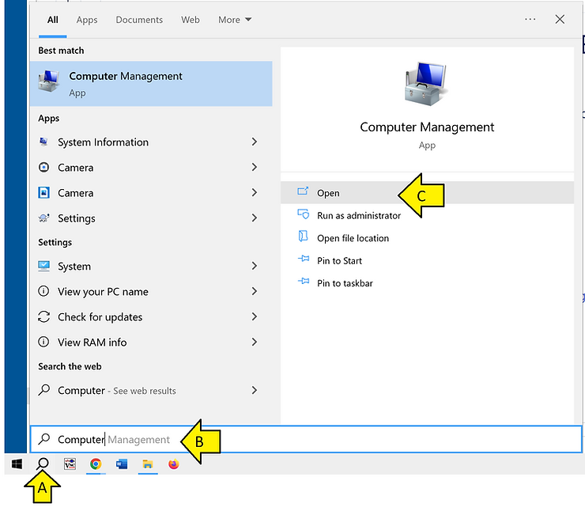

\# "...and select **Disk Management**."

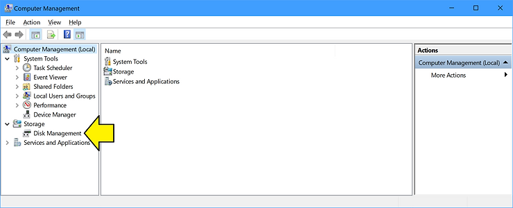

On my [<u>system</u>](https://www.zachpfeffer.com/single-post/2020/08/24/new-lenovo-p52-thinkpad-system-information) I see **Connecting to Virtual Disk Service...** for 10's of seconds:

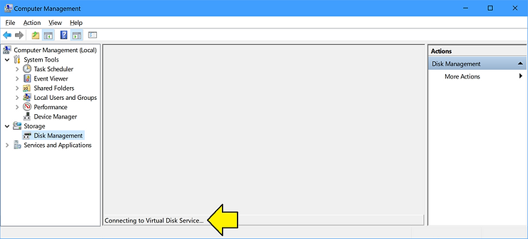

\# Plug in the external drive

\# Right-click on the drive and select **Change Drive Letter and Paths...**

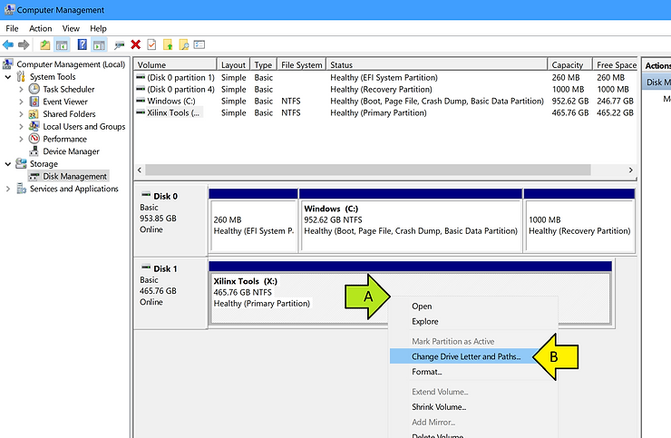

\# Click **Add**

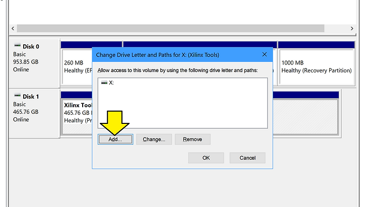

\# Click **Browse...**, click the empty folder (**Tools**), and click **OK**

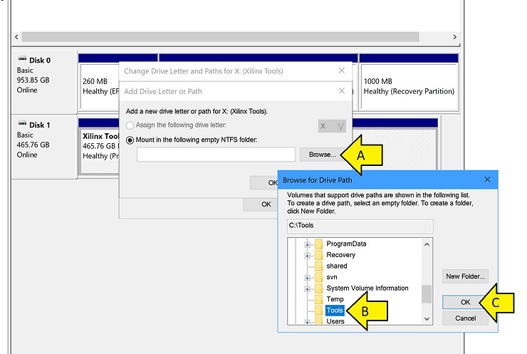

...click OK again.

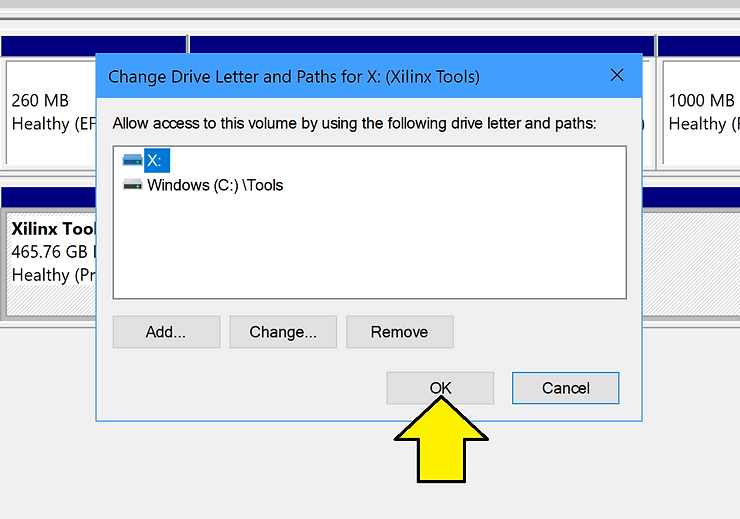

\# Browse to the directory and create Test Folder

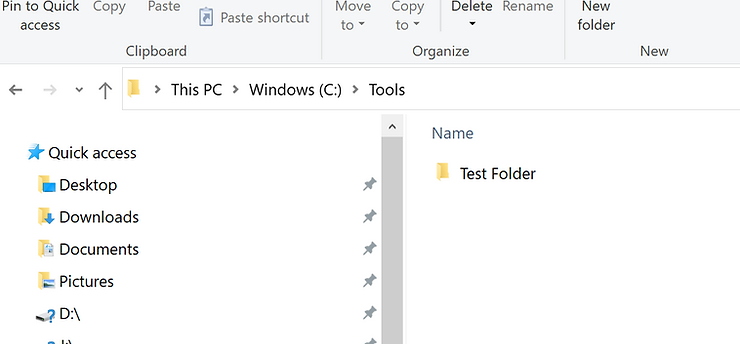

## Testing Samsung Portable SSD T5 Eject and Reinsert

\# Close the explorer window to the folder, right-click on the **Eject** icon, and click on **Eject Portable SSD T5** (the name of your drive may be different).

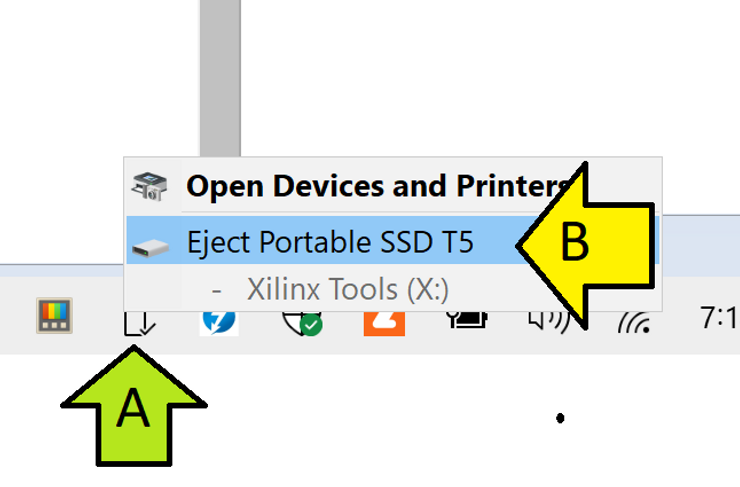

I saw:

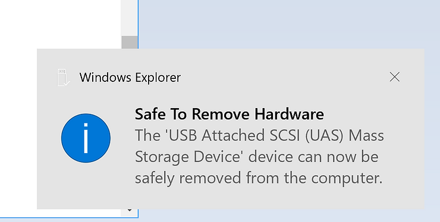

If I was browsing the drive I saw the following:

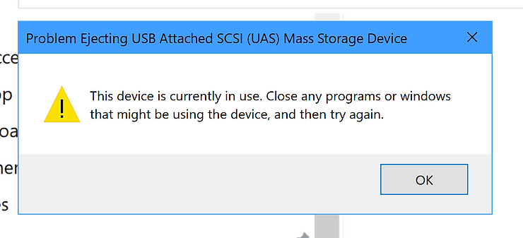

When I tried to click on the folder where the disk was mounted, I saw:

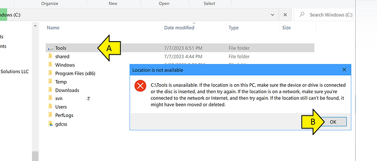

...plugging the external drive back in made it available.

If the drive was plugged in and I slept the computer, then I unplugged the drive, I caused the same "unavailable error."

If I was exploring the drive and then disconnected it, I saw the "unavailable error."

If the drive was disconnected, I slept the computer, reconnected it while the computer was asleep, and then woke the computer up, the drive was available.

## References

Mount a drive as a folder with Disk Management

https://learn.microsoft.com/en-us/windows-server/storage/disk-management/assign-a-mount-point-folder-path-to-a-drive 

Windows 10 Logo

[https://commons.wikimedia.org/wiki/File:Windows_logo_-_2012_%28dark_blue%29.svg](https://commons.wikimedia.org/wiki/File:Windows_logo_-_2012_(dark_blue).svg) 