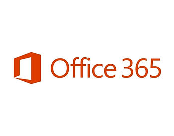
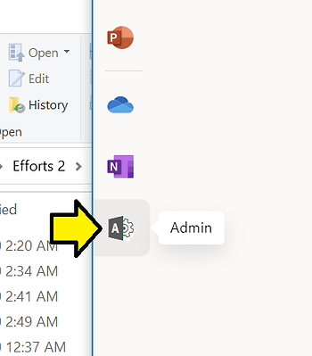
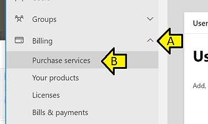

# How to "Purchase services" like Office 365 at office.com

This post shows how to find the "**Purchase services**" screen after logging into [<u>office.com</u>](http://office.com/)

Step [#1](https://www.centennialsoftwaresolutions.com/blog/hashtags/1): Go to \[[<u>link</u>](http://office.com/)\]

Step [#2](https://www.centennialsoftwaresolutions.com/blog/hashtags/2): Click **Admin** (this takes you to \[[<u>link</u>](https://admin.microsoft.com/AdminPortal/Home#/homepage)\])

Step [#3](https://www.centennialsoftwaresolutions.com/blog/hashtags/3): (A) Expand **Billing** and (B) click **Purchase services**

**<u>Reference</u>**

Office 365 logo from \[[<u>link</u>](https://images.app.goo.gl/uAGQ146v9Wwbm94b6)\]