# How to Remove Sharing from all Google Drive Files

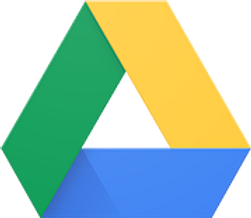

This post shows how to remove sharing from all your Google Drive files. Its a bit of a workaround, but its better than doing it manually.

Step 1:

In the search-bar type: owner:me before:2019-12-31 after:2019-01-01

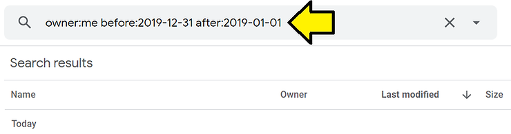

Note: the dates allow only a subset of files to be displayed at a time.

Step 2: Click the first result

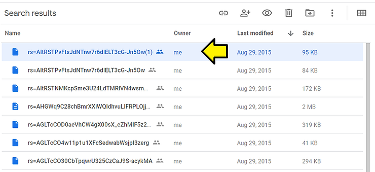

Step 3: Type Ctrl-a

Important Note 1: you may need to scroll down to see all the files

Important Note 2: it may take a log time or hang Google Drive to select them like this

Important Note 3: you can also hold down Ctrl and click each file with the **shared icon**; the files do not need to be listed contiguously

You should see all the results selected:

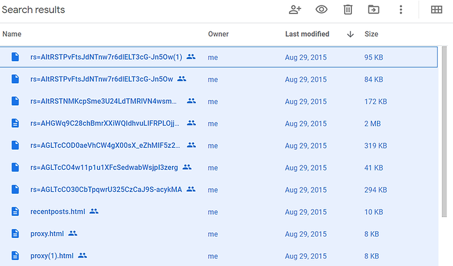

Step 4: Right-click on the first entry and select **Share**

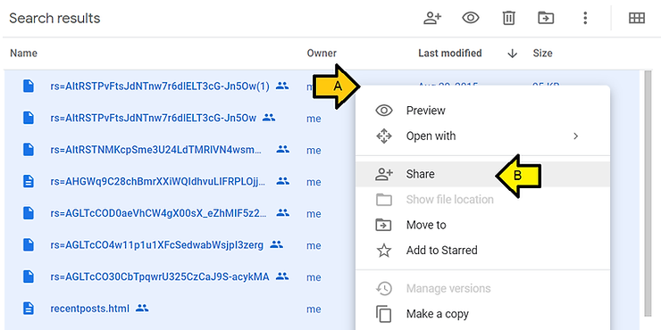

Step 5: Click **Advanced**

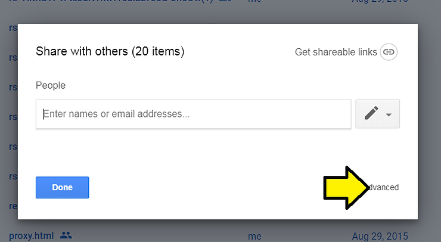

Step 6: Click the **x** on everyone listed

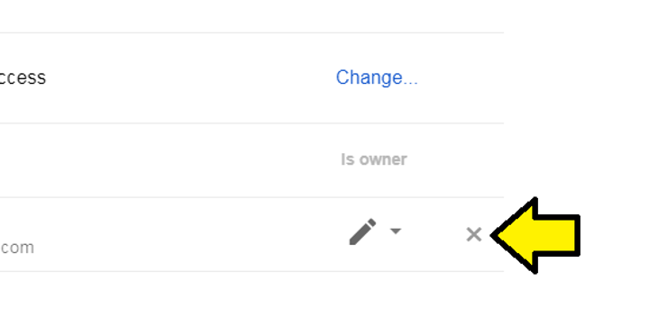

Step 7: Click **Save changes**

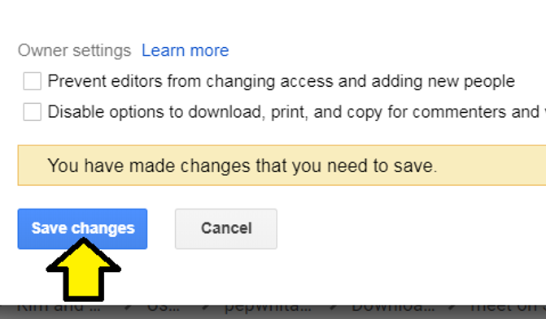

Step 8: Click **Change...**

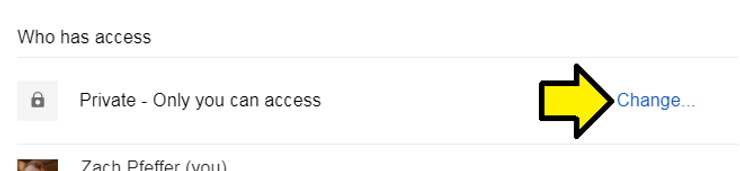

Step 9: (A) Click **Off - Specific people** and (B) click **Save**

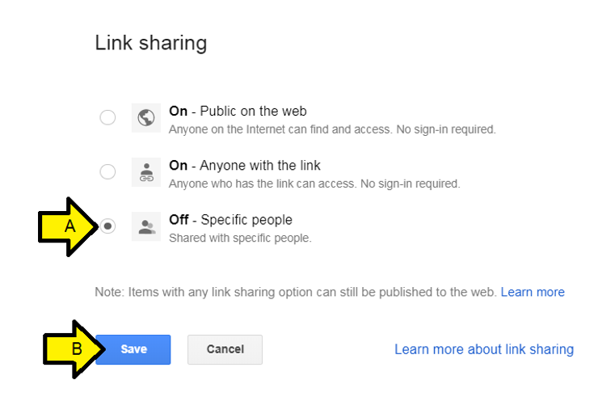

Step 10: Click **Done**

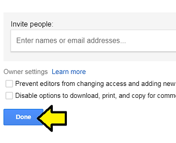

Step 11: Repeat for each year.

Note: I tried to just use **owner:me** and press Ctrl-a but my browser hung.

**References**

-   Drive logo from [link](http://www.google.com/drive/)