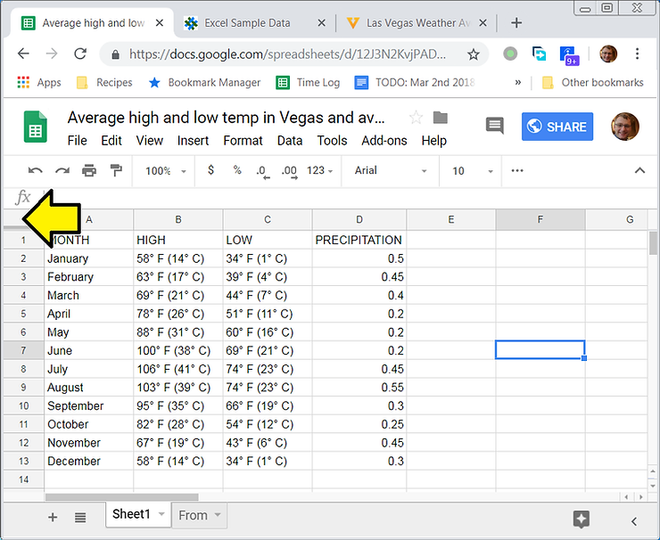
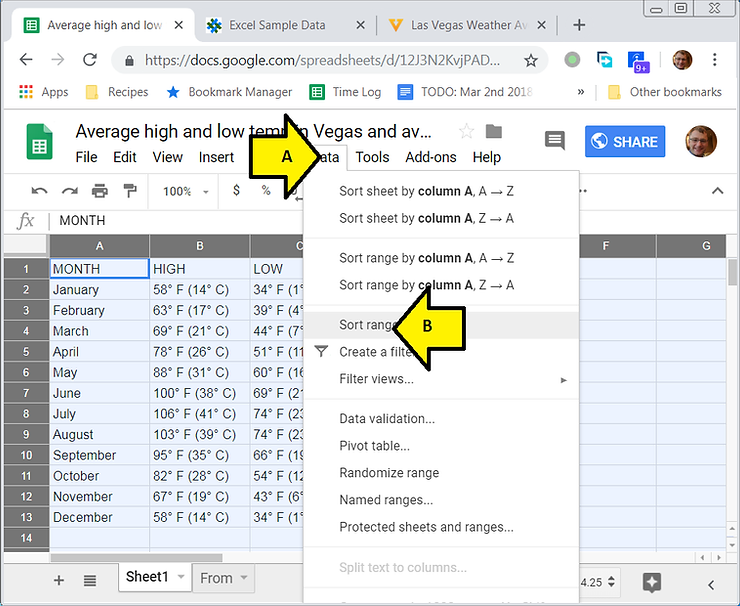
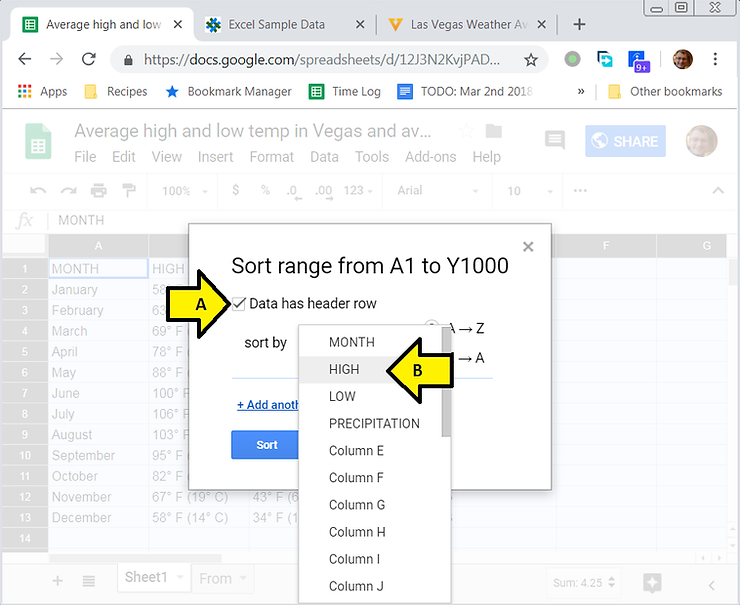
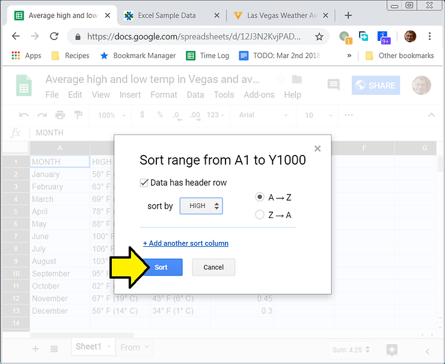
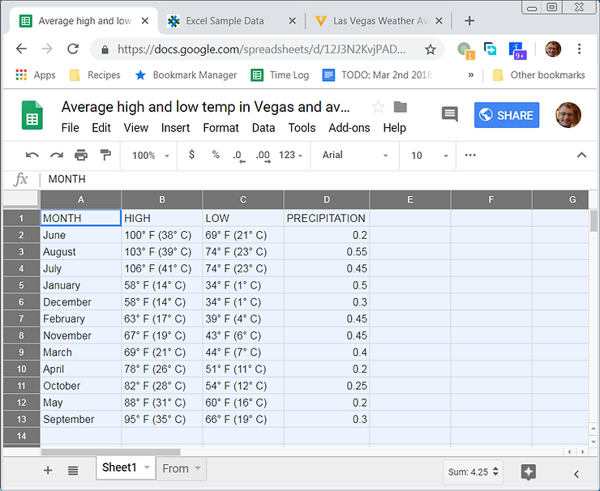

# How to Sort Data with Headers in Google Sheets

This post describes how to sort data with headers in Google Sheets as of Oct 3rd 2018.

**Steps**

1\. Select the entire sheet by clicking on the box in the upper left corner

2\. (A) Click **Data** then (B) click **Sort range...**

3\. (A) Click **Data has header row** then (B) click **HIGH**

4\. Click **Sort**

You'll now see the HIGH column "alpha" sorted:

**References**

-   The worksheet I used is at \[[link](http://docs.google.com/spreadsheets/d/12J3N2KvjPADOpqczKLlUTf3jLQTRO7fg_iEvAzMfh6M/edit?usp=sharing)\]
    
-   The data for the worksheet came from vegas.com: \[[link](http://www.vegas.com/weather/averages.html)\]
    
-   Google sheet pic from \[[link](http://lh3.ggpht.com/e3oZddUHSC6EcnxC80rl_6HbY94sM63dn6KrEXJ-C4GIUN-t1XM0uYA_WUwyhbIHmVMH=s180)\]