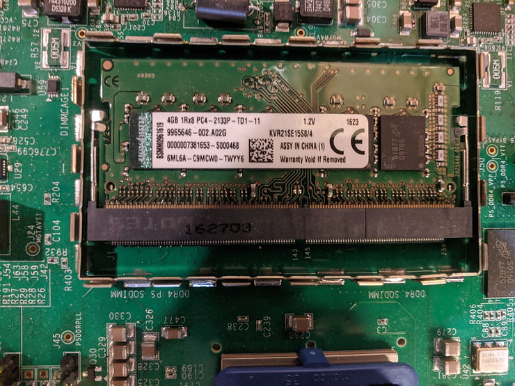

# HW-Z1-ZCU102, REVISION 1.0, DDR4 PS, Kingston, 4GB 1Rx8 PC4-2133P-TD1-11

This post contains a picture of the Kingston, 4GB 1Rx8 PC4-2133P-TD1-11 SODIMM in REVISION 1.0 of HW-Z1-ZCU102.

The Kingston part number is: KVR21SE15S8/4

The spec sheet is \[[<u>here</u>](https://www.kingston.com/dataSheets/KVR21SE15S8_4.pdf)\] or \[[<u>copy</u>](https://drive.google.com/file/d/1NtVDg3gw8VrMAVjOzAqFXF12Ds3gDxfh/view?usp=sharing)\].

**<u>References</u>**

The Xilinx graphic is from \[[link](http://pbs.twimg.com/profile_images/535545777020338176/pEWdIYq__400x400.png)\]