# Install 2023.1 Vivado ML Enterprise On Ubuntu 22.04.1


This post shows how to install 2023.1 Vivado ML Enterprise On Ubuntu 22.04.1. It also demonstrates how to recover from a failed installation.

## Before you Start

This installation may take a full workday to complete. You will need between 400 and 500 GB of free space. You will also need a network connection of at least 8 MB/sec download to complete this install in about a day.

## Create a Directory for the Install

```
mkdir -p ~/tools/amd/vivadoml/2023.1
```

## Option 1: Run the Installer That Downloads Components

Warning: Don't use this option because when it fails you'll need to re-download everything (probably)

```
chmod +x /mnt/hgfs/Installers/Xilinx/2023.1/Xilinx_Unified_2023.1_0507_1903_Lin64.bin 
/mnt/hgfs/Installers/Xilinx/2023.1/Xilinx_Unified_2023.1_0507_1903_Lin64.bin
```

Note: record where the installer is located, how you launched it, and where you installed it. You'll run this installer multiple times to install different tools.

## Option 2: Extract The Single File Download and Run the Installer

```
rsync -ah --progress /mnt/hgfs/Installers/Xilinx/2023.1/Xilinx_Unified_2023.1_0507_1903.tar.gz ~/
cd ~/
tar -xvf Xilinx_Unified_2023.1_0507_1903.tar.gz 
./Xilinx_Unified_2023.1_0507_1903/xsetup
```

Note: again, I recommend downloading the SFD and using it. If the "downloading installer" fails, you may need to redownload everything again.

## Install Additional Packages to Ensure "Vivado ML 2021.2 is stuck on Generating installed device list" Doesn't Happen

\# Run:

```
sudo apt-get install libtinfo5
```

## Install

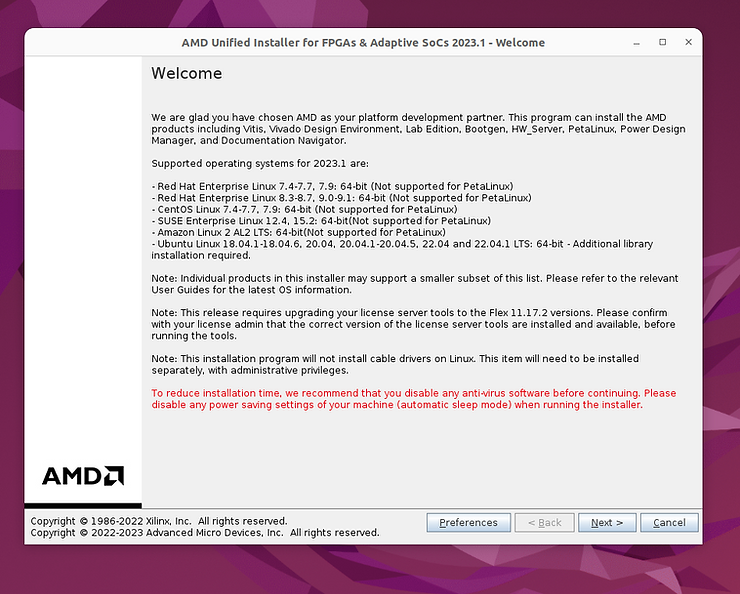

## Preferences

Proxy setting preferences

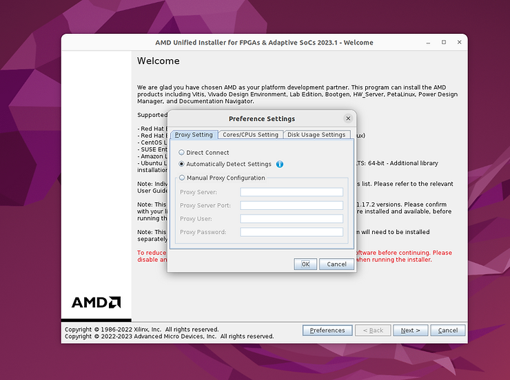

Cores/CPUs settings preferences

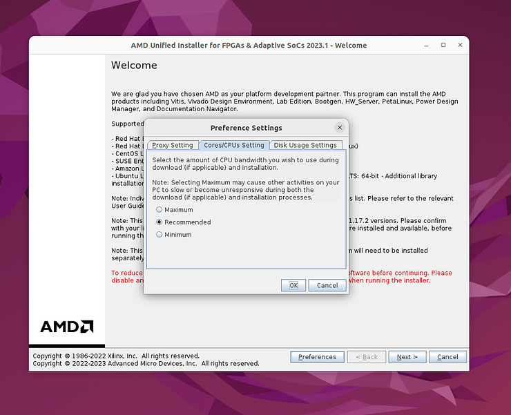

Disk usage settings preferences

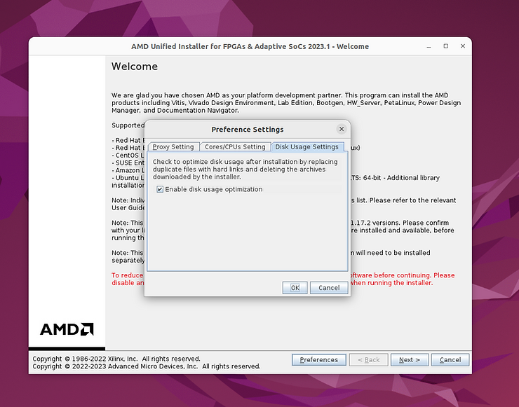

## Installation

This vvv window is not present on the SFD.

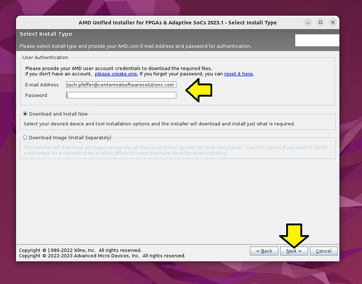

\# Select Vivado

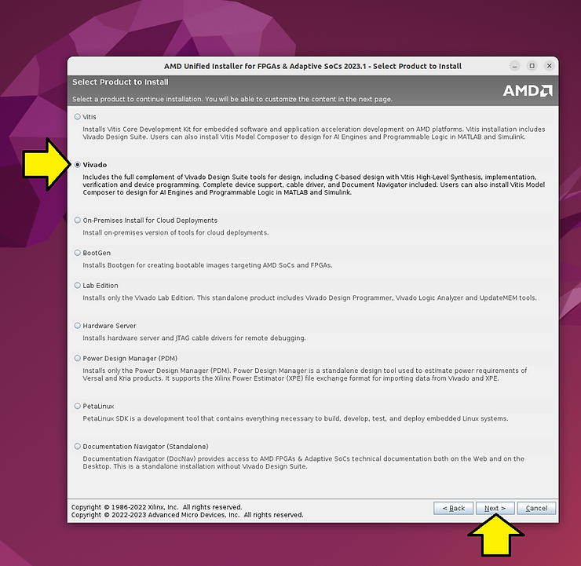

\# Select Vivado ML Enterprise

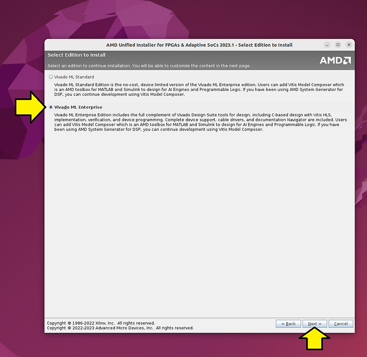

\# The default installation options

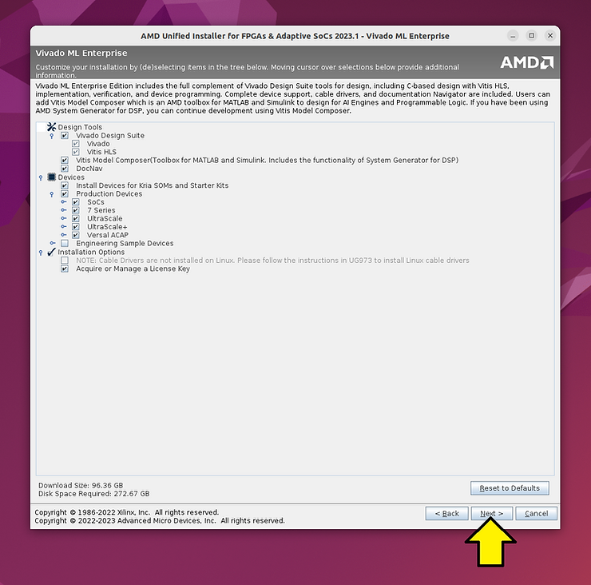

\# Accept all license agreements

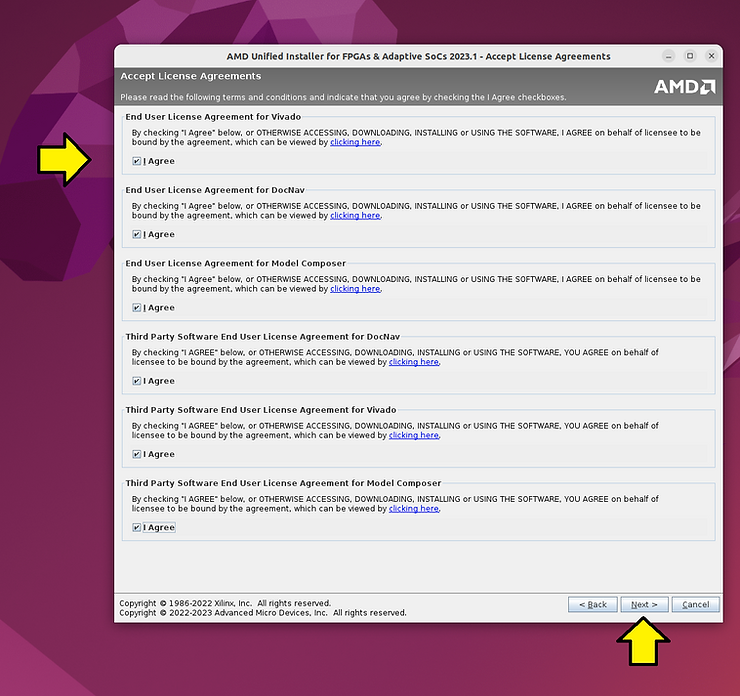

Use /home/demouser/tools/amd/vivadoml/2023.1 as the installation directory.

SFD Installer:

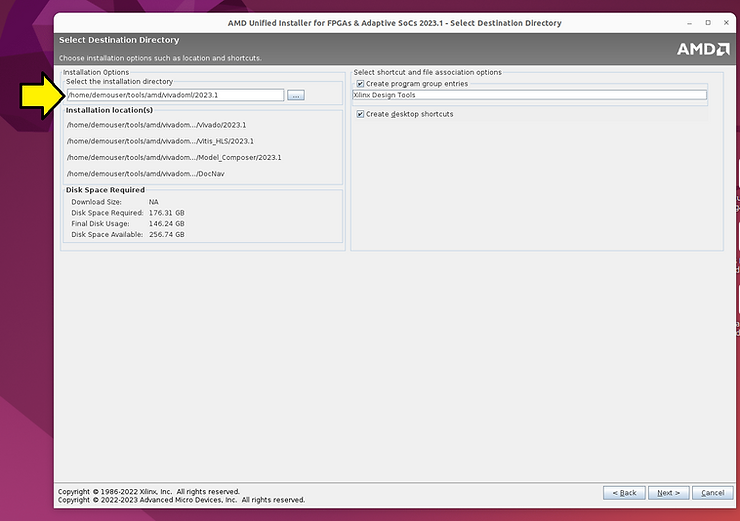

Downloading installer version:

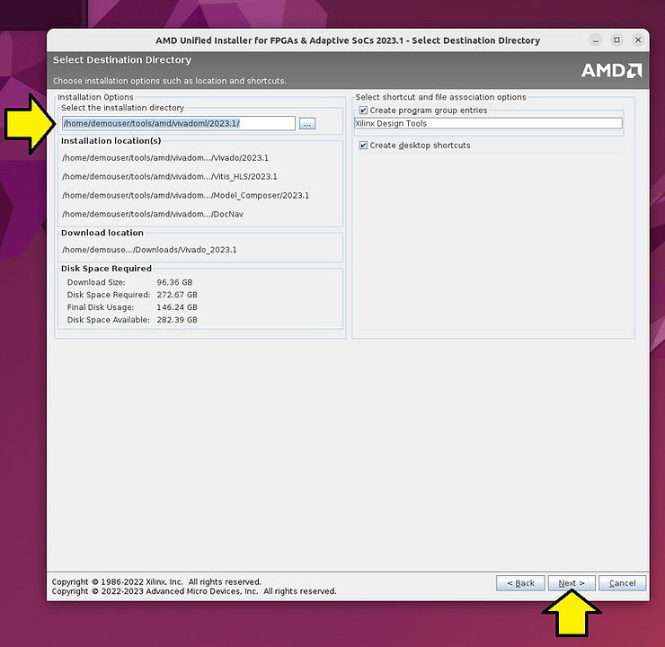

SFD installer version:

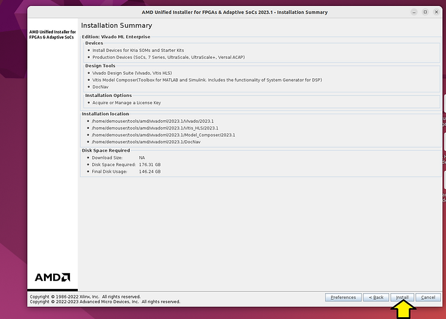

Downloading installer version:

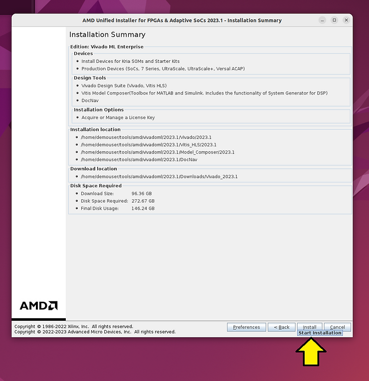

## Installer Progress

SFD Installer:

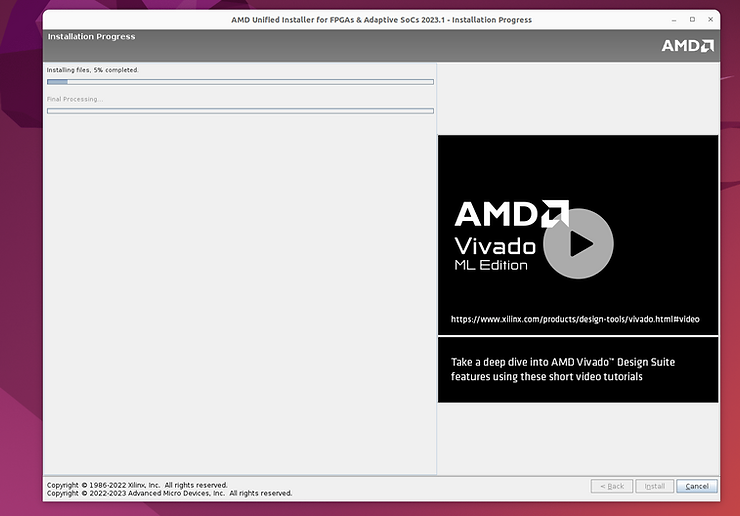

Downloading installer version:

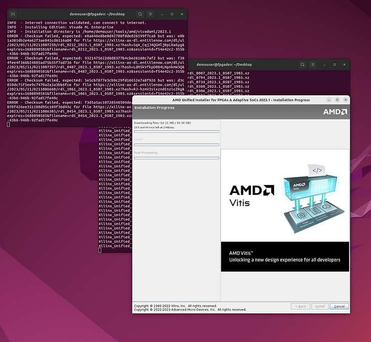

Downloading installer after 3h and 17 min and 82% installation

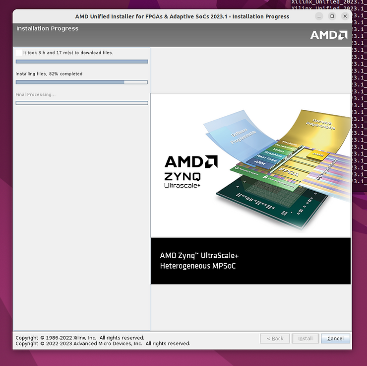

In the installation hangs here see the fix above (you will need to cancel the install and redo the entire thing):

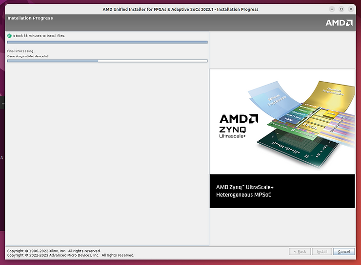

The completed install screen is not shown.

## Generate a License and Save It

\# Got to https://xilinx.entitlenow.com/AcrossUser/main.gsp?product=&tab=&req_hash=& 

\# Click the "Create New Licenses" tab

\# Select the Vivado ML Enterprise Edition, Node-Locked License

\# Click the "Generate Node-Locked License" button

\# Under 2 SYSTEM INFORMATION, select the pull down next to the Select a host... button and click "Add a host..."

\# Host Name: fpgadev (type: "hostname" on Linux)

Operating System: Linux 64-bit

Host ID Type: Ethernet MAC

Host ID Value: (type: "sudo apt-get install net-tools" then "ifconfig | grep ether")

\# Add a comment:

For Zach Pfeffer's vmwaredisk-20230708-vivado\_22.04.1-on-ubuntu\_22.04.01

\# Click Next

\# On the REVIEW LICENSE REQUEST window, click Next

\# Save the emailed license (Xilinx.lic) to ~/

```
cp /mnt/hgfs/Installers/Xilinx/Xilinx.lic ~/
```

\# Click **Load License**

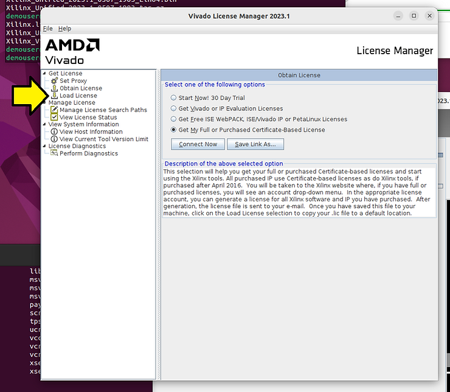

\# Click **Copy License**

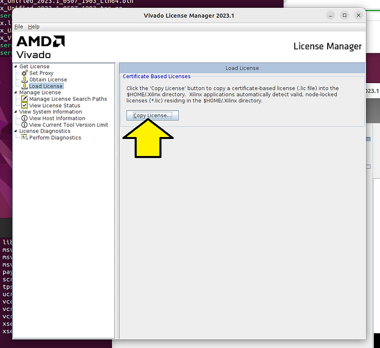

\# Find the Xilinx.lic

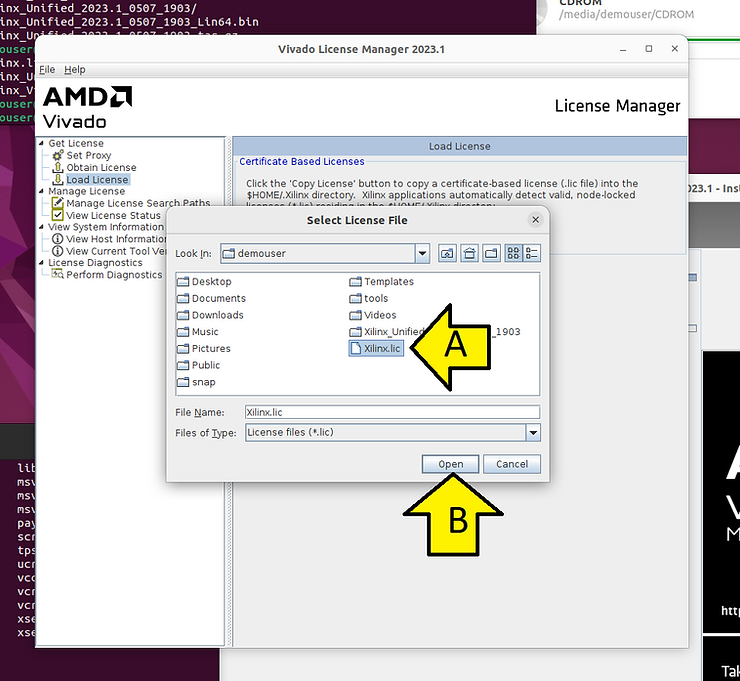

You should see:


## Run Vivado

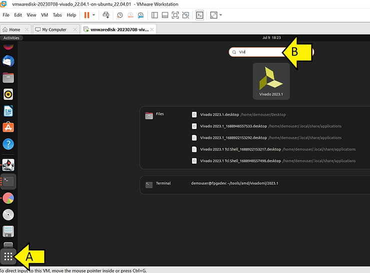

## Install Cable Drivers on Linux

Adapted from https://docs.xilinx.com/r/en-US/ug973-vivado-release-notes-install-license/Installing-Cable-Drivers 

```
cd ~/tools/amd/vivadoml/2023.1/Vivado/2023.1/data/xicom/cable_drivers/lin64/install_script/install_drivers/
sudo ./install_drivers
```

You should see output similar to:

```
[sudo] password for demouser: 
INFO: Installing cable drivers.
INFO: Script name = ./install_drivers
INFO: HostName = fpgadev
INFO: RDI_BINROOT= .
INFO: Current working dir = /home/demouser/tools/amd/vivadoml/2023.1/Vivado/2023.1/data/xicom/cable_drivers/lin64/install_script/install_drivers
INFO: Kernel version = 5.19.0-46-generic.
INFO: Arch = x86_64.
Successfully installed Digilent Cable Drivers
--File /etc/udev/rules.d/52-xilinx-ftdi-usb.rules does not exist.
--File version of /etc/udev/rules.d/52-xilinx-ftdi-usb.rules = 0000.
--Updating rules file.
--File /etc/udev/rules.d/52-xilinx-pcusb.rules does not exist.
--File version of /etc/udev/rules.d/52-xilinx-pcusb.rules = 0000.
--Updating rules file.

INFO: Digilent Return code = 0
INFO: Xilinx Return code = 0
INFO: Xilinx FTDI Return code = 0
INFO: Return code = 0
INFO: Driver installation successful.
CRITICAL WARNING: Cable(s) on the system must be unplugged then plugged back in order for the driver scripts to update the cables.
```

## Recover from a Crashed Install

Note: depending on when the installation crashes, the installer may redownload all components.

To recover from a crashed install:

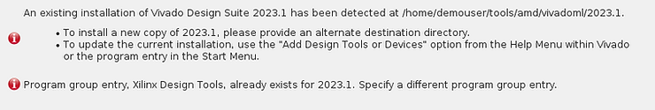

Run:

```
rm -rf "/home/demouser/.config/menus/applications-merged/Xilinx Design Tools.menu"
cd ~/tools/amd/vivadoml/2023.1
rm -rf Vivado/ 
rm -rf Vitis_HLS/ 
rm -rf Model_Composer/ 
```

### This post has shown how to install 2023.1 Vivado ML Enterprise on Ubuntu 22.04.1.

## References

Logo

https://library.amd.com/media/?mediaId=84C3498C-1B51-4965-93729CC284CD2DC2

Vivado 2020.2 Installation stuck at "Generating installed device list" on UBUNTU 20.04LTS

https://support.xilinx.com/s/question/0D52E00006hpRxQSAU/vivado-20202-installation-stuck-at-generating-installed-device-list-on-ubuntu-2004lts?language=en_US 

76616 - Vitis 2021.1 - Install - Install hangs on Ubuntu 20.04

[https://support.xilinx.com/s/article/76616?language=en_US&topicId=0TO2E000000YKXwWAO&topicName=Installation%20And%20Licensing](https://support.xilinx.com/s/article/76616?language=en_US&topicId=0TO2E000000YKXwWAO&topicName=Installation And Licensing) 

63794 - Install - What Ubuntu files are required for Vivado to run successfully?

https://support.xilinx.com/s/article/63794?language=en_US 