# Install a Vim Package on Vim 8 Running on Windows 7

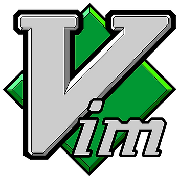

This post gives step-by-step instructions for installing a Vim package on Vim 8 (specifically 8.1.606) running on Windows 7 (SP1).

**Info**

This post uses the **vim-airline** plugin available at \[[link](http://github.com/vim-airline/vim-airline)\] to demonstrate how to install a plugin. It uses vim-airline because its very obvious if it works and its a useful plugin.

**Steps**

Step 1: Open gVim 8.1 by double clicking the gVim 8.1 icon:

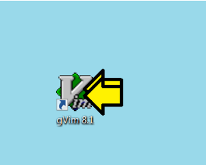

You should see:

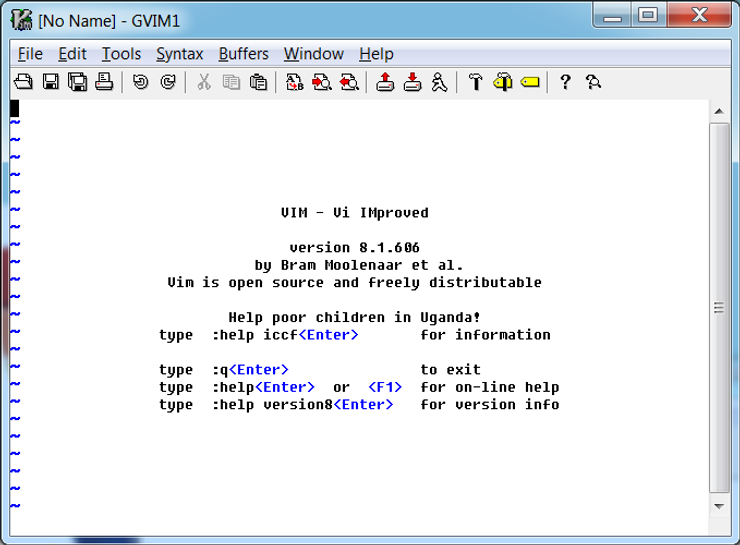

Note: your specific version may be different. It should at least be version 8 something for these steps to work.

Step 2:

A) Run **:set packpath**

You should see:

packpath=~/vimfiles,C:\\Program Files\\Vim/vimfiles,C:\\Program Files\\Vim\\vim81,C:\\Program Files\\Vim/vimfiles/after,~/vimfiles/after

B) Make sure the you see **~/vimfiles**

Note: to "copy" this, i.e. copy the ex command output in Vim parlance, so that you can paste it into another document (like a Word document) \[[\-romainl-](http://www.reddit.com/user/-romainl-/)\] from Reddit (thanks -romainl-) shared at \[[link](http://www.reddit.com/r/vim/comments/gcmemr/install_a_vim_package_on_vim_8_running_on_windows/)\] that you can type **:let @\*=&packpath** and then **Paste** into an external document. This may be better than another method you can use **:enew|pu=execute('set packpath')** which sends the output to a buffer, then you can copy from the buffer. Type :q! to close the buffer that pops up. The second method may be useful if you don't want all the output.

Step 3: Find **~/vimfiles** which should be C:\\Users\\**username**\\vimfiles and open an Explorer window

Step 4: Create a directory named **pack**

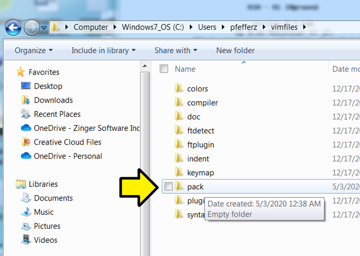

Step 5: Enter the pack directory and create a directory named **anyname** (you can name this something else)

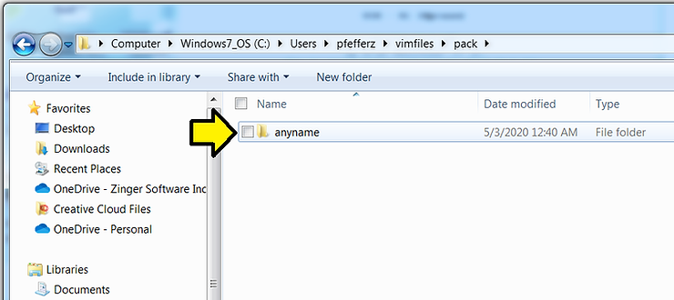

Step 6: Click inside anyname and create a directory called **start**

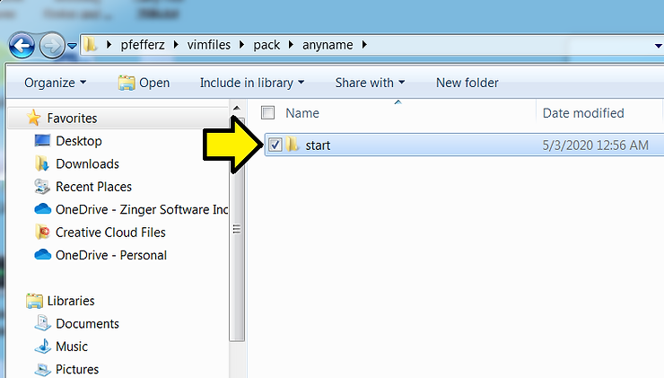

Step 6: Download a Zip file from [https://github.com/vim-airline/vim-airline](http://github.com/vim-airline/vim-airline) to 

C:\Users\username\vimfiles\pack\anyname\start\

A) On [https://github.com/vim-airline/vim-airline](http://github.com/vim-airline/vim-airline) click Clone of download

B) Click Download ZIP

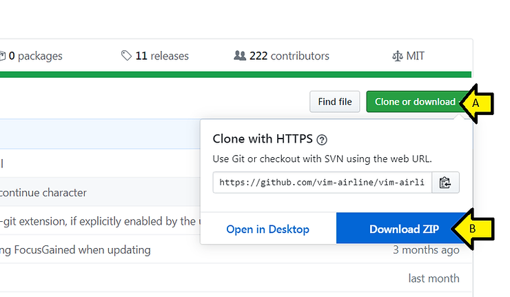

C) Click **Save**

Step 7: A) Right-click on **vim-airline-master.zip** and B) click **Extract All...**

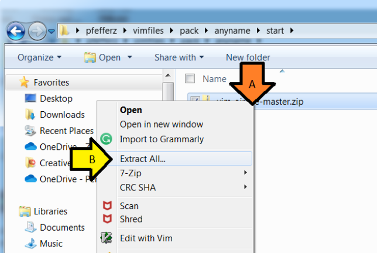

You'll see:

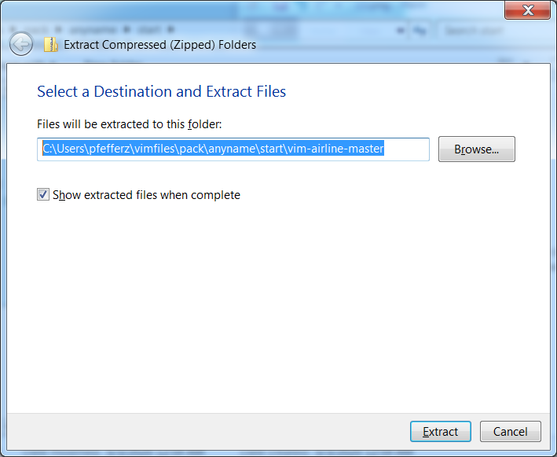

C) Remove **vim-airline-master** and D) click **Extract**

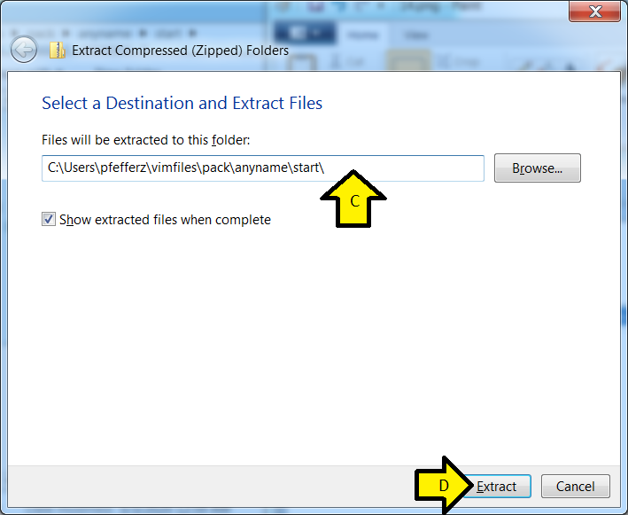

E) Click on **vim-airline-master** and you should see:

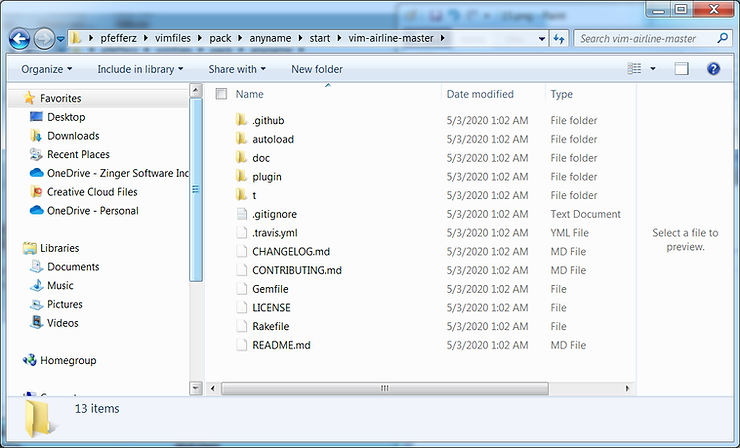

Step 8: Restart gVim 8.1. You should see a new bar:

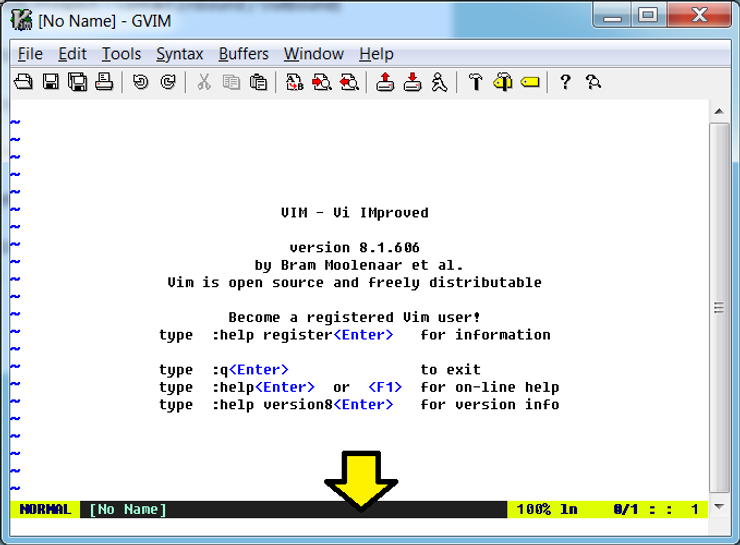

**References**

-   Copy ex command output \[[link](http://ipfs-sec.stackexchange.cloudflare-ipfs.com/vi/A/question/8378.html)\]
    
-   The Vim logo is from \[[link](http://commons.wikimedia.org/wiki/File:Vimlogo.svg)\]
