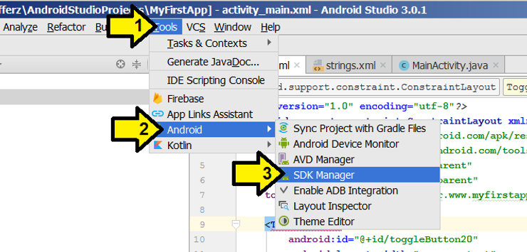
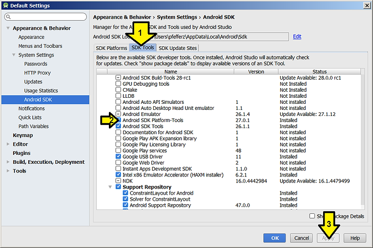

# Install ADB and fastboot from Android Studio 3.0.1 on Windows 7 Professional


This post lists how to install ADB and fastboot from Android Studio 3.0.1 on Windows 7 Professional.

**Steps**

**1.** Launch the **SDK manager**

Click (1) **Tools**, (2) **Android**, (3) **SDK Manager**



**2.** Click (1) **SDK Tools** then (2) **Android SDK Platform-Tools** and click (3) **Apply**



adb.exe and fastboot.exe were installed at

```
C:\Users\pfefferz\AppData\Local\Android\Sdk\platform-tools
```

**Reference**

The Android Robot logo came from [link](http://developer.android.com/distribute/marketing-tools/brand-guidelines.html).