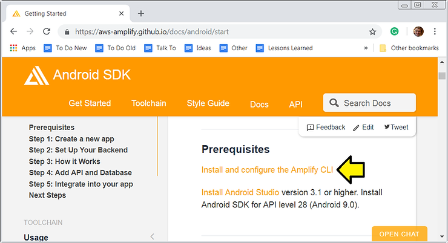
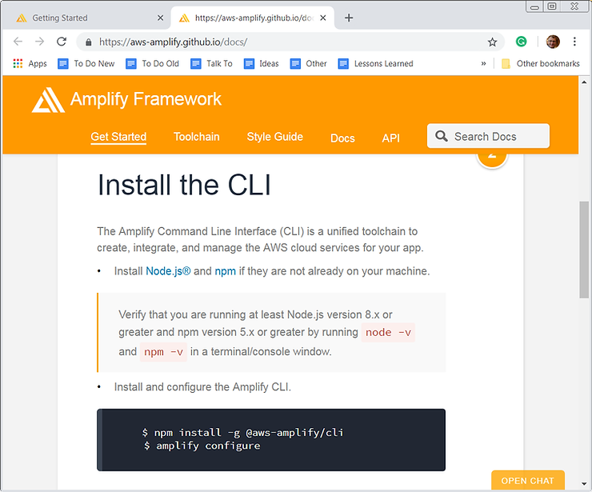
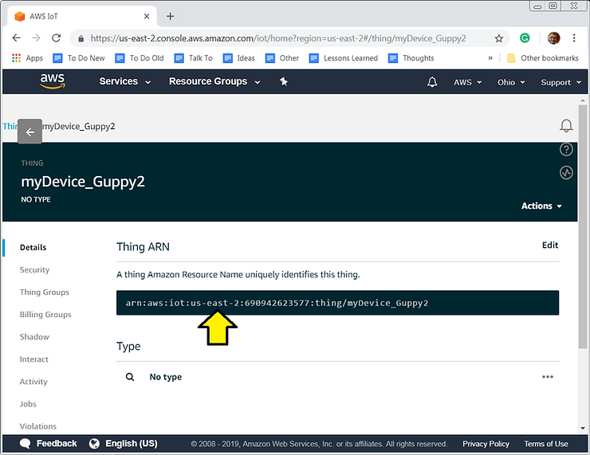
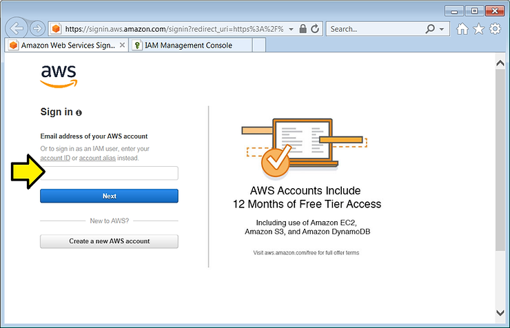
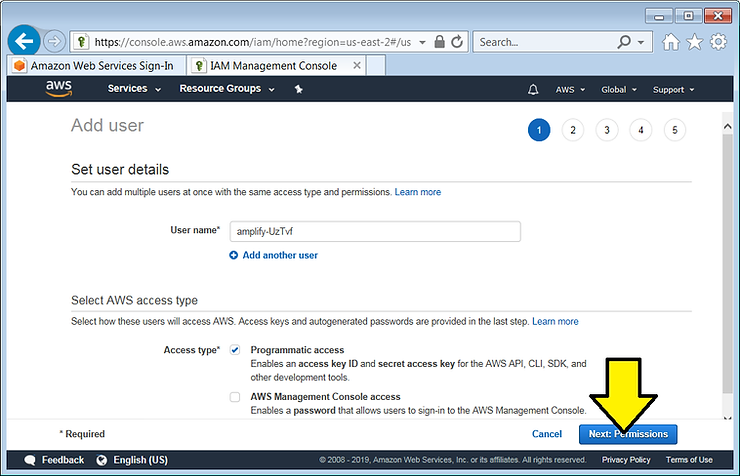
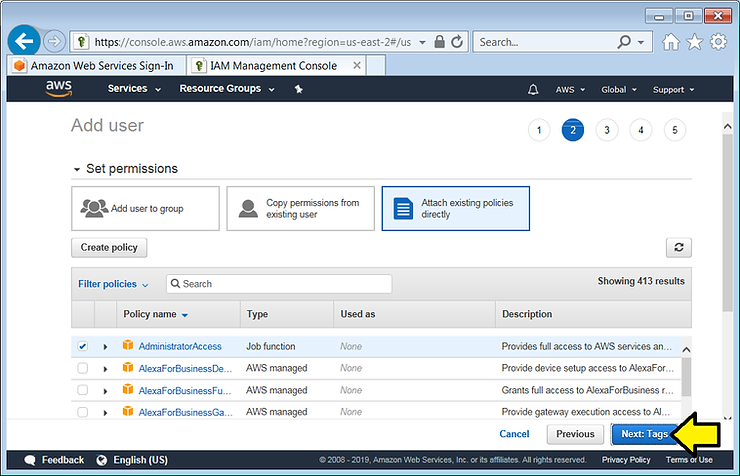
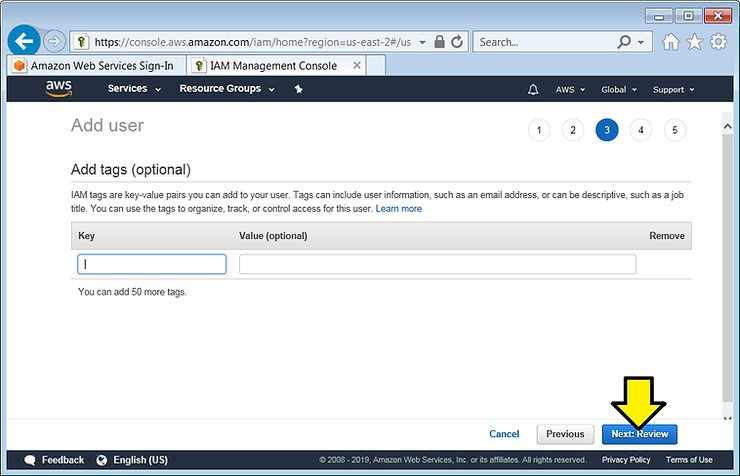
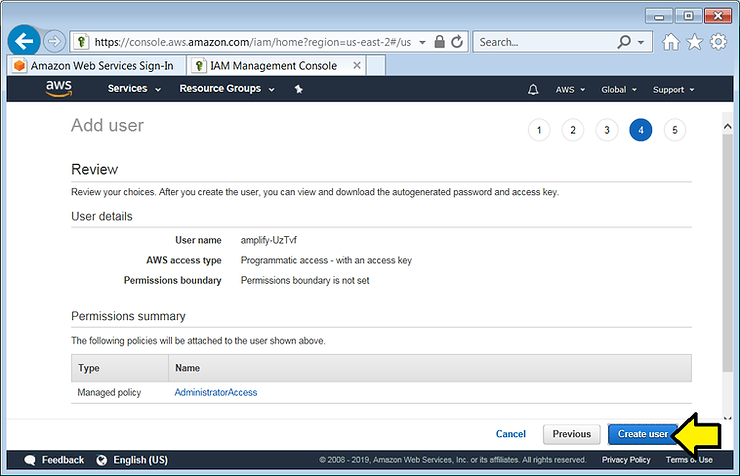
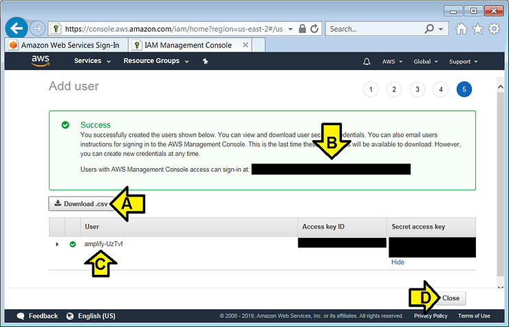
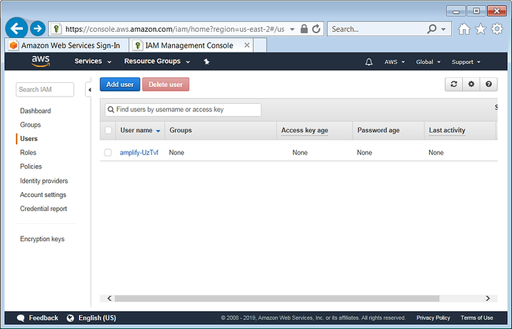

# Install and Configure the AWS Amplify CLI on Windows 7


This post shows a walk-through of the **Install and configure the Amplify CLI** instructions posted at \[[link](https://aws-amplify.github.io/docs/android/start)\]:



Actual instructions at \[[link](https://aws-amplify.github.io/docs/)\]:



**<u><span>Versions</span></u>**

Node.js version 8.x or higher

npm version 5.x or higher

**<u><span>Install Node.js and npm on Windows</span></u>**

Follow the instructions at \[[link](https://www.centennialsoftwaresolutions.com/blog/install-node-js-on-windows-7)\]

**<u><span>Test Node.js on Windows</span></u>**

1\. Open a CMD.exe window

2\. Type **node -v**

You should see v10.14.2 or higher.

3\. Type **npm -v**

You should see 6.4.1 or higher.

**<u><span>Install and Configure the Amplify CLI</span></u>**

1\. Open a CMD.exe window

2\. Type **npm install -g @aws-amplify/cli**

You should see something like:

```
C:\Users\pfefferz>npm install -g @aws-amplify/cli
npm WARN deprecated circular-json@0.3.3: CircularJSON is in maintenance only, flatted is its successor.
npm WARN deprecated kleur@2.0.2: Please upgrade to kleur@3 or migrate to 'ansi-colors' if you prefer the old syntax. Visit  for migration path(s).
npm WARN deprecated minimatch@2.0.10: Please update to minimatch 3.0.2 or higher to avoid a RegExp DoS issue
C:\Users\pfefferz\AppData\Roaming\npm\amplify -> C:\Users\pfefferz\AppData\Roaming\npm\node_modules\@aws-amplify\cli\bin\amplify
npm WARN graphql-import@0.4.5 requires a peer of graphql@^0.11.0 || ^0.12.0 || ^0.13.0 but none is installed. You must install peer dependencies yourself.
npm WARN optional SKIPPING OPTIONAL DEPENDENCY: fsevents@1.2.4 (node_modules\@aws-amplify\cli\node_modules\fsevents):
npm WARN notsup SKIPPING OPTIONAL DEPENDENCY: Unsupported platform for fsevents@1.2.4: wanted {"os":"darwin","arch":"any"} (current: {"os":"win32","arch":"x64"}
)

+ @aws-amplify/cli@0.1.41
added 1842 packages from 1303 contributors in 84.986s
```

Note: on my machine this installs **amplify** and **amplify.cmd** and **node\_modules\\@aws-amplify\\cli** in **C:\\Users\\pfefferz\\AppData\\Roaming\\npm\\**

Note 2: you can look at the Windows' PATH variable by typing **echo %path:;=&echo.%**

you'll see that **C:\\Users\\pfefferz\\AppData\\Roaming\\npm** (or something like it) is listed in your path.

3\. Type **amplify configure**

You should see something like:

```
C:\Users\pfefferz>amplify configure
Follow these steps to set up access to your AWS account:

Sign in to your AWS administrator account:
https://console.aws.amazon.com/
Press Enter to continue
aws@centennialsoftwaresolutions.com
Specify the AWS Region
? region:  us-east-2
Specify the username of the new IAM user:
? user name:  amplify-UzTvf
Complete the user creation using the AWS console
https://console.aws.amazon.com/iam/home?region=us-east-2#/users$new?step=final&accessKey&userNames=amplify-UzTvf&permissionType=policies&policies=arn:aws:iam::a
ws:policy%2FAdministratorAccess
Press Enter to continue
```

**Note**: I picked **us-east-2** because my device shadows are in **us-east-2**

See \[[link](https://www.centennialsoftwaresolutions.com/blog/connect-a-device-to-aws-through-a-machineq-gateway-run-through)\] for setting up the node and the **us-east-2** reference:



4\. A browser will pop up. Log in.



5\. Accept defaults and click **Next: Permissions**



6\. Accept defaults and click **Next: Tags**



7\. Accept defaults and click **Next: Review**



8\. Accept defaults and click **Create user**



9\. (A) Download the **csv**, (B) save the **sign-in link**, (C) save the **User** name and (D) click **Close**



You should see:



10\. Back in CMD.exe, press Enter

You should see:

```
Enter the access key of the newly created user:
? accessKeyId:  ()
```

11\. Open the csv file, find the **Access key ID** column, find the value and paste it in.

12\. Find the **Secret access key** column, find the value and paste it in.

13\. Accept **default** as the **Profile Name**

You should see:

```
Successfully set up the new user.
```

The full log:

```
C:\Users\pfefferz>amplify configure
Follow these steps to set up access to your AWS account:

Sign in to your AWS administrator account:
https://console.aws.amazon.com/
Press Enter to continue
aws@centennialsoftwaresolutions.com
Specify the AWS Region
? region:  us-east-2
Specify the username of the new IAM user:
? user name:  amplify-UzTvf
Complete the user creation using the AWS console
https://console.aws.amazon.com/iam/home?region=us-east-2#/users$new?step=final&accessKey&userNames=amplify-UzTvf&permissionType=policies&policies=arn:aws:iam::a
ws:policy%2FAdministratorAccess
Press Enter to continue

Enter the access key of the newly created user:
? accessKeyId:  XXXXXXXXXX**********
? secretAccessKey:  XxXxXxXxXxXxXxXxXxXx********************
This would update/create the AWS Profile in your local machine
? Profile Name:  default

Successfully set up the new user.
```

**<u><span>References</span></u>**

-   Amplify Getting Started @ \[[link](https://aws-amplify.github.io/docs/android/start)\]
    
-   Install and configure the Amplify CLI @ \[[link](https://aws-amplify.github.io/docs/)\] (scroll down to see **Install the CLI**)
    
-   How do I view/see the PATH in a windows environment? @ \[[link](http://geekswithblogs.net/AskPaula/archive/2008/12/18/128035.aspx)\]
    
-   AWS icon from \[[link](https://goo.gl/images/4jUMSB)\]