# Install, Run and Uninstall the Guppy LoRaWAN Configuration Tool

This post lists links to the Guppy LoRaWAN Configuration Tool and steps to install it, run it and uninstall it.

**<u>Install</u>**

1\. Install the **Guppy LoRaWAN Configuration Tool** posted at [[link](https://support.digitalmatter.com/support/solutions/articles/16000072392-guppy-configuration-application)] - the actual link is https://www.oemserver.com/tools/GuppyLoRaWAN/ConfigTool/setup.exe

I renamed **setup.exe** to **guppy lorawan setup.exe**

2\. Double-click on **guppy lorawan setup.exe** and click **Run** on the **Open File - Security Warning**

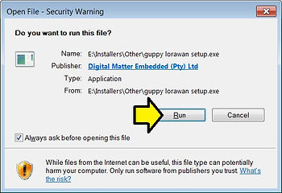

3\. Click **Install**

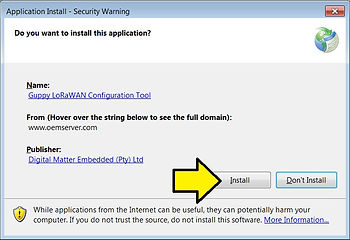

You'll see:

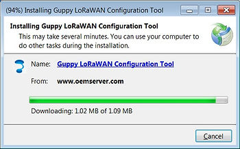

...and see the icon on the desktop

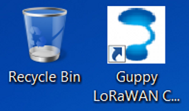

...and the program will pop up

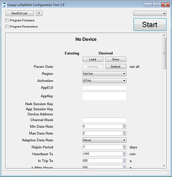

**<u>Run It</u>**

1\. Plug in the configuration cable

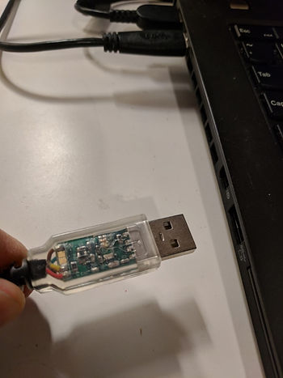

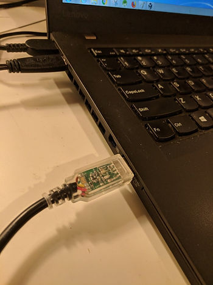

You'll see

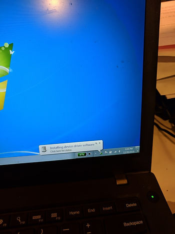

2\. Select the COM

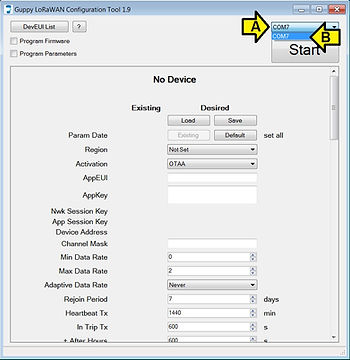

3\. Click **Start**

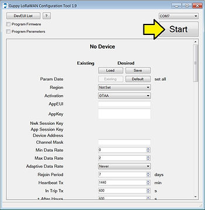

4\. Click **Stop**

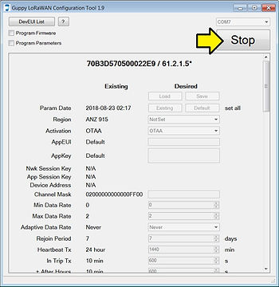

You should see:

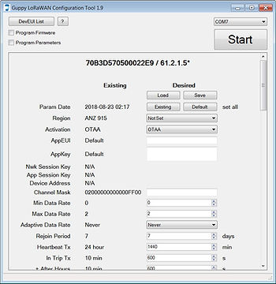

**<u>Program Parameters</u>**

Programming parameters is covered at \[[<u>link</u>](https://support.digitalmatter.com/support/solutions/articles/16000063353-configuration-and-usage-guide)\]

1\. To read parameters click Start

**Note**: The configuration tool will read continuously, and display the existing parameters in the center column.

2\. To program new parameters and firmware (you have to do both)

A. Enter the parameters in the right hand column

B. Check the **Program Parameters** checkbox.

C. Click **Run**

To update the firmware only

A. Check the **Program Firmware** checkbox

B. Leave the Program Parameters checkbox clear

C. Click **Run**

**<u>Uninstall</u>**

1\. Run **Uninstall a program**

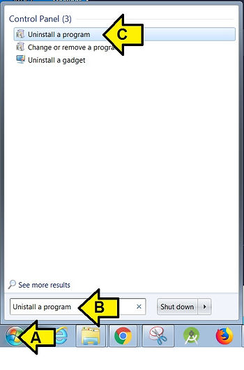

2\. Double-click **Guppy LoRaWAN Configuration Tool**

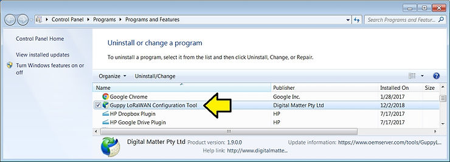

3\. Click OK

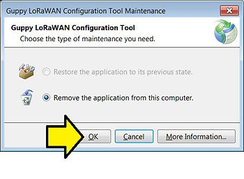

**<u>Reference</u>**

Digital Matter logo from \[[<u>link</u>](https://partners.sigfox.com/assets/media-for/58b80b11172d940cfc466151?type=company)\]