# Install Node.js on Windows 7

This post walks through a Node.js install on Windows 7 and tests that node and npm work. It installs v13.14.0 LTS.

It seems that v13.14.0 LTS is the last installer that works on Window 7. I get this error when I try to install v14.0.0 (node-v14.0.0-x64.msi from \[[<u>link</u>](https://nodejs.org/download/release/v14.0.0/)\]):

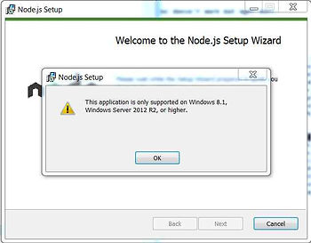

This post also includes a link to the License Agreement so people can review it before installing. The install takes about 30 secs and uses 86 MB.

**<u>Steps</u>**

**1**. Go to [[link](https://nodejs.org/download/release/v13.14.0/)]

**2**. Click node-v13.14.0-x64.msi or click \[[link](https://nodejs.org/download/release/v13.14.0/node-v13.14.0-x64.msi)\]

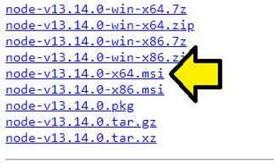

**3**. Click to launch the install

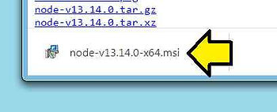

**4**. Click **Run**

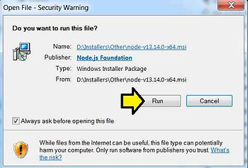

**5**. Click **Next**

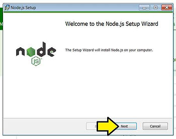

**6**. Click the **I accept the terms in the License Agreement** checkbox and click **Next**

**Note**: A PDF of the 25 page **License Agreement** is \[[<u>here</u>](https://drive.google.com/file/d/1aLdNUrLCFfv2IUZbYVg9_zq-zmvfOSxh/view?usp=sharing)\] a Word doc is \[[<u>here</u>](https://drive.google.com/file/d/1wc5zXwjB53L7x20k9Hnu1LmBgt-sk4nX/view?usp=sharing)\]

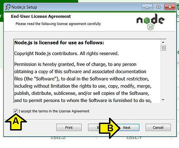

**7**. Click **Next**

**Note**: Installs **Node.js** into **C:\\Program Files\\nodejs\\**

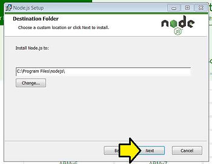

**8**. Click **Next** on the Custom Setup

**Note**: I've expanded the submodules in the picture

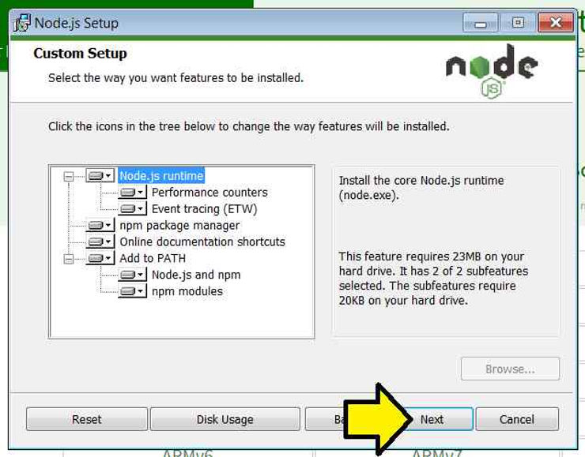

**Note 2**: Clicking on Disk Usage shows that all the features require 86 MB

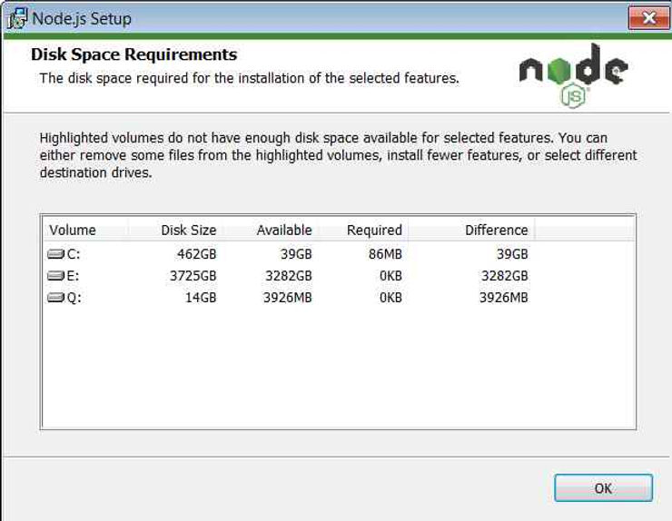

**9**. Click **Install**

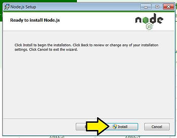

**10**. You'll see the screen pause, darken, and see this pop up. Click **Yes**.

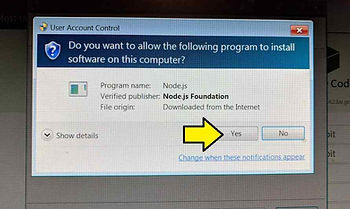

**11**. Click **Finish**

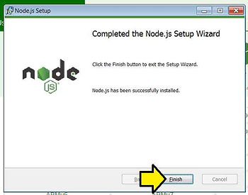

Congratulations! You've installed node and npm.

**<u>Test</u>**

1\. (A) Click the **Windows Icon**, (B) type **cmd** and (C) click **cmd.exe**

2\. Type **node -v**. I see **v10.14.2.**

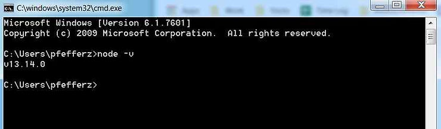

3\. Type **npm -v**. I see **6.4.1**.

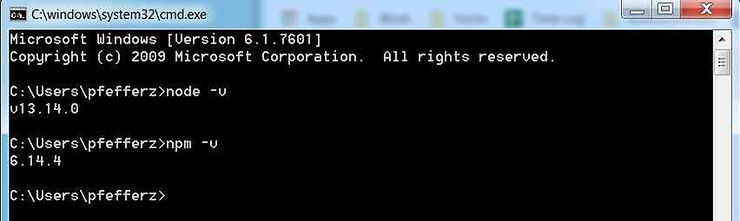

...and it works!

**<u>Reference</u>**

Node.js logo from \[[link](https://nodejs.org/static/images/logo.svg)\]