# Install & Remove Tools for TinyFPGA Bx Programming and Program the board on Windows 7 SP1


This post describes how to install and remove the tools needed to program an image onto a TinyFPGA Bx and how to use the tools to program the board, It installs **python-3.6.5-amd64-webinstall.exe**, **apio-0.4.0b5** and **tinyprog-1.0.21**.

**Install**

<u><span>Install Python 3.6.5</span></u>

1\. Download **python-3.6.5-amd64-webinstall.exe** at \[[link](https://drive.google.com/file/d/1IVjFdcLv_8pwzIcjUa3f6rId-1Ijd8VQ/view?usp=sharing)\] to your **Documents** folder

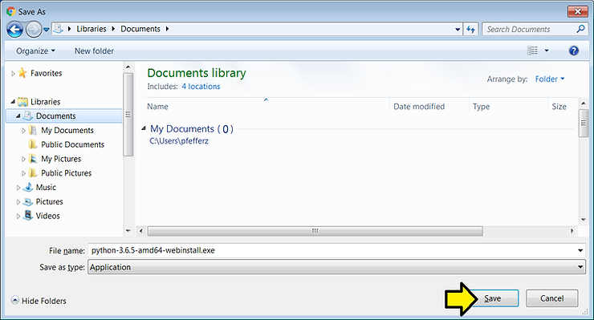

2\. Double-click **python-3.6.5-amd64-webinstall.exe** to run it

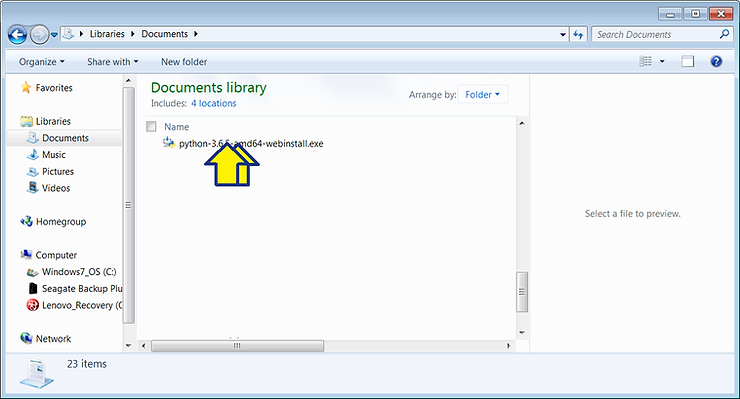

3\. Click **Run**

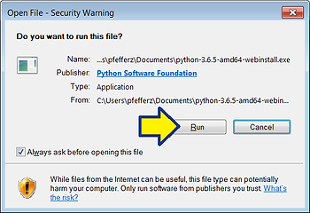

4\. (A) Click the **Add Python 3.6 to PATH** checkbox and (B) click **Install Now**

You should see:

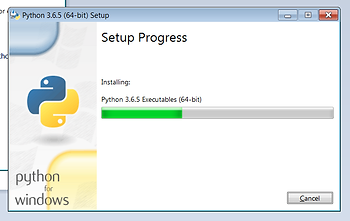

5\. Click **Close**

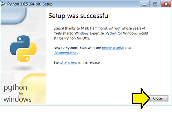

Congratulations! You have successfully installed **Python 3.6.5**

<u><span>Install apio-0.4.0b5 and tinyprog-1.0.21 (and system scons icestorm iverilog )</span></u>

6\. (A) Click **Windows**, (B) type **cmd.exe** and (C) click **cmd.exe**

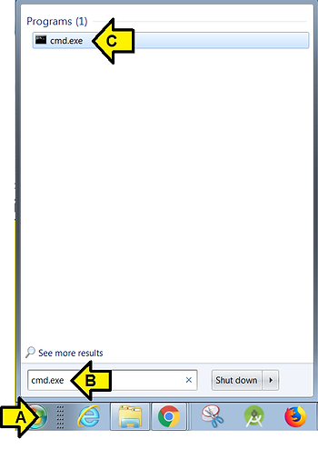

7\. Type **pip install apio==0.4.0b5 tinyprog==1.0.21** in cmd.exe

You should see something like:

```
Collecting apio==0.4.0b5
  Using cached https://files.pythonhosted.org/packages/b4/8d/f8ee43824478b2435d6ef1dd71e166de6ecc6ba13de7f3103aff383364a2/apio-0.4.0b5.tar.gz
Collecting tinyprog==1.0.21
  Using cached https://files.pythonhosted.org/packages/2e/10/cfcd7e90514657d2419c842c2aaaa3a96d3d3e90d2e25a6c6ea273a21c87/tinyprog-1.0.21-py3-none-any.whl
Requirement already satisfied: click<7,>=5 in c:\users\pfefferz\appdata\local\programs\python\python36\lib\site-packages (from apio==0.4.0b5)
Requirement already satisfied: semantic_version<3,>=2.5.0 in c:\users\pfefferz\appdata\local\programs\python\python36\lib\site-packages (from apio==0.4.0b5)
Requirement already satisfied: requests<3,>=2.4.0 in c:\users\pfefferz\appdata\local\programs\python\python36\lib\site-packages (from apio==0.4.0b5)
Requirement already satisfied: pyjwt<2,>=1.5.3 in c:\users\pfefferz\appdata\local\programs\python\python36\lib\site-packages (from apio==0.4.0b5)
Requirement already satisfied: colorama in c:\users\pfefferz\appdata\local\programs\python\python36\lib\site-packages (from apio==0.4.0b5)
Requirement already satisfied: pyserial<4,>=3 in c:\users\pfefferz\appdata\local\programs\python\python36\lib\site-packages (from apio==0.4.0b5)
Requirement already satisfied: six in c:\users\pfefferz\appdata\local\programs\python\python36\lib\site-packages (from tinyprog==1.0.21)
Requirement already satisfied: pyusb in c:\users\pfefferz\appdata\local\programs\python\python36\lib\site-packages (from tinyprog==1.0.21)
Requirement already satisfied: tqdm<5,>=4.19.5 in c:\users\pfefferz\appdata\local\programs\python\python36\lib\site-packages (from tinyprog==1.0.21)
Requirement already satisfied: jsonmerge<2,>=1.4.0 in c:\users\pfefferz\appdata\local\programs\python\python36\lib\site-packages (from tinyprog==1.0.21)
Requirement already satisfied: packaging in c:\users\pfefferz\appdata\local\programs\python\python36\lib\site-packages (from tinyprog==1.0.21)
Requirement already satisfied: intelhex<3,>=2.2.1 in c:\users\pfefferz\appdata\local\programs\python\python36\lib\site-packages (from tinyprog==1.0.21)
Requirement already satisfied: chardet<3.1.0,>=3.0.2 in c:\users\pfefferz\appdata\local\programs\python\python36\lib\site-packages (from requests<3,>=2.4.0->api
o==0.4.0b5)
Requirement already satisfied: idna<2.8,>=2.5 in c:\users\pfefferz\appdata\local\programs\python\python36\lib\site-packages (from requests<3,>=2.4.0->apio==0.4.
0b5)
Requirement already satisfied: urllib3<1.25,>=1.21.1 in c:\users\pfefferz\appdata\local\programs\python\python36\lib\site-packages (from requests<3,>=2.4.0->api
o==0.4.0b5)
Requirement already satisfied: certifi>=2017.4.17 in c:\users\pfefferz\appdata\local\programs\python\python36\lib\site-packages (from requests<3,>=2.4.0->apio==
0.4.0b5)
Requirement already satisfied: jsonschema<3.0.0 in c:\users\pfefferz\appdata\local\programs\python\python36\lib\site-packages (from jsonmerge<2,>=1.4.0->tinypro
g==1.0.21)
Requirement already satisfied: pyparsing>=2.0.2 in c:\users\pfefferz\appdata\local\programs\python\python36\lib\site-packages (from packaging->tinyprog==1.0.21)

Installing collected packages: apio, tinyprog
  Running setup.py install for apio ... done
Successfully installed apio-0.4.0b5 tinyprog-1.0.21
You are using pip version 9.0.3, however version 18.1 is available.
You should consider upgrading via the 'python -m pip install --upgrade pip' command.
```

<u><span>Install apio system scons icestorm and iverilog</span></u>

8\. Type **apio install system** in cmd.exe

You should see something like:

```
Installing system package:
Download tools-system-windows_amd64-1.1.0.tar.gz
Downloading  [####################################]  100%
Unpacking  [####################################]  100%
Package 'system' has been successfully installed!
```

<u><span>Install Serial Driver</span></u>

9\. Type **apio drivers --serial-enable** in cmd.exe

10\. Click **Yes** on the **Do you want to allow the following program to make changes to this computer** window

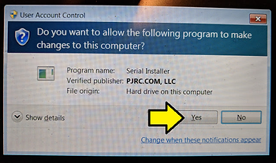

11\. Click **Install** on the **Virtual Serial Driver** screen

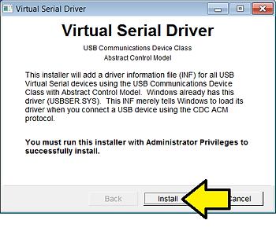

12\. Click **Done**

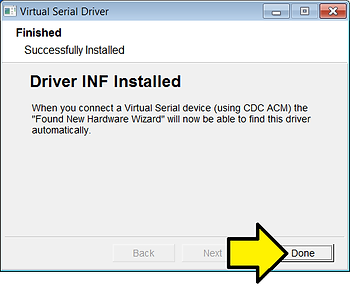

After You should see the following in the cmd.exe window:

```
Launch drivers configuration tool

   Serial driver installation:
   Usage instructions

      1. Connect the Serial FPGA board
      2. Install the driver
      3. Reconnect the board
      4. Check `apio system --lsserial`

Serial drivers configuration finished
```

<u><span>Connect the TinyFPGA Bx</span></u>

13\. Connect the USB cable to the PC

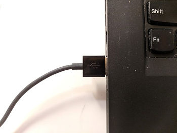

14\. Connect the

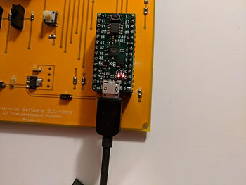

You should see the Pwr LED lit and the Boot LED blinking:

(video_unavailable)

15\. Type **apio system --lsserial**

You should see something like:

```
Number of Serial devices found: 1

COM2
Description: Teensy USB Serial (COM2)
Hardware info: USB VID:PID=1D50:6130 SER=5 LOCATION=1-1
```

<u><span>Program your bitstream</span></u>

16\. Type tinyprog -p Documents\\bitstream.bin

**Uninstall All**

1\. (A) Click **Windows**, (B) type **cmd.exe** and (C) click **cmd.exe**


<u><span>Uninstall Serial Driver</span></u>

2\. Type **apio drivers --serial-disable**

You should see:

```
Launch device manager

   Serial driver uninstallation:
   Usage instructions

      1. Find the FPGA USB Device
      2. Right click
      3. Select "Uninstall"
      4. Accept the dialog
```

...and

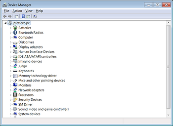

There is no device present. Close the device manager. (TODO figure out what's actually happening here)

<u><span>Unistall apio system</span></u>

3\. Type **apio uninstall system**

You should see:

```
Do you want to continue? [y/N]:
```

4\. Type **y**

You should see:

```
Do you want to continue? [y/N]: y
Uninstalling system package:
Package 'system' has been successfully uninstalled!
```

<u><span>Uninstall apio-0.4.0b5 and tinyprog-1.0.21</span></u>

5\. Type **pip uninstall apio tinyprog**

You should see:

```
Uninstalling apio-0.4.0b5:
  c:\users\pfefferz\appdata\local\programs\python\python36\lib\site-packages\apio-0.4.0b5-py3.6.egg-info
  c:\users\pfefferz\appdata\local\programs\python\python36\lib\site-packages\apio\__init__.py
  c:\users\pfefferz\appdata\local\programs\python\python36\lib\site-packages\apio\__main__.py
  c:\users\pfefferz\appdata\local\programs\python\python36\lib\site-packages\apio\__pycache__\__init__.cpython-36.pyc
  c:\users\pfefferz\appdata\local\programs\python\python36\lib\site-packages\apio\__pycache__\__main__.cpython-36.pyc
  c:\users\pfefferz\appdata\local\programs\python\python36\lib\site-packages\apio\__pycache__\api.cpython-36.pyc
  c:\users\pfefferz\appdata\local\programs\python\python36\lib\site-packages\apio\__pycache__\profile.cpython-36.pyc
  c:\users\pfefferz\appdata\local\programs\python\python36\lib\site-packages\apio\__pycache__\resources.cpython-36.pyc
  c:\users\pfefferz\appdata\local\programs\python\python36\lib\site-packages\apio\__pycache__\util.cpython-36.pyc
  c:\users\pfefferz\appdata\local\programs\python\python36\lib\site-packages\apio\api.py
  c:\users\pfefferz\appdata\local\programs\python\python36\lib\site-packages\apio\commands\__init__.py
  c:\users\pfefferz\appdata\local\programs\python\python36\lib\site-packages\apio\commands\__pycache__\__init__.cpython-36.pyc
  c:\users\pfefferz\appdata\local\programs\python\python36\lib\site-packages\apio\commands\__pycache__\boards.cpython-36.pyc
  c:\users\pfefferz\appdata\local\programs\python\python36\lib\site-packages\apio\commands\__pycache__\build.cpython-36.pyc
  c:\users\pfefferz\appdata\local\programs\python\python36\lib\site-packages\apio\commands\__pycache__\clean.cpython-36.pyc
  c:\users\pfefferz\appdata\local\programs\python\python36\lib\site-packages\apio\commands\__pycache__\config.cpython-36.pyc
  c:\users\pfefferz\appdata\local\programs\python\python36\lib\site-packages\apio\commands\__pycache__\drivers.cpython-36.pyc
  c:\users\pfefferz\appdata\local\programs\python\python36\lib\site-packages\apio\commands\__pycache__\examples.cpython-36.pyc
  c:\users\pfefferz\appdata\local\programs\python\python36\lib\site-packages\apio\commands\__pycache__\init.cpython-36.pyc
  c:\users\pfefferz\appdata\local\programs\python\python36\lib\site-packages\apio\commands\__pycache__\install.cpython-36.pyc
  c:\users\pfefferz\appdata\local\programs\python\python36\lib\site-packages\apio\commands\__pycache__\lint.cpython-36.pyc
  c:\users\pfefferz\appdata\local\programs\python\python36\lib\site-packages\apio\commands\__pycache__\sim.cpython-36.pyc
  c:\users\pfefferz\appdata\local\programs\python\python36\lib\site-packages\apio\commands\__pycache__\system.cpython-36.pyc
  c:\users\pfefferz\appdata\local\programs\python\python36\lib\site-packages\apio\commands\__pycache__\time.cpython-36.pyc
  c:\users\pfefferz\appdata\local\programs\python\python36\lib\site-packages\apio\commands\__pycache__\uninstall.cpython-36.pyc
  c:\users\pfefferz\appdata\local\programs\python\python36\lib\site-packages\apio\commands\__pycache__\upgrade.cpython-36.pyc
  c:\users\pfefferz\appdata\local\programs\python\python36\lib\site-packages\apio\commands\__pycache__\upload.cpython-36.pyc
  c:\users\pfefferz\appdata\local\programs\python\python36\lib\site-packages\apio\commands\__pycache__\verify.cpython-36.pyc
  c:\users\pfefferz\appdata\local\programs\python\python36\lib\site-packages\apio\commands\boards.py
  c:\users\pfefferz\appdata\local\programs\python\python36\lib\site-packages\apio\commands\build.py
  c:\users\pfefferz\appdata\local\programs\python\python36\lib\site-packages\apio\commands\clean.py
  c:\users\pfefferz\appdata\local\programs\python\python36\lib\site-packages\apio\commands\config.py
  c:\users\pfefferz\appdata\local\programs\python\python36\lib\site-packages\apio\commands\drivers.py
  c:\users\pfefferz\appdata\local\programs\python\python36\lib\site-packages\apio\commands\examples.py
  c:\users\pfefferz\appdata\local\programs\python\python36\lib\site-packages\apio\commands\init.py
  c:\users\pfefferz\appdata\local\programs\python\python36\lib\site-packages\apio\commands\install.py
  c:\users\pfefferz\appdata\local\programs\python\python36\lib\site-packages\apio\commands\lint.py
  c:\users\pfefferz\appdata\local\programs\python\python36\lib\site-packages\apio\commands\sim.py
  c:\users\pfefferz\appdata\local\programs\python\python36\lib\site-packages\apio\commands\system.py
  c:\users\pfefferz\appdata\local\programs\python\python36\lib\site-packages\apio\commands\time.py
  c:\users\pfefferz\appdata\local\programs\python\python36\lib\site-packages\apio\commands\uninstall.py
  c:\users\pfefferz\appdata\local\programs\python\python36\lib\site-packages\apio\commands\upgrade.py
  c:\users\pfefferz\appdata\local\programs\python\python36\lib\site-packages\apio\commands\upload.py
  c:\users\pfefferz\appdata\local\programs\python\python36\lib\site-packages\apio\commands\verify.py
  c:\users\pfefferz\appdata\local\programs\python\python36\lib\site-packages\apio\managers\__init__.py
  c:\users\pfefferz\appdata\local\programs\python\python36\lib\site-packages\apio\managers\__pycache__\__init__.cpython-36.pyc
  c:\users\pfefferz\appdata\local\programs\python\python36\lib\site-packages\apio\managers\__pycache__\arguments.cpython-36.pyc
  c:\users\pfefferz\appdata\local\programs\python\python36\lib\site-packages\apio\managers\__pycache__\downloader.cpython-36.pyc
  c:\users\pfefferz\appdata\local\programs\python\python36\lib\site-packages\apio\managers\__pycache__\drivers.cpython-36.pyc
  c:\users\pfefferz\appdata\local\programs\python\python36\lib\site-packages\apio\managers\__pycache__\examples.cpython-36.pyc
  c:\users\pfefferz\appdata\local\programs\python\python36\lib\site-packages\apio\managers\__pycache__\installer.cpython-36.pyc
  c:\users\pfefferz\appdata\local\programs\python\python36\lib\site-packages\apio\managers\__pycache__\project.cpython-36.pyc
  c:\users\pfefferz\appdata\local\programs\python\python36\lib\site-packages\apio\managers\__pycache__\scons.cpython-36.pyc
  c:\users\pfefferz\appdata\local\programs\python\python36\lib\site-packages\apio\managers\__pycache__\system.cpython-36.pyc
  c:\users\pfefferz\appdata\local\programs\python\python36\lib\site-packages\apio\managers\__pycache__\unpacker.cpython-36.pyc
  c:\users\pfefferz\appdata\local\programs\python\python36\lib\site-packages\apio\managers\arguments.py
  c:\users\pfefferz\appdata\local\programs\python\python36\lib\site-packages\apio\managers\downloader.py
  c:\users\pfefferz\appdata\local\programs\python\python36\lib\site-packages\apio\managers\drivers.py
  c:\users\pfefferz\appdata\local\programs\python\python36\lib\site-packages\apio\managers\examples.py
  c:\users\pfefferz\appdata\local\programs\python\python36\lib\site-packages\apio\managers\installer.py
  c:\users\pfefferz\appdata\local\programs\python\python36\lib\site-packages\apio\managers\project.py
  c:\users\pfefferz\appdata\local\programs\python\python36\lib\site-packages\apio\managers\scons.py
  c:\users\pfefferz\appdata\local\programs\python\python36\lib\site-packages\apio\managers\system.py
  c:\users\pfefferz\appdata\local\programs\python\python36\lib\site-packages\apio\managers\unpacker.py
  c:\users\pfefferz\appdata\local\programs\python\python36\lib\site-packages\apio\profile.py
  c:\users\pfefferz\appdata\local\programs\python\python36\lib\site-packages\apio\resources.py
  c:\users\pfefferz\appdata\local\programs\python\python36\lib\site-packages\apio\resources\80-fpga-ftdi.rules
  c:\users\pfefferz\appdata\local\programs\python\python36\lib\site-packages\apio\resources\80-fpga-serial.rules
  c:\users\pfefferz\appdata\local\programs\python\python36\lib\site-packages\apio\resources\boards.json
  c:\users\pfefferz\appdata\local\programs\python\python36\lib\site-packages\apio\resources\distribution.json
  c:\users\pfefferz\appdata\local\programs\python\python36\lib\site-packages\apio\resources\fpgas.json
  c:\users\pfefferz\appdata\local\programs\python\python36\lib\site-packages\apio\resources\packages.json
  c:\users\pfefferz\appdata\local\programs\python\python36\lib\site-packages\apio\resources\programmers.json
  c:\users\pfefferz\appdata\local\programs\python\python36\lib\site-packages\apio\resources\sconstruct
  c:\users\pfefferz\appdata\local\programs\python\python36\lib\site-packages\apio\util.py
  c:\users\pfefferz\appdata\local\programs\python\python36\scripts\apio-script.py
  c:\users\pfefferz\appdata\local\programs\python\python36\scripts\apio.exe
```

6\. Type **y** to proceed

You should see:

```
Successfully uninstalled apio-0.4.0b5
Uninstalling tinyprog-1.0.21:
  c:\users\pfefferz\appdata\local\programs\python\python36\lib\site-packages\tinyprog-1.0.21.dist-info\description.rst
  c:\users\pfefferz\appdata\local\programs\python\python36\lib\site-packages\tinyprog-1.0.21.dist-info\entry_points.txt
  c:\users\pfefferz\appdata\local\programs\python\python36\lib\site-packages\tinyprog-1.0.21.dist-info\installer
  c:\users\pfefferz\appdata\local\programs\python\python36\lib\site-packages\tinyprog-1.0.21.dist-info\metadata
  c:\users\pfefferz\appdata\local\programs\python\python36\lib\site-packages\tinyprog-1.0.21.dist-info\metadata.json
  c:\users\pfefferz\appdata\local\programs\python\python36\lib\site-packages\tinyprog-1.0.21.dist-info\record
  c:\users\pfefferz\appdata\local\programs\python\python36\lib\site-packages\tinyprog-1.0.21.dist-info\top_level.txt
  c:\users\pfefferz\appdata\local\programs\python\python36\lib\site-packages\tinyprog-1.0.21.dist-info\wheel
  c:\users\pfefferz\appdata\local\programs\python\python36\lib\site-packages\tinyprog\__init__.py
  c:\users\pfefferz\appdata\local\programs\python\python36\lib\site-packages\tinyprog\__main__.py
  c:\users\pfefferz\appdata\local\programs\python\python36\lib\site-packages\tinyprog\__pycache__\__init__.cpython-36.pyc
  c:\users\pfefferz\appdata\local\programs\python\python36\lib\site-packages\tinyprog\__pycache__\__main__.cpython-36.pyc
  c:\users\pfefferz\appdata\local\programs\python\python36\scripts\tinyprog.exe
```

7\. Type **y** to proceed again

You should see:

```
Successfully uninstalled tinyprog-1.0.21
You are using pip version 9.0.3, however version 18.1 is available.
You should consider upgrading via the 'python -m pip install --upgrade pip' command.
```

<u><span>Uninstall Python 3.6.5 (64-bit)</span></u>

8\. (A) Click **Windows,** (B) type **Uninstall a program** and (C) click **Uninstall a program**


9\. (A) Right-click on **Python 3.6.5 (64-bit)** and (B) click **Uninstall**

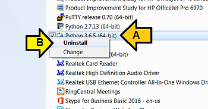

You should see:

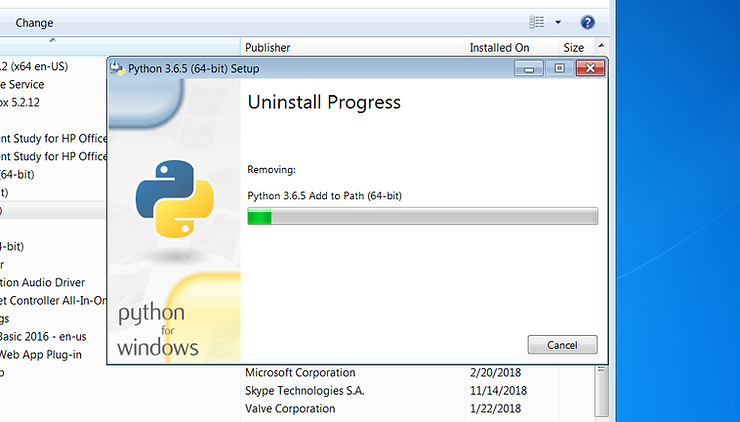

10\. Click **Close**

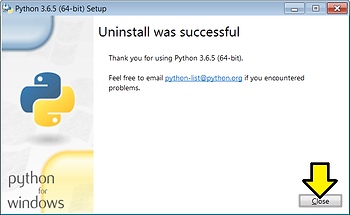

**<u><span>Reference</span></u>**

TinyFPGA BX User Guide at \[[link](https://tinyfpga.com/bx/guide.html)\]