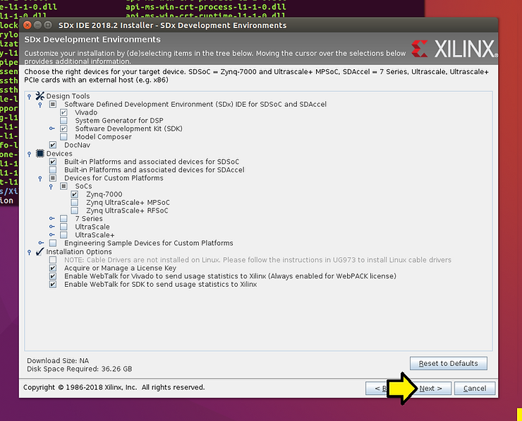

# Try SDSoC for Free on Linux

This post show you how to try SDSoC for free on Linux: install SDSoC 2018.2 on Ubuntu 16.04.3, get a free 60-day license and run SDSoC.

**<u>Notes</u>**

-   The full download of SDSoC is **20.35 GB**
    
-   This guide was built using a fresh install of Ubuntu 16.04.3 where **Download updates** and **Install third party software** were not selected
    

**<u>OSes Supported</u>**

-   Windows 7.1: 64-bit
    
-   Windows 10 Professional versions 1709 and 1803: 64-bit
    
-   Red Hat Enterprise Linux 6.6-6.9: 64-bit
    
-   Red Hat Enterprise Linux 7.2-7.4: 64-bit
    
-   CentOS Linux 6.6-6.9: 64-bit
    
-   CentOS Linux 7.2-7.4: 64-bit
    
-   Ubuntu Linux 16.04.3 LTS: 64-bit - Additional library installation required
    

**<u>Boards Support &amp; Memory Needed Per Board</u>**

SDSoC does not state the required memory in the SDx Development Environment Release Notes, Installation and Licensing Guide.

Assuming SDSoC runs "Vivado" under the hood, the memory requirements should be similar to the memory requirements of Vivado.

At \[[<u>link</u>](http://www.zachpfeffer.com/single-post/Xilinx-20182-Software-Tool-Installation-Overview-and-Assessment)\] under <u>Memory Recommendations for Vivado</u> the memory recommendations for Vivado 2018.2 have been listed.

Here are the typical and peak memory usages (and cost and links to buy) for each board supported in SDSoC 2018.2:

| SoC/MPSoC                     | Board    | Cost       | Chip Version      | Typical GB | Peak GB | Link                                                         |
| ----------------------------- | -------- | ---------- | ----------------- | ---------- | ------- | ------------------------------------------------------------ |
| Xilinx Zynq-7000 SoC          | ZC702    | $ 895.00   | XC7Z020-CLG484-1  | 1.3        | 1.9     | [link](https://www.xilinx.com/products/boards-and-kits/ek-z7-zc702-g.html) |
| Xilinx Zynq-7000 SoC          | ZC706    | $ 2,495.00 | XC7Z045 FFG900-2  | 3          | 5       | [link](https://www.xilinx.com/products/boards-and-kits/ek-z7-zc706-g.html) |
| Xilinx Zynq-7000 SoC          | ZedBoard | $ 449.00   | XC7Z020-CLG484    | 1.3        | 1.9     | [link](https://store.digilentinc.com/zedboard-zynq-7000-arm-fpga-soc-development-board/) |
| Xilinx Zynq UltraScale+ MPSoC | ZCU102   | $ 2,495.00 | XCZU9EG-2FFVB1156 | 10         | 15      | [link](https://www.xilinx.com/products/boards-and-kits/ek-u1-zcu102-g.html) |
| Zynq® UltraScale+™ MPSoC EV   | ZCU104   | $ 895.00   | XCZU7EV-2FFVC1156 | 9          | 14      | [link](https://www.xilinx.com/products/boards-and-kits/zcu104.html) |
| Zynq® UltraScale+™ MPSoC EV   | ZCU106   | $ 1,995.00 | XCZU7EV-2FFVC1156 | 9          | 14      | [link](https://www.xilinx.com/products/boards-and-kits/zcu106.html) |

Spreadsheet available at \[[<u>link</u>](https://docs.google.com/spreadsheets/d/1b8Y6VMx1V9rfOuy36ASBAQ3ULmJFTGrCQLi2SQx1n9U/edit?usp=sharing)\].

**<u>Sizing a Virtual Machine</u>**

If you are installing SDSoC 2018.2 on a VirtualBox virtual machine and using a ZC702 use 5GB of RAM and 100 GB of disk. I named my sdsoc\_ubuntu-16.04.3-desktop-amd64\_5GB-RAM\_100GB-Disk. 5 GB is 5120 MB.

Help!

If you need help installing Ubuntu 16.04.3 on VirtualBox 5.2.12 running on Windows 7 SP1 check out \[[<u>link</u>](https://www.centennialsoftwaresolutions.com/blog/install-64bit-ubuntu-16-04-3-on-a-virtualbox-5-2-12-managed-virtual-machine-running-on-windows-7-sp1)\].

**<u>Get SDSoC</u>**

1\. Go to Xilinx at \[[<u>link</u>](https://www.xilinx.com/)\] and (A) click **Developer Zone** and (B) click **SDSoC Development Environment**.

2\. (A) Click **Download / Buy** and (B) click **SDSoC Downloads** (License Required)

3\. Click **SDx 2018.2 SFD**

**<u>Add Packages</u>**

1\. Type **sudo apt-get upgrade;**

2\. Type **sudo apt-get install build-essential module-assistant;**

3\. Type **sudo dpkg --add-architecture i386**

4\. Type **sudo apt-get update**

5\. Type **sudo apt-get install libc6:i386 libncurses5:i386 libstdc++6:i386**

6\. Type **sudo apt-get install g++-multilib**

7\. Type **sudo apt-get install libgtk2.0-0:i386 dpkg-dev:i386**

8\. Type **sudo ln -s /usr/bin/make /usr/bin/gmake**

**<u>Extract</u>**

1\. Type **mkdir ~/xpkgs**

2\. Move Xilinx\_SDx\_2018.2\_0614\_1954.tar.gz to ~/xpkgs

3\. Type **cd ~/xpkgs**

4\. Type **tar -zxvf Xilinx\_SDx\_2018.2\_0614\_1954.tar.gz**

5\. Type **cd Xilinx\_SDx\_2018.2\_0614\_1954/**

6\. Type **./xsetup**

You should see:

...followed by:

If you click the **Preferences** button:

...you'll see a place where you can **set up a proxy**:

...and/or **select the amount of CPU bandwidth** you wish to use during installation:

1\. Click **Next >**

2\. (A) Agree to the **Xilinx Inc. End User License Agreement**, (B) **WebTalk Terms And Conditions** and (C) T**hird Party Software End User License Agreement** and (D) click **Next >**

3\. Click off everything you don't need. In my case I only care about Zynq-7000 so I can save 12.59 GB

<u>Calculation</u>

I started with the stated space and started subtracing features. You can use this to figure out how "big" each sub feature is.

Original disk space required: 48.85 GB

\- Devices / Built-in Platforms and associated device for SDAccel: 47.63 GB

\- Devices / Devices for Custom Platforms / SoCs / Zynq UltraScale+ MPSoC: 45.51 GB

\- Devices / Devices for Custom Platforms / SoCs / Zynq UltraScale+ RFSoC: 44.12 GB

\- Devices / Devices for Custom Platforms / 7 Series: 42.82 GB

\- Devices / Devices for Custom Platforms / UltraScale: 39.39 GB

\- Devices / Devices for Custom Platforms / UltraScale+: **36.26 GB**

...once configured click **Next >**

If you see **Cannot write to /opt/Xilinx. Check the read/write permissions.** as seen here: (if you don't jump to 4.)

Open a new terminal window and:

Type **sudo mkdir -p /opt/Xilinx**

Type **sudo chmod -R a+rwX /opt/Xilinx**

...as seen here:

Then click **< Back**

Then **Next >**

4\. ...and you'll see the following. Click **Next >**.

Here are the Installation location(s):

-   /opt/Xilinx/SDx/2018.2
    
-   /opt/Xilinx/Vivado/2018.2
    
-   /opt/Xilinx/SDK/2018.2
    
-   /opt/Xilinx/DocNav
    

5\. Finally, click **Install**

You'll see the **Installation Progress** screen:

At the end you'll see a pop up that says **Installation completed successfully.** and the Vivado License Manager 2018.2 popping up behind the **Installation Progress** window.

6\. Click **OK**.

You'll see the Vivado License Manager:

**<u>Get a 60-Day License</u>**

1\. Go to https://www.xilinx.com/getproduct and sign in.

2\. (A) Click the **SDSoC Environment: 60 Day Evaluation License** checkbox then click (B) **Generate Node-Locked License**

3\. (A) Click **Select a host...** then **(B) Add a host...**

4\. Back in the **License Manager,** click (A) **View Host Information** then record (B) the **Host Name** and (C) the **Network Interface Card (NIC) ID**

5\. (A) Enter the **Host Name**, (B) select **Linux 64-bit**, (C) select **Ethernet MAC**, (D) enter in the **Network Interface Card (NIC) ID** from the previous step into the **Host ID v**alue and (E) click **Add**.

6\. Click **Next**

7\. Click **Next** again

8\. Review the following (note the email address) and click the **x**

9\. Open the email the license was emailed too and save the license to your home directory

10\. (A) Select the **Save file** radio button and (B) click **OK**

11\. In the **License Manager**, (A) click **Load License** and (B) click **Open**

12\. Click **OK**

13\. (A) Click **View License Status**, (B) look for **SDSoC\_Tools** and if everything looks good (C) click the **x** to close the **License Manager**

14\. Click **Yes**

**<u>Running SDSoC</u>**

Type **source /opt/Xilinx/SDx/2018.2/settings64.sh**

Type **sdx**

You'll see:

Set the path to the workspace you'd like to use and click OK

It will take a moment to come up.

After a moment, you'll see:

Congratulations! You installed SDSoC!

**<u>Thank You!</u>**

Thank you for reading this!

**Click the subscribe** button above to get updates and special offers.

**<u>Reference</u>**

SDx Development Environment Release Notes, Installation and Licensing Guide UG1238 (v2018.2) June 6, 2018 at \[[<u>link</u>](https://www.xilinx.com/support/documentation/sw_manuals/xilinx2018_2/ug1238-sdx-rnil.pdf)\]

SDSoC Environment Tutorial, Introduction, UG1028 (v2018.2) July 2, 2018 \[[<u>link</u>](https://www.xilinx.com/support/documentation/sw_manuals/xilinx2018_2/ug1028-sdsoc-intro-tutorial.pdf)\] actually at \[[<u>link</u>](https://github.com/Xilinx/SDSoC-Tutorials/blob/master/getting-started-tutorial/README.md)\]