# Install Ubuntu 16.04.2 in VirtualBOX on Windows 10 to run Quartus Pro 17.1

## 1. Requirements:

This post assumes that Virtual Box is already installed on a Windows 10 PC.   We will need ~100GB of free disk space to install Quartus. This demo only requires about 15GB. 

Let's start with downloading Ubuntu. 

You can get the Legacy Version of Ubuntu here: 

http://old-releases.ubuntu.com/releases/16.04.2/

This post uses:

*Name: ubuntu-16.04.2-desktop-amd64.iso*

*Size: 1554186240 bytes (1482 MiB)*

*MD5: 1400884cec8e40a1a876b2678f81494b*

Also using *7-Zip ZStandard* from here: [7-Zip-zstd · GitHub](https://github.com/mcmilk/7-Zip-zstd/releases).   

Any tool to check MD5 will work. 

 

## 2\. Virtual Machine Configuration.

Start Virtual Box. In the Virtual Box Manager Window: Click on **New**.

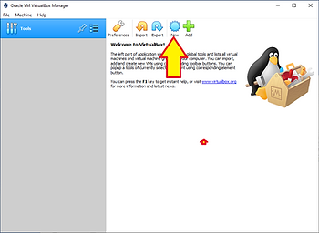

In the "Create Virtual Machine" popup. You need to (1) give your VM a name. Place it in a folder (2) with sufficient space. Make sure it's set to **Linux** (3) and **Ubuntu (64-bit)** (4) Click **Next** (5)**.**

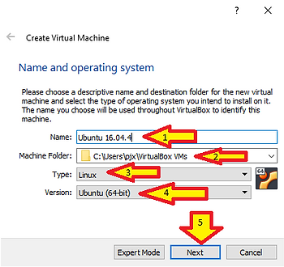

In the "Create Virtual Machine" popup. You need to give your VM some memory. Quartus 8GB Minimum. Click **Next**.

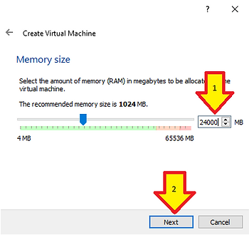

In the "Create Virtual Machine" popup. You need to create a virtual hard disk. Click **Next**.

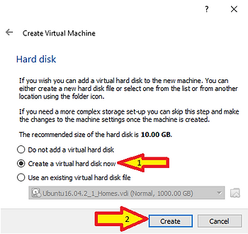

In the "Create Virtual Machine" popup. The type doesn't matter. Click **Next**.

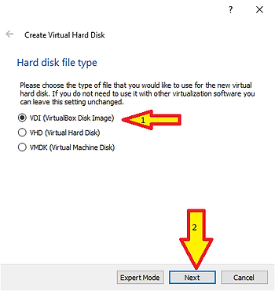

In the "Create Virtual Machine" popup. Storage Type doesn't matter. Click **Next**.

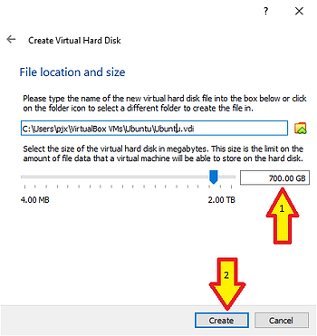

In the "Create Virtual Machine" popup. Select a location. Set a size (2). Quartus is a pig. Click **Create**.

In the "Virtual Box manager". In the menu at the left, on the new virtual machine, there is a **Menu Icon** (1). Click on the **Menu Icon** (1), then on in the popup click **Details** (2).

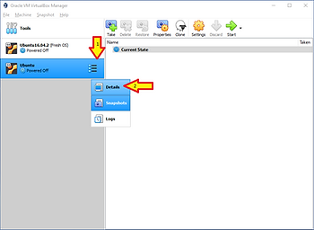

In the "Virtual Box Manager". Click on **Optical Drive**. In the Popup click **Choose/Create a disk image...**

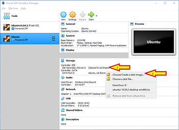

In the "Optical Disk Selector". Navigate to your Ubuntu ISO. Select it. Click **Choose**.

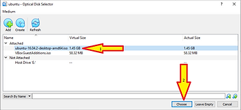

In the "VirtualBox Manager" click **Start**.

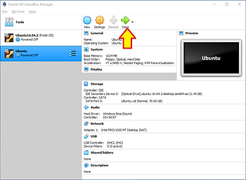

## 3\. Guest OS Installation

The previous step will bring up the "Oracle VM VirtualBox" Virtual Monitor. With in the "Oracle VM VirtualBox" Virtual Monitor, you will see Windows Boot and stop at this Install Screen. In this screen select you language and click **Install Ubuntu**.

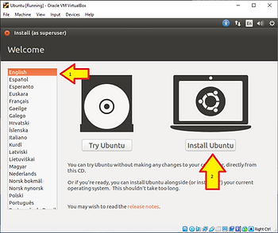

On the Install screen in the "Oracle VM VirtualBox" Virtual Monitor: Do NOT select download updates. Something about the updates BREAKS THE QUARTUS INSTALLER. This very much a bug or bad design in Quartus. Click **Continue**.

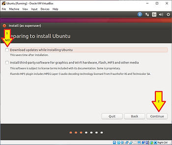

On the Install screen in the "Oracle VM VirtualBox" Virtual Monitor: Select "Erase disk and install Ubuntu". Click **Next**.

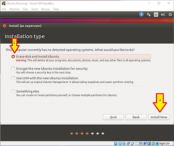

On the Popup in the "Oracle VM VirtualBox" Virtual Monitor: Click **Continue**.

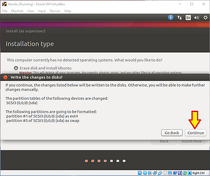

On the Install screen in the "Oracle VM VirtualBox" Virtual Monitor: Select a timezone and click **Continue**.

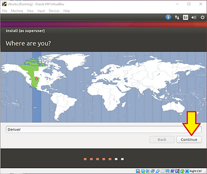

On the Install screen in the "Oracle VM VirtualBox" Virtual Monitor: Select your keyboard. The Dialog box here is wider than the Virtual Monitor. We'll fix that in a minute, but for the moment grab near the <---> in the picture below and drag the dialog box to the LEFT to get to the **Continue** button.

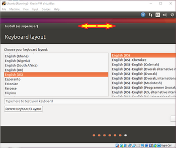

On the Install screen in the "Oracle VM VirtualBox" Virtual Monitor: Click **Continue**.

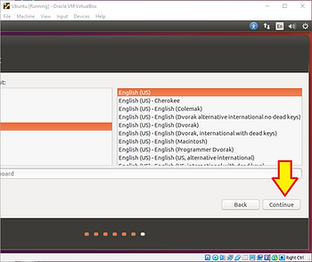

On the Install screen in the "Oracle VM VirtualBox" Virtual Monitor: This is another box that needs to get dragged to the left. Repeat the process from above. Select your username, machine name, set a password and click **Continue.**

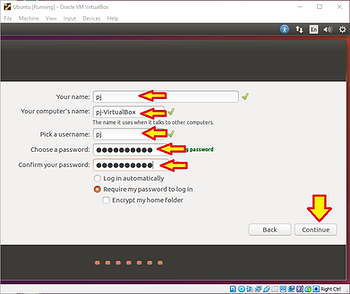

This will start the installer. This can take 5-20 minutes depending on how fast your machine is. When it completes you'll see the "Installation Complete" dialog in the "Oracle VM VirtualBox" Virtual Monitor. Click **Restart Now**.

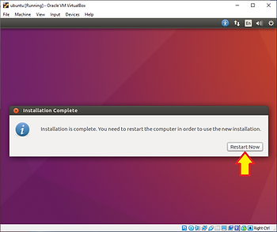

Your VM will reboot. When you see the following screen proceed to the next step.

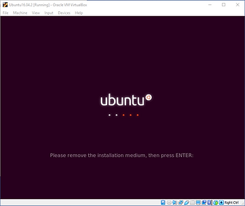

In the menu's at the top of the "Oracle VM VirtualBox" Virtual Monitor: Navigate to Devices->Optical Drives and make sure the check box next to your .iso is removed. This will "unmount" the CDROM drive. Most of the time this happens automatically. Then press the **Enter** key.

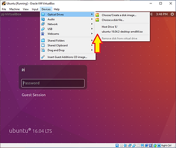

## 4\. Guest OS Configuration

You're not done yet. Login with the password you selected earlier.

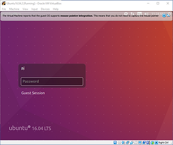

NOTE: At some non-deterministic point in the next few minutes you will get this popup. Click **Do Not Upgrade.** Upgrading will break Quartus.

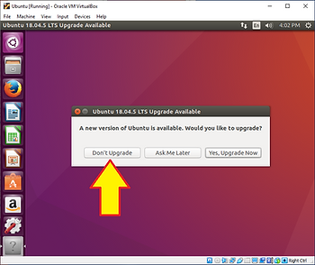

Yes, you're sure. Click **OK**.

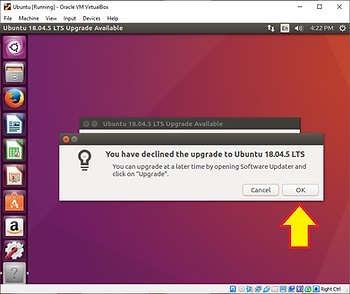

## 5\. Guest Add-Ons

VirtualBox provides a bunch of Add-Ons for the guest operating system to enable you to interact with it in a more convenient way. These enable clip board integration and allow the virtual display to be resized.

In the "Oracle VM VirtualBox" Virtual Monitor: Navigate to Devices->**Insert Guest Additions CD Image**. Click on it.

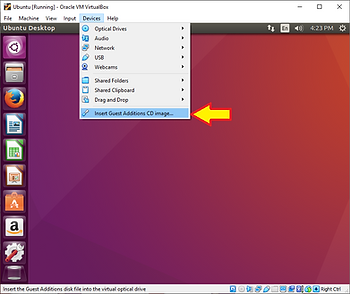

In the popup in the "Oracle VM VirtualBox" Virtual Monitor: Click **Run**.

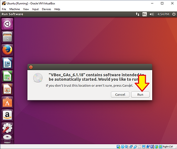

In the "Authenticate" popup in the "Oracle VM VirtualBox" Virtual Monitor: Type your password and click **Authenticate**".

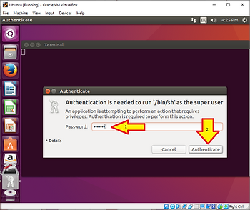

A terminal window will start. When you see "Press Return to close this window..." Press "Enter".

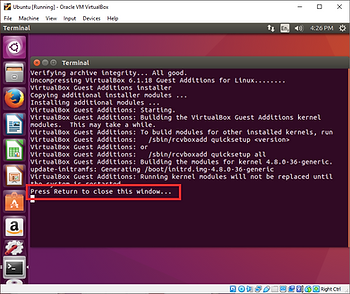

Shut down your VM.

In the "Oracle VM VirtualBox" Virtual Monitor: find this icon in the top right corner:

Navigate to and click on **Shut Down...**

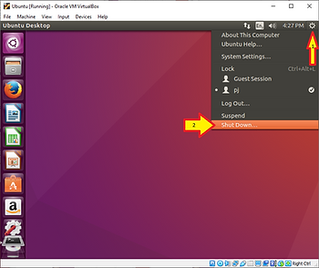

Click on **Shut Down**... Again...

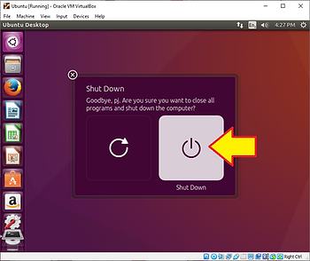

## 6\. Add additional virtual hardware resources.

Once the VM is shut down: We need to give more "processors" to it. The Virtual Box default is just 1 CPU. In the Oracle VM VirtualBox Manager: Make sure your VM is Powered Off, selected, then click Settings.

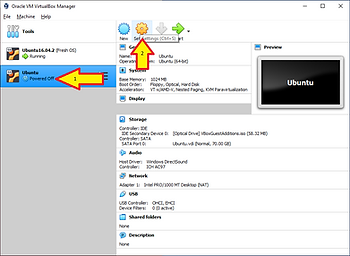

In the "Settings" Popup. Select **System** from the menu on the right, then select the **Processor** tab, then Increase the number of CPU's and click **OK**.

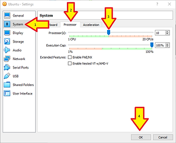