# Install Ubuntu 16.04 on a USB Stick from Windows


This guide gives the exact steps to install Ubuntu on a USB stick from Windows. With these instructions the USB stick will not have any persistent storage.

**Warning**

The instructions have you destroy any existing data on the USB stick.

**Steps**

**1.** Go to  http://releases.ubuntu.com/16.04.4/

**2.** Download [64-bit PC (AMD64) desktop image](http://releases.ubuntu.com/16.04.4/ubuntu-16.04.4-desktop-amd64.iso)

Note: the file is 1.5 GB

**3.** Insert your USB stick:

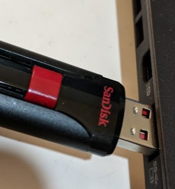

If you get an AutoPlay window, close it by clicking on the 'x':

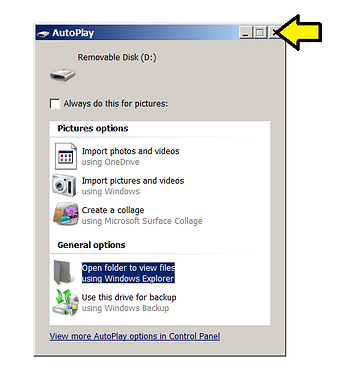

**4.** Download Rufus from [link](http://rufus.akeo.ie/downloads/rufus-2.18.exe).

Note: There's no need to install Rufus. Its just an exe. I saved mine to C:\\tools

**5.** Double click on rufus-2.18.exe to run it

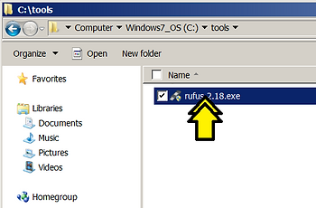

**6.** Use the following settings and click on the disk icon.

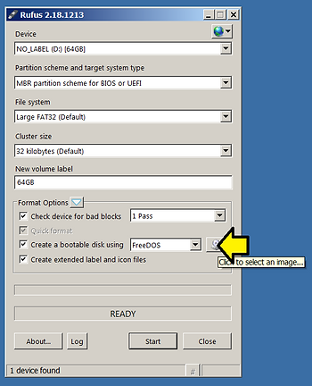

Make sure Device is the USB stick you plugged in. To do this, note the drive letter (**D:**) Run **Windows Explore**r by right clicking on **Start** and clicking **Open Windows Explorer.**

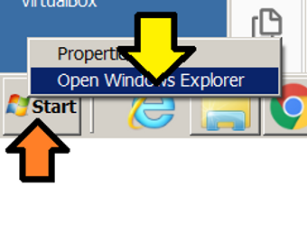

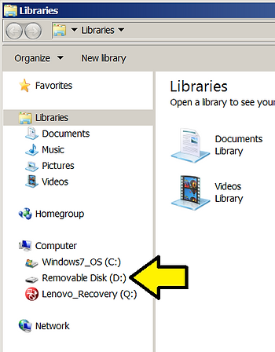

**7.** (**1**) Select the ISO and (**2**) click Open

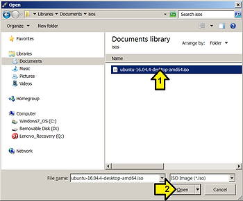

**8.** Click **Start**

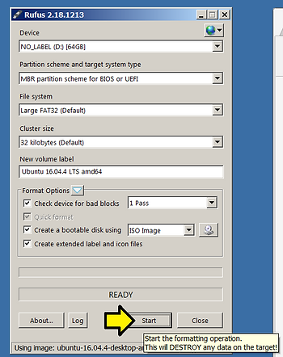

Note: I've selected **Check device for bad blocks** so that I can make sure the device has no bad blocks before using it. It does take more time to program a USB stick if this is selected.

**9.** Click **OK** on the **Download required** popup

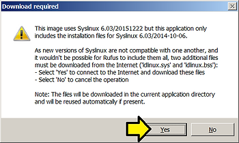

**10.** Leave **Write in ISO Image mode (Recommended)** selected and click **OK** on the ISOHybrid image detected window

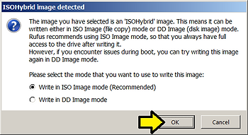

**11.** Click OK on the WARNING: ALL DATA... pop up. It will take a bit since we've selected **Check the device for bad blocks**.

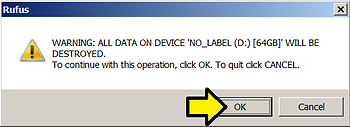

Note: with **Check for bad blocks** programming can take time.

**11.1.** Click on Log to get the log.

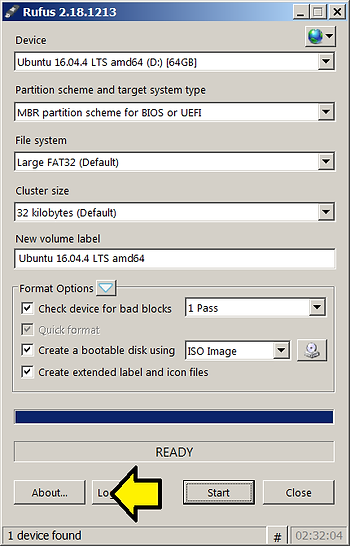

Here's the log from my run:

```
Rufus version: 2.18.1213
Windows version: Windows 7 SP1 64-bit
Syslinux versions: 4.07/2013-07-25, 6.03/2014-10-06
Grub versions: 0.4.6a, 2.02
System locale ID: 0x0409
Will use default UI locale 0x0409
SetLGP: Successfully set NoDriveTypeAutorun policy to 0x0000009E
Localization set to 'en-US'
Found USB 2.0 device 'SanDisk Cruzer Glide USB Device' (0781:5575)
1 device found
Disk type: Removable, Disk size: 64GB, Sector size: 512 bytes
Cylinders: 7645, Tracks per cylinder: 255, Sectors per track: 63
Partition type: MBR, NB Partitions: 1
Disk ID: 0x00000000
Drive has a Zeroed Master Boot Record
Partition 1:
  Type: FAT32 LBA (0x0c)
  Size: 58.6 GB (62889377792 bytes)
  Start Sector: 32, Boot: No
Checking for Rufus updates...
Checking release channel...
No new release version found.
Scanning image...
ISO analysis:
  Image is an ISO9660 image
  Will use '/isolinux/isolinux.cfg' for Syslinux
  Detected Syslinux version: 6.03/20151222 (from '/isolinux/isolinux.bin')
Disk image analysis:
  Image has an unknown Master Boot Record
  Image is a bootable disk image
ISO label: 'Ubuntu 16.04.4 LTS amd64'
  Size: 1.5 GB (Projected)
  Has a >64 chars filename
  Uses: Syslinux/Isolinux v6.03
  Uses: EFI
  Note: This ISO uses symbolic links, which will not be replicated due to file system limitations.
  Because of this, some features from this image may not work...
Using image: ubuntu-16.04.4-desktop-amd64.iso (1.5 GB)
Downloading 'ldlinux.sys' from http://rufus.akeo.ie/files/syslinux-6.03/20151222/ldlinux.sys
Unable to access file: 404
Extended version was not found, trying main version...
Downloading 'ldlinux.sys' from http://rufus.akeo.ie/files/syslinux-6.03/ldlinux.sys
File length: 68599 bytes
Successfully downloaded 'ldlinux.sys'
Downloading 'ldlinux.bss' from http://rufus.akeo.ie/files/syslinux-6.03/20151222/ldlinux.bss
Unable to access file: 404
Extended version was not found, trying main version...
Downloading 'ldlinux.bss' from http://rufus.akeo.ie/files/syslinux-6.03/ldlinux.bss
File length: 512 bytes
Successfully downloaded 'ldlinux.bss'

Format operation started
Requesting disk access...
Opened \\.\PHYSICALDRIVE1 for exclusive write access
Requesting lock...
Will use 'D:' as volume mountpoint
I/O boundary checks disabled
Requesting lock...
Analyzing existing boot records...
Drive has a Zeroed Master Boot Record
Volume has an unknown Partition Boot Record
Clearing MBR/PBR/GPT structures...
Erasing 32 sectors
Deleting partitions...
Bad Blocks: Checking from block 0 to 122830847
Bad Blocks: Using offset 310 for fake device check
Bad Blocks: Writing test pattern 0xAA
Bad Blocks: Reading and comparing
Bad Blocks: Check completed, 0 bad blocks found. (0/0/0 errors)
Clearing MBR/PBR/GPT structures...
Erasing 32 sectors
Partitioning (MBR)...
Closing existing volume...
Waiting for logical drive to reappear...
Formatting (Large FAT32)...
Opened \\?\Volume{46523d02-27f7-11e8-9654-f48c503076b7} for exclusive write access
Requesting lock...
Size : 58.6 GB 122828800 sectors
Cluster size 32768 bytes, 512 Bytes Per Sector
Volume ID is 1700:3815
32 Reserved Sectors, 14991 Sectors per FAT, 2 FATs
1918731 Total clusters
1918730 Free Clusters
Clearing out 30078 sectors for reserved sectors, FATs and root cluster...
Initializing reserved sectors and FATs...
FAT #0 sector at address: 32
FAT #1 sector at address: 15023
Writing partition boot record...
Using Standard FAT32 partition boot record
Confirmed new volume has a primary FAT32 boot sector
Setting primary FAT32 boot sector for boot...
Confirmed new volume has a secondary FAT32 boot sector
Setting secondary FAT32 boot sector for boot...
Setting Label (This may take while)...
Format completed.
Writing master boot record...
Drive has a Zeroed Master Boot Record
Partition is already FAT32 LBA...
Set bootable USB partition as 0x80
Using Syslinux MBR
Found volume GUID \\?\Volume{46523d02-27f7-11e8-9654-f48c503076b7}\
Installing Syslinux 6.03...
Opened \\?\Volume{46523d02-27f7-11e8-9654-f48c503076b7} for shared write access
Using existing './rufus_files/syslinux-6.03/20151222/ldlinux.sys' ✓
Using existing './rufus_files/syslinux-6.03/20151222/ldlinux.bss' ✓
Successfully wrote 'ldlinux.sys'
Successfully wrote Syslinux boot record
Successfully remounted \\?\Volume{46523d02-27f7-11e8-9654-f48c503076b7}\ on D:
Copying ISO files...
Extracting files...
Image is an ISO9660 image
This image will be extracted using Rock Ridge extensions (if present)
Extracting: D:\.disk\base_installable (0 bytes)
Extracting: D:\.disk\casper-uuid-generic (37 bytes)
Extracting: D:\.disk\cd_type (15 bytes)
Extracting: D:\.disk\info (60 bytes)
Extracting: D:\.disk\release_notes_url (80 bytes)
Extracting: D:\boot\grub\efi.img (2.3 MB)
Extracting: D:\boot\grub\font.pf2 (4.9 KB)
Extracting: D:\boot\grub\grub.cfg (955 bytes)
Extracting: D:\boot\grub\loopback.cfg (625 bytes)
Extracting: D:\boot\grub\x86_64-efi\acpi.mod (15.7 KB)
Extracting: D:\boot\grub\x86_64-efi\adler32.mod (2.0 KB)
Extracting: D:\boot\grub\x86_64-efi\ahci.mod (22.1 KB)
Extracting: D:\boot\grub\x86_64-efi\all_video.mod (1 KB)
Extracting: D:\boot\grub\x86_64-efi\aout.mod (1.6 KB)
Extracting: D:\boot\grub\x86_64-efi\appleldr.mod (5.3 KB)
Extracting: D:\boot\grub\x86_64-efi\archelp.mod (4.5 KB)
Extracting: D:\boot\grub\x86_64-efi\ata.mod (8.8 KB)
Extracting: D:\boot\grub\x86_64-efi\at_keyboard.mod (7.4 KB)
Extracting: D:\boot\grub\x86_64-efi\backtrace.mod (2.6 KB)
Extracting: D:\boot\grub\x86_64-efi\bfs.mod (9.8 KB)
Extracting: D:\boot\grub\x86_64-efi\bitmap.mod (3.2 KB)
Extracting: D:\boot\grub\x86_64-efi\bitmap_scale.mod (5.2 KB)
Extracting: D:\boot\grub\x86_64-efi\blocklist.mod (3.2 KB)
Extracting: D:\boot\grub\x86_64-efi\boot.mod (3.3 KB)
Extracting: D:\boot\grub\x86_64-efi\bsd.mod (48.2 KB)
Extracting: D:\boot\grub\x86_64-efi\btrfs.mod (19.2 KB)
Extracting: D:\boot\grub\x86_64-efi\bufio.mod (2.9 KB)
Extracting: D:\boot\grub\x86_64-efi\cat.mod (4.2 KB)
Extracting: D:\boot\grub\x86_64-efi\cbfs.mod (5.4 KB)
Extracting: D:\boot\grub\x86_64-efi\cbls.mod (6.2 KB)
Extracting: D:\boot\grub\x86_64-efi\cbmemc.mod (3.9 KB)
Extracting: D:\boot\grub\x86_64-efi\cbtable.mod (1.7 KB)
Extracting: D:\boot\grub\x86_64-efi\cbtime.mod (4.1 KB)
Extracting: D:\boot\grub\x86_64-efi\chain.mod (20.6 KB)
Extracting: D:\boot\grub\x86_64-efi\cmdline_cat_test.mod (4.7 KB)
Extracting: D:\boot\grub\x86_64-efi\cmp.mod (2.9 KB)
Extracting: D:\boot\grub\x86_64-efi\command.lst (3.5 KB)
Extracting: D:\boot\grub\x86_64-efi\cpio.mod (4.3 KB)
Extracting: D:\boot\grub\x86_64-efi\cpio_be.mod (4.3 KB)
Extracting: D:\boot\grub\x86_64-efi\cpuid.mod (2.6 KB)
Extracting: D:\boot\grub\x86_64-efi\crc64.mod (2.2 KB)
Extracting: D:\boot\grub\x86_64-efi\crypto.lst (936 bytes)
Extracting: D:\boot\grub\x86_64-efi\crypto.mod (6.9 KB)
Extracting: D:\boot\grub\x86_64-efi\cryptodisk.mod (15.6 KB)
Extracting: D:\boot\grub\x86_64-efi\cs5536.mod (3.9 KB)
Extracting: D:\boot\grub\x86_64-efi\date.mod (3.3 KB)
Extracting: D:\boot\grub\x86_64-efi\datehook.mod (3 KB)
Extracting: D:\boot\grub\x86_64-efi\datetime.mod (2.0 KB)
Extracting: D:\boot\grub\x86_64-efi\disk.mod (3.1 KB)
Extracting: D:\boot\grub\x86_64-efi\diskfilter.mod (13.5 KB)
Extracting: D:\boot\grub\x86_64-efi\div_test.mod (5.7 KB)
Extracting: D:\boot\grub\x86_64-efi\dm_nv.mod (2.7 KB)
Extracting: D:\boot\grub\x86_64-efi\echo.mod (3.1 KB)
Extracting: D:\boot\grub\x86_64-efi\efifwsetup.mod (2.3 KB)
Extracting: D:\boot\grub\x86_64-efi\efinet.mod (10 KB)
Extracting: D:\boot\grub\x86_64-efi\efi_gop.mod (13.4 KB)
Extracting: D:\boot\grub\x86_64-efi\efi_uga.mod (7.4 KB)
Extracting: D:\boot\grub\x86_64-efi\ehci.mod (24.5 KB)
Extracting: D:\boot\grub\x86_64-efi\elf.mod (7.2 KB)
Extracting: D:\boot\grub\x86_64-efi\eval.mod (2.2 KB)
Extracting: D:\boot\grub\x86_64-efi\exfat.mod (8.3 KB)
Extracting: D:\boot\grub\x86_64-efi\exfctest.mod (2.3 KB)
Extracting: D:\boot\grub\x86_64-efi\ext2.mod (8.4 KB)
Extracting: D:\boot\grub\x86_64-efi\fat.mod (8.5 KB)
Extracting: D:\boot\grub\x86_64-efi\file.mod (23.9 KB)
Extracting: D:\boot\grub\x86_64-efi\fixvideo.mod (3 KB)
Extracting: D:\boot\grub\x86_64-efi\font.mod (17.5 KB)
Extracting: D:\boot\grub\x86_64-efi\fs.lst (214 bytes)
Extracting: D:\boot\grub\x86_64-efi\gcry_arcfour.mod (2.5 KB)
Extracting: D:\boot\grub\x86_64-efi\gcry_blowfish.mod (9.1 KB)
Extracting: D:\boot\grub\x86_64-efi\gcry_camellia.mod (31.2 KB)
Extracting: D:\boot\grub\x86_64-efi\gcry_cast5.mod (14.4 KB)
Extracting: D:\boot\grub\x86_64-efi\gcry_crc.mod (3.9 KB)
Extracting: D:\boot\grub\x86_64-efi\gcry_des.mod (16.6 KB)
Extracting: D:\boot\grub\x86_64-efi\gcry_dsa.mod (3.5 KB)
Extracting: D:\boot\grub\x86_64-efi\gcry_idea.mod (4.1 KB)
Extracting: D:\boot\grub\x86_64-efi\gcry_md4.mod (4.2 KB)
Extracting: D:\boot\grub\x86_64-efi\gcry_md5.mod (4.7 KB)
Extracting: D:\boot\grub\x86_64-efi\gcry_rfc2268.mod (3.3 KB)
Extracting: D:\boot\grub\x86_64-efi\gcry_rijndael.mod (20.5 KB)
Extracting: D:\boot\grub\x86_64-efi\gcry_rmd160.mod (7.9 KB)
Extracting: D:\boot\grub\x86_64-efi\gcry_rsa.mod (3.5 KB)
Extracting: D:\boot\grub\x86_64-efi\gcry_seed.mod (15.8 KB)
Extracting: D:\boot\grub\x86_64-efi\gcry_serpent.mod (16.7 KB)
Extracting: D:\boot\grub\x86_64-efi\gcry_sha1.mod (7.7 KB)
Extracting: D:\boot\grub\x86_64-efi\gcry_sha256.mod (5.4 KB)
Extracting: D:\boot\grub\x86_64-efi\gcry_sha512.mod (6.4 KB)
Extracting: D:\boot\grub\x86_64-efi\gcry_tiger.mod (13.4 KB)
Extracting: D:\boot\grub\x86_64-efi\gcry_twofish.mod (33.3 KB)
Extracting: D:\boot\grub\x86_64-efi\gcry_whirlpool.mod (22.4 KB)
Extracting: D:\boot\grub\x86_64-efi\geli.mod (8.9 KB)
Extracting: D:\boot\grub\x86_64-efi\gettext.mod (8.5 KB)
Extracting: D:\boot\grub\x86_64-efi\gfxmenu.mod (58.6 KB)
Extracting: D:\boot\grub\x86_64-efi\gfxterm.mod (17.6 KB)
Extracting: D:\boot\grub\x86_64-efi\gfxterm_background.mod (4.7 KB)
Extracting: D:\boot\grub\x86_64-efi\gfxterm_menu.mod (7.7 KB)
Extracting: D:\boot\grub\x86_64-efi\gptsync.mod (5 KB)
Extracting: D:\boot\grub\x86_64-efi\grub.cfg (219 bytes)
Extracting: D:\boot\grub\x86_64-efi\gzio.mod (11.2 KB)
Extracting: D:\boot\grub\x86_64-efi\halt.mod (6.7 KB)
Extracting: D:\boot\grub\x86_64-efi\hashsum.mod (8.5 KB)
Extracting: D:\boot\grub\x86_64-efi\hdparm.mod (11.1 KB)
Extracting: D:\boot\grub\x86_64-efi\help.mod (4.0 KB)
Extracting: D:\boot\grub\x86_64-efi\hexdump.mod (4.5 KB)
Extracting: D:\boot\grub\x86_64-efi\hfs.mod (10.3 KB)
Extracting: D:\boot\grub\x86_64-efi\hfsplus.mod (10.5 KB)
Extracting: D:\boot\grub\x86_64-efi\hfspluscomp.mod (4.3 KB)
Extracting: D:\boot\grub\x86_64-efi\http.mod (9.5 KB)
Extracting: D:\boot\grub\x86_64-efi\iorw.mod (4.6 KB)
Extracting: D:\boot\grub\x86_64-efi\jfs.mod (8.8 KB)
Extracting: D:\boot\grub\x86_64-efi\jpeg.mod (8.6 KB)
Extracting: D:\boot\grub\x86_64-efi\keylayouts.mod (6.3 KB)
Extracting: D:\boot\grub\x86_64-efi\keystatus.mod (3.1 KB)
Extracting: D:\boot\grub\x86_64-efi\ldm.mod (8.2 KB)
Extracting: D:\boot\grub\x86_64-efi\legacycfg.mod (43.5 KB)
Extracting: D:\boot\grub\x86_64-efi\legacy_password_test.mod (15.6 KB)
Extracting: D:\boot\grub\x86_64-efi\linux.mod (21.3 KB)
Extracting: D:\boot\grub\x86_64-efi\linux16.mod (12.7 KB)
Extracting: D:\boot\grub\x86_64-efi\linuxefi.mod (10.1 KB)
Extracting: D:\boot\grub\x86_64-efi\loadbios.mod (4.8 KB)
Extracting: D:\boot\grub\x86_64-efi\loadenv.mod (9.3 KB)
Extracting: D:\boot\grub\x86_64-efi\loopback.mod (4.8 KB)
Extracting: D:\boot\grub\x86_64-efi\ls.mod (6.6 KB)
Extracting: D:\boot\grub\x86_64-efi\lsacpi.mod (7.2 KB)
Extracting: D:\boot\grub\x86_64-efi\lsefi.mod (5.3 KB)
Extracting: D:\boot\grub\x86_64-efi\lsefimmap.mod (3.7 KB)
Extracting: D:\boot\grub\x86_64-efi\lsefisystab.mod (3.5 KB)
Extracting: D:\boot\grub\x86_64-efi\lsmmap.mod (3.0 KB)
Extracting: D:\boot\grub\x86_64-efi\lspci.mod (7.2 KB)
Extracting: D:\boot\grub\x86_64-efi\lssal.mod (3.9 KB)
Extracting: D:\boot\grub\x86_64-efi\luks.mod (9.3 KB)
Extracting: D:\boot\grub\x86_64-efi\lvm.mod (9.6 KB)
Extracting: D:\boot\grub\x86_64-efi\lzopio.mod (12.0 KB)
Extracting: D:\boot\grub\x86_64-efi\macbless.mod (4.9 KB)
Extracting: D:\boot\grub\x86_64-efi\macho.mod (10.6 KB)
Extracting: D:\boot\grub\x86_64-efi\mdraid09.mod (2.8 KB)
Extracting: D:\boot\grub\x86_64-efi\mdraid09_be.mod (2.8 KB)
Extracting: D:\boot\grub\x86_64-efi\mdraid1x.mod (2.7 KB)
Extracting: D:\boot\grub\x86_64-efi\memrw.mod (4.6 KB)
Extracting: D:\boot\grub\x86_64-efi\minicmd.mod (5.5 KB)
Extracting: D:\boot\grub\x86_64-efi\minix2.mod (5.5 KB)
Extracting: D:\boot\grub\x86_64-efi\minix2_be.mod (5.6 KB)
Extracting: D:\boot\grub\x86_64-efi\minix3.mod (5.5 KB)
Extracting: D:\boot\grub\x86_64-efi\minix3_be.mod (5.5 KB)
Extracting: D:\boot\grub\x86_64-efi\minix_be.mod (5.5 KB)
Extracting: D:\boot\grub\x86_64-efi\mmap.mod (9.5 KB)
Extracting: D:\boot\grub\x86_64-efi\moddep.lst (4.7 KB)
Extracting: D:\boot\grub\x86_64-efi\morse.mod (3.4 KB)
Extracting: D:\boot\grub\x86_64-efi\mpi.mod (42.7 KB)
Extracting: D:\boot\grub\x86_64-efi\msdospart.mod (3.7 KB)
Extracting: D:\boot\grub\x86_64-efi\multiboot.mod (18.5 KB)
Extracting: D:\boot\grub\x86_64-efi\multiboot2.mod (20.3 KB)
Extracting: D:\boot\grub\x86_64-efi\nativedisk.mod (6.5 KB)
Extracting: D:\boot\grub\x86_64-efi\net.mod (85.8 KB)
Extracting: D:\boot\grub\x86_64-efi\newc.mod (4.5 KB)
Extracting: D:\boot\grub\x86_64-efi\ntfs.mod (15 KB)
Extracting: D:\boot\grub\x86_64-efi\ntfscomp.mod (5.7 KB)
Extracting: D:\boot\grub\x86_64-efi\odc.mod (4.3 KB)
Extracting: D:\boot\grub\x86_64-efi\offsetio.mod (2.3 KB)
Extracting: D:\boot\grub\x86_64-efi\ohci.mod (15.8 KB)
Extracting: D:\boot\grub\x86_64-efi\partmap.lst (111 bytes)
Extracting: D:\boot\grub\x86_64-efi\parttool.lst (17 bytes)
Extracting: D:\boot\grub\x86_64-efi\parttool.mod (7.3 KB)
Extracting: D:\boot\grub\x86_64-efi\part_acorn.mod (2.3 KB)
Extracting: D:\boot\grub\x86_64-efi\part_amiga.mod (2.6 KB)
Extracting: D:\boot\grub\x86_64-efi\part_apple.mod (3 KB)
Extracting: D:\boot\grub\x86_64-efi\part_bsd.mod (4.2 KB)
Extracting: D:\boot\grub\x86_64-efi\part_dfly.mod (2.7 KB)
Extracting: D:\boot\grub\x86_64-efi\part_dvh.mod (2.2 KB)
Extracting: D:\boot\grub\x86_64-efi\part_gpt.mod (3.3 KB)
Extracting: D:\boot\grub\x86_64-efi\part_msdos.mod (3 KB)
Extracting: D:\boot\grub\x86_64-efi\part_plan.mod (2.6 KB)
Extracting: D:\boot\grub\x86_64-efi\part_sun.mod (2.3 KB)
Extracting: D:\boot\grub\x86_64-efi\part_sunpc.mod (2.5 KB)
Extracting: D:\boot\grub\x86_64-efi\password.mod (3.0 KB)
Extracting: D:\boot\grub\x86_64-efi\password_pbkdf2.mod (4.4 KB)
Extracting: D:\boot\grub\x86_64-efi\pata.mod (7.2 KB)
Extracting: D:\boot\grub\x86_64-efi\pbkdf2.mod (2.1 KB)
Extracting: D:\boot\grub\x86_64-efi\pbkdf2_test.mod (3.5 KB)
Extracting: D:\boot\grub\x86_64-efi\pcidump.mod (3.6 KB)
Extracting: D:\boot\grub\x86_64-efi\play.mod (3.9 KB)
Extracting: D:\boot\grub\x86_64-efi\png.mod (10.1 KB)
Extracting: D:\boot\grub\x86_64-efi\priority_queue.mod (2.2 KB)
Extracting: D:\boot\grub\x86_64-efi\probe.mod (4.2 KB)
Extracting: D:\boot\grub\x86_64-efi\procfs.mod (3.5 KB)
Extracting: D:\boot\grub\x86_64-efi\progress.mod (3.0 KB)
Extracting: D:\boot\grub\x86_64-efi\raid5rec.mod (2.1 KB)
Extracting: D:\boot\grub\x86_64-efi\raid6rec.mod (3.3 KB)
Extracting: D:\boot\grub\x86_64-efi\read.mod (2.3 KB)
Extracting: D:\boot\grub\x86_64-efi\reboot.mod (1.9 KB)
Extracting: D:\boot\grub\x86_64-efi\regexp.mod (75 KB)
Extracting: D:\boot\grub\x86_64-efi\reiserfs.mod (13.8 KB)
Extracting: D:\boot\grub\x86_64-efi\relocator.mod (25.3 KB)
Extracting: D:\boot\grub\x86_64-efi\romfs.mod (5.7 KB)
Extracting: D:\boot\grub\x86_64-efi\scsi.mod (7.2 KB)
Extracting: D:\boot\grub\x86_64-efi\serial.mod (14.3 KB)
Extracting: D:\boot\grub\x86_64-efi\setjmp.mod (1 KB)
Extracting: D:\boot\grub\x86_64-efi\setjmp_test.mod (2.7 KB)
Extracting: D:\boot\grub\x86_64-efi\setpci.mod (8.8 KB)
Extracting: D:\boot\grub\x86_64-efi\signature_test.mod (8.6 KB)
Extracting: D:\boot\grub\x86_64-efi\sleep.mod (3.6 KB)
Extracting: D:\boot\grub\x86_64-efi\sleep_test.mod (3.5 KB)
Extracting: D:\boot\grub\x86_64-efi\spkmodem.mod (3.2 KB)
Extracting: D:\boot\grub\x86_64-efi\squash4.mod (9.4 KB)
Extracting: D:\boot\grub\x86_64-efi\syslinuxcfg.mod (28.9 KB)
Extracting: D:\boot\grub\x86_64-efi\terminal.lst (162 bytes)
Extracting: D:\boot\grub\x86_64-efi\terminal.mod (6.7 KB)
Extracting: D:\boot\grub\x86_64-efi\terminfo.mod (19.2 KB)
Extracting: D:\boot\grub\x86_64-efi\test.mod (7.6 KB)
Extracting: D:\boot\grub\x86_64-efi\testload.mod (3.8 KB)
Extracting: D:\boot\grub\x86_64-efi\testspeed.mod (3.5 KB)
Extracting: D:\boot\grub\x86_64-efi\test_blockarg.mod (2.1 KB)
Extracting: D:\boot\grub\x86_64-efi\tftp.mod (8.4 KB)
Extracting: D:\boot\grub\x86_64-efi\tga.mod (6.5 KB)
Extracting: D:\boot\grub\x86_64-efi\time.mod (2.4 KB)
Extracting: D:\boot\grub\x86_64-efi\tr.mod (3.7 KB)
Extracting: D:\boot\grub\x86_64-efi\trig.mod (2 KB)
Extracting: D:\boot\grub\x86_64-efi\true.mod (1.9 KB)
Extracting: D:\boot\grub\x86_64-efi\udf.mod (11.1 KB)
Extracting: D:\boot\grub\x86_64-efi\ufs1.mod (7.7 KB)
Extracting: D:\boot\grub\x86_64-efi\ufs1_be.mod (7.9 KB)
Extracting: D:\boot\grub\x86_64-efi\ufs2.mod (7.7 KB)
Extracting: D:\boot\grub\x86_64-efi\uhci.mod (10.1 KB)
Extracting: D:\boot\grub\x86_64-efi\usb.mod (15.6 KB)
Extracting: D:\boot\grub\x86_64-efi\usbms.mod (11 KB)
Extracting: D:\boot\grub\x86_64-efi\usbserial_common.mod (3 KB)
Extracting: D:\boot\grub\x86_64-efi\usbserial_ftdi.mod (3.5 KB)
Extracting: D:\boot\grub\x86_64-efi\usbserial_pl2303.mod (3.8 KB)
Extracting: D:\boot\grub\x86_64-efi\usbserial_usbdebug.mod (2.4 KB)
Extracting: D:\boot\grub\x86_64-efi\usbtest.mod (5.5 KB)
Extracting: D:\boot\grub\x86_64-efi\usb_keyboard.mod (5.8 KB)
Extracting: D:\boot\grub\x86_64-efi\verify.mod (19.2 KB)
Extracting: D:\boot\grub\x86_64-efi\video.lst (41 bytes)
Extracting: D:\boot\grub\x86_64-efi\video.mod (9.0 KB)
Extracting: D:\boot\grub\x86_64-efi\videoinfo.mod (5.7 KB)
Extracting: D:\boot\grub\x86_64-efi\videotest.mod (5.4 KB)
Extracting: D:\boot\grub\x86_64-efi\videotest_checksum.mod (3.8 KB)
Extracting: D:\boot\grub\x86_64-efi\video_bochs.mod (9.1 KB)
Extracting: D:\boot\grub\x86_64-efi\video_cirrus.mod (9.5 KB)
Extracting: D:\boot\grub\x86_64-efi\video_colors.mod (9.9 KB)
Extracting: D:\boot\grub\x86_64-efi\video_fb.mod (28.6 KB)
Extracting: D:\boot\grub\x86_64-efi\xfs.mod (10.4 KB)
Extracting: D:\boot\grub\x86_64-efi\xnu.mod (41.1 KB)
Extracting: D:\boot\grub\x86_64-efi\xnu_uuid.mod (3.3 KB)
Extracting: D:\boot\grub\x86_64-efi\xnu_uuid_test.mod (3.3 KB)
Extracting: D:\boot\grub\x86_64-efi\xzio.mod (20 KB)
Extracting: D:\boot\grub\x86_64-efi\zfscrypt.mod (8.4 KB)
Extracting: D:\casper\filesystem.manifest (67.2 KB)
Extracting: D:\casper\filesystem.manifest-remove (3.8 KB)
Extracting: D:\casper\filesystem.size (11 bytes)
Extracting: D:\casper\filesystem.squashfs (1.5 GB)
Extracting: D:\casper\filesystem.squashfs.gpg (916 bytes)
Extracting: D:\casper\initrd.lz (30.3 MB)
Extracting: D:\casper\vmlinuz.efi (7.4 MB)
Extracting: D:\dists\stable (0 bytes)
  Ignoring Rock Ridge symbolic link to 'xenial'
Extracting: D:\dists\unstable (0 bytes)
  Ignoring Rock Ridge symbolic link to 'xenial'
Extracting: D:\dists\xenial\main\binary-amd64\Packages.gz (10.3 KB)
Extracting: D:\dists\xenial\main\binary-amd64\Release (96 bytes)
Extracting: D:\dists\xenial\main\binary-i386\Packages.gz (20 bytes)
Extracting: D:\dists\xenial\main\binary-i386\Release (95 bytes)
Extracting: D:\dists\xenial\Release (3.3 KB)
Extracting: D:\dists\xenial\Release.gpg (819 bytes)
Extracting: D:\dists\xenial\restricted\binary-amd64\Packages.gz (818 bytes)
Extracting: D:\dists\xenial\restricted\binary-amd64\Release (102 bytes)
Extracting: D:\dists\xenial\restricted\binary-i386\Packages.gz (20 bytes)
Extracting: D:\dists\xenial\restricted\binary-i386\Release (101 bytes)
Extracting: D:\EFI\BOOT\BOOTx64.EFI (1.1 MB)
Extracting: D:\EFI\BOOT\grubx64.efi (1.1 MB)
Extracting: D:\install\mt86plus (178.4 KB)
Extracting: D:\isolinux\16x16.fnt (69.6 KB)
Extracting: D:\isolinux\access.pcx (3.3 KB)
Extracting: D:\isolinux\adtxt.cfg (0 bytes)
Extracting: D:\isolinux\am.tr (3.4 KB)
Extracting: D:\isolinux\ast.hlp (7.2 KB)
Extracting: D:\isolinux\ast.tr (2.3 KB)
Extracting: D:\isolinux\back.jpg (7.3 KB)
Extracting: D:\isolinux\be.hlp (11.4 KB)
Extracting: D:\isolinux\be.tr (3.9 KB)
Extracting: D:\isolinux\bg.hlp (11.4 KB)
Extracting: D:\isolinux\bg.tr (4.3 KB)
Extracting: D:\isolinux\blank.pcx (11.2 KB)
Extracting: D:\isolinux\bn.hlp (14.8 KB)
Extracting: D:\isolinux\boot.cat (2 KB)
Extracting: D:\isolinux\bootlogo (842.5 KB)
Extracting: D:\isolinux\bs.hlp (6.9 KB)
Extracting: D:\isolinux\bs.tr (2.3 KB)
Extracting: D:\isolinux\ca.hlp (7.9 KB)
Extracting: D:\isolinux\ca.tr (2.6 KB)
Extracting: D:\isolinux\chain.c32 (24.3 KB)
Extracting: D:\isolinux\cs.hlp (7.2 KB)
Extracting: D:\isolinux\cs.tr (2.4 KB)
Extracting: D:\isolinux\da.hlp (6.7 KB)
Extracting: D:\isolinux\da.tr (2.3 KB)
Extracting: D:\isolinux\de.hlp (7.6 KB)
Extracting: D:\isolinux\de.tr (2.5 KB)
Extracting: D:\isolinux\dtmenu.cfg (1.4 KB)
Extracting: D:\isolinux\el.hlp (13.1 KB)
Extracting: D:\isolinux\el.tr (4.6 KB)
Extracting: D:\isolinux\en.hlp (6.4 KB)
Extracting: D:\isolinux\en.tr (2 KB)
Extracting: D:\isolinux\eo.hlp (6.7 KB)
Extracting: D:\isolinux\eo.tr (2.2 KB)
Extracting: D:\isolinux\es.hlp (7.5 KB)
Extracting: D:\isolinux\es.tr (2.3 KB)
Extracting: D:\isolinux\et.hlp (6.6 KB)
Extracting: D:\isolinux\et.tr (2.2 KB)
Extracting: D:\isolinux\eu.hlp (7 KB)
Extracting: D:\isolinux\eu.tr (2.2 KB)
Extracting: D:\isolinux\exithelp.cfg (53 bytes)
Extracting: D:\isolinux\f1.txt (869 bytes)
Extracting: D:\isolinux\f10.txt (723 bytes)
Extracting: D:\isolinux\f2.txt (739 bytes)
Extracting: D:\isolinux\f3.txt (782 bytes)
Extracting: D:\isolinux\f4.txt (417 bytes)
Extracting: D:\isolinux\f5.txt (806 bytes)
Extracting: D:\isolinux\f6.txt (1.2 KB)
Extracting: D:\isolinux\f7.txt (916 bytes)
Extracting: D:\isolinux\f8.txt (1 KB)
Extracting: D:\isolinux\f9.txt (765 bytes)
Extracting: D:\isolinux\fa.tr (3.6 KB)
Extracting: D:\isolinux\fi.hlp (7.0 KB)
Extracting: D:\isolinux\fi.tr (2.3 KB)
Extracting: D:\isolinux\fr.hlp (7.8 KB)
Extracting: D:\isolinux\fr.tr (2.4 KB)
Extracting: D:\isolinux\ga.tr (2.5 KB)
Extracting: D:\isolinux\gfxboot.c32 (10.3 KB)
Extracting: D:\isolinux\gfxboot.cfg (369 bytes)
Extracting: D:\isolinux\gl.hlp (7.4 KB)
Extracting: D:\isolinux\gl.tr (2.3 KB)
Extracting: D:\isolinux\he.hlp (9.2 KB)
Extracting: D:\isolinux\he.tr (3.3 KB)
Extracting: D:\isolinux\hi.hlp (0 bytes)
Extracting: D:\isolinux\hr.tr (2.3 KB)
Extracting: D:\isolinux\hu.hlp (7.6 KB)
Extracting: D:\isolinux\hu.tr (2.7 KB)
Extracting: D:\isolinux\id.hlp (6.9 KB)
Extracting: D:\isolinux\id.tr (2 KB)
Extracting: D:\isolinux\is.hlp (7.3 KB)
Extracting: D:\isolinux\is.tr (2.4 KB)
Extracting: D:\isolinux\isolinux.bin (40 KB)
Extracting: D:\isolinux\isolinux.cfg (178 bytes)
Extracting: D:\isolinux\it.hlp (7.0 KB)
Extracting: D:\isolinux\it.tr (2.3 KB)
Extracting: D:\isolinux\ja.hlp (9.2 KB)
Extracting: D:\isolinux\ja.tr (3.4 KB)
Extracting: D:\isolinux\ka.hlp (12.1 KB)
Extracting: D:\isolinux\ka.tr (5.3 KB)
Extracting: D:\isolinux\kk.hlp (12.8 KB)
Extracting: D:\isolinux\kk.tr (4.1 KB)
Extracting: D:\isolinux\km.hlp (18.2 KB)
Extracting: D:\isolinux\kn.tr (6.4 KB)
Extracting: D:\isolinux\ko.hlp (8.1 KB)
Extracting: D:\isolinux\ko.tr (2.7 KB)
Extracting: D:\isolinux\ku.tr (2.4 KB)
Extracting: D:\isolinux\langlist (232 bytes)
Extracting: D:\isolinux\ldlinux.c32 (113.8 KB)
Extracting: D:\isolinux\libcom32.c32 (178.3 KB)
Extracting: D:\isolinux\libutil.c32 (23.1 KB)
Extracting: D:\isolinux\lo.tr (5.5 KB)
Extracting: D:\isolinux\lt.hlp (7.2 KB)
Extracting: D:\isolinux\lt.tr (2.4 KB)
Extracting: D:\isolinux\lv.hlp (7.7 KB)
Extracting: D:\isolinux\lv.tr (2.5 KB)
Extracting: D:\isolinux\menu.cfg (437 bytes)
Extracting: D:\isolinux\mk.tr (3.6 KB)
Extracting: D:\isolinux\mr.tr (6.1 KB)
Extracting: D:\isolinux\nb.hlp (6.8 KB)
Extracting: D:\isolinux\nb.tr (2.2 KB)
Extracting: D:\isolinux\nl.hlp (7.0 KB)
Extracting: D:\isolinux\nl.tr (2.5 KB)
Extracting: D:\isolinux\nn.hlp (7 KB)
Extracting: D:\isolinux\nn.tr (2.2 KB)
Extracting: D:\isolinux\pl.hlp (7.4 KB)
Extracting: D:\isolinux\pl.tr (2.5 KB)
Extracting: D:\isolinux\prompt.cfg (175 bytes)
Extracting: D:\isolinux\pt.hlp (7.4 KB)
Extracting: D:\isolinux\pt.tr (2.3 KB)
Extracting: D:\isolinux\pt_BR.hlp (7.3 KB)
Extracting: D:\isolinux\pt_BR.tr (2.5 KB)
Extracting: D:\isolinux\ro.hlp (8.4 KB)
Extracting: D:\isolinux\ro.tr (2.5 KB)
Extracting: D:\isolinux\rqtxt.cfg (135 bytes)
Extracting: D:\isolinux\ru.hlp (11.8 KB)
Extracting: D:\isolinux\ru.tr (4.0 KB)
Extracting: D:\isolinux\si.hlp (13.7 KB)
Extracting: D:\isolinux\si.tr (6.2 KB)
Extracting: D:\isolinux\sk.hlp (7.4 KB)
Extracting: D:\isolinux\sk.tr (2.6 KB)
Extracting: D:\isolinux\sl.hlp (6.8 KB)
Extracting: D:\isolinux\sl.tr (2.3 KB)
Extracting: D:\isolinux\splash.pcx (13.8 KB)
Extracting: D:\isolinux\splash.png (16.9 KB)
Extracting: D:\isolinux\sq.hlp (7.8 KB)
Extracting: D:\isolinux\sq.tr (2.3 KB)
Extracting: D:\isolinux\sr.hlp (11.4 KB)
Extracting: D:\isolinux\sr.tr (4.3 KB)
Extracting: D:\isolinux\stdmenu.cfg (508 bytes)
Extracting: D:\isolinux\sv.hlp (7.1 KB)
Extracting: D:\isolinux\sv.tr (2.3 KB)
Extracting: D:\isolinux\te.tr (6.4 KB)
Extracting: D:\isolinux\th.hlp (12.8 KB)
Extracting: D:\isolinux\tl.tr (2.1 KB)
Extracting: D:\isolinux\tr.hlp (7.6 KB)
Extracting: D:\isolinux\tr.tr (2.4 KB)
Extracting: D:\isolinux\txt.cfg (671 bytes)
Extracting: D:\isolinux\ug.hlp (11.6 KB)
Extracting: D:\isolinux\uk.hlp (11.5 KB)
Extracting: D:\isolinux\uk.tr (4.1 KB)
Extracting: D:\isolinux\vesamenu.c32 (26.1 KB)
Extracting: D:\isolinux\vi.hlp (9.5 KB)
Extracting: D:\isolinux\vi.tr (3.0 KB)
Extracting: D:\isolinux\zh_CN.hlp (6.1 KB)
Extracting: D:\isolinux\zh_CN.tr (2.1 KB)
Extracting: D:\isolinux\zh_TW.hlp (6.1 KB)
Extracting: D:\isolinux\zh_TW.tr (2.3 KB)
Extracting: D:\md5sum.txt (21.0 KB)
Extracting: D:\pics\blue-lowerleft.png (294 bytes)
Extracting: D:\pics\blue-lowerright.png (266 bytes)
Extracting: D:\pics\blue-upperleft.png (280 bytes)
Extracting: D:\pics\blue-upperright.png (290 bytes)
Extracting: D:\pics\debian.jpg (8.2 KB)
Extracting: D:\pics\logo-50.jpg (3.9 KB)
Extracting: D:\pics\red-lowerleft.png (353 bytes)
Extracting: D:\pics\red-lowerright.png (299 bytes)
Extracting: D:\pics\red-upperleft.png (321 bytes)
Extracting: D:\pics\red-upperright.png (344 bytes)
Extracting: D:\pool\main\b\b43-fwcutter\b43-fwcutter_019-2_amd64.deb (22.8 KB)
Extracting: D:\pool\main\d\dkms\dkms_2.2.0.3-2ubuntu11.5_all.deb (64.8 KB)
Extracting: D:\pool\main\g\glibc\libc6-i386_2.23-0ubuntu10_amd64.deb (2.2 MB)
Extracting: D:\pool\main\g\grub\grub_0.97-29ubuntu68_amd64.deb (191.5 KB)
Extracting: D:\pool\main\g\grub2\grub-efi_2.02~beta2-36ubuntu3.17_amd64.deb (2.5 KB)
Extracting: D:\pool\main\g\grub2\grub-efi-amd64_2.02~beta2-36ubuntu3.17_amd64.deb (64.3 KB)
Extracting: D:\pool\main\g\grub2\grub-efi-amd64-bin_2.02~beta2-36ubuntu3.17_amd64.deb (646.0 KB)
Extracting: D:\pool\main\g\grub2-signed\grub-efi-amd64-signed_1.66.17+2.02~beta2-36ubuntu3.17_amd64.deb (289.7 KB)
Extracting: D:\pool\main\i\intel-microcode\intel-microcode_3.20180108.0+really20170707ubuntu16.04.1_amd64.deb (962.1 KB)
Extracting: D:\pool\main\i\iucode-tool\iucode-tool_1.5.1-1ubuntu0.1_amd64.deb (33 KB)
Extracting: D:\pool\main\l\lupin\lupin-support_0.57_amd64.deb (13.6 KB)
Extracting: D:\pool\main\m\mouseemu\mouseemu_0.16-0ubuntu9_amd64.deb (17.6 KB)
Extracting: D:\pool\main\s\setserial\setserial_2.17-49_amd64.deb (35.3 KB)
Extracting: D:\pool\main\s\shim\shim_13-0ubuntu2_amd64.deb (430.1 KB)
Extracting: D:\pool\main\s\shim-signed\shim-signed_1.33.1~16.04.1+13-0ubuntu2_amd64.deb (309.1 KB)
Extracting: D:\pool\main\u\ubiquity\oem-config_2.21.63.6_all.deb (13.7 KB)
Extracting: D:\pool\main\u\ubiquity\oem-config-gtk_2.21.63.6_all.deb (4.1 KB)
Extracting: D:\pool\main\u\ubiquity-slideshow-ubuntu\oem-config-slideshow-ubuntu_113.1_all.deb (827.3 KB)
Extracting: D:\pool\main\u\user-setup\user-setup_1.63ubuntu4_all.deb (187.5 KB)
Extracting: D:\pool\main\w\wvdial\wvdial_1.61-4.1_amd64.deb (82.2 KB)
Extracting: D:\pool\main\w\wvstreams\libuniconf4.6_4.6.1-7_amd64.deb (126.4 KB)
Extracting: D:\pool\main\w\wvstreams\libwvstreams4.6-base_4.6.1-7_amd64.deb (197.8 KB)
Extracting: D:\pool\main\w\wvstreams\libwvstreams4.6-extras_4.6.1-7_amd64.deb (431.5 KB)
Extracting: D:\pool\restricted\b\bcmwl\bcmwl-kernel-source_6.30.223.271+bdcom-0ubuntu1~1.2_amd64.deb (1.5 MB)
Extracting: D:\preseed\cli.seed (266 bytes)
Extracting: D:\preseed\ltsp.seed (551 bytes)
Extracting: D:\preseed\ubuntu.seed (514 bytes)
Extracting: D:\README.diskdefines (232 bytes)
Extracting: D:\ubuntu (0 bytes)
  Ignoring Rock Ridge symbolic link to '.'
Created: D:\syslinux.cfg
Finalizing, please wait...
Created: D:autorun.inf
Created: D:autorun.ico

Found USB 2.0 device 'SanDisk Cruzer Glide USB Device' (0781:5575)
Using autorun.inf label for drive D: 'Ubuntu 16.04.4 LTS amd64'
1 device found
Disk type: Removable, Disk size: 64GB, Sector size: 512 bytes
Cylinders: 7645, Tracks per cylinder: 255, Sectors per track: 63
Partition type: MBR, NB Partitions: 1
Disk ID: 0x21857AAB
Drive has a Syslinux Master Boot Record
Partition 1:
  Type: FAT32 LBA (0x0c)
  Size: 58.6 GB (62888345600 bytes)
  Start Sector: 2048, Boot: Yes
Found USB 2.0 device 'SanDisk Cruzer Glide USB Device' (0781:5575)
Using autorun.inf label for drive D: 'Ubuntu 16.04.4 LTS amd64'
1 device found
Disk type: Removable, Disk size: 64GB, Sector size: 512 bytes
Cylinders: 7645, Tracks per cylinder: 255, Sectors per track: 63
Partition type: MBR, NB Partitions: 1
Disk ID: 0x21857AAB
Drive has a Syslinux Master Boot Record
Partition 1:
  Type: FAT32 LBA (0x0c)
  Size: 58.6 GB (62888345600 bytes)
  Start Sector: 2048, Boot: Yes
Found USB 2.0 device 'SanDisk Cruzer Glide USB Device' (0781:5575)
Using autorun.inf label for drive D: 'Ubuntu 16.04.4 LTS amd64'
1 device found
Disk type: Removable, Disk size: 64GB, Sector size: 512 bytes
Cylinders: 7645, Tracks per cylinder: 255, Sectors per track: 63
Partition type: MBR, NB Partitions: 1
Disk ID: 0x21857AAB
Drive has a Syslinux Master Boot Record
Partition 1:
  Type: FAT32 LBA (0x0c)
  Size: 58.6 GB (62888345600 bytes)
  Start Sector: 2048, Boot: Yes
```

**12.** Close Rufus.

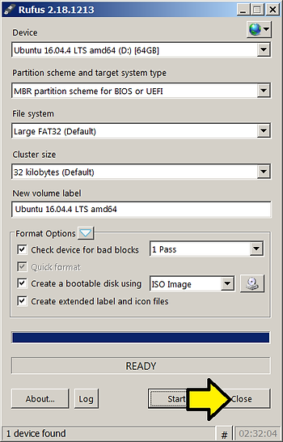

**13.** Open Windows Explorer, (**1**) right-click on the drive and (**2**) click Eject. Leave the USB stick in.

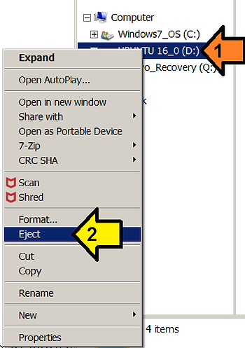

**14\.** Note how to enter your BIOS or boot from another boot media\*, save your work, and reboot your computer (get ready to press F12 when you see the Lenovo screen).

\*On the T460 you "Restart the computer. When the Lenovo logo is displayed, press F1 to start the ThinkPad Setup program." (from the T460 [User's Guide](http://drive.google.com/open?id=1vdCFaz7m5HHRv9vHX4ezz_OPYcq4aycU)).

\*You can also press F12 to enter the boot menu. The next instructions use this method.

**15.** At the Lenovo screen press F12.

**16**. Select **USB HDD: SanDisk Cruzer Glide** to with the arrow keys and hit **Enter**.

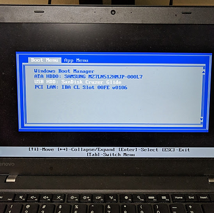

**17.** Select **Try Ubuntu**.

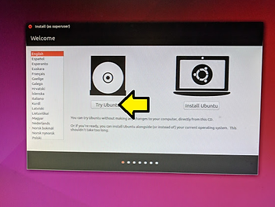

Ubuntu will boot up.

**18.** When your done, simply power off Ubuntu. Remember, none of your changes will persist.

Specific Hardware and Software Used in this Example

-   Ubuntu 16.04.4
    
-   USB Stick
    
-   SanDisk Cruzer Glide 64GB at [link](http://www.sandisk.com/home/usb-flash/cruzer-glide)
    
-   Markings
    
-   SDC260-064G
    
-   BN170625695B
    
-   KCC-REM-TAD-SDCZ60 D33724
    
-   Computer
    
-   Lenovo T460
    
-   Marking and Specification Overview at [link](http://www.zachpfeffer.com/single-post/2017/01/28/New-T460-System-Information)
    
-   OS
    
-   Microsoft Windows 7 Professional Version: 6.1.7601 Service Pack 1 Build 7601
    

**References**

-   [Create a bootable USB stick on Windows](http://tutorials.ubuntu.com/tutorial/tutorial-create-a-usb-stick-on-windows#0)
    
-   Rufus's [webpage](http://rufus.akeo.ie/)
    
-   Ubuntu logo from [link](http://assets.ubuntu.com/v1/57a889f6-ubuntu-logo112.png)