# Install Ubuntu 22.04.1 in VMware and Launch the Vivado 2023.1 Installer


This post shows you how to install Ubuntu 22.04.1 in VMware and launch the Vivado 2023.1 installer inside it.

## Check which OS Vivado Supports

\# Find Vivado ML Edition 2023.1 (aka Vivado) @

[amd.com](http://amd.com/) > Downloads & Support > [Vivado ML Developer Tools](https://www.xilinx.com/support/download/index.html/content/xilinx/en/downloadNav/vivado-design-tools.html) 

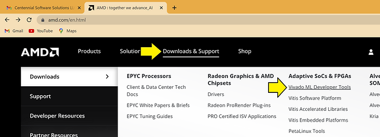

\# Click Release Notes (https://docs.xilinx.com/r/en-US/ug973-vivado-release-notes-install-license/Supported-Operating-Systems ) to check **supported operating systems:** 

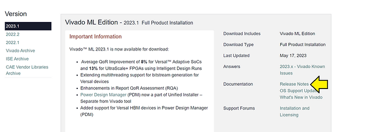

Here's a copy of the operating systems supported for Vivado 2023.1 (Vivado ML Edition 2023.1):

-   Microsoft Windows Professional/Enterprise 10.0 20H2 Update; 10.0 21H1 Update; 10.0 21H2 Update; 10.0 22H2 Update
    
-   Microsoft Windows 11.0 21H2 Update; 11.0 22H2 Update
    
-   Red Hat Enterprise Workstation/Server 7.4, 7.5, 7.6, 7.7, 7.9, 8.3, 8.4, 8.5, 8.6, 8.7, 9.0 and 9.1 (64-bit), English/Japanese
    
-   CentOS 7.4, 7.5, 7.6, 7.7, and 7.9 (64-bit), English/Japanese
    
-   SUSE Linux Enterprise 12 SP4 and 15 SP2 (64-bit), English/Japanese
    
-   Amazon Linux 2 AL2 LTS (64-bit)
    
-   Ubuntu Linux 18.04.1 LTS; 18.04.2 LTS, 18.04.3 LTS; 18.04.4 LTS; 18.04.5 LTS; 18.04.6 LTS; and 20.04 LTS, 20.04.1 LTS, 20.04.2 LTS, 20.04.3 LTS, 20.04.4 LTS; 20.04.5 LTS; 22.04 LTS and 22.04.1 LTS (64-bit), English/Japanese
    

## Get the Installer

\# Click on the following: (you can create an account from the link if you don't have one):

[AMD Unified Installer for FPGAs & Adaptive SoCs 2023.1: Linux Self Extracting Web Installer](https://www.xilinx.com/member/forms/download/xef.html?filename=Xilinx_Unified_2023.1_0507_1903_Lin64.bin) (BIN - **265.94** MB)

MD5 SUM Value : **e47ad71388b27a6e2339ee82c3c8765f**

Download to "D:\Installers\Xilinx\2023.1\Xilinx_Unified_2023.1_0507_1903_Lin64.bin"

\# Check the MD5SUM in PowerShell using [<u><span>Get-FileHash</span></u>](https://learn.microsoft.com/en-us/powershell/module/microsoft.powershell.utility/get-filehash?view=powershell-7.3)

```
Get-FileHash "D:\Installers\Xilinx\2023.1\Xilinx_Unified_2023.1_0507_1903_Lin64.bin" -Algorithm MD5
```

Result (matches):

```
Algorithm       Hash                                                                   Path
---------       ----                                                                   ----
MD5             E47AD71388B27A6E2339EE82C3C8765F                                       D:\Installers\Xilinx\2023.1\Xilinx_Unified_2023.1_0507_1903_Lin64.bin
```

## Get the Ubuntu ISO

\# Download the **3.6G** Ubuntu 22.04.1 LTS ISO @ https://old-releases.ubuntu.com/releases/22.04.1/ubuntu-22.04.1-desktop-amd64.iso ( from https://old-releases.ubuntu.com/releases/22.04.1/ ) to "D:\isos\Ubuntu\22.04.01\ubuntu-22.04.1-desktop-amd64.iso"

Note: 

Here are what the other files are:

.iso - this file

.iso.torrent - for BitTorrents ( https://ubuntu.com/download/alternative-downloads )

.iso.zsync - save bandwidth and time downloading ( https://help.ubuntu.com/community/ZsyncCdImage )

.list - a listing of the files in the iso

.manifest - a list of the packages and package versions included in the .iso

\# Check the SHA256SUM in PowerShell using [Get-FileHash](https://learn.microsoft.com/en-us/powershell/module/microsoft.powershell.utility/get-filehash?view=powershell-7.3) 

https://old-releases.ubuntu.com/releases/22.04.1/SHA256SUMS 

**c396e956a9f52c418397867d1ea5c0cf1a99a49dcf648b086d2fb762330cc88d** *ubuntu-22.04.1-desktop-amd64.iso

```
Get-FileHash "D:\isos\Ubuntu\22.04.01\ubuntu-22.04.1-desktop-amd64.iso" -Algorithm SHA256
```

Result (matches):

```
Algorithm       Hash                                                                   Path
---------       ----                                                                   ----
SHA256          C396E956A9F52C418397867D1EA5C0CF1A99A49DCF648B086D2FB762330CC88D       D:\isos\Ubuntu\22.04.01\ubuntu-22.04.1-desktop-amd64.iso
```

## Check Computer Configuration

\# Search **Information** and Open **System Information**

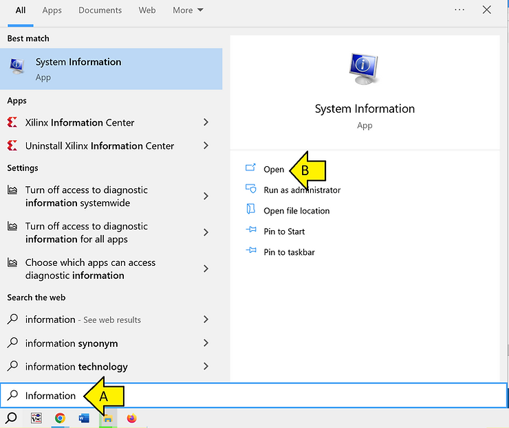

\# Check processors:

Processor Intel(R) Core(TM) i9-8950HK CPU @ 2.90GHz, 2904 Mhz, **6 Core(s), 12 Logical Processor(s)**

\# Check memory:

Installed Physical Memory (RAM) 96.0 GB

Total Physical Memory **95.7 GB**

Available Physical Memory 80.8 GB

\# Launch VMware Workstation 16 Pro (Help > About VMware Workstation: 16.2.4 build-20089737)

\# Click **Home** > **Create a New Virtual Machine**

\# Select **Typical,** click **Next >**

\# Select **Installer disc image (iso)**, use **D:\\isos\\Ubuntu\\22.04.01\\ubuntu-22.04.1-desktop-amd64.iso** (will use [<u><span>Easy Install</span></u>](https://docs.vmware.com/en/VMware-Workstation-Pro/16.0/com.vmware.ws.using.doc/GUID-3F6B9D0E-6CFC-4627-B80B-9A68A5960F60.html) - just need a Full name, username, password); click **Next >**

\# Set **Full name**, **User name**, **Password**

\# Set the **Virtual machine name**:

```
vmwaredisk-20230708-vivado_22.04.1-on-ubuntu_22.04.01
```

\# Set the Location:

**C:\\Users\\Zach Pfeffer\\Documents\\Virtual Machines\\vmwaredisk-20230708-vivado\_22.04.1-on-ubuntu\_22.04.01**

\# Set Maximum disk size (GB): **400** (**300 is not big enough)**; select **Store virtual disk as a single file**; click **Next >**

\# Click **Customize Hardware**

\# Set memory to **32 GB**

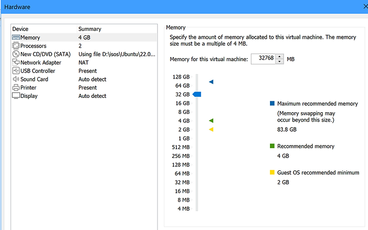

\# Set the **Number of processors** to **4**

\# Set the **Number of cores per processor** to **2**

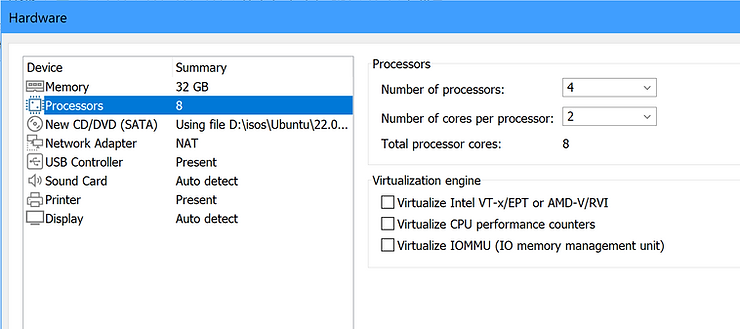

\# Set **USB compatibility** to **USB 3.1**

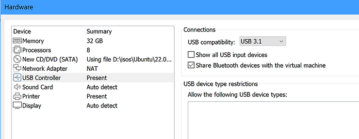

\# Click **Close**

\# Click **Finish**

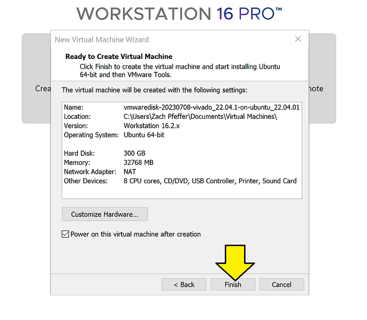

The virtual machine will launch

## Configure Ubuntu

\# Select **Keyboard layout** and click **Continue**

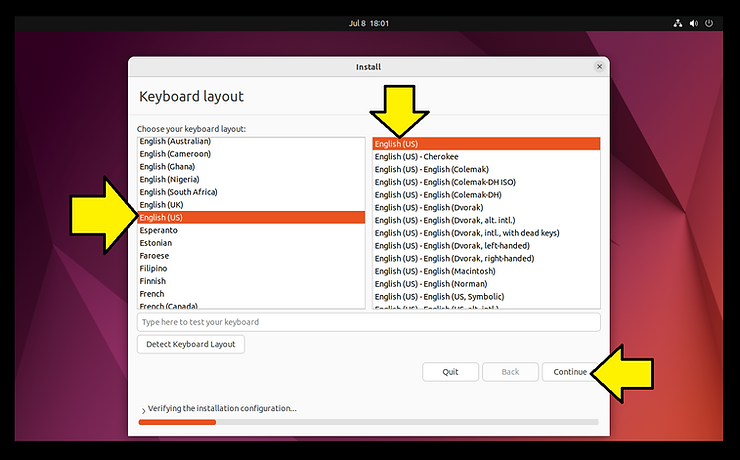

\# Leave **Normal installation** and **Download updates while installing Ubuntu** selected; select **Install third-party software for graphics and Wi-Fi hardware and additional media formats**; click **Continue**

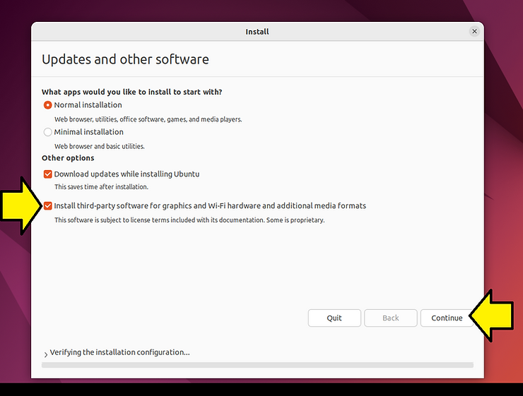

\# Leave **Erase disk and install Ubuntu** selected and click **Install Now**

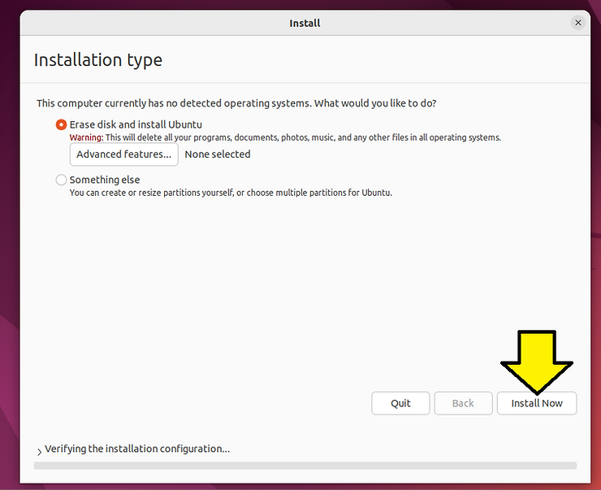

\# Click **Continue** on the **Write the changes to disks?** pop-up

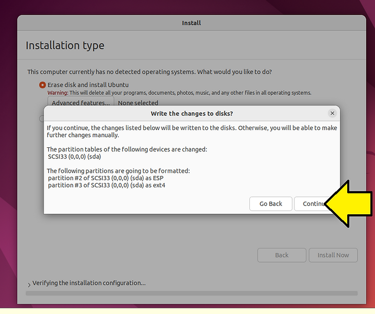

\# List location (Denver)


\# Enter

Your name: Demo User

Your computer's name: fpgadev

Pick a username: demouser

Password

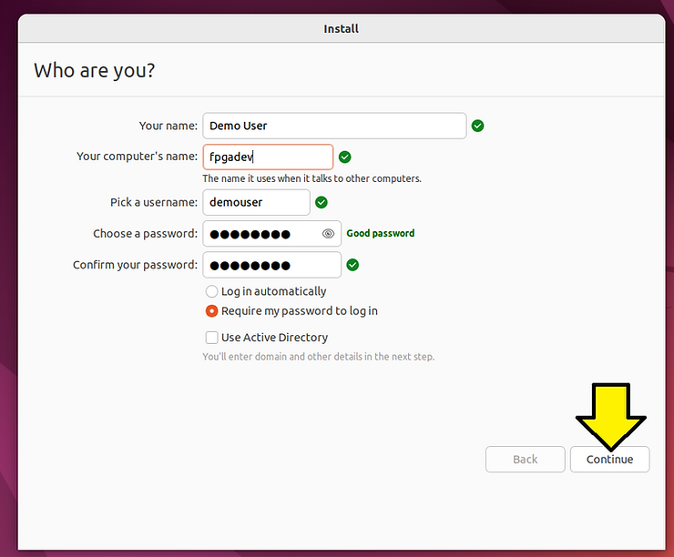

You'll see:


\# Click **Restart Now**

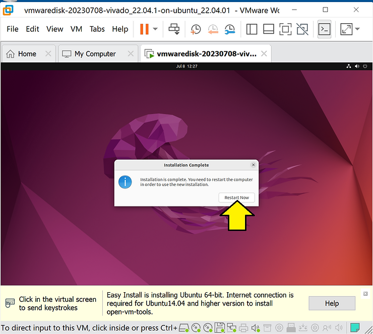

Note: **open-vm-tools** will have been installed

## Optional: Run Settings and Disable Automatic Suspend

\# Click **Power** \> **Automatic Suspend** > **Never**

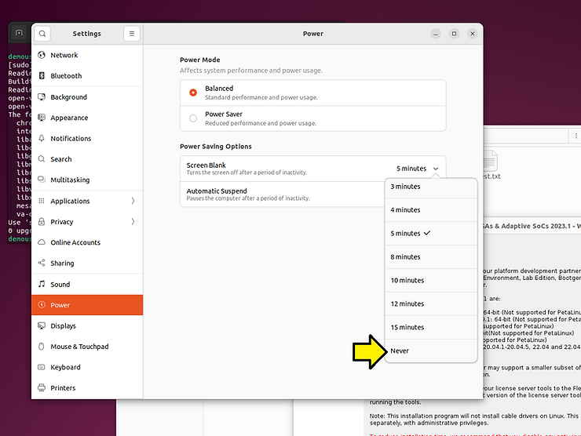

## Share the Folder You Downloaded the Installer To

These instructions will allow you to access Installers at **/mnt/hgfs/Installers**

\# Click **VM** \> **Settings...**

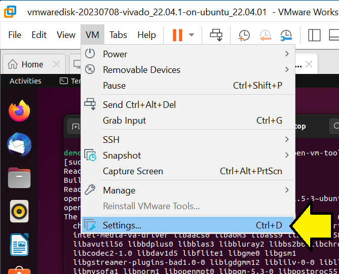

Click **Options**, **Shared Folders**, **Enabled until next power off or suspend**, **Add...**

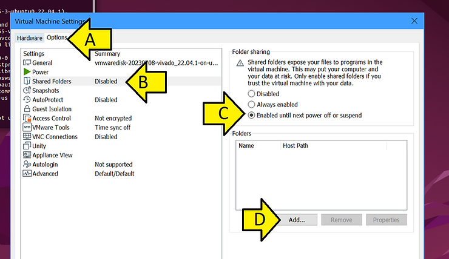

\# Click **Browse** and find the **Installers** path

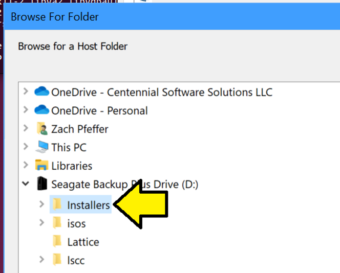

\# Click **Next**

\# Click **Finish**

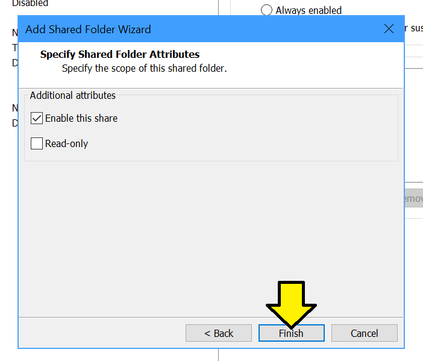

\# Click **OK**

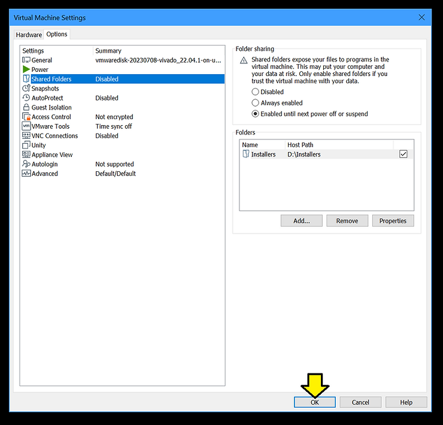

\# Test: open a terminal in Ubuntu and run:

```
ls /mnt/hgfs/Installers
```

...and

```
cd /mnt/hgfs/Installers
touch test.txt
# Check test.txt exists
```

## Launch the Installer

\# Open a terminal and run

```
cd /mnt/hgfs/Installers
chmod +x Xilinx/2023.1/Xilinx_Unified_2023.1_0507_1903_Lin64.bin
./Xilinx/2023.1/Xilinx_Unified_2023.1_0507_1903_Lin64.bin
```

You should see:

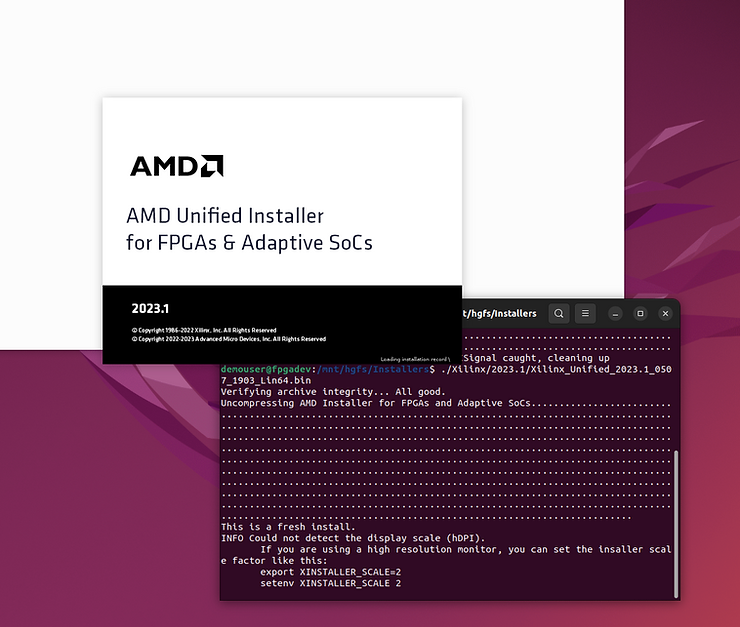

### This post described how to Install Ubuntu 22.04.1 in VMware and launch the Vivado Installer

## Recover From An Out of Space Error

You'll need the sudo password for this.

\# If you run out of space during the subsequent install, click **Cancel**

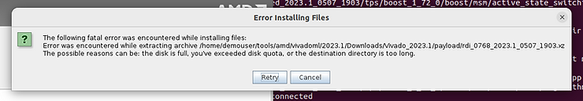

\# Click **No**

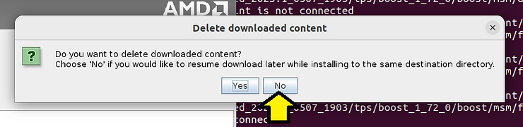

[#Power](https://www.centennialsoftwaresolutions.com/blog/hashtags/Power) off the VM

\# Double-click the Hard Disk (SCSI)

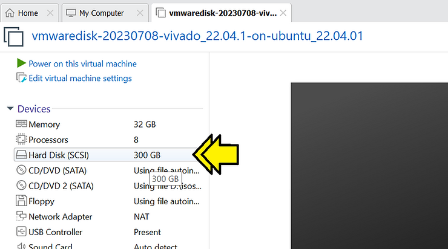

\# Click **Expand**

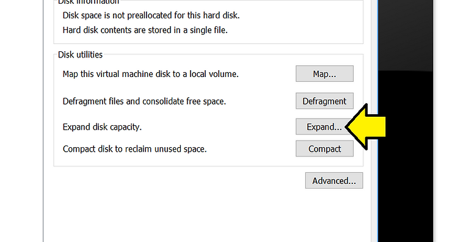

\# Set the **Maximum disk size (GB)** to 400 and click **Expand**

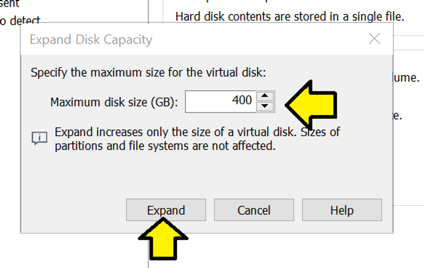

You'll see:

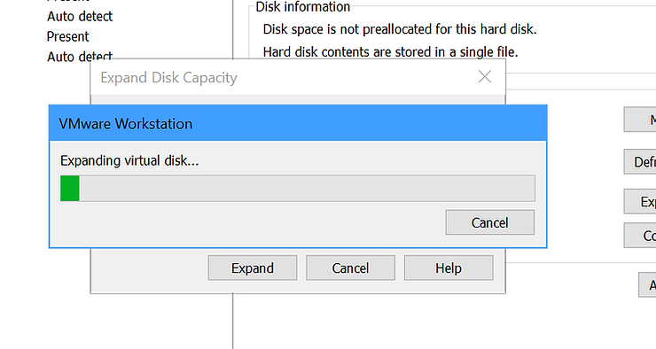

It will take some time to complete the expansion.

\# Once it completes, click **OK**:

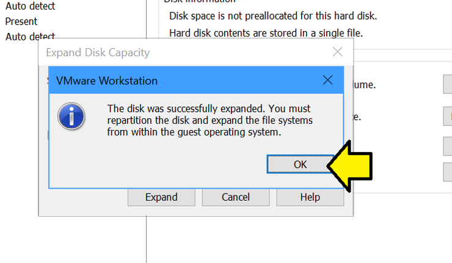

\# Close the hardware configuration and power on the VM

\# In Ubuntu, click **Show Applications**, search **Disk**, click on **Disks**

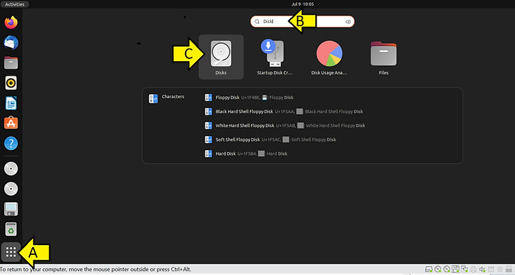

\# Click on the disk, click the partition, click the gear and click Resize

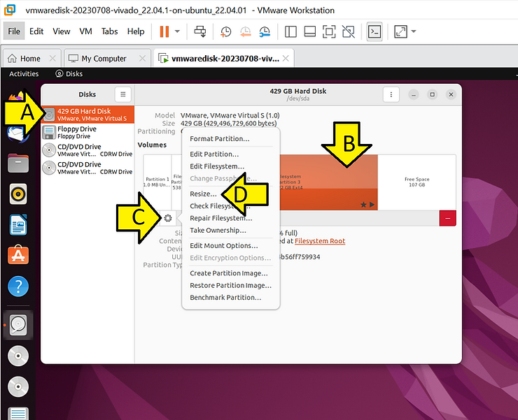

\# Drag the cursor to increase the size and click **Resize**

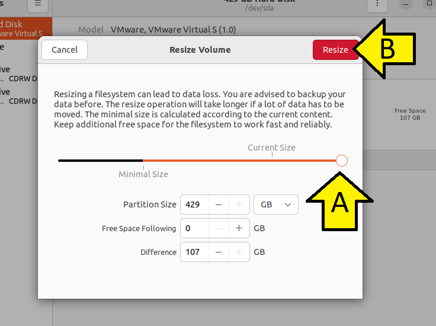

\# Enter the sudo password and click **Authenticate**


\# Launch the installer again

```
cd /mnt/hgfs/Installers
chmod +x Xilinx/2023.1/Xilinx_Unified_2023.1_0507_1903_Lin64.bin
./Xilinx/2023.1/Xilinx_Unified_2023.1_0507_1903_Lin64.bin
```

## References

Enable a Shared Folder for a Virtual Machine

https://docs.vmware.com/en/VMware-Workstation-Pro/16.0/com.vmware.ws.using.doc/GUID-D6D9A5FD-7F5F-4C95-AFAB-EDE9335F5562.html 

Disk Resize on Ubuntu

https://help.ubuntu.com/stable/ubuntu-help/disk-resize.html.en 

Logo

https://library.amd.com/media/?mediaId=84C3498C-1B51-4965-93729CC284CD2DC2 