# Install Ubuntu on an External Hard Drive

This post shows how to install Ubuntu 16.04 on an external hard drive.

**Specifics**

Computer

-   T460 ([spec](http://www.zachpfeffer.com/single-post/2017/01/28/New-T460-System-Information))
    
-   External hard drive
    
-   500 GB Samsung Portable SSD T5 with USB 3.1 Gen 2 (Up to 10Gbps) Model Code: MU - PA500B/AM
    
-   $159.99 at [Amazon](http://www.amazon.com/Samsung-T5-Portable-SSD-MU-PA500B/dp/B073GZBT36)
    
-   Ubuntu 16.04.4
    

**Prerequisites**

-   The tutorial uses the USB stick created in [Install Ubuntu 16.04 on a USB Stick from Windows](http://www.zachpfeffer.com/single-post/Install-Ubuntu-1604-on-a-USB-Stick-from-Windows).
    
-   You should note how much RAM your computer has.
    

**Note**

Some of the items listed are specific to the BIOS running on the T460. You may need to look up how to do the same or similar steps using your BIOS.

**Steps**

1\. Connect the external hard drive and the USB stick.

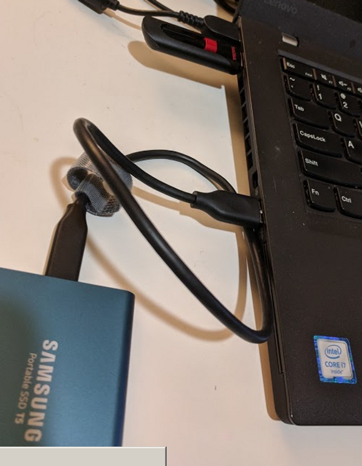

2\. Prepare to press **F12** to enter the boot menu. Boot and press **F12** at the Lenovo screen.

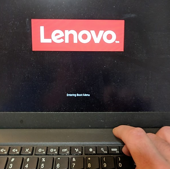

3\. Select **USB HDD**.

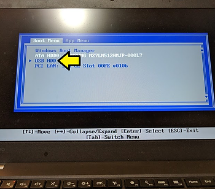

4\. Click **Install Ubuntu**.

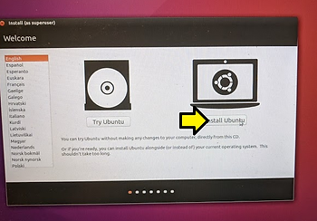

5\. (1) Select your WiFi and (2) click **Connect**.

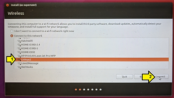

6\. (1) Enter your password and (2) click **Connect**.

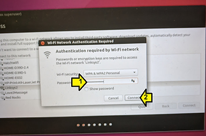

7\. Make sure your connection has been established.

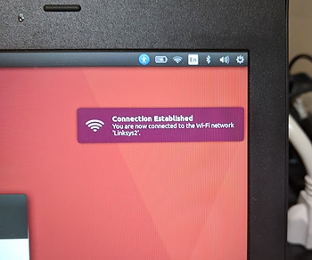

8\. (1) Click the **Download updates while installing Ubuntu** checkbox, (2) the **Install third-party software for graphics and WiFi hardware, Flash, MP3 and other media** checkbox and (3) click **Continue**.

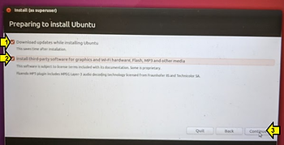

9\. On the Installation type screen click the (1) **Something else** radio button and (2) click **Continue**.

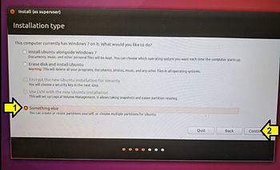

10\. (1) Select **freespace** under **/dev/sdb** and (2) click **+**, note the amount of space (500107 MB in this case).

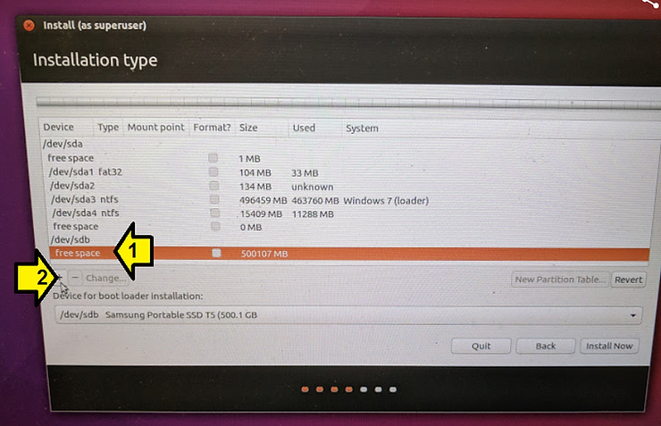

11\. On the **Create partition** screen, subtract 2 times the amount of RAM you have from the value in size. The T460 I have has 12 GB of memory. So I subtract 24 GB from 500107 MB. 24 GB is 24 GB \* (1024 MB / 1 GB) or 24576 MBs. So I (1) enter in **475531 MB** (500107-24576) for **Size**. Make sure (2) **Type for the new partition** is **Primary**, (3) **Location for the new partition** is **Beginning of this space**, (4) **Use as** is set to **Ext4 journaling file system** and the (5) **Mount point** is **/**. Click (6) **Okay**.

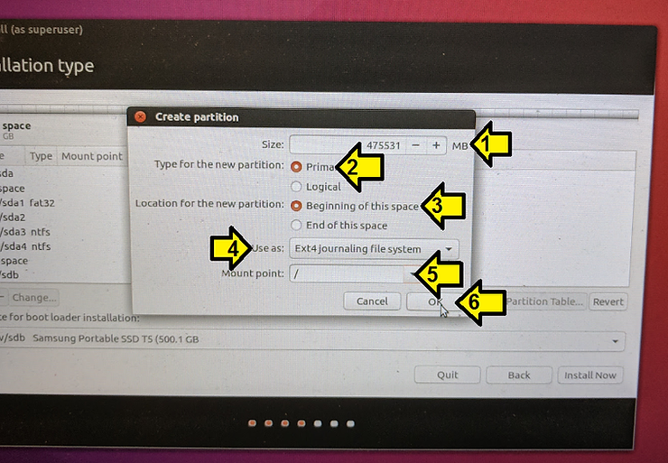

12\. Again (1) select **free space** then (2) **+**.

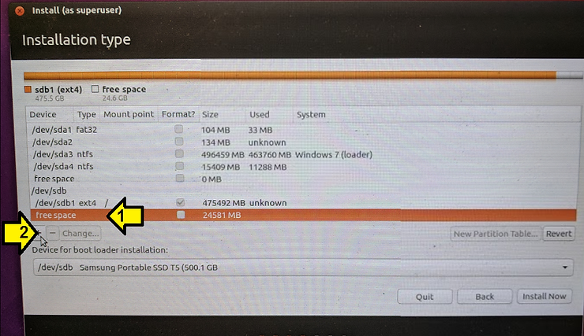

13\. (1) Put the number of MB's left over in the **Size** field, **24582** in this case, (2) ensure **Logical** is clicked for the **Type for the new partition,** (3) ensure the **Location for the new partition** is set to **Beginning of this space** and (3) select **swap area** for **Use as**.

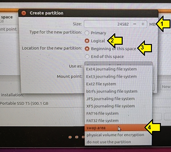

14\. Click **OK**.

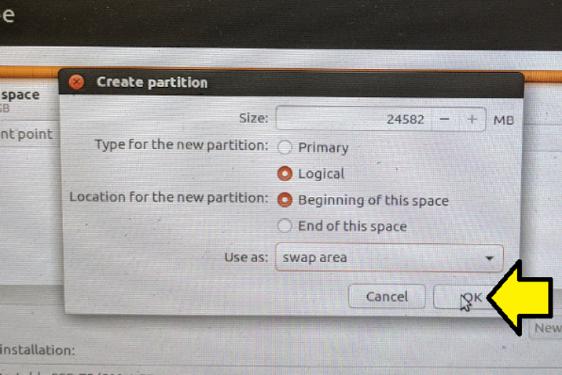

14\. (1) select **/dev/sdb**, (2) select **/dev/sdb Samsung Portable SSD T5 (500.1 GB** and (3) click **Install Now**.

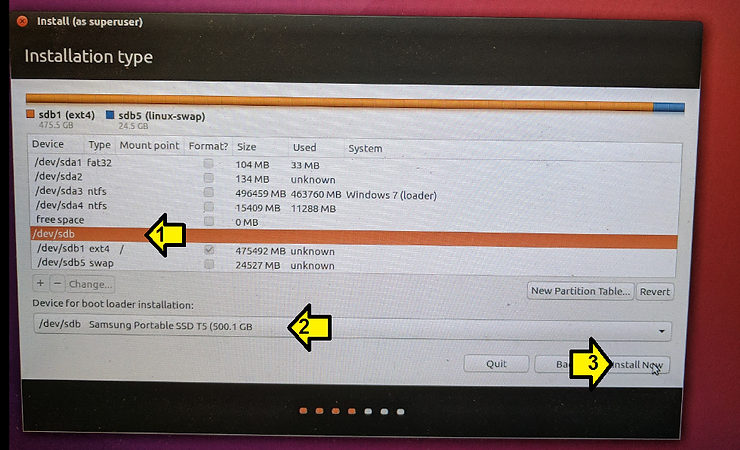

15\. Click **Continue** to write the changes to disk.

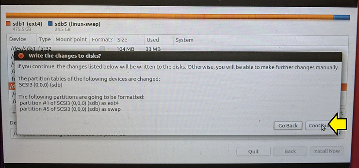

16\. After this you select your timezone and click **Continue**.

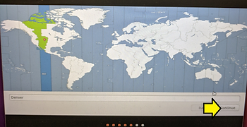

17\. Your select your keyboard and click **Continue**.

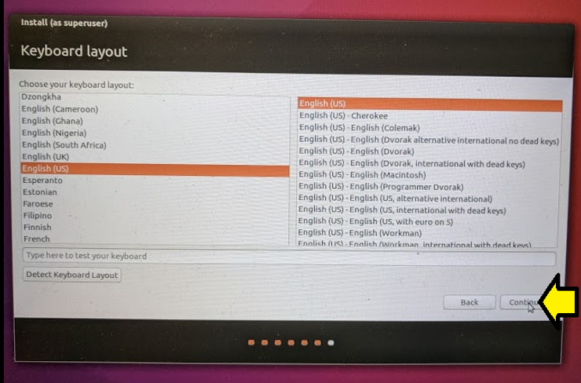

18\. (1) enter in **Your name**, (2) **Your computer's name**, (3) **Pick a username**, (4) **Choose a password** and **confirm** it, (5) click **Require my password to log in** and (6) click **Continue**.

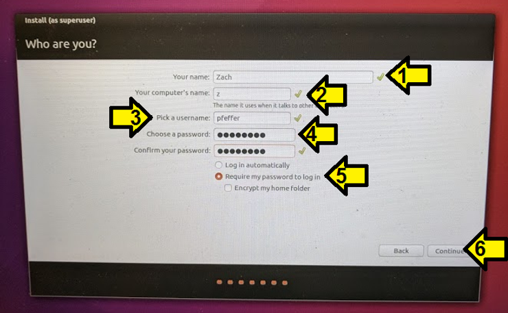

19\. You'll see a bunch of info screens now (this is just a sample, there are more screens than this):

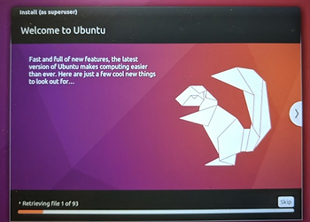

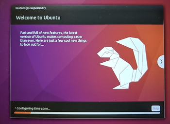

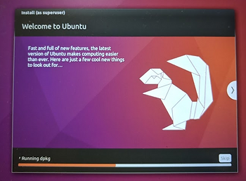

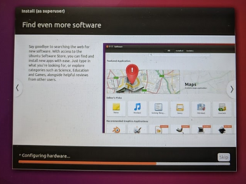

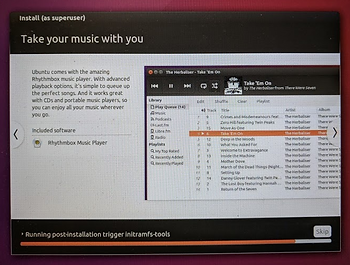

20\. Click Restart Now.

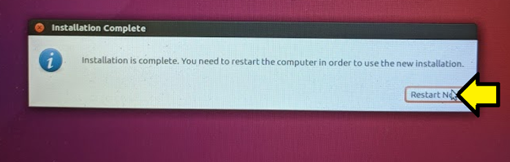

21\. Let the computer will boot up into Windows.

22\. Remove the USB stick.

23\. Prepare to press F12. Restart the computer and press F12 at the Lenovo screen:

24\. Select the **USB HDD: Samsung Portable SSD T5** and press **Enter**.

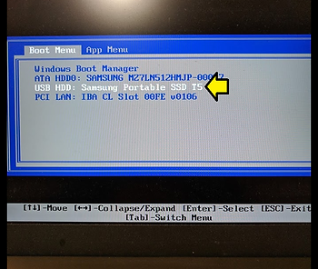

25\. Select **\*Ubuntu** and press **Enter** (or wait a few seconds)

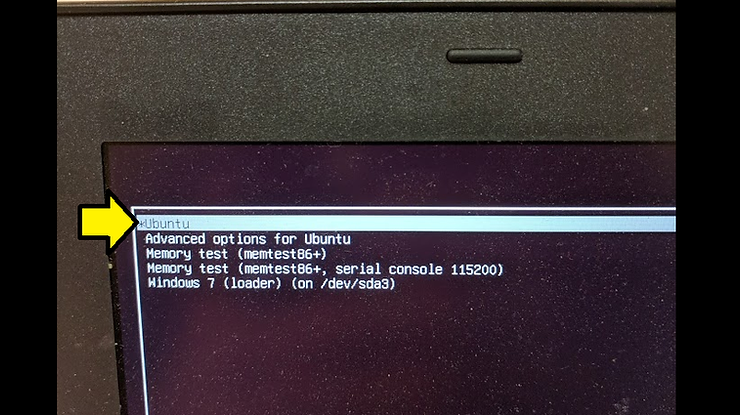

26\. Wait a few more seconds and Voilà Ubuntu has booted on your external hard drive.

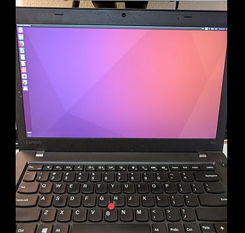

**References**

-   Ubuntu logo from [link](http://assets.ubuntu.com/v1/57a889f6-ubuntu-logo112.png).
    

**Answers to Questions**

**Does this SSD work well ?**

The one I used worked pretty well. I used the set up for a week and only had 1 time when the system "froze" due to the drive. I restarted and everything worked.

**Does is show good speed/performance on Linux ?**

I did not notice that it was slower or faster than normal.

**I am going to use it via usb-c (thunderbolt). What would you say about it ?**

Sounds like a good plan. From: [https://thunderbolttechnology.net/tech/faq](http://thunderbolttechnology.net/tech/faq) it looks like you should expect 2x the performance. 

**Is the speed comparable to regular internal SSD ?**

On my laptop (http://www.zachpfeffer.com/single-post/2017/01/28/New-T460-System-Information)

I have a:

Hard Drive: 512GB Solid State Drive, SATA3 (MZ7LN512HMJP-000)

Comparing SATA3 to Thunderbolt, this posts suggests they would have similar performance:

[http://tips.tinyiron.net/direct-sata3-vs-thunderbolt-vs-usb3-vs-usb2-how-do-they-stack-up/ ](http://tips.tinyiron.net/direct-sata3-vs-thunderbolt-vs-usb3-vs-usb2-how-do-they-stack-up/)