# Install VirtualBox 7 on Windows 10

This post answers how to install VirtualBox 7 on Windows 10. It also lists VirtualBox 7 install links, how to check SHA256 and MD5 of the downloaded components on Windows, the installation defaults and sizes, and how to solve a Python Core package and the win32api bindings missing dependencies. It also lists installation screenshots and two ways to uninstall VirtualBox 7 quickly.

## Environment

This post was created using this environment:

-   VirtualBox-7.0.20-163906-Win.exe
    
-   Microsoft Windows 10 Pro 10.0.19045 N/A Build 19045 \[ **cmd > systeminfo | findstr /B /C:"OS Name" /C:"OS Version"** or **winver** \]
    

## Topics

-   [<u><span>Download the VirtualBox 7.0.20 Installer, Manual, and Extensions</span></u>](https://www.centennialsoftwaresolutions.com/post/install-virtualbox-7-on-windows-10#viewer-q78in26988)
    
-   [<u><span>Check SHA256 and MD5 Checksums of VirtualBox-7.0.20-163906-Win.exe</span></u>](https://www.centennialsoftwaresolutions.com/post/install-virtualbox-7-on-windows-10#viewer-f7xgx16823)
    
-   [<u><span>Install Defaults, Features, and Feature Sizes</span></u>](https://www.centennialsoftwaresolutions.com/post/install-virtualbox-7-on-windows-10#viewer-i03n4124604)
    
-   [<u><span>Handling Missing Dependencies: Python Core package and the win32api bindings</span></u>](https://www.centennialsoftwaresolutions.com/post/install-virtualbox-7-on-windows-10#viewer-awe6w816)
    
-   [<u><span>Install VirtualBox 7 on Windows 10</span></u>](https://www.centennialsoftwaresolutions.com/post/install-virtualbox-7-on-windows-10#viewer-9lz8x420627)
    
-   [<u><span>Uninstalling</span></u>](https://www.centennialsoftwaresolutions.com/post/install-virtualbox-7-on-windows-10#viewer-xx9tx420947)
    

## Download the VirtualBox 7.0.20 Installer, Manual, and Extensions

-   Go to \[ [<u><span>https://www.virtualbox.org/wiki/Downloads</span></u>](https://www.virtualbox.org/wiki/Downloads) <u><span>]</span></u>
    
-   Get the **VirtualBox 7.0.20 installer** (aka VirtualBox 7.0.20 platform packages) for Windows
    
    -   Click [\[](https://download.virtualbox.org/virtualbox/7.0.20/VirtualBox-7.0.20-163906-Win.exe) [<u><span>Windows hosts</span></u>](https://download.virtualbox.org/virtualbox/7.0.20/VirtualBox-7.0.20-163906-Win.exe) \] \[ <u><span>cached</span></u> \]
    
-   Get the **Manual**
    
    -   Click \[ [<u><span>Manual</span></u>](https://download.virtualbox.org/virtualbox/7.0.20/UserManual.pdf) \] \[ <u><span>(</span></u>[<u><span>HTML version</span></u>](https://www.virtualbox.org/manual)<u><span>)</span></u> \] \[ [<u><span>cached</span></u>](https://drive.google.com/file/d/16aj6QA6BZUj1Cw4_P6u86Gs-Nwx6jPP5/view?usp=sharing) \]
    
-   Get the **Extension Pack**
    
    -   Click \[ <u><span>Oracle_VM_VirtualBox_Extension_Pack-7.0.20.vbox-extpack</span></u> \] \[ [<u><span>cached</span></u>](https://drive.google.com/open?id=16b6BF48kbjhw8lCYoSewwWDIt7xSvLju&usp=drive_fs) \]
    
-   Get the [VirtualBox](https://www.virtualbox.org/wiki/VirtualBox) 7.0.20 Software Developer Kit (**SDK**)
    
    -   Click \[ <u><span>All platforms</span></u> \] \[ [<u><span>cached</span></u>](https://drive.google.com/file/d/16vXdu-KwoBtCnDOfllNbEJi22_uJ41i3/view?usp=sharing) \].
        

## Check SHA256 and MD5 Checksums of VirtualBox-7.0.20-163906-Win.exe

To check the \[ [<u><span>SHA256 checksums</span></u>](https://www.virtualbox.org/download/hashes/7.0.20/SHA256SUMS) \] \[ [<u><span>cached</span></u>](https://drive.google.com/file/d/16lW10YnimCBPgzX6Dj_NfjZRDAr4JxXZ/view?usp=sharing) \] or \[ [<u><span>MD5 checksums</span></u>](https://www.virtualbox.org/download/hashes/7.0.20/MD5SUMS) \] \[ [<u><span>cached</span></u>](https://drive.google.com/file/d/16ocAnuHeWwIUu_vJ65fJpdM_ym112iMH/view?usp=sharing) \]: Type **Window+R**. Enter **cmd**. **cd** to the directory you downloaded the VirtualBox installer to

Run to check SHA256:

```
certutil -hashfile VirtualBox-7.0.20-163906-Win.exe sha256
```

You should see:

```
SHA256 hash of VirtualBox-7.0.20-163906-Win.exe:
fa3544162eee87b660999bd913f76ccb2e5a706928ef2c2e29811e4ac76fb166
CertUtil: -hashfile command completed successfully.
```

```
fa3544162eee87b660999bd913f76ccb2e5a706928ef2c2e29811e4ac76fb166 *VirtualBox-7.0.20-163906-Win.exe
```

Run to check MD5:

```
certutil -hashfile VirtualBox-7.0.20-163906-Win.exe md5
```

You should see:

```
MD5 hash of VirtualBox-7.0.20-163906-Win.exe:
b822835698e76fff193342effc92d286
CertUtil: -hashfile command completed successfully.
```

```
b822835698e76fff193342effc92d286 *VirtualBox-7.0.20-163906-Win.exe
```

Note: checksums for all downloadable VirtualBox-7.0.20-163906 components are at at each link.

Note: we'll skip the calculations for other components for the rest of the post.

## Install Defaults, Features, and Feature Sizes

The install defaults to installing into C:\\Program Files\\Oracle\\VirtualBox\\ and installing all features. This may cause an issue if you leave **VirtualBox Python Support** included. A fix for this issue is listed after the feature table.

### Feature Table

<table data-hook="TableComponent"><colgroup><col><col><col><col><col><col></colgroup><tbody><tr><td data-hook="table-plugin-cell"><p dir="auto" id="viewer-7wrwu137374"><span><span>VirtualBox Application</span></span></p></td><td data-hook="table-plugin-cell"></td><td data-hook="table-plugin-cell"></td><td data-hook="table-plugin-cell"><p dir="auto" id="viewer-zbnik137381"><span><span>Oracle VM VirtualBox 7.0.20 application.</span></span></p></td><td data-hook="table-plugin-cell"><p dir="auto" id="viewer-vu6m4137384"><span><span>This feature requires 209MB on your hard drive. It has 3 of 3 subfeatures selected. The subfeatures require 1000KB on your hard drive</span></span></p></td><td data-hook="table-plugin-cell"><p dir="auto" id="viewer-3ytyt137387"><span><span>209 MB</span></span></p></td></tr><tr><td data-hook="table-plugin-cell"></td><td data-hook="table-plugin-cell"><p dir="auto" id="viewer-jq1i5137393"><span><span>VirtualBox </span><strong><span>USB</span></strong><span> Support</span></span></p></td><td data-hook="table-plugin-cell"></td><td data-hook="table-plugin-cell"><p dir="auto" id="viewer-ntr9u137398"><span><span>Oracle VM VirtualBox 7.0.20 USB device drivers for USB device support.</span></span></p></td><td data-hook="table-plugin-cell"><p dir="auto" id="viewer-3eg73137401"><span><span>This feature requires 436KB on your hard drive.</span></span></p></td><td data-hook="table-plugin-cell"><p dir="auto" id="viewer-a9v0l137404"><span><span>436 KB</span></span></p></td></tr><tr><td data-hook="table-plugin-cell"></td><td data-hook="table-plugin-cell"><p dir="auto" id="viewer-zf1af137410"><span><span>VirtualBox </span><strong><span>Networking</span></strong></span></p></td><td data-hook="table-plugin-cell"></td><td data-hook="table-plugin-cell"><p dir="auto" id="viewer-zy27q137415"><span><span>Oracle VM VirtualBox 7.0.20 network device drivers for networking support.</span></span></p></td><td data-hook="table-plugin-cell"><p dir="auto" id="viewer-psahl137418"><span><span>This feature requires 0KB on your hard drive. It has 2 of 2 subfeatures selected. The subfeatures require 564KB on your hard drive.</span></span></p></td><td data-hook="table-plugin-cell"><p dir="auto" id="viewer-2of9w137421"><span><span>0 KB</span></span></p></td></tr><tr><td data-hook="table-plugin-cell"></td><td data-hook="table-plugin-cell"></td><td data-hook="table-plugin-cell"><p dir="auto" id="viewer-6hnr6137429"><span><span>VirtualBox </span><strong><span>Bridged Networking</span></strong></span></p></td><td data-hook="table-plugin-cell"><p dir="auto" id="viewer-2qeun137432"><span><span>Oracle VM VirtualBox 7.0.20 virtual network adapter driver for Host-Only Networking.</span></span></p></td><td data-hook="table-plugin-cell"><p dir="auto" id="viewer-dy82d137435"><span><span>This feature requires 288KB on your hard drive.</span></span></p></td><td data-hook="table-plugin-cell"><p dir="auto" id="viewer-rs6c7137438"><span><span>288 KB</span></span></p></td></tr><tr><td data-hook="table-plugin-cell"></td><td data-hook="table-plugin-cell"></td><td data-hook="table-plugin-cell"><p dir="auto" id="viewer-yviu0137446"><span><span>VirtualBox </span><strong><span>Host-Only Networking</span></strong></span></p></td><td data-hook="table-plugin-cell"><p dir="auto" id="viewer-8wqm1137449"><span><span>Oracle VM VirtualBox 7.0.20 virtual network adapter driver for Host-Only Networking.</span></span></p></td><td data-hook="table-plugin-cell"><p dir="auto" id="viewer-2v1ow137452"><span><span>This feature requires 276KB on your hard drive.</span></span></p></td><td data-hook="table-plugin-cell"><p dir="auto" id="viewer-n3yi4137455"><span><span>276 KB</span></span></p></td></tr><tr><td data-hook="table-plugin-cell"></td><td data-hook="table-plugin-cell"><p dir="auto" id="viewer-woqko137461"><span><span>VirtualBox </span><strong><span>Python</span></strong><span> Support</span></span></p></td><td data-hook="table-plugin-cell"></td><td data-hook="table-plugin-cell"><p dir="auto" id="viewer-fnb26137466"><span><span>Python support for VirtualBox.</span></span></p></td><td data-hook="table-plugin-cell"><p dir="auto" id="viewer-eyl20137469"><span><span>This feature requires 0KB on your hard drive.</span></span></p></td><td data-hook="table-plugin-cell"><p dir="auto" id="viewer-jg6ur137472"><span><span>0 KB</span></span></p></td></tr></tbody></table>

## Handling Missing Dependencies: Python Core package and the win32api bindings

If you install the Python bindings, you may get this notification:

**Missing Dependencies**

**Python Core / win32api**

**Installing the Oracle VM VirtualBox 7.0.20 Python bindings requires the Python Core package and the win32api bindings to be installed first.**

**When continuing the installation of the Oracle VM VirtualBox 7.0.20 Python bindings now, those need to be set up manually later. Refer to the Oracle VM VirtualBox 7.0.20 SDK manual for more information.**

**Proceed with installation now?**

Here are the instructions listed in the Oracle VM VirtualBox 7.0.20 SDK manual [ https://download.virtualbox.org/virtualbox/SDKRef.pdf ] [ [cached](https://drive.google.com/file/d/1Ti5oWxQtc7qvBrF7DkzT3zJJpZRPwZHW/view?usp=sharing) ]

```
cd VBOX_INSTALL_PATH/sdk/installer
PYTHON vboxapisetup.py install
```

If you have Python installed, you can avoid this error with these steps:

Start cmd as an Administrator: Windows-R, type cmd, press Ctrl-Shift-Enter.

You should see something like:

```
Microsoft Windows [Version 10.0.19045.4651]
(c) Microsoft Corporation. All rights reserved.

C:\Windows\system32&gt;
```

Type:

```
py --list paths
```

You should see output like this:

```
-V:3.12 *        C:\Python312\python.exe
-V:3.10          C:\Users\Zach Pfeffer\AppData\Local\Programs\Python\Python310\python.exe
```

cd to a path like C:\\Python312\\Lib\\site-packages\\win32comext\\axscript\\client using the \* (stared) path for root.

```
cd "C:\Python312\Lib\site-packages\win32comext\axscript\client"
```

In your admin window run,

```
py .\pyscript.py
```

After doing this, close the VirtualBox installer and rerun it. The error should disappear.

## Install VirtualBox 7 on Windows 10

Here are all the install pages for reference.

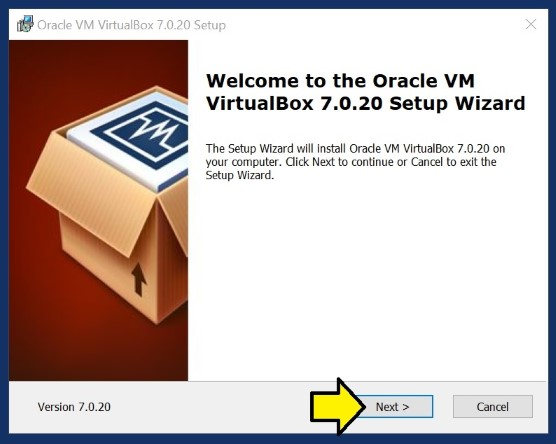

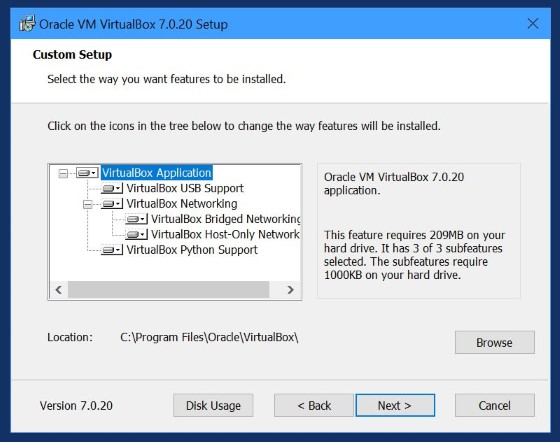

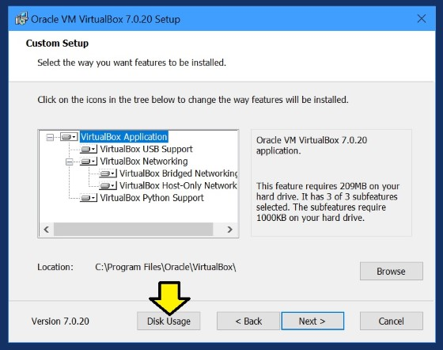

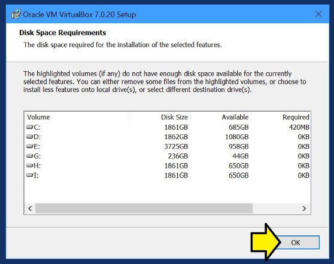

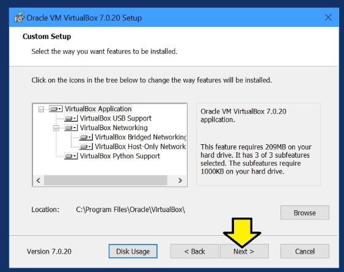

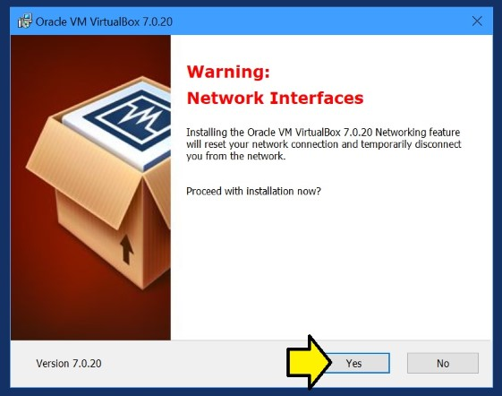

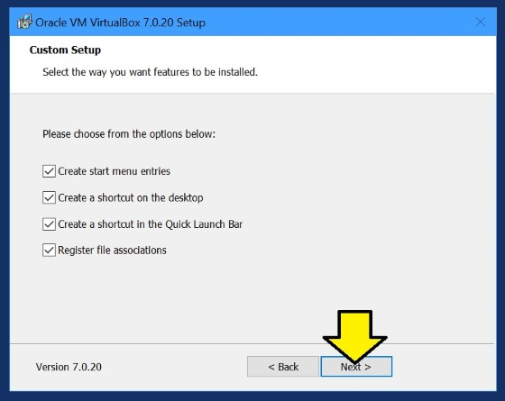

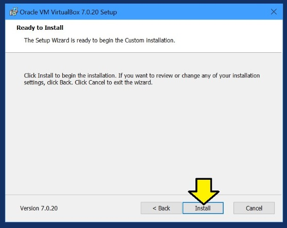

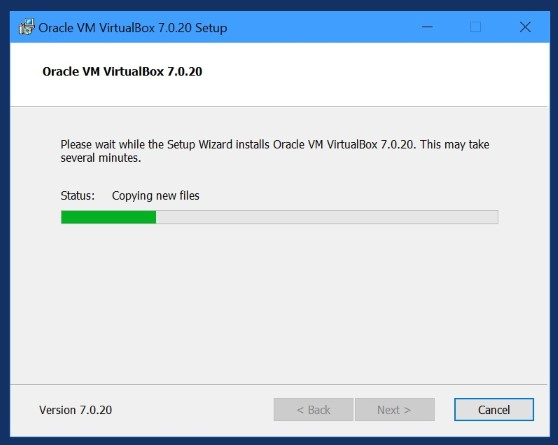

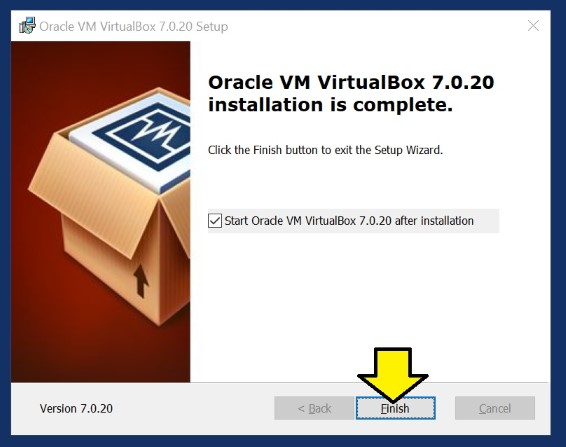

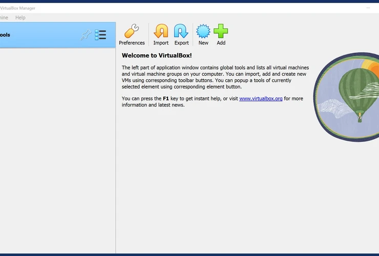

## Uninstalling

### Via GUI

Press **Windows + R** > Type **appwiz.cpl** > Find **Oracle V VirtualBox 7.0.20** > Click **Uninstall**.

### Via PowerShell

get-package \*VirtualBox\* | Uninstall-Package