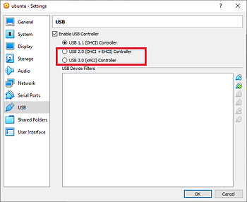
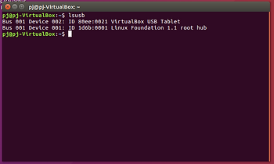
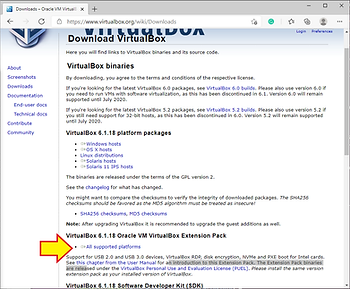
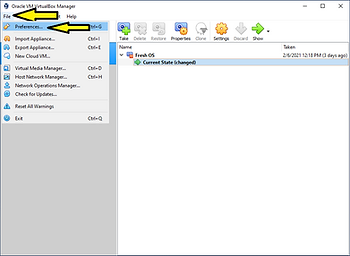
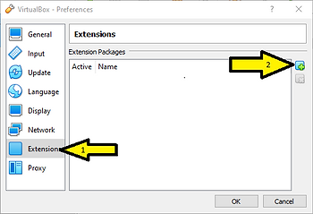
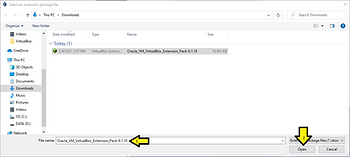
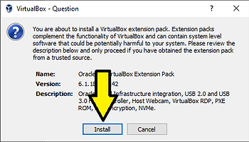
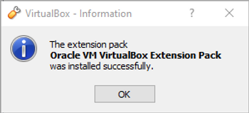
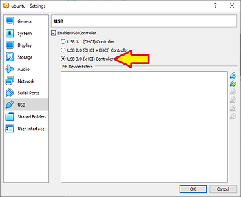
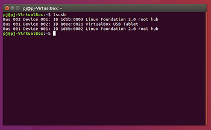

# Install VirtualBox Extension Pack to enable USB2.0 and USB3.0 in Guest O/S.

## 1\. Prerequisites

This post assumes that Virtual Box is already installed on a Windows 10 PC. My version is 6.1.

This post shows how to solve the following problems: You can't select anything other than USB1.1, selecting anything other than USB1.1 shows and error at the bottom of the screen, or the USB2 and USB3 options don't appear in the menu at all.

and the Guest O/S only sees a 1.1 controller:

You need to download the Oracle VM VirtualBox Extension Pack. Follow this link.

[Downloads – Oracle VM VirtualBox](https://www.virtualbox.org/wiki/Downloads)

On that page select the **All supported platforms** link in the section about the Extension Pack.

## 2\. Run the Extension Pack

Once you have completed the download you can either navigate to the download and launch it with Windows Explorer (and skip to section 3 below), OR navigate to File->Preferences and click on **Preferences...** (or just press Ctrl-G).

This will open the VirtualBox - Preferences window. In that window select **Extensions** from the menu on the left, then click on the **ADD** button on the right.

This will open the file navigator. Navigate to and select the Extensions pack that you just downloaded. Click **Open**.

## 3\. Extension Pack Wizard

In the popup VirtualBox - Question: Click **Install**.

This will switch to Windows UAC. (Which I can't get a good screen shot for). Click on OK in the UAC.

Then in the VirtualBox - Information window Click **OK**.

## 4\. Final

You can configure you guest to USB3.

Your Guest O/S should now see the USB2 and USB3 controllers.

