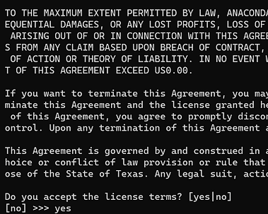
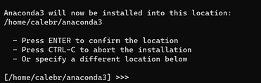
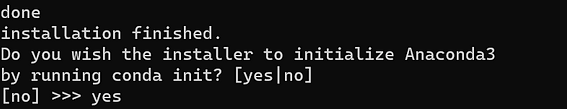
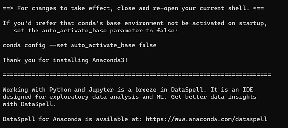

# Installing Anaconda on Ubuntu 20.04


Anaconda is the Python package manager of data scientists, researchers, and developers looking to seamlessly change virtual environments with all the dependencies covered. Here are the steps to install it on Ubuntu 20.04 (WSL2, VirtualBox/VMWare, or native)

## Installing Anaconda

-   Install the dependencies
    

```
sudo apt install libgl1-mesa-glx libegl1-mesa libxrandr2 libxrandr2 libxss1 libxcursor1 libxcomposite1 libasound2 libxi6 libxtst6
```

-   Download the installer
    

```
wget -O - https://www.anaconda.com/distribution/ 2>/dev/null | sed -ne 's@.*\(https:\/\/repo\.anaconda\.com\/archive\/Anaconda3-.*-Linux-x86_64\.sh\)\">64-Bit (x86) Installer.*@\1@p' | xargs wget
```

-   Run the installer
    

```
bash ./Anaconda3-*-Linux-x86_64.sh
```

-   Agree to the terms (type "yes" into the terminal)
    



-   Press enter (default of home directory is a good idea)
    



-   Choose whether you want conda to be activated in your terminal (type "yes" or "no" into the terminal)
    
    -   "yes" is the correct option if you would like to only use Anaconda for building and deploying Python scripts, however...
        



-   Anaconda in fact does not recommend initializing conda by default for a few reasons listed below
    
    -   It will make current pip-managed Python environments difficult to use
        
    -   It modestly slows boot-time of the user's shell
        
    -   Petalinux installs a version of system Python that default conda conflicts with, causing difficult to debug errors if the user is not aware
    
-   If you choose "no", you will need to activate conda each time you would like to use it by running the following two commands
    

```
source <path to conda>/bin/activate
conda init
```

-   For example, if conda was installed to your home directory (the default option), the following commands would be sufficient to initialize conda
    

```
source ~/conda/bin/activate
conda init
```

-   The dialog below indicates that you have successfully installed anaconda - congrats!
    

