# Installing Nvidia Driver, Cuda 11.x, and CudaNN 8.x on Ubuntu 20.04

## Nvidia Driver

-   Go to Nvidia's [<u><span>driver download website</span></u>](https://www.nvidia.com/Download/index.aspx?lang=en-us) and find a menu that looks like this at the top of the page
    

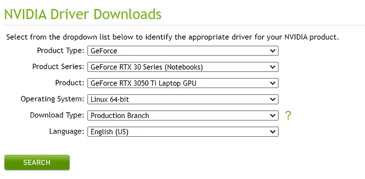

-   The first three dropdown boxes just define which GPU you are using. Click through the options to select your GPU
    
-   "Download Type" should always be set to "Production Branch" and "Language" can be set to whatever you prefer
    
-   If using standard Ubuntu 20.04
    
    -   Select "Linux 64-bit" for the "Operating System" dropbox
    
-   If using WSL2
    
    -   Select "Windows 10 64-bit" or "Windows 11" for the "Operating System" dropbox
    
-   Click "Search"
    

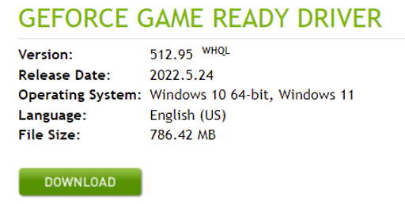

-   Click "Download"
    
-   Open the terminal and run the installer (in the case of WSL2, it will be an exe file)
    

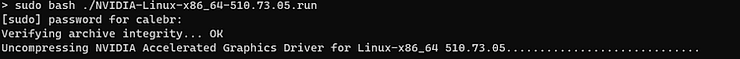

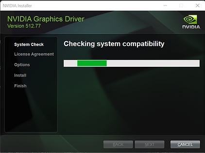

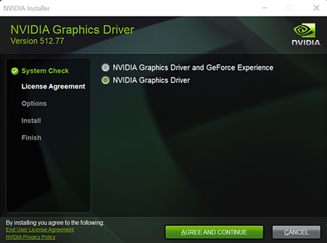

-   Click on "NVIDIA Graphics Driver", then "AGREE AND CONTINUE "
    

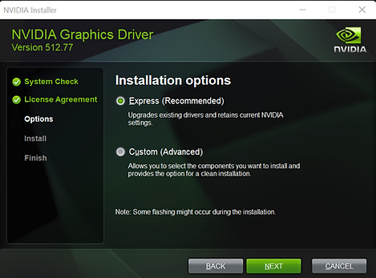

-   Choose "Express" then click "NEXT"
    


-   The installer will then execute
    

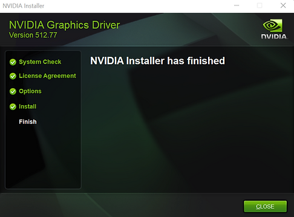

-   Then "CLOSE" the installer
    
-   Restart the terminal and then run the command

```
nvidia-smi
```

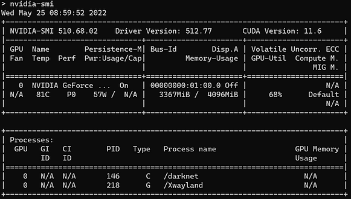

## Cuda

-   Get the new Nvidia keys
    

```
sudo apt-key del 7fa2af80
```

```
wget https://developer.download.nvidia.com/compute/cuda/repos/wsl-ubuntu/x86_64/cuda-wsl-ubuntu.pin
```

```
sudo mv cuda-wsl-ubuntu.pin /etc/apt/preferences.d/cuda-repository-pin-600
```

-   Check [<u><span>this chart</span></u>](https://docs.nvidia.com/deeplearning/cudnn/support-matrix/index.html) to see the latest version of CUDA that is supported by cuDNN
    

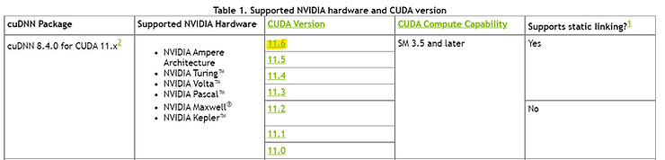

-   As you can see above, CUDA 11.6 is the latest version to be supported by cuDNN. Click on that number on the webpage to be redirected to the release page
    

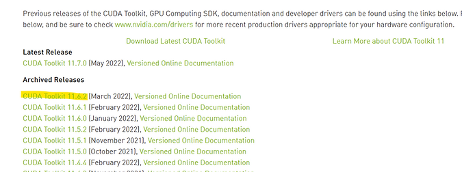

-   You should not click any links here - just see that 11.6.2 in this case is the newest version of CUDA 11.6, so we will install that version
    
-   Set the CUDA version number that you would like to download in order of "XX.Y.Z". The example of downloading 11.6.2 is shown below. All the rest of the commands can be copy-pasted directly
    

```
export XX=11
export Y=6
export Z=2
```

-   Download the debian file
    

```
wget https://developer.download.nvidia.com/compute/cuda/${XX}.${Y}.${Z}/
local_installers/cuda-repo-wsl-ubuntu-${XX}-${Y}-local_${XX}.${Y}.${Z}-1_amd64.deb
```

-   Configure the installer to be available to the "apt" system
    

```
sudo dpkg -i cuda-repo-wsl-ubuntu-${XX}-${Y}-local_${XX}.${Y}.${Z}-1_amd64.deb
```

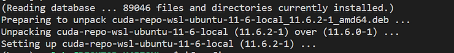

-   Install cuda
    

```
sudo apt update
sudo apt install cuda=${XX}.${Y}.${Z}-1 -y
```

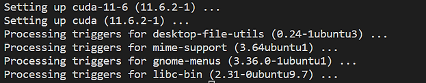

-   Add CUDA to your system PATH. Open ~/.bashrc ("gedit ~/.bashrc") and add this line to the bottom of the file
    

```
export PATH=/usr/local/cuda/bin:${PATH}
```

-   Reflect those changes in your current terminal session

```
source ~/.bashrc
```

-   Check that your version of cuda is installed

```
nvcc --version
```

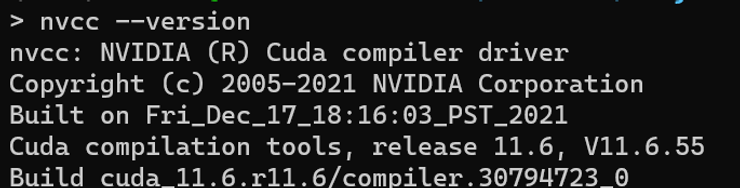

## CUDNN

-   Export the CUDA version, which can be found as shown above, using "nvcc --version"

```
export CUDA_VERSION=11.6
```

-   Install the CUDNN driver for ubuntu 20.04

-   Go the the [<u><span>CUDNN home page</span></u>](https://developer.nvidia.com/cudnn)

-   Click on "Download cuDNN"


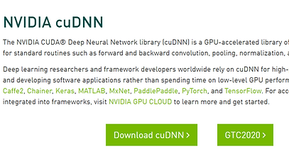

-   Check "I Agree To the Terms..." and then click on "Download cuDNN vW.X.Y for CUDA ...". just choose the latest version
    

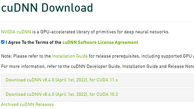

-   Click on "Local Installer for Ubuntu 20.04 x86\_64"
    

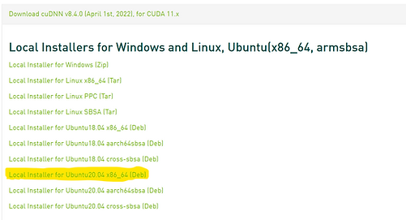

-   Configure the installer to be available to the "apt" system
    

```
sudo dpkg -i cudnn-local-repo-ubuntu2004-*_1.0-1_amd64.deb<span><span>sudo dpkg -i cudnn-local-repo-ubuntu2004-*_1.0-1_amd64.deb</span></span>
```

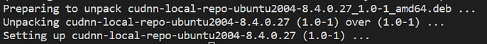

-   sudo apt update
    
-   Install CudaNN
    

```
sudo apt install libcudnn8=*-1+cuda${CUDA_VERSION}
```

```
sudo apt-get install libcudnn8-dev=*-1+cuda${CUDA_VERSION}
```

```
sudo apt-get install libcudnn8-samples=*-1+cuda${CUDA_VERSION}
```

-   Validate the install
    

```
cp /usr/src/cudnn_samples_v8/ $HOME -rfv
cd ~/cudnn_samples_v8/conv_sample
make clean
make -sj
./conv_sample
```

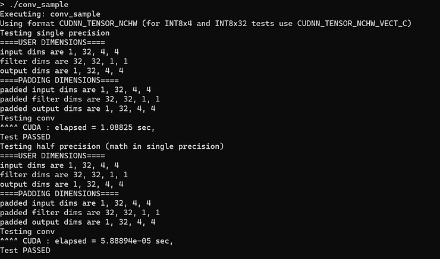