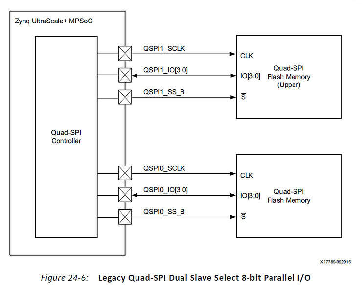
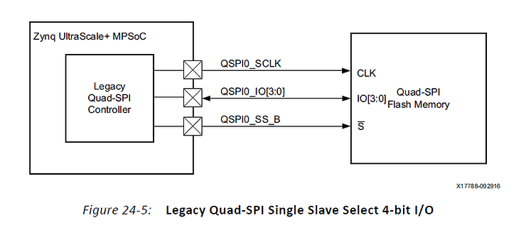

# Integrate a QSPI using PetaLinux Tools Part 2


This post is a continuation of part 1 @ [link](http://www.zachpfeffer.com/single-post/Integrate-a-QSPI-using-PetaLinux-Tools-Part-1). It shows the solution to part 1's issue then starts to scrub the QSPI device-tree to ensure everything looks okay.

**Solved Part 1**

After more debug I found the problem.

I needed to remove:

```
is-dual = <0x1>;
```

**is-dual** is used for this configuration (diagram from page 664 of the TRM):



However, I'm using the single slave configuration show below.

After finding this I decided to scrub through the remaining device-tree SPI nodes.

The rest of the post presents the scrub.

**Set Up for this Post**

The env variables used in this post are created in [setup\_env.sh](http://github.com/pfefferz/build/blob/master/setup_env.sh).

This script is part of a set of scripts to manage a build for a Zynq UltraScale+ MPSoC board available at [link](http://github.com/pfefferz/build).

In this case changes to the DT file are made to ./project-spec/meta-user/recipes-bsp/device-tree/files/system-user.dtsi

**QSPI Configuration**



From page 663 of ZU+ TRM

**Scrub the Device Tree**

Get the Actual Device Tree Used

Output the compiled DTB to the console:

```
$PETALINUX/tools/linux-i386/petalinux/bin/dtc -I dtb \
$PETALINUX_PROJS_DIR/$PETALINUX_PROJ_NAME/images/linux/system.dtb
```

Identify QSPI

QSPI section:

```
spi@ff0f0000 {
        u-boot,dm-pre-reloc;
        compatible = "xlnx,zynqmp-qspi-1.0";
        interrupt-parent = <0x4>;
        num-cs = <0x1>;
        reg = <0x0 0xff0f0000 0x0 0x1000 0x0 0xc0000000 0x0 0x8000000>;
        #address-cells = <0x1>;
        #size-cells = <0x0>;
        #stream-id-cells = <0x1>;
        iommus = <0x7 0x873>;
        power-domains = <0x16>;
        clocks = <0x3 0x35 0x3 0x1f>;
        is-dual = <0x0>;
        spi-rx-bus-width = <0x4>;
        spi-tx-bus-width = <0x4>;

        flash@0 {
                compatible = "jedec,spi-nor";
                reg = <0x0>;
                #address-cells = <0x1>;
                #size-cells = <0x1>;
                spi-max-frequency = <0x55d4a80>;
                spi-tx-bus-width = <0x4>;
                spi-rx-bus-width = <0x4>;

                partition@0x00000000 {
                        label = "boot";
                        reg = <0x0 0x100000>;
                };

                partition@0x00100000 {
                        label = "bootenv";
                        reg = <0x100000 0x40000>;
                };

                partition@0x00140000 {
                        label = "kernel";
                        reg = <0x140000 0x1600000>;
                };
        };
};
```

**Ensure Each Field is Needed**

Find "xlnx,zynqmp-qspi-1.0":

```
grep -REns "xlnx,zynqmp-qspi-1.0" *
```

Output (reformated a little):

```
arch/arm64/boot/dts/xilinx/zynqmp.dtsi:819:                     
        compatible = "xlnx,zynqmp-qspi-1.0";

Documentation/devicetree/bindings/spi/spi-zynqmp-qspi.txt:5:
        - compatible            : Should be "xlnx,zynqmp-qspi-1.0".

Documentation/devicetree/bindings/spi/spi-zynqmp-qspi.txt:27:                
        compatible = "xlnx,zynqmp-qspi-1.0";

drivers/mtd/spi-nor/spi-nor.c:1809:                                     
        "xlnx,zynqmp-qspi-1.0") >= 0)) {

drivers/spi/spi-zynqmp-gqspi.c:1326:    
        { .compatible = "xlnx,zynqmp-qspi-1.0", },
```

File that's used to create the DTB.

Documentation/devicetree/bindings/spi/spi-zynqmp-qspi.txt:5: \- compatible : Should be "xlnx,zynqmp-qspi-1.0".

Dump of file:

```
Xilinx Zynq UltraScale+ MPSoC GQSPI controller Device Tree Bindings
-------------------------------------------------------------------

Required properties:
- compatible            : Should be "xlnx,zynqmp-qspi-1.0".
- reg                   : Physical base address and size of GQSPI registers map.
- interrupts            : Property with a value describing the interrupt
                          number.
- interrupt-parent      : Must be core interrupt controller.
- clock-names           : List of input clock names - "ref_clk", "pclk"
                          (See clock bindings for details).
- clocks                : Clock phandles (see clock bindings for details).

Optional properties:
- num-cs                : Number of chip selects used.
- has-io-mode           : boolean property describes the controller operating
                          mode. if exists controller will operate in IO mode
                          else dma mode.
- is-dual               : zynqmp qspi support for dual-parallel mode configuration
                          value should be 1.
- is-stacked            : zynqmp qspi support for stacked mode configuration.
                          to enable this mode, is-dual should be 0 and is-stacked
                          should be 1.

Example:
        qspi: spi@ff0f0000 {
                compatible = "xlnx,zynqmp-qspi-1.0";
                clock-names = "ref_clk", "pclk";
                clocks = <&misc_clk &misc_clk>;
                interrupts = <0 15 4>;
                interrupt-parent = <&gic>;
                num-cs = <1>;
                reg = <0x0 0xff0f0000 0x1000>,<0x0 0xc0000000 0x8000000>;
        };
```

**Remove num-cs?**

Code @ drivers/spi/spi-zynqmp-gqspi.c does this:

```
        ret = of_property_read_u32(pdev->dev.of_node, "num-cs", &num_cs);
        if (ret < 0)
                master->num_chipselect = GQSPI_DEFAULT_NUM_CS;
        else
                master->num_chipselect = num_cs;
```

GQSPI\_DEFAULT\_NUM\_CS is 1:

```
#define GQSPI_DEFAULT_NUM_CS    1       /* Default number of chip selects */
```

We only have one CS and the default does the right thing so **remove**.

has-io-mode, is-dual, is-stacked are not used.

Smoke Test

Build

```
pfefferz@plc2:~/plprj4/mtd_board$ petalinux-build -c device-tree
```

Run

```
source tools/cp_bins_for_jtag_load.sh 
source tools/reset_to_jtag_boot.sh 
source tools/jtag_load.sh
```

Set Up The Com

```
minicom -o -w -C May-17th-2018.log
```

Check dmesg

```
[    4.706967] m25p80 spi0.0: n25q00 (131072 Kbytes)                                                                
[    4.706990] 3 ofpart partitions found on MTD device spi0.0                                                       
[    4.707001] Creating 3 MTD partitions on "spi0.0":                                                               
[    4.707015] 0x000000000000-0x000000100000 : "boot"                                                               
[    4.707712] 0x000000100000-0x000000140000 : "bootenv"                                                            
[    4.708285] 0x000000140000-0x000001740000 : "kernel"
```

Looks good.

Run a Test

```
insmod /lib/modules/4.9.0-xilinx-v2017.4/kernel/drivers/mtd/tests/mtd_speedtest.ko dev=0                                                                                                          
rmmod mtd_speedtest.ko                                                                                       
insmod /lib/modules/4.9.0-xilinx-v2017.4/kernel/drivers/mtd/tests/mtd_speedtest.ko dev=1                     
rmmod mtd_speedtest.ko  
insmod /lib/modules/4.9.0-xilinx-v2017.4/kernel/drivers/mtd/tests/mtd_speedtest.ko dev=2                     
rmmod mtd_speedtest.ko
```

Note: If you Control-C any of the insmod lines, you don't need to rmmod.

Tests looked good.

**Remove u-boot,dm-pre-reloc;?**

Find It

```
grep -REns "u-boot,dm-pre-reloc" *
```

Output

```
$ grep -REns "u-boot,dm-pre-reloc" *
arch/arm/boot/dts/zynq-zc770-xm010.dts:128:	u-boot,dm-pre-reloc;
arch/arm/boot/dts/zynq-zc770-xm013.dts:120:	u-boot,dm-pre-reloc;
arch/arm/boot/dts/zynq-7000.dtsi:70:		u-boot,dm-pre-reloc;
arch/arm/boot/dts/zynq-zc770-xm012.dts:111:	u-boot,dm-pre-reloc;
arch/arm/boot/dts/zynq-zybo.dts:61:	u-boot,dm-pre-reloc;
arch/arm/boot/dts/zynq-zybo.dts:66:	u-boot,dm-pre-reloc;
arch/arm/boot/dts/zynq-zybo.dts:71:	u-boot,dm-pre-reloc;
arch/arm/boot/dts/zynq-zc706.dts:319:	u-boot,dm-pre-reloc;
arch/arm/boot/dts/zynq-zc706.dts:355:	u-boot,dm-pre-reloc;
arch/arm/boot/dts/zynq-zc706.dts:362:	u-boot,dm-pre-reloc;
arch/arm/boot/dts/zynq-zc702.dts:416:	u-boot,dm-pre-reloc;
arch/arm/boot/dts/zynq-zc702.dts:452:	u-boot,dm-pre-reloc;
arch/arm/boot/dts/zynq-zc702.dts:459:	u-boot,dm-pre-reloc;
arch/arm/boot/dts/zynq-zed.dts:63:	u-boot,dm-pre-reloc;
arch/arm/boot/dts/zynq-zed.dts:99:	u-boot,dm-pre-reloc;
arch/arm/boot/dts/zynq-zed.dts:104:	u-boot,dm-pre-reloc;
arch/arm/boot/dts/zynq-zc770-xm011.dts:105:	u-boot,dm-pre-reloc;
arch/arm64/boot/dts/xilinx/zynqmp-clk.dtsi:19:		u-boot,dm-pre-reloc;
arch/arm64/boot/dts/xilinx/zynqmp.dtsi:101:		u-boot,dm-pre-reloc;
arch/arm64/boot/dts/xilinx/zynqmp.dtsi:390:		u-boot,dm-pre-reloc;
arch/arm64/boot/dts/xilinx/zynqmp.dtsi:818:			u-boot,dm-pre-reloc;
arch/arm64/boot/dts/xilinx/zynqmp.dtsi:889:			u-boot,dm-pre-reloc;
arch/arm64/boot/dts/xilinx/zynqmp.dtsi:905:			u-boot,dm-pre-reloc;
arch/arm64/boot/dts/xilinx/zynqmp.dtsi:1005:			u-boot,dm-pre-reloc;
arch/arm64/boot/dts/xilinx/zynqmp.dtsi:1016:			u-boot,dm-pre-reloc;
arch/arm64/boot/dts/xilinx/zynqmp-clk-ccf.dtsi:40:		u-boot,dm-pre-reloc;
arch/arm64/boot/dts/xilinx/zynqmp-clk-ccf.dtsi:47:		u-boot,dm-pre-reloc;
arch/arm64/boot/dts/xilinx/zynqmp-clk-ccf.dtsi:54:		u-boot,dm-pre-reloc;
arch/arm64/boot/dts/xilinx/zynqmp-clk-ccf.dtsi:61:		u-boot,dm-pre-reloc;
arch/arm64/boot/dts/xilinx/zynqmp-clk-ccf.dtsi:68:		u-boot,dm-pre-reloc;
arch/arm64/boot/dts/xilinx/zynqmp-clk-ccf.dtsi:75:		u-boot,dm-pre-reloc;
arch/arm64/boot/dts/xilinx/zynqmp-ep108-clk.dtsi:19:		u-boot,dm-pre-reloc;
```

Find just dm-pre-reloc

```
grep -REns "dm-pre-reloc" *
```

Same result: its not used by itself.

What is u-boot,dm-pre-reloc?

-   **u-boot,dm-pre-reloc is used by U-Boot not the Linux kernel.**
    
-   **It tells U-Boot that this device is a "pre-relocation device."**
    
-   **If U-Boot calls dm\_scan\_fdt\_dev() before relocation, only devices marked with this string will be bound.**
    
-   **A bound device is an instance of a driver connected to a port or peripheral, i.e. memory has been reserved for the device and you can then use the device to work with the port or peripheral.**
    
-   **U-Boot typically starts running in ROM space then relocates it self to RAM. u-boot,dm-pre-reloc would indicate that the device is needed pre-reallocation.**
    

Is it needed?

It may be needed since we may run U-Boot out of the SPI at some point. It is also not doing any harm where it is for our build because Linux doesn't read it. **Leave it.**

**What is the 4 for and who references this: interrupt-parent = <0x4>;**

There's a great write up [here](http://elinux.org/Device_Tree_Mysteries) on what the 0x4 means. Short story, you should look for a device that lists "phandle = <0x4>" thats the interrupt parent. In our case:

```
        amba_apu@0 {
                compatible = "simple-bus";
                #address-cells = <0x2>;
                #size-cells = <0x1>;
                ranges = <0x0 0x0 0x0 0x0 0xffffffff>;

                interrupt-controller@f9010000 {
                        compatible = "arm,gic-400", "arm,cortex-a15-gic";
                        #interrupt-cells = <0x3>;
                        reg = <0x0 0xf9010000 0x10000 0x0 0xf9020000 0x20000 0x0 0xf9040000 0x20000 0x0 0xf9060000 0x20000>;
                        interrupt-controller;
                        interrupt-parent = <0x4>;
                        interrupts = <0x1 0x9 0xf04>;
                        linux,phandle = <0x4>;
                        phandle = <0x4>;
                };
        };
```

**What do all of these values map to: reg = <0x0 0xff0f0000 0x0 0x1000 0x0 0xc0000000 0x0 0x8000000>?**

The info on **reg**, **[#address](https://www.centennialsoftwaresolutions.com/blog/hashtags/address)-cells** and **[#size](https://www.centennialsoftwaresolutions.com/blog/hashtags/size)-cells** came from [here](http://elinux.org/Device_Tree_Usage).

The parent node is needed to interpret this.

```
amba {
        #address-cells = <0x2>;
        #size-cells = <0x2>;
        spi@ff0f0000 {
                reg = <0x0 0xff0f0000 0x0 0x1000 0x0 0xc0000000 0x0 0x8000000>;
        };
};
```

The spi controller is at 0x00000000ff0f0000 and is 0x0000000000001000 long. They is also an address range at: 0x00000000c0000000 that is 0000000080000000 long defined.

The first range is used to access the QSPI Controller's registers: see [link](http://www.xilinx.com/html_docs/registers/ug1087/mod___qspi.html).

It is read here in [drivers/spi/spi-zynqmp-gqspi.c](http://github.com/Xilinx/linux-xlnx/blob/b450e900fdb473a53613ad014f31eedbc80b1c90/drivers/spi/spi-zynqmp-gqspi.c):

```
res = platform_get_resource(pdev, IORESOURCE_MEM, 0);
xqspi->regs = devm_ioremap_resource(&pdev->dev, res);
```

A printk in devm\_ioremap\_resource() shows:

```
dest_ptr ffffff8008016000 res->start ff0f0000 size 1000
```

The second address and length does not appear to be used in Linux or in U-Boot. Should it be removed?

It does look like a range that may be used in U-Boot . 0xc0000000 looks like PAGE\_OFFSET on a 32-bit machine and 0x80000000 looks like a 2 GB range. This would put the highest address outside of a 32-address space.

Like **u-boot,dm-pre-reloc** it doesn't \_seem\_ to harm anything so leaving it in for now.

**Reference**

-   Debugging of U-Boot @ [link](http://www.denx.de/wiki/DULG/DebuggingUBoot)
    
-   Device Tree spec @ [link](http://www.devicetree.org/downloads/devicetree-specification-v0.1-20160524.pdf)
    
-   U-Boot programming: A tutorial -- Part III @ [link](http://xillybus.com/tutorials/uboot-hacking-howto-3) (by the way, check out [Xillybus' IP core](http://xillybus.com/doc/xilinx-pcie-principle-of-operation))
    
-   [https://elinux.org/Device\_Tree\_Mysteries](http://elinux.org/Device_Tree_Mysteries)
    
-   [include/dm/device.h](http://github.com/Xilinx/u-boot-xlnx/blob/41006dd91e3704b6a4be0d1623891335ebe1ceef/include/dm/device.h)
    
-   Zynq UltraScale+ Device Technical Reference Manual (ZU+ TRM), UG1085 (v1.7) December 22, 2017 @ [link](http://www.xilinx.com/support/documentation/user_guides/ug1085-zynq-ultrascale-trm.pdf)
    
-   Xilinx logo from [https://twitter.com/xilinxinc](http://twitter.com/xilinxinc) at [link](http://pbs.twimg.com/profile_images/535545777020338176/pEWdIYq__400x400.png)