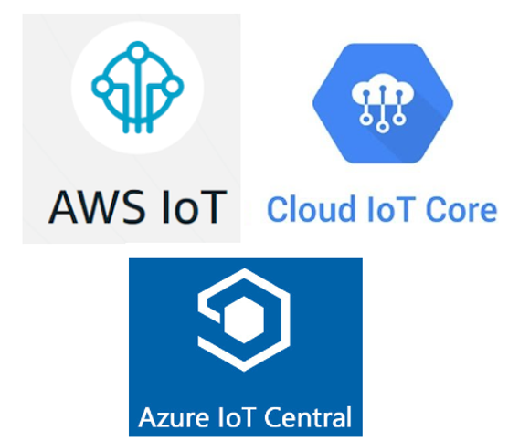

# IoT Protocols Supported by AWS IoT, Microsoft Azure IoT Central and Google Cloud IoT Core

This post lists the IoT protocols supported by Amazon AWS' IoT, Microsoft Azure's IoT Hub and Google Cloud's IoT Core as of May 28th 2019.

Amazon AWS' IoT supports \[[link](https://docs.aws.amazon.com/iot/latest/developerguide/protocols.html)\]:

-   MQTT
    
-   MQTT over WebSockets
    
-   HTTPS
    

Microsoft Azure's IoT Central supports \[[link](https://docs.microsoft.com/en-us/azure/iot-hub/iot-hub-devguide-protocols)\]:

-   MQTT
    
-   MQTT over WebSockets
    
-   AMQP
    
-   AMQP over WebSockets
    
-   HTTPS
    

Google Cloud's IoT Core supports \[[link](https://cloud.google.com/iot/docs/concepts/protocols)\]:

-   MQTT
    
-   HTTP 1.1
    

**<u>References</u>**

-   AWS IoT logo found @ \[[link](https://images.app.goo.gl/zxkw7eXhp5YJRUxNA)\]
    
-   Azure IoT Central logo found @ \[[link](https://images.app.goo.gl/DTWwpCfqpekTmuXR6)\]
    
-   Google Cloud logo found @ \[[link](https://images.app.goo.gl/zg7j2HM6HjkCLhS5A)\]