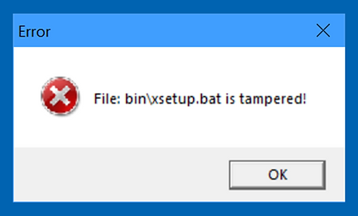
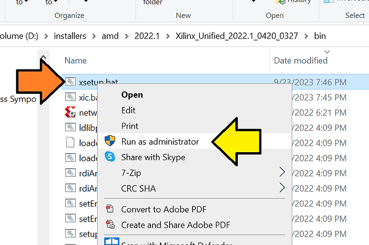
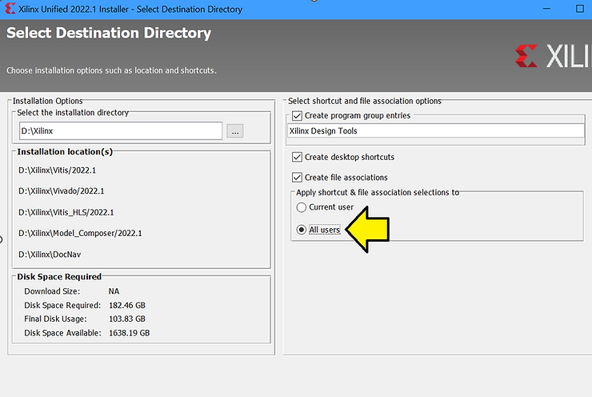
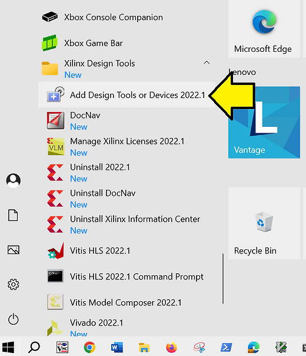
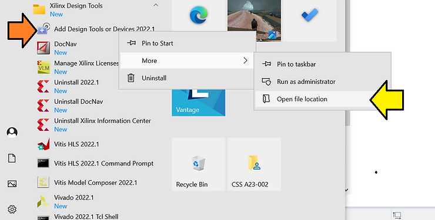
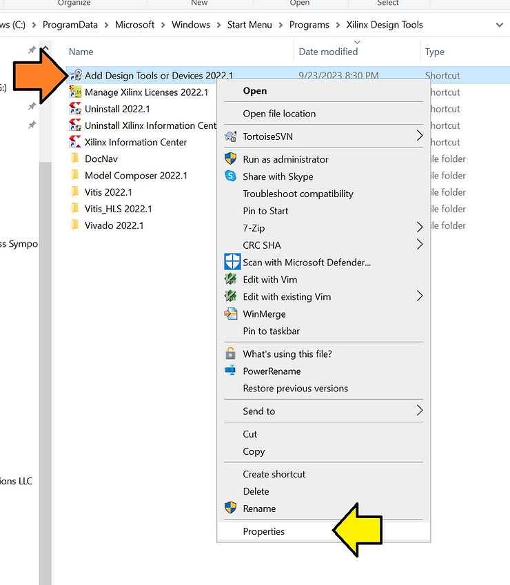
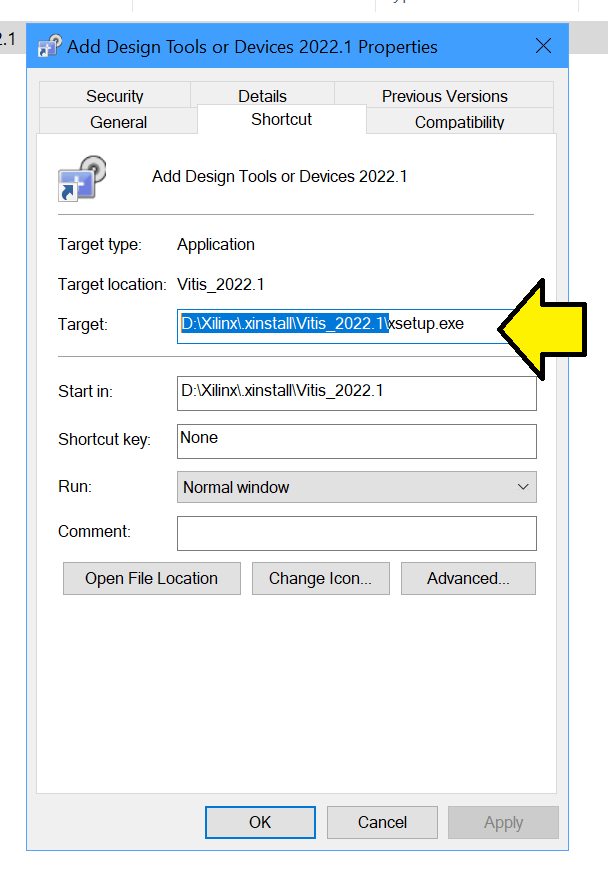
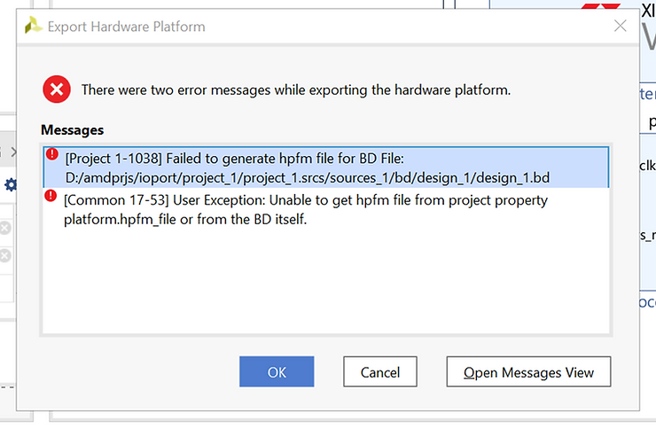

# Is "xsetup.exe" Giving You the Silent Treatment? Let's Solve That Mystery! 😱


Ever clicked on 'xsetup.exe' only to be met with... silence? You're not alone. In fact, there's a sneaky culprit behind this that's tripped up many Windows users. If the phrase "space in your user name" rings a bell, then I've got a revelation for you. For those of you using Windows 10 (or earlier versions) with Vivado 2022.1 and prior, this post might just save you a headache or two!

Quick Hint: It’s all about those .bat scripts and how they deal with spaces. But don't worry, I've got the remedy you're looking for. Dive in to find out!

You'll need to do three separate steps

First look at xic.bat and xsetup.bat:

```
$ grep -REns USERPROFILE *
xic.bat:10:set ARGS=%ARGS% -DLOG_FILE_NAME=%USERPROFILE%/.Xilinx\xinstall\xic.log
xic.bat:11:set ARGS=%ARGS% -DLOG_FILE=%USERPROFILE%\.Xilinx\xinstall\xic.log
xsetup.bat:59:  set LOG_FILE=%USERPROFILE%\.Xilinx\xinstall\xinstall-%logName%.log
xsetup.bat:61:  if not exist "%USERPROFILE%\.Xilinx\xinstall\" (
xsetup.bat:62:          mkdir %USERPROFILE%\.Xilinx\xinstall
```

Next, change the scripts to (just add quotes):

```
$ grep -REns USERPROFILE *
xic.bat:10:set ARGS=%ARGS% -DLOG_FILE_NAME="%USERPROFILE%/.Xilinx\xinstall\xic.log"
xic.bat:11:set ARGS=%ARGS% -DLOG_FILE="%USERPROFILE%\.Xilinx\xinstall\xic.log"
xsetup.bat:59:  set LOG_FILE="%USERPROFILE%\.Xilinx\xinstall\xinstall-%logName%.log"
xsetup.bat:61:  if not exist "%USERPROFILE%\.Xilinx\xinstall\" (
xsetup.bat:62:          mkdir "%USERPROFILE%\.Xilinx\xinstall"
```

Now, if you try to run xsetup.exe it'll error with **File: bin\\xsetup.bar is tampered!** seen here:



Work around this by right-clicking on xsetup.bat and selecting **Run as Administrator**:



Incidentally, when you're installing, make sure you install for **All users** - you can't go back and fix this.



That's it. Happy installing!

## You will see the same silent behavior when you click Add Design Tools or Devices 2022.1:



To fix this, right-click and **Open file location**



Then right-click and click **Properties**:



See where this shortcut lives:



Then make the quoting change to the installed **bin\\xsetup.bat** and **bin\\xic.bat** and run **bin\\xsetup.bat** as **Administrator** as above.

Finally, if you click on Vivado on the desktop and you have a space in your username you may run into two errors when you attempt to export a platform or bitstream:



In text:

```
[Project 1-1038] Failed to generate hpfm file for BD File:      D:/amdprjs/ioport/project_1/project_1.srcs/sources_1/bd/design_1/design_1.bd      
[Common 17-53] User Exception: Unable to get hpfm file from project property platform.hpfm_file or from the BD itself.
```

If you look at the log you'll see that the username space has caused issues (my username is **Zach Pfeffer**):

```
INFO: [Project 1-1918] Creating Hardware Platform: D:/amdprjs/ioport/project_1/design_1_wrapper.xsa ...
INFO: [Project 1-655] Project does not have Board Part set. Board related data may be missing or incomplete in the generated Hardware Platform.
WARNING: [Project 1-646] Board name, vendor and part not set in Hardware Platform.
WARNING: [Project 1-645] Board images not set in Hardware Platform.
INFO: [Project 1-1906] Skipping semantic label enumeration.
WARNING: [BD 41-2589] Platform should have atleast one axi memory mapped master interface. Enable a master AXI interface as platform AXI_PORT.
WARNING: [Vivado 12-818] No files matched 'Pfeffer/AppData/Roaming/Xilinx/Vivado/.Xil/Vivado-23344-LAPTOP-3MCNKKJO/xsa/design_1_wrapper.hpfm'
couldn't open "C:/Users/Zach": permission denied
ERROR: [Project 1-1038] Failed to generate hpfm file for BD File: D:/amdprjs/ioport/project_1/project_1.srcs/sources_1/bd/design_1/design_1.bd
ERROR: [Common 17-53] User Exception: Unable to get hpfm file from project property platform.hpfm_file or from the BD itself.
```

```
Microsoft Windows [Version 10.0.19045.3448]
(c) Microsoft Corporation. All rights reserved.

C:\Users\Zach Pfeffer>d:

D:\>cd D:\amdprjs\ioport\project_1

D:\amdprjs\ioport\project_1>d:\Xilinx\Vivado\2022.1\settings64.bat

D:\amdprjs\ioport\project_1>cd outputdir

D:\amdprjs\ioport\project_1\outputdir>vivado

****** Vivado v2022.1 (64-bit)
  **** SW Build 3526262 on Mon Apr 18 15:48:16 MDT 2022
  **** IP Build 3524634 on Mon Apr 18 20:55:01 MDT 2022
    ** Copyright 1986-2022 Xilinx, Inc. All Rights Reserved.


start_gui

****** Xilinx Vitis Development Environment
Vitis v2022.1 (64-bit)
****** SW Build 0 on 2022-04-14-18:00:04
    ** Copyright 1986-2022 Xilinx, Inc. All Rights Reserved.

```

## **<u><span>References</span></u>**

Xilinx logo clipped from [xilinx.com](http://xilinx.com/)