# Lab 1 SDSoC Build and Load

This post is my run through of SDSoC Lab 1 Tutorial at \[[<u>link</u>](https://github.com/Xilinx/SDSoC-Tutorials/blob/master/getting-started-tutorial/lab-1-introduction-to-the-sdsoc-development-environment.md)\].

**<u>Prerequisites</u>**

-   Install SDSoC on Linux using a free 60-day trial and launch it \[[<u>instructions</u>](https://www.centennialsoftwaresolutions.com/blog/install-sdsoc-on-ubuntu-16-04-3)\]
    
-   Have a ZC702 (I used a ZC702 Rev 1.1)
    

**<u>Notes</u>**

Use the Zynq-7000 on the ZC702 or the ZedBoard available at \[[<u>link</u>](https://www.xilinx.com/products/boards-and-kits/ek-z7-zc702-g.html)\] and \[[<u>link</u>](https://store.digilentinc.com/zedboard-zynq-7000-arm-fpga-soc-development-board/)\] to play around with SDSoC.

The ZC702 is $895.00 and the ZedBoard is $449.00.

The key benefit is that you'll only need **2 GB** of host memory to build images for the board.

If you use a Zynq UltraScale+ MPSoC on a ZCU102 (available at \[[<u>link</u>](https://www.xilinx.com/products/boards-and-kits/ek-u1-zcu102-g.html)\]), you'll need **14 GB** of host memory and $2495.00 for the board.

This advice applies to other situations where you'd like to use a Arm + FPGA fabric. Also long as you don't need a hypervisor or the performance, the Zynq-7000 is a good, economical **and fast** platform for development (Zynq-7000 projects build in much less time).

**<u>Steps</u>**

1\. Click **Create SDx project**

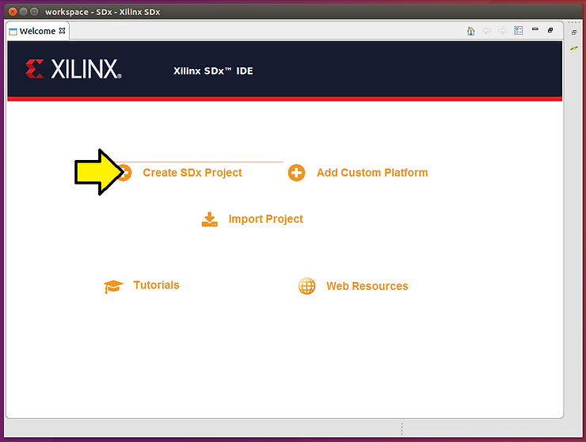

2\. Keep **Application** selected and click **Next >**

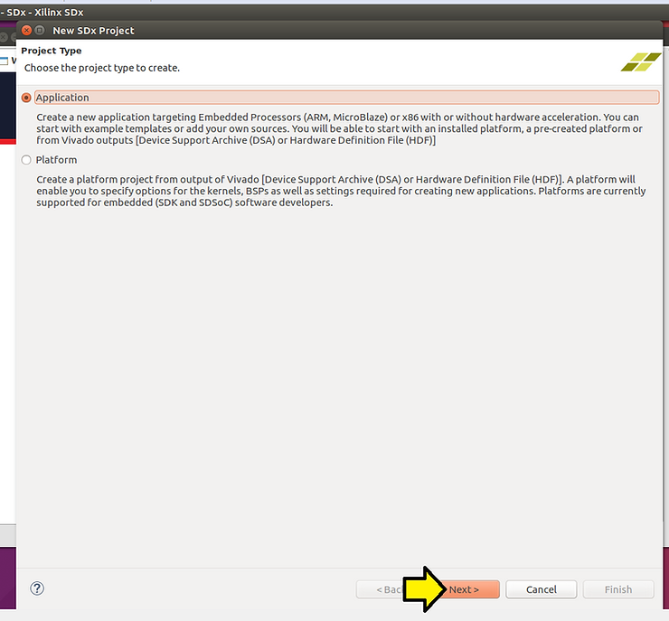

3\. Name your project **lab1,** keep **Use default location** clicked and click **Next >**

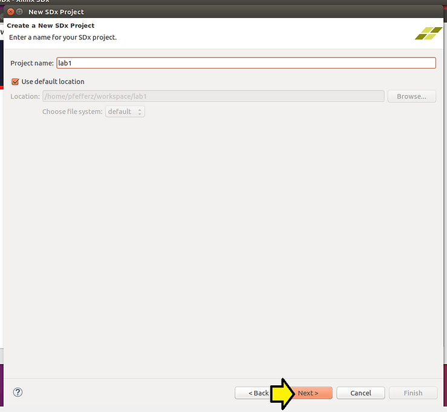

**Note**: You can use any 3 to 40 character sequence of a-z, A-Z, 0-9, \_ and -

**Note2**: In a regex: \[a-zA-Z0-9\_ -\]{3,40}

4\. (A) Select the **zc702** and (B) click **Next**

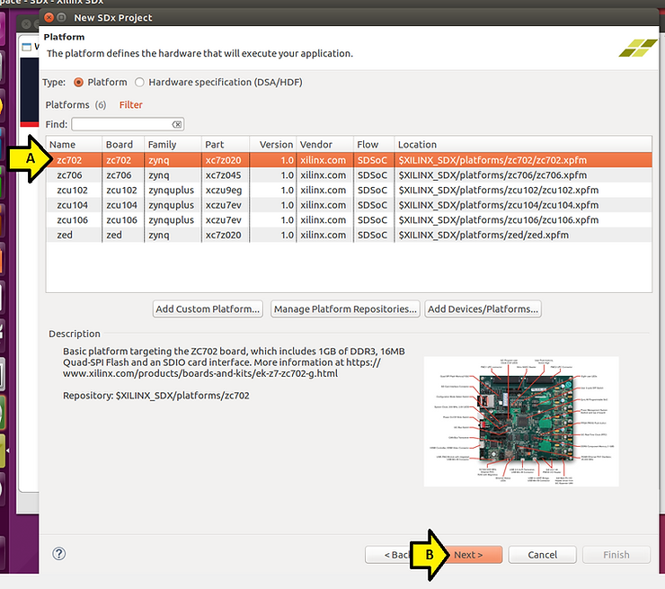

5\. Accept defaults and click **Next** on the **System configuration** window

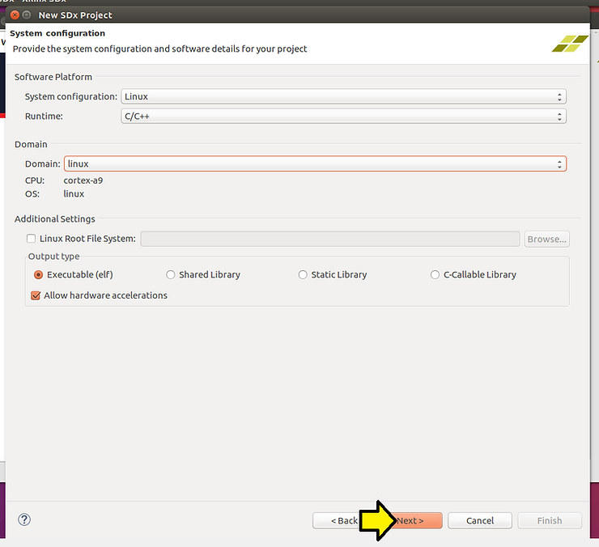

6\. (A) Select **Matrix Multiplication and Addition** and (B) click **Finish**

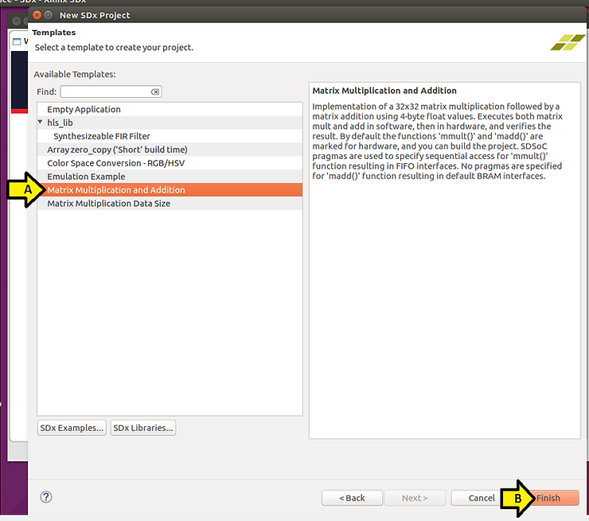

You should see:

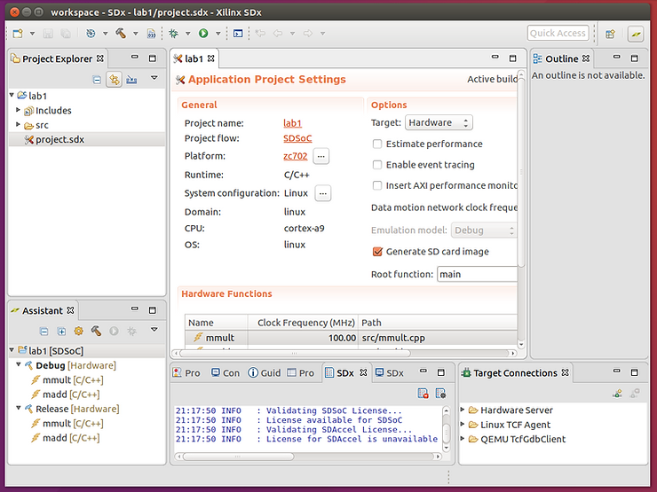

At this point I diverge from the tutorial a little.

7\. Click **build** (this step will take a significant amount of time).

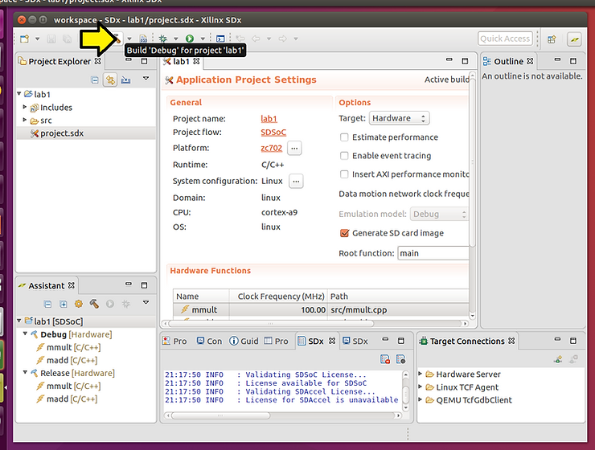

Note: this step took 1h:24m:29s.132ms, the entire output is \[[<u>here</u>](https://docs.google.com/document/d/1AhUyuAvUozG3Rk4_e-k5CW116Ce_9TDCqoxt2MTHePQ/edit?usp=sharing)\].

If you need help accessing an SD card from in Ubuntu running on VirtualBox, running on Windows 7 click \[[<u>here</u>](https://www.centennialsoftwaresolutions.com/blog/sd-card-access-from-ubuntu-16-04-3-on-virtualbox-on-windows-7)\].

8\. To copy the files to the SD card...

Type **cd ~**

Type **cd workspace/lab1/Debug/sd\_card**

Type **ls**

You should see:

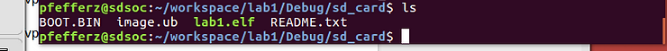

ls

BOOT.BIN

image.ub

lab1.elf

README.txt

After replacing pfefferz with your path, type **cp -f \* /media/pfefferz/C002-DEEF/**

Type **ls -l /media/pfefferz/C002-DEEF/** to check that the files were copied

9\. Eject the SD card

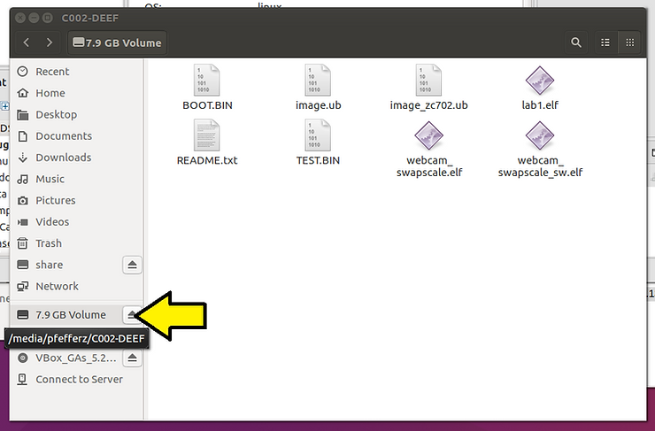

10\. Set up minicom

Close SDx and everything else (you'll need to log out and back in)

Type **sudo apt-get install minicom**

Type **sudo adduser $USER dialout**

Log out, (A) click the gear icon, (B) click **Log Out...**

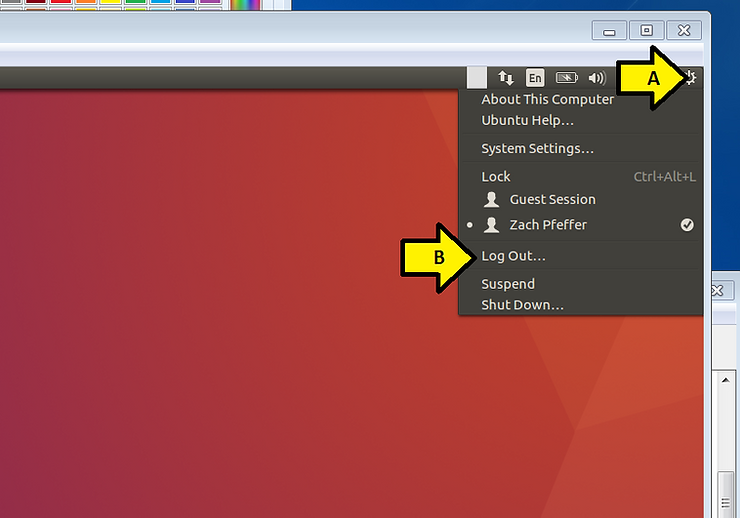

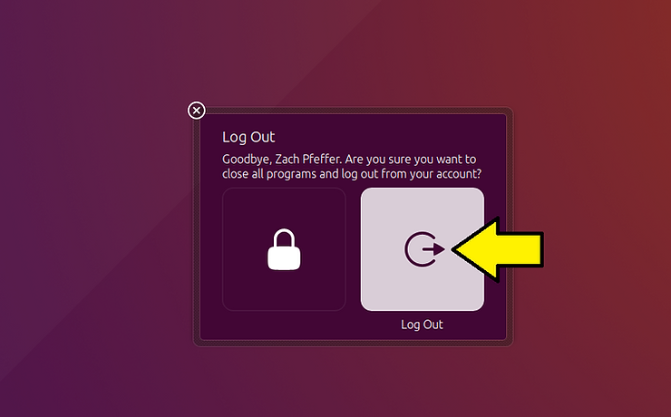

Log in, type your password and hit enter

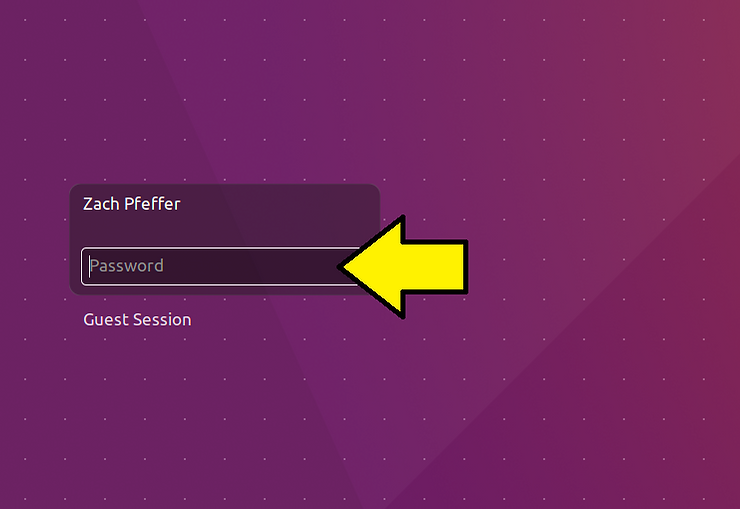

Open a terminal and type **sudo minicom -s**

At this screen:

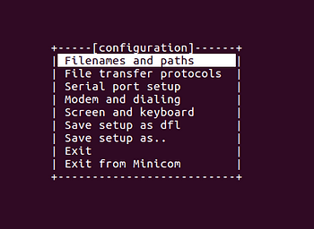

Hit the down arrow until you hit **Serial port setup**

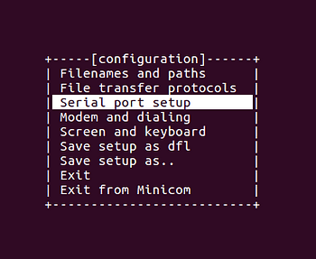

Press **Enter**

At this screen type **F** to turn off **Hardware Flow Control** and type **A**, changing the serial device to **/dev/ttyUSB0**

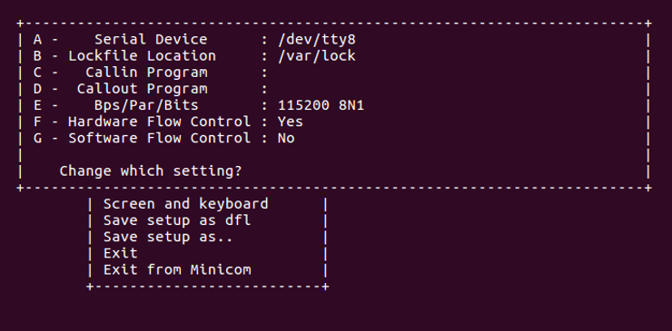

Things should look like:

Press **Enter** to return to the previous menu

Press down until you get to **Save setup as dfl**

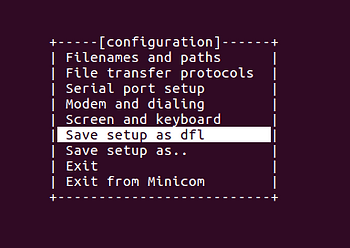

Press **Enter**

You should see:

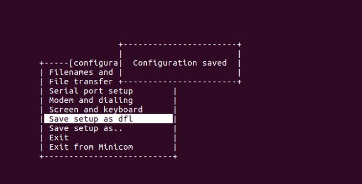

Press down until you get to **Exit from Minicom**

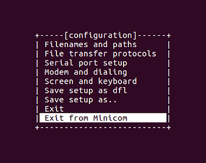

Press **Enter**

11\. Set up the board

Plug the SD card in

Push it in:

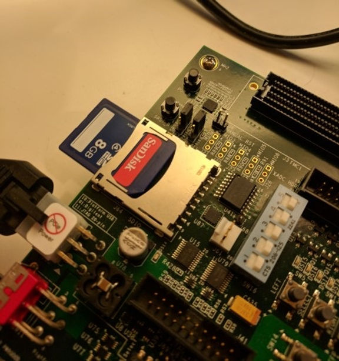

...till it clicks

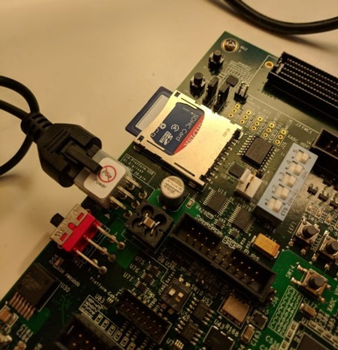

Set SW16 to boot from the SD card:

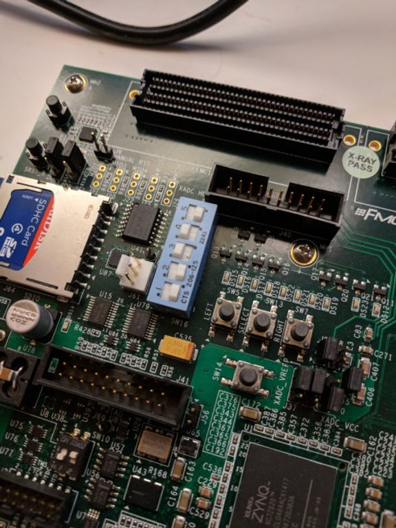

Plug in the USB UART:

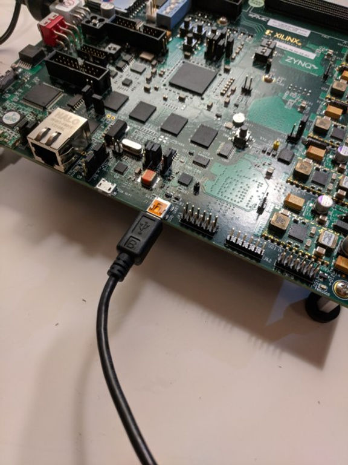

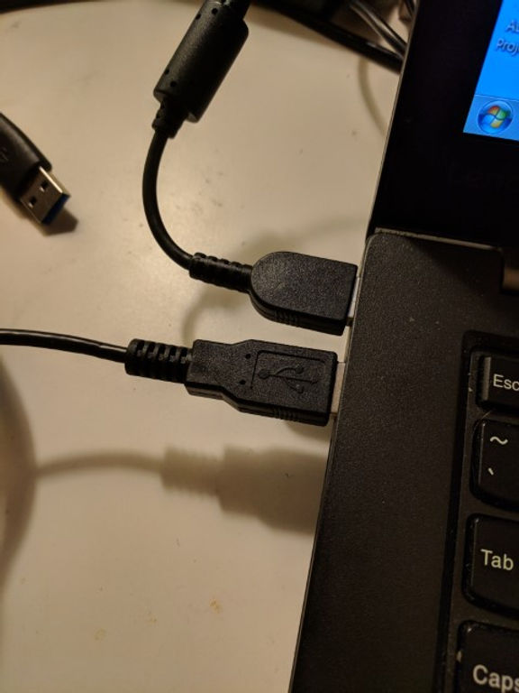

12\. If you're running this in a virtual machine, managed by VirtualBox, then capture the USB UART in VirtualBox by (A) clicking **Devices**, (B) clicking **USB** and (C) clicking **Silicon Labs CP2103 USB to UART Bridge Controller \[0100\]**

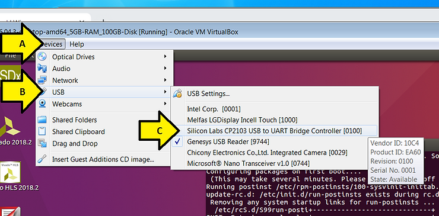

13\. Run minicom by typing **minicom** in a terminal

Note: exit minicom by typing **Control-a x**

You should see

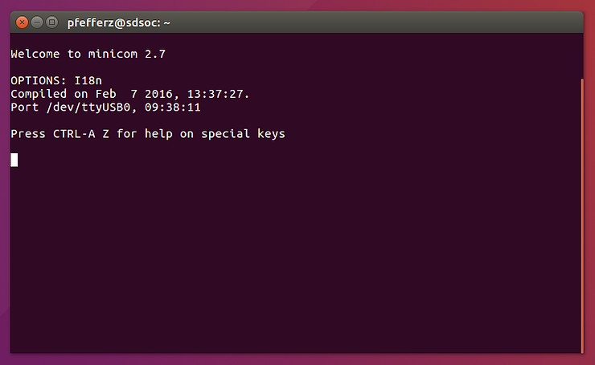

14\. Power on the ZC702

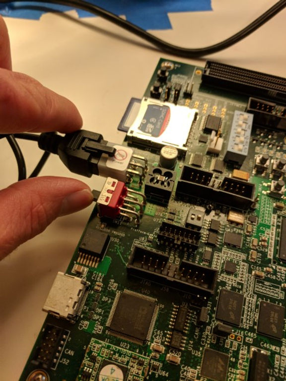

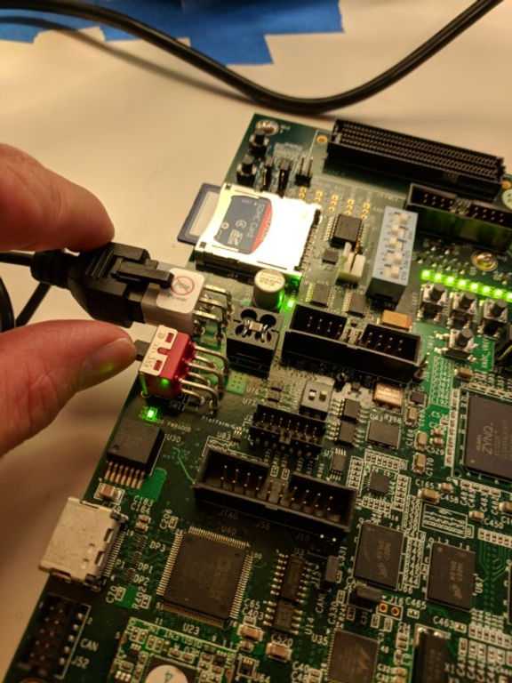

You should see output in the minicom terminal end with:

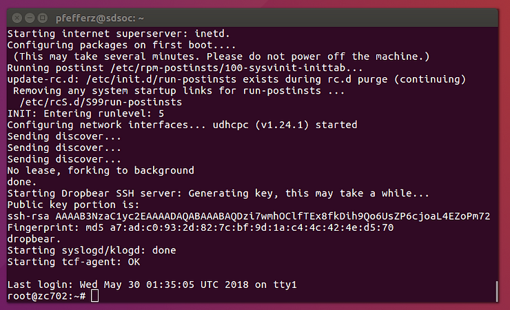

Full output is \[[<u>here</u>](https://docs.google.com/document/d/1vJCOU3q8UvSZXjPg3RFywyreXuI8b9xTKY-l-nl1Qoo/edit?usp=sharing)\].

15\. Type **/mnt/lab1.elf**

You should see the :

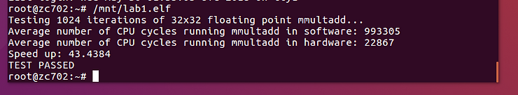

Congratulations! You completed Lab 1 of the SDSoC tutorial on the ZC702.

Share this post if you feel like it would benefit others!

**<u>Reference</u>**

SDSoC Environment Tutorial: Introduction - Lab 1: Introduction to the SDSoC Development Environment at \[[<u>link</u>](https://github.com/Xilinx/SDSoC-Tutorials/blob/master/getting-started-tutorial/lab-1-introduction-to-the-sdsoc-development-environment.md)\]