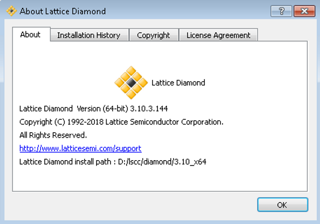

# Lattice Diamond 3.10 SP3 File Extensions

This post lists all the file extensions used by Lattice Diamond 3.10 SP3.

**<u>File Extension: File Use</u>**

\_sc: Schematic Editor log file

\_sy: Symbol Editor log file

\_wt: Waveform Editor Viewer log file

\_wv: Waveform Viewer log file

.asc: ASCII schematic file

.asy: ASCII symbol file

.ed\*: EDIF netlist

.err: Error output file

.fp0, .fp1: ORCAstra configuration file

.fpm: ORCAstra macro file

.his: Waveform Viewer history file

.ipx: Manifest file. This file is loaded into IPexpress so that modifications can be made to the module.

.lci: Constraint file

.lco: Constraint output from the Fitter (such as the post-fit pinouts)

.lct: Temporary working copy of the constraint file

.ldc: Lattice synthesis constraint file

.ldf: Lattice Diamond project file

.lpc: Lattice parameter configuration file created with IPexpress in ispLEVER

.lpf: Logical preference file

.nam: Binary waveform name file

.pcf: Power Calculator project file

.pin: Netlist file for generic netlist by pin

.rva: Reveal Analyzer file

.rvl, .rvs: Reveal Inserter project file

.sch: Schematic Editor files

.sty: Lattice Diamond strategy file

.sym: Symbol Editor file

.syn: ispLEVER project file (reserved only when importing an ispLEVER project into Lattice Diamond)

.spf: Lattice Diamond Simulation Wizard file

.tpf: Lattice Diamond Simulation timing preference file

.vis: ORCAstra custom Visual Window definition

.wav: Waveform Viewer waveforms and trigger information

.wdl: Waveform Editor display file

.wet: Waveform Editor database

**<u>References</u>**

-   File present in the install at: lscc/diamond/3.10\_x64/docs/webhelp/eng/index.htm#page/User%2520Guides%2FManaging%2520Projects%2Freserved\_file\_names.htm%23ww1113352
    
-   About Lattice Diamond clipped from Lattice Diamond