# Lattice Semiconductor's "senseAI": Trascript, Screenshots & Commentary

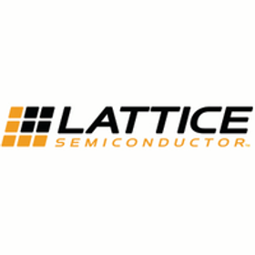

This post presents a transcript + screenshots of "senseAI" from Lattice Semiconductor. It was built to provide an easy reference to the information presented and to allow commentary to be added inline with the presentation.

The original video can be found \[[<u>here</u>](http://files.latticesemi.com/finalVids/Deepak_sensAI_EN.mp4)\]\[[<u>YouTube</u>](https://youtu.be/atEe56CPhyo)\].

The transcript is available at \[[<u>link</u>](https://drive.google.com/open?id=1aU69DPMQh8HOlk4QT9rTorZhFPAt2-tV)\].

**<u>Transcript &amp; Screenshots</u>**

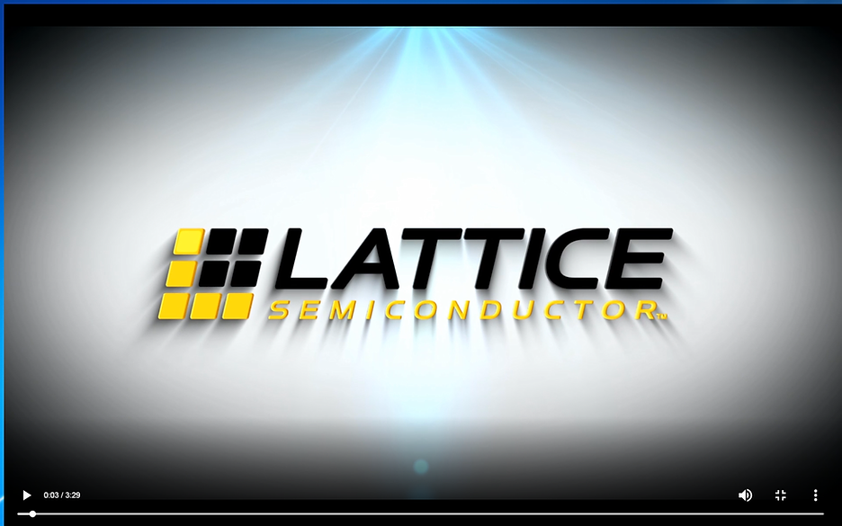

(00:05) Hi, I'm Deepak Boppana Senior Director of Marketing at Lattice semiconductor. Are you looking to integrate AI into your edge device but only have a few milliwatts of power consumption budget? Are you looking for a flexible inferencing solution that seamlessly fits into your existing design with legacy interface support? Are you looking to make your device smarter but only have a few dollars of additional BOM cost added? If any of these interest you, you need to check out the Lattice senseAI.

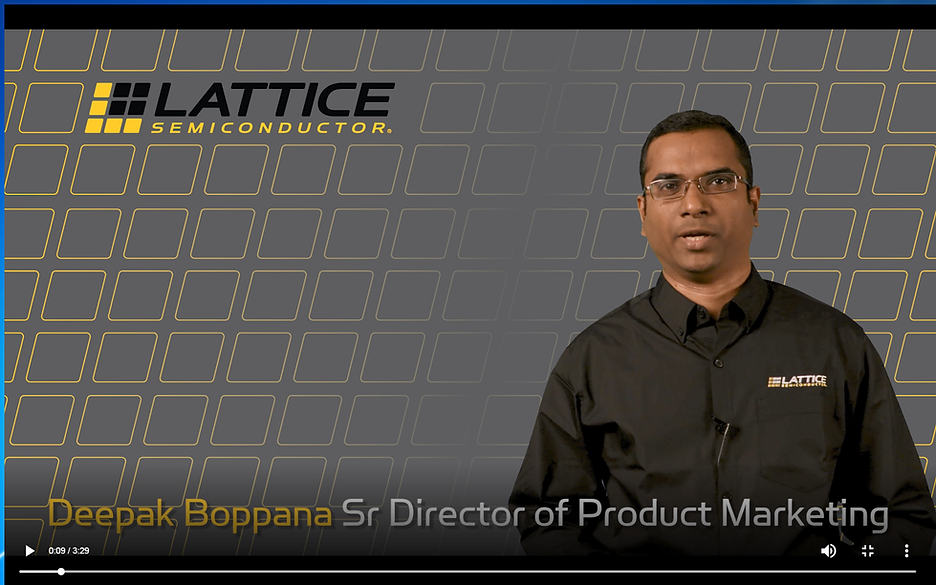

(0:36) Lattice senseAI is a complete technology stack for implementing ultra low power, flexible influencing at the edge.

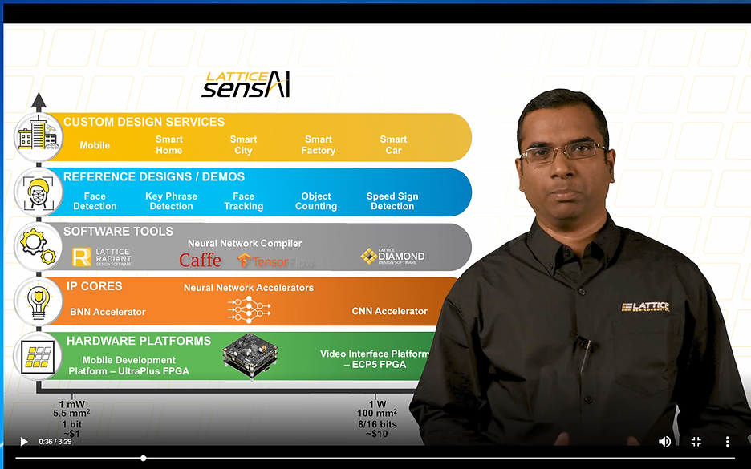

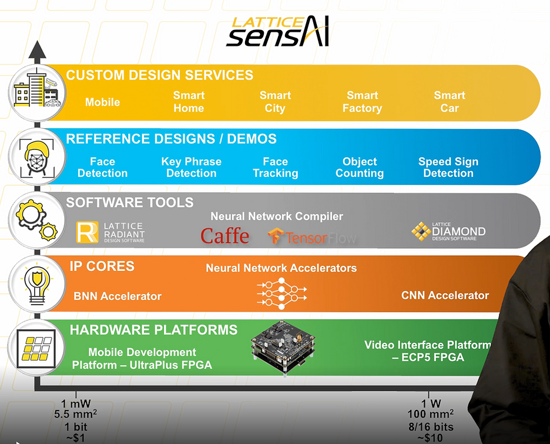

(0:43) Lattice senseAI solutions consume from under one milliwatt to one watt of power consumption, are offered in package sizes from 5.5 to 100 millimeters square. Are customizable for performance, accuracy and legacy interface support. All this while running on production priced FPGAs from the $1 to $10 range. With Lattice senseAI, you're essentially getting all the benefits of an ASIC with the time to market and flexibility benefits of FPGA.

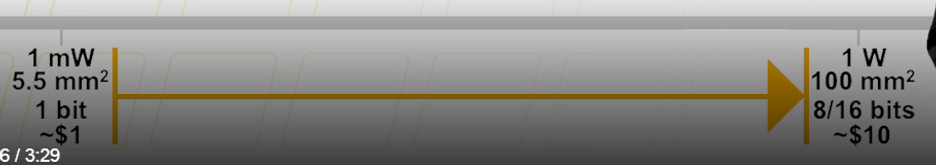

(1:24) To help simplify and accelerate the integration of AI in the Lattice FPGA's the sense AI stack includes modular hardware platforms including the mobile development platform based on the ICE UltraPlus FPGA that comes with a variety of onboard sensors and the video interface platform based on the ECP5 FPGA including the award winning embedded vision development kit.

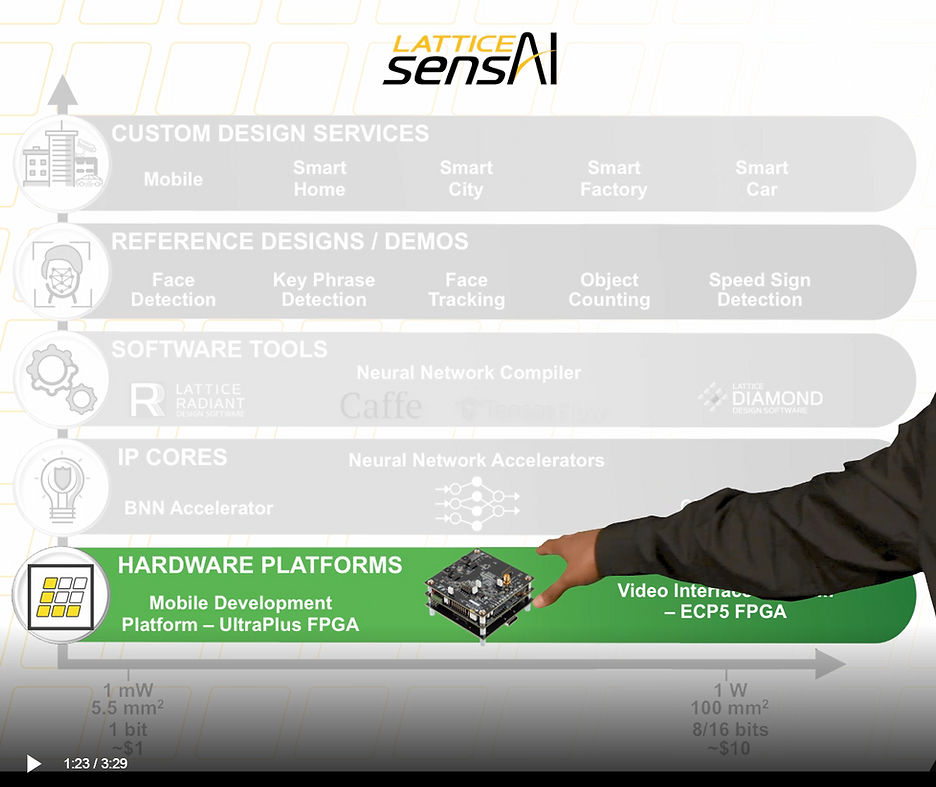

(1:44) Now in addition to the kits, the SenseAI stack includes new neural network accelerator IP cores with custom quantization support including the binarized neural network optimized for ICE UltraPlus FPGAs with with one bit quantization support and the convolutional neural network optimized for ECP5 FPGA with support for 1, 8 and 16-bit quantization.

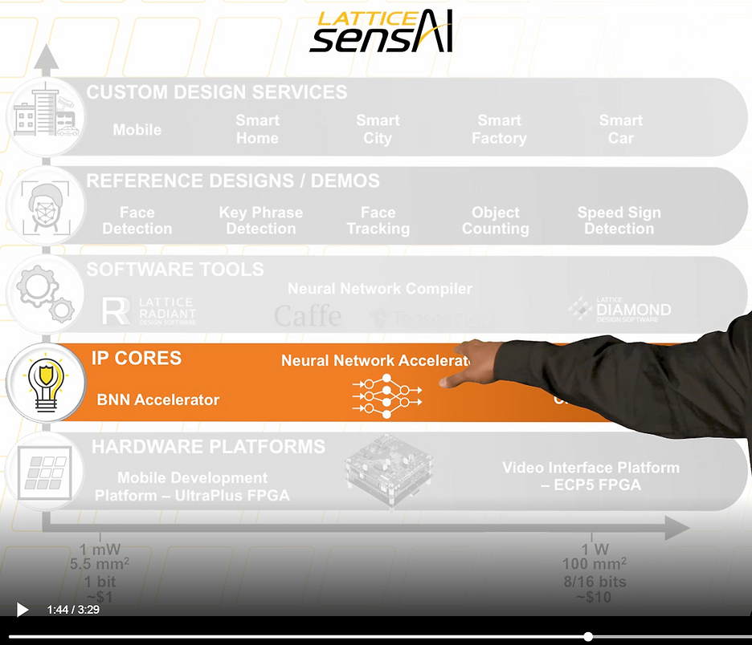

(2:11) Now in addition to the kits and the IP, the senseAI stack also includes new easy to use software tools including the neural network compiler tool that interfaces with industry standard frameworks such as Caffe and TensorFlow and enables rapid design space exploration to make trade offs between power, performance and accuracy and all this without needing any prior RTL expertise.

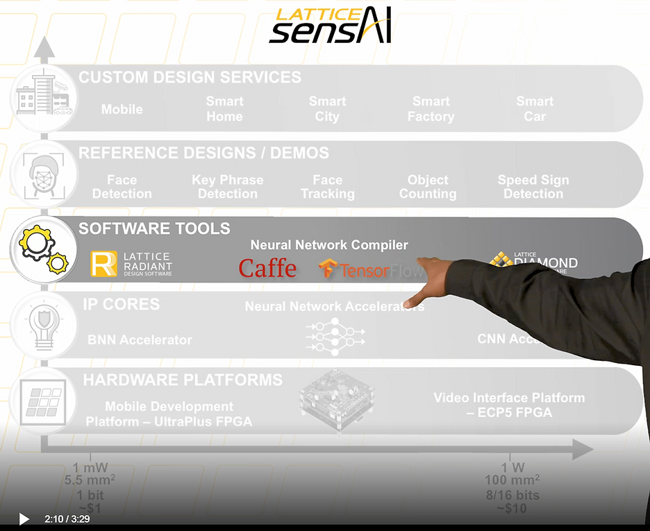

(2:32) Now to bring all this together. The Lattice senseAI stack also includes up to 5 new reference designs and demos, including the face detection and key phrase detection demos on ICE UltraPlus FPGAs consuming under five milliwatts of power consumption and the face tracking, object counting and speed sign detection demos on the ECP5 FPGA consuming under one watt of power consumption.

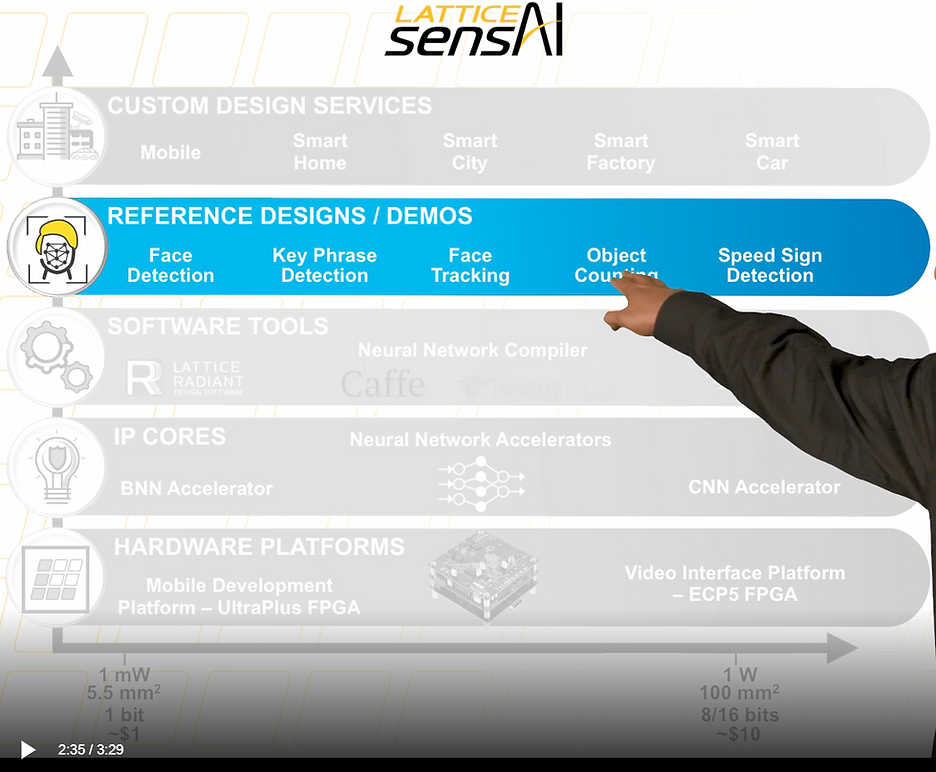

(2:58) And last but not the least, the Lattice senseAI stack also includes an ecosystem of partners to deliver custom design services for applications including mobile, smart home, smart city, smart factory, and smart car applications.

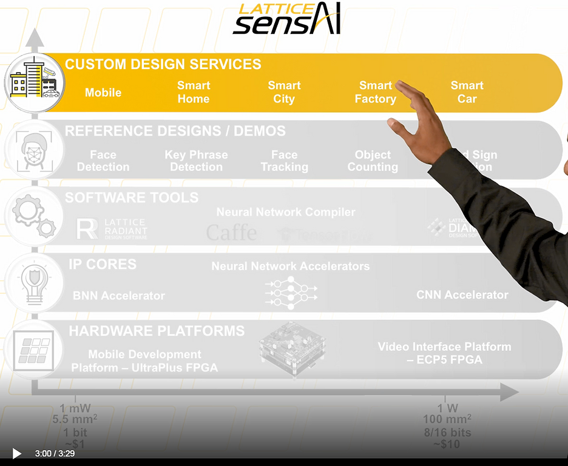

(3:12) To summarize Lattice senseAI will accelerate integration of AI into your edge device.

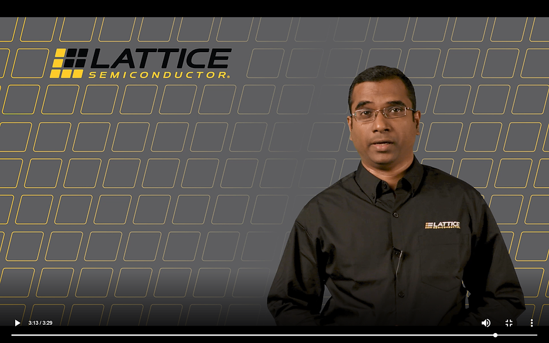

(3:18) Check out more details on our website and download the documentation and designs to get started. Thank you for watching.

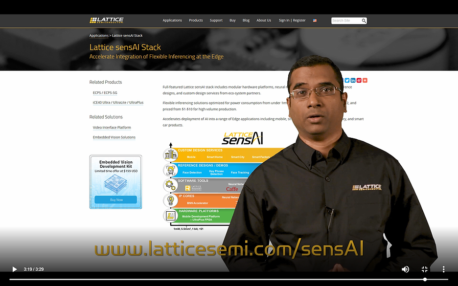

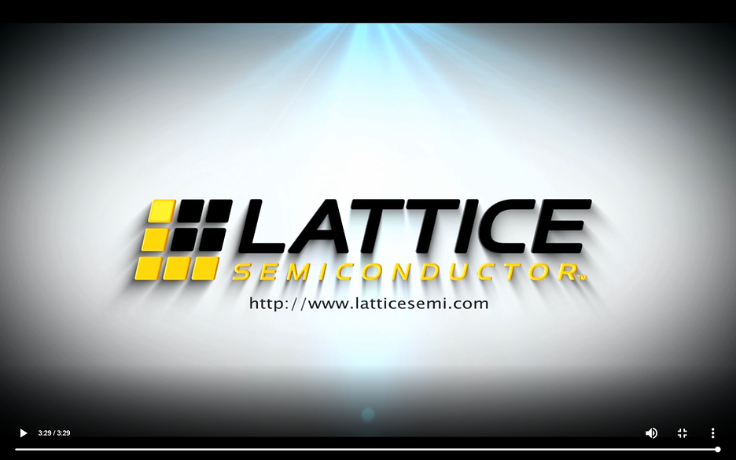

**<u>More Info</u>**

-   But what \*is\* a Neural Network? @ \[[<u>link</u>](https://youtu.be/aircAruvnKk)\]
    

**<u>References</u>**

-   Lattice logo from \[[<u>link</u>](https://www.linkedin.com/company/lattice-semiconductor/)\]
    
-   Transcript from [<u>temi.com</u>](https://www.temi.com/)