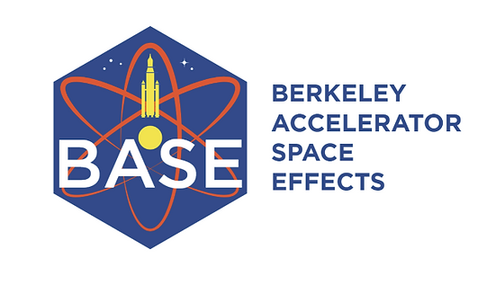
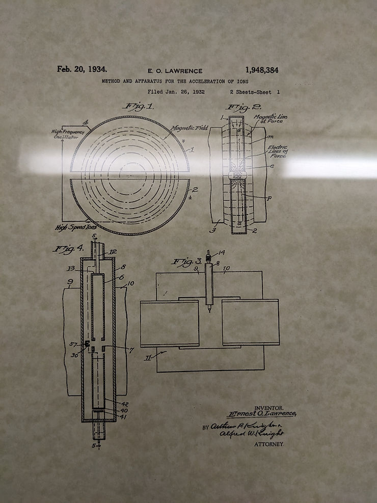
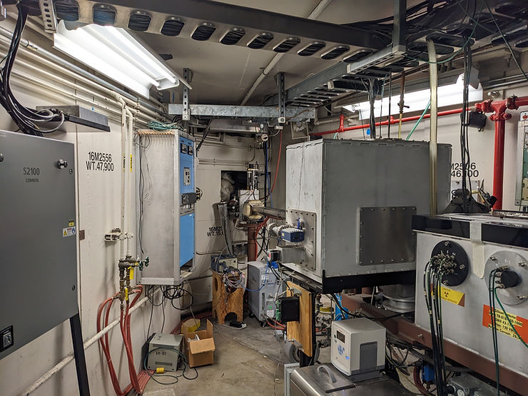
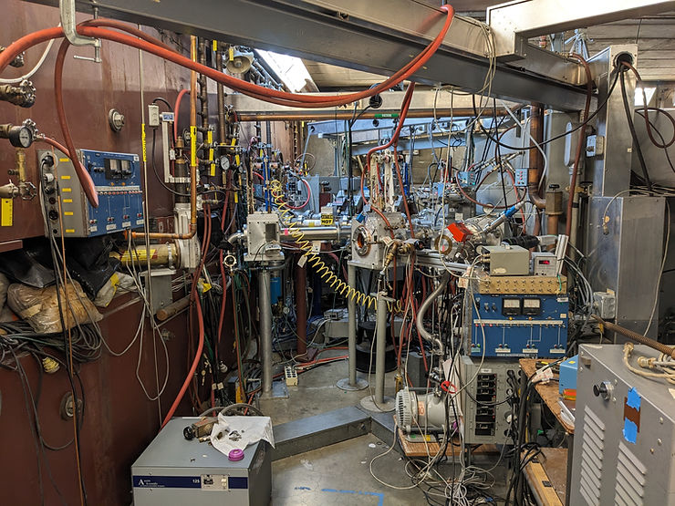
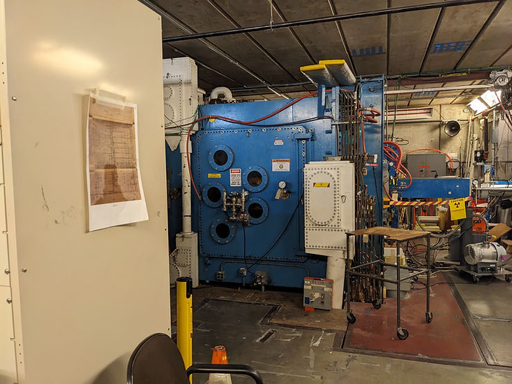
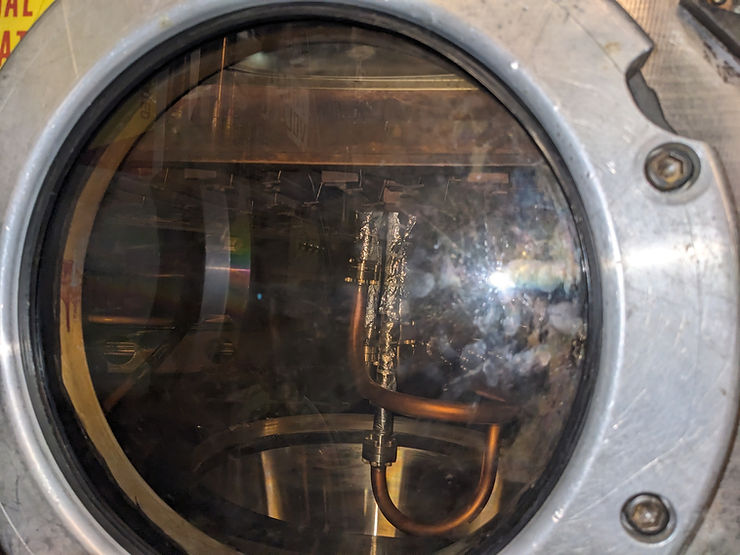
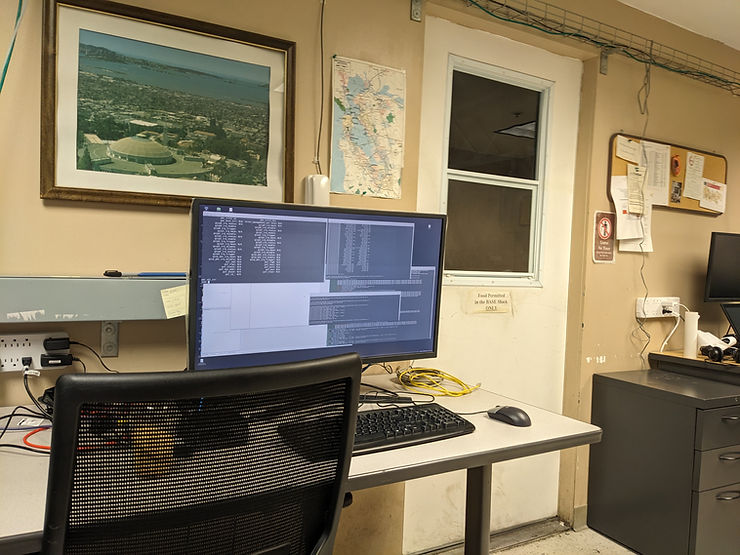
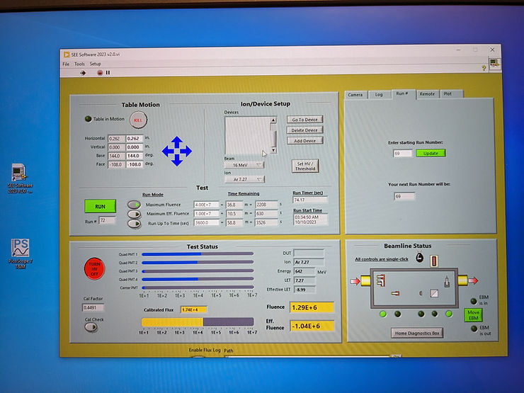
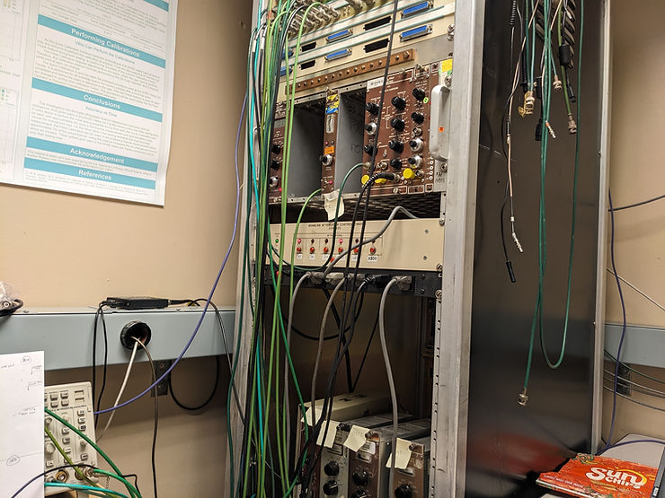

# Lawrence Berkeley National Lab 88-Inch Cyclotron Berkeley Accelerator Space Effects Facility Photos

This post shows some Lawrence Berkeley National Lab 88-Inch Cyclotron Berkeley Accelerator Space Effects Facility (BASE) photos I took during two recent trips to test AMDs Versal with the Xilinx Radiation Test Consortium.

###### Cyclotron Patent

###### Cave

One of the "Caves" Where the Versal Was Exposed to the Beam

###### Cyclotron Accelerator Room

###### 88-Inch Cyclotron RF

###### Inside the Cyclotron Accelerator

###### Cyclotron Control Room

Inside the "Love Shack" aka the Control Room

###### Cyclotron Beam Control Panel

###### Cyclotron Beamline Attenuator Control Chassis

###### More Info

See https://cyclotron.lbl.gov/ for more information.