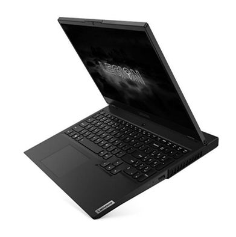

# Lenovo Legion 5 15IMH05H Part Number 81Y6000EUS Factory ID JVHFC1 GeForce RTX 2060 Intel HM470

This post lists original and saved versions of Lenovo Legion 5 15IMH05H Part Number 81Y6000EUS Factory ID JVHFC1 GeForce RTX 2060 Intel HM470 documentation.

#### Lenovo Legion 5 15IMH05H Part Number 81Y6000EUS

###### Specification

-   [<u>https://psref.lenovo.com/product/legion/lenovo_legion_5_15imh05h?tab=spec</u>](https://psref.lenovo.com/product/legion/lenovo_legion_5_15imh05h?tab=spec)
    
-   [<u>https://drive.google.com/file/d/1ksVnIAe9Jayvt0znyqVD7g51OsGhsu_f/view?usp=sharing</u>](https://drive.google.com/file/d/1ksVnIAe9Jayvt0znyqVD7g51OsGhsu_f/view?usp=sharing)
    

###### Setup Guide

-   [<u>https://download.lenovo.com/consumer/mobiles_pub/legion_5_15_17_sg_en_da_fi_nb_sv_202004.pdf</u>](https://download.lenovo.com/consumer/mobiles_pub/legion_5_15_17_sg_en_da_fi_nb_sv_202004.pdf)
    
-   [<u>https://drive.google.com/file/d/1l9NKiD51GHxLyzZqJU46NAUVLPTSS30p/view?usp=sharing</u>](https://drive.google.com/file/d/1l9NKiD51GHxLyzZqJU46NAUVLPTSS30p/view?usp=sharing)  
    

###### Lenovo Legion 5 15IMH05H Hardware Maintenance Manual

-   [<u>https://download.lenovo.com/consumer/mobiles_pub/lenovo_legion_5_lenovo_legion_5p_hmm_v1.1.pdf</u>](https://download.lenovo.com/consumer/mobiles_pub/lenovo_legion_5_lenovo_legion_5p_hmm_v1.1.pdf)
    
-   [<u>https://drive.google.com/file/d/1kn1GA3lyiPwbYoYqKm-1PiztQ9qVaFpL/view?usp=sharing</u>](https://drive.google.com/file/d/1kn1GA3lyiPwbYoYqKm-1PiztQ9qVaFpL/view?usp=sharing)
    

###### Lenovo Legion 5 15IMH05H PSREF (Product Specifications Reference)

-   [<u>https://psref.lenovo.com/syspool/Sys/PDF/Legion/Lenovo_Legion_5_15IMH05H/Lenovo_Legion_5_15IMH05H_Spec.pdf</u>](https://psref.lenovo.com/syspool/Sys/PDF/Legion/Lenovo_Legion_5_15IMH05H/Lenovo_Legion_5_15IMH05H_Spec.pdf)
    
-   [<u>https://drive.google.com/file/d/1ksVnIAe9Jayvt0znyqVD7g51OsGhsu_f/view?usp=sharing</u>](https://drive.google.com/file/d/1ksVnIAe9Jayvt0znyqVD7g51OsGhsu_f/view?usp=sharing)
    

###### Lenovo\_Legion\_5\_15IMH05H multi model 202404071148

-   [<u>https://psref.lenovo.com/product/legion/lenovo_legion_5_15imh05h?tab=spec</u>](https://psref.lenovo.com/product/legion/lenovo_legion_5_15imh05h?tab=spec)
    
-   [<u>https://docs.google.com/spreadsheets/d/1l-lQ0LnH9fvMw2dtaxPlrHLmR27XSABV/edit?usp=sharing&amp;ouid=104422661029399872488&amp;rtpof=true&amp;sd=true</u>](https://docs.google.com/spreadsheets/d/1l-lQ0LnH9fvMw2dtaxPlrHLmR27XSABV/edit?usp=sharing&ouid=104422661029399872488&rtpof=true&sd=true)
    

###### Lenovo Legion 5 15IMH05H 81Y6000EUS PSREF (Product Specifications Reference)

-   [<u>https://psref.lenovo.com/Detail/Legion/lenovo_legion_5_15imh05h?M=81Y6000EUS</u>](https://psref.lenovo.com/Detail/Legion/lenovo_legion_5_15imh05h?M=81Y6000EUS)
    
-   [<u>https://psref.lenovo.com/syspool/TempFile/cache/C90F3578-FE38-4B64-9518-B80D5BDE155E/Lenovo_Legion_5_15IMH05H_81Y6000EUS.pdf</u>](https://psref.lenovo.com/syspool/TempFile/cache/C90F3578-FE38-4B64-9518-B80D5BDE155E/Lenovo_Legion_5_15IMH05H_81Y6000EUS.pdf)
    
-   [<u>https://drive.google.com/file/d/1l1t5VXKPTrja15ty37DHZ0DeAQ-sdtXA/view?usp=sharing</u>](https://drive.google.com/file/d/1l1t5VXKPTrja15ty37DHZ0DeAQ-sdtXA/view?usp=sharing)
    

###### Lenovo Legion 5 Spec Table

-   [<u>https://docs.google.com/spreadsheets/d/1l2Axwj40-FWLD99cOyQ3bzFE_RZpqBH6/edit?usp=sharing&amp;ouid=104422661029399872488&amp;rtpof=true&amp;sd=true</u>](https://docs.google.com/spreadsheets/d/1l2Axwj40-FWLD99cOyQ3bzFE_RZpqBH6/edit?usp=sharing&ouid=104422661029399872488&rtpof=true&sd=true)
    

###### Lenovo Legion 5 15IMH05H 81Y6000EUS Specification

**PERFORMANCE**

Processor

-   Intel® Core™ i7-10750H (6C / 12T, 2.6 / 5.0GHz, 12MB)
    

Graphics

-   NVIDIA® GeForce RTX™ 2060 6GB GDDR6
    

Chipset

-   Intel® HM470
    

Memory

-   2x 8GB SO-DIMM DDR4-2933
    

Memory Slots

-   Two DDR4 SO-DIMM slots, dual-channel capable
    

Max Memory

-   Up to 32GB DDR4-2933 offering
    

Storage

-   1TB SSD M.2 2280 PCIe® 3.0x4 NVMe® + Empty HDD Bay
    

Storage Support

-   HDD/SSD mode: up to two drives, 1x 2.5" HDD + 1x M.2 SSD
    
-   2.5" HDD up to 2TB
    
-   M.2 2242 SSD up to 512GB
    
-   M.2 2280 SSD up to 1TB
    

Storage Slot

-   HDD/SSD mode: one 2.5" drive slot + one M.2 slot
    
-   One 2.5" drive slot, supports 2.5" SATA HDD
    
-   One M.2 2280 PCIe® Gen 3x4 slot, supports M.2 2242/2280 SSD
    

Card Reader

-   None
    

Optical

-   None
    

Audio Chip

-   High Definition (HD) Audio, Realtek® ALC3287 codec
    

Speakers

-   Stereo speakers, 2W x2, Dolby® Atmos® for gaming, Harman Speakers
    

Camera

-   720p with Privacy Shutter
    

Microphone

-   2x, Array
    

Battery

-   Integrated 60Wh
    

Power Adapter

-   230W Slim Tip (3-pin)
    

**DESIGN**

Display

-   15.6" FHD (1920x1080) IPS 500nits Anti-glare, 240Hz, 100%
    
-   sRGB, Dolby® Vision®, DC dimmer
    

Touchscreen

-   None
    

Keyboard

-   White Backlit, English (US)
    

Touchpad

-   Buttonless Mylar® surface multi-touch touchpad
    

Case Color

-   Phantom Black
    

Surface Treatment

-   Painting
    

Case Material

-   PC + ABS (Top), PC + ABS (Bottom)
    

Dimensions (WxDxH)

-   363.06 x 259.61 x 23.57-26.1 mm (14.3 x 10.22 x 0.93-1.03 inches)
    

Weight

-   2.46 kg (5.42 lbs)
    

**SOFTWARE**

Operating System

-   Windows® 10 Home 64, English
    

Bundled Software

-   Office Trial
    

**CONNECTIVITY**

Ethernet

-   100/1000M
    
-   WLAN + Bluetooth®
    
-   Wi-Fi® 6 11ax, 2x2 + BT5.0
    

Standard Ports

-   1x USB-C® 3.2 Gen 1 (support data transfer and DisplayPort™ 1.2)
    
-   1x USB 3.2 Gen 1 (Always On)
    
-   3x USB 3.2 Gen 1
    
-   1x HDMI® 2.0
    
-   1x Headphone / microphone combo jack (3.5mm)
    
-   1x Ethernet (RJ-45)
    
-   1x Power connector
    

**SECURITY & PRIVACY**

Security Chip

-   Firmware TPM 2.0
    

Fingerprint Reader

-   None
    

Physical Locks

-   Kensington® Security Slot™
    

Other Security

-   Camera privacy shutter
    

**SERVICE**

Base Warranty

-   1-year, Depot
    

Included Upgrade

-   1Y Legion Ultimate Support IdeaPad® 5 embedded (5WS0Y99554)
    

**ACCESSORIES**

Bundled Accessories

-   None
    

**CERTIFICATIONS**

Green Certifications

-   ErP Lot 3
    
-   RoHS compliant
    

**MODEL**

-   TopSeller :
    
-   No Announce Date : 2020-07-14
    
-   EAN / UPC / JAN : 194778313919
    
-   End of Support : 2026-05-27
    

###### GeForce RTX Graphics Cards

-   [<u>https://www.nvidia.com/en-us/geforce/news/gfecnt/nvidia-geforce-rtx-2060/</u>](https://www.nvidia.com/en-us/geforce/news/gfecnt/nvidia-geforce-rtx-2060/)
    

###### Compare GeForce RTX 20 Series Specs

-   [<u>https://www.nvidia.com/en-us/geforce/graphics-cards/compare/?section=compare-20</u>](https://www.nvidia.com/en-us/geforce/graphics-cards/compare/?section=compare-20)
    
-   [<u>https://docs.google.com/spreadsheets/d/1K39u0E7kRojsyWBZozazS4hFga9RDA3KufaN5q9KBPQ/edit?usp=sharing</u>](https://docs.google.com/spreadsheets/d/1K39u0E7kRojsyWBZozazS4hFga9RDA3KufaN5q9KBPQ/edit?usp=sharing)
    

###### NVIDIA Turing GPU Architecture

-   [<u>https://images.nvidia.com/aem-dam/en-zz/Solutions/design-visualization/technologies/turing-architecture/NVIDIA-Turing-Architecture-Whitepaper.pdf</u>](https://images.nvidia.com/aem-dam/en-zz/Solutions/design-visualization/technologies/turing-architecture/NVIDIA-Turing-Architecture-Whitepaper.pdf)
    
-   [<u>https://drive.google.com/file/d/1kkbHzvqPgswB-4D6ELuLfscy5y6Q_r60/view?usp=sharing</u>](https://drive.google.com/file/d/1kkbHzvqPgswB-4D6ELuLfscy5y6Q_r60/view?usp=sharing)
    

###### Intel® HM470 Chipset

-   [<u>https://www.intel.com/content/www/us/en/products/docs/processors/core/core-technical-resources.html</u>](https://www.intel.com/content/www/us/en/products/docs/processors/core/core-technical-resources.html)
    

###### Intel® HM470 Specifications

-   [<u>https://drive.google.com/file/d/1lQlClCL6vO8V-gNblhfNLwXBPbvnkTjY/view?usp=sharing</u>](https://drive.google.com/file/d/1lQlClCL6vO8V-gNblhfNLwXBPbvnkTjY/view?usp=sharing)
    

###### Intel® HM470 Ordering & Compliance

-   [<u>https://drive.google.com/file/d/1lGFYzZmdUm4BWaxMyppX07RfSba0sp_h/view?usp=sharing</u>](https://drive.google.com/file/d/1lGFYzZmdUm4BWaxMyppX07RfSba0sp_h/view?usp=sharing)
    

###### Intel® HM470 Compatible Products

-   [<u>https://drive.google.com/file/d/1lPw6y6aZhDbZxeFhJF-XNIFfadi4kzQG/view?usp=sharing</u>](https://drive.google.com/file/d/1lPw6y6aZhDbZxeFhJF-XNIFfadi4kzQG/view?usp=sharing)
    
-   [<u>https://www.intel.com/content/www/us/en/products/sku/203697/intel-hm470-chipset/specifications.html</u>](https://www.intel.com/content/www/us/en/products/sku/203697/intel-hm470-chipset/specifications.html)