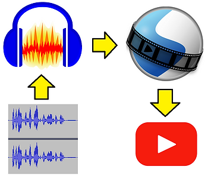

# Links and Tips to Create a Transcript from Online Video

This post presents some links and tips on creating a transcript from an online video that doesn't include one. It uses opensource tools that run on Windows, Mac and Linux.

**Tools**

To create a transcript of an online video that doesn't include one you can use the following tools:

-   Audacity @ \[[link](http://www.audacityteam.org/download/)\]
    
-   OpenShot Video Editor @ \[[link](http://www.openshot.org/download/)\]
    
-   YouTube
    

**Steps**

1\. Record the audio in Audacity [[instructions](http://www.wikihow.com/Record-Audio-on-a-PC)]

2\. Add the audio to a movie in OpenShot, you can also add an image (if you want a "sharp" image use a 1280×720 resolution image for 720p, 1920×1080 for 1080p)

3\. Export the MP4 from OpenShot

4\. Upload the MP4 to YouTube and download the transcript (note below if YouTube doesn't auto transcribe)

**YouTube Didn't Auto-Transcribe**

If YouTube doesn't auto transcribe you can use tools listed at \[[link](http://www.movavi.com/learning-portal/best-speech-to-text-software.html)\]:

-   Dragon Home \[[link](http://www.nuance.com/dragon/dragon-for-pc/home-edition.html)\]
    
-   IBM Speech to Text \[[link](http://www.ibm.com/watson/services/speech-to-text/)\]
    
-   Temi \[[link](http://www.temi.com/)\] (**have used**)
    
-   Braina Pro \[[link](http://www.brainasoft.com/braina/download.html)\]
    
-   Transcribe \[[link](http://transcribe.wreally.com/)\]
    

Take a look at this answer for YouTube transcription \[[link](http://support.google.com/youtube/answer/6373554?hl=en)\].

**References**

-   Audacity icon from \[[link](http://commons.wikimedia.org/wiki/File:Audacity_Logo.svg)\]
    
-   OpenShot icon from \[[link](http://en.wikipedia.org/wiki/File:OpenShot_logo.svg)\]
    
-   YouTube icon from \[[link](http://www.youtube.com/yt/about/brand-resources/#logos-icons-colors)\]