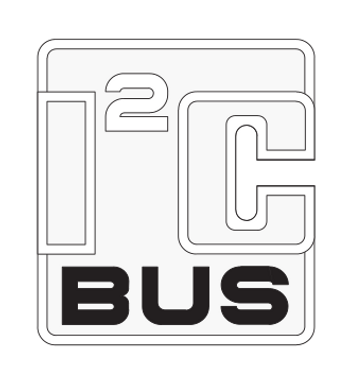

# Links to the I2C-bus Spec Version 2.1 & Xilinx's AXI IIC Bus Interface v2.0 LogiCORE IP

This post lists links to the **Philips Semiconductors I2C-bus Specification, Version 2.1, January 2000** as referenced in **Xilinx's AXI IIC Bus Interface v2.0 LogiCORE IP Product Guide Vivado Design Suite PG090 October 5, 2016** and links to the Xilinx LogiCORE product guide. It was written

**Note:** This post lists a backup location to Version 2.1 of the I2C specification at Berkely not a link to the specification at NXP (which owns Philips).

**<u>Links</u>**

-   Philips Semiconductors I2C-bus Specification, Version 2.1, January 2000 \[[<u>backup link 1</u>](http://www-inst.eecs.berkeley.edu/~cs150/Documents/I2C_BUS_SPECIFICATION_3.pdf)\]\[[<u>backup link 2</u>](https://drive.google.com/file/d/17GE-hs8zOU67_C4izxUk5XCy-AKGJl6v/view?usp=sharing)\]
    
-   Xilinx's AXI IIC Bus Interface v2.0 LogiCORE IP Product Guide Vivado Design Suite PG090 October 5, 2016 \[[<u>link</u>](https://www.xilinx.com/support/documentation/ip_documentation/axi_iic/v2_0/pg090-axi-iic.pdf)\]\[[<u>backup link</u>](https://drive.google.com/file/d/1nML_5m1Z4BPE7wdQy983swhYy3V-f-Di/view?usp=sharing)\]
    

**<u>Reference</u>**

Image from \[[<u>link</u>](https://en.wikipedia.org/wiki/I%C2%B2C)\]
