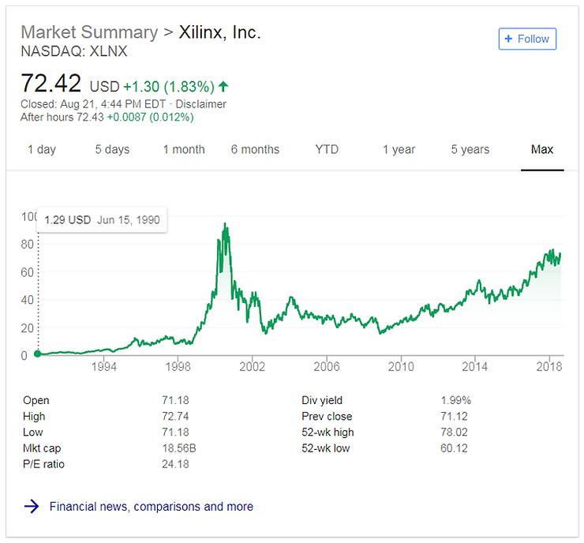

# Links to Xilinx Annual Reports from 1995

**Annual Reports**

1995 at [[link](http://media.corporate-ir.net/media_files/irol/75/75919/reports/annual95/home.htm)]

1996 at [[link](http://media.corporate-ir.net/media_files/irol/75/75919/reports/annual96/home.htm)]

1997 at [[link](http://media.corporate-ir.net/media_files/irol/75/75919/reports/annual97/home.htm)]

1998 at [[link](http://www.corporate-ir.net/media_files/NSD/XLNX/annual98/index.htm)]

1999 at [[link](http://www.corporate-ir.net/media_files/IROL/75/75919/reports/annual99/index.htm)]

2000 at [[link](http://investor.xilinx.com/static-files/ce920600-c2a9-4044-b921-ce6212107cc7)] PDF's start

2001 at [[link](http://investor.xilinx.com/static-files/a3d5404a-f6ae-4446-8ea9-239bfd81ff68)]

2002 at [[link](http://media.corporate-ir.net/media_files/irol/75/75919/reports/annual2002/ar02/index.htm)] Only available in HTML

2003 at [[link](http://investor.xilinx.com/static-files/3266328c-a6e6-4048-bf45-486b984e8dbd)] 

2004 at [[link](http://investor.xilinx.com/static-files/37064649-ac44-4eb1-bc60-94b69e5dc2c4)] Annual Report and Proxy

2005 at [[link](http://media.corporate-ir.net/media_files/IROL/75/75919/reports/annual2005/XLNX_AR_05/index.htm)] Only available in HTML

2006 at [[link](http://media.corporate-ir.net/media_files/irol/75/75919/ar2006/ar2006/XILINX_AR_06/index.htm)] Only available in HTML

2007 at [[link](http://media.corporate-ir.net/media_files/irol/75/75919/XLNX_AR_07/index.htm)] Only available in HTML

2008 at [[link](http://www.shareholder.com/visitors/dynamicdoc/document.cfm?documentid=2162&companyid=XLNX&page=1&pin=&language=EN&resizethree=yes&scale=100&zid=)] Only available in HTML. Starts being listed as **Form 10-K And Proxy**, 

2009 at [[link](http://investor.xilinx.com/static-files/194f9dbf-4479-449c-bacf-6fd21e76eec6)] 

2010 at [[link](http://investor.xilinx.com/static-files/57753e0c-4cfd-4e70-b44f-c03aecc34056)] 

2011 at [[link](http://investor.xilinx.com/static-files/13f9542d-173d-48dd-992c-5ed0f6c898c1)]

2012 at [[link](http://investor.xilinx.com/static-files/6932a02a-ac4d-411c-a03f-c0ca11e5c565)]

2013 at [link] The [[link](http://investor.xilinx.com/2013AR/index.html)] listed at [[link](http://investor.xilinx.com/download-library?field_nir_tags_target_id[0]=4031&promote=All&items_per_page=10&page=1)] is dead.

2014 at [[link](http://investor.xilinx.com/static-files/adae2e12-6768-41eb-a5da-9f81f39602f3)]

2015 at [[link](http://investor.xilinx.com/static-files/76b70f3c-47d7-43aa-9a54-be2c9296d887)]

2016 at [[link](http://investor.xilinx.com/static-files/99525c41-e41e-4ead-a3ec-601190b366ad)]

2017 at [[link](http://investor.xilinx.com/static-files/b429084b-0ad3-4f0a-a427-77fe7a15858f)]

**Note:** "A Form 10-K is an annual report required by the U.S. Securities and Exchange Commission (SEC), that gives a comprehensive summary of a company's financial performance." from Form 10-K Wiki

**XLNX as of Aug 21st 2018**

**References**

-   Form 10-K at \[[link](http://en.wikipedia.org/wiki/Form_10-K)\]
    
-   Graphic from XLNX search on Google
    
-   Xilinx investor library at \[[link](http://investor.xilinx.com/download-library)\]
    
-   Logo via [https://twitter.com/xilinxinc](http://twitter.com/xilinxinc) at \[[link](http://pbs.twimg.com/profile_images/535545777020338176/pEWdIYq__400x400.png)\].