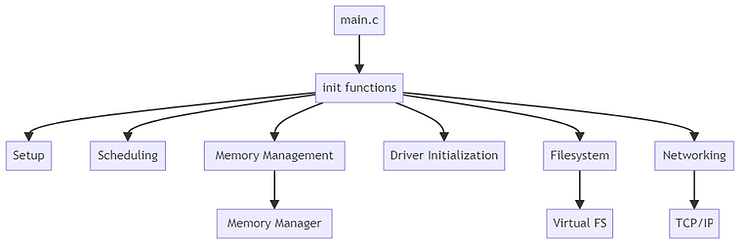

# Linux Kernel: main.c

#### Diagram

Each box in the main.c \[1\] diagram \[2\] represents a critical aspect of the kernel's initialization process, ensuring the system is ready to execute processes, manage resources, and interact with hardware effectively.

#### Detail

###### main

\- **Purpose**: The entry point for the Linux kernel initialization.

\- **Key Activities**:

\- Initialize kernel data structures.

\- Parse kernel command-line arguments.

\- Set up the kernel's running environment, including memory, processor, and early hardware initialization.

###### init functions

\- **Purpose**: Call various initialization functions to set up different kernel subsystems.

\- **Key Activities**:

\- Sequentially invokes specific initialization routines for subsystems such as memory management, device drivers, filesystems, and networking.

###### Setup

\- **Purpose**: Handle early kernel setup tasks.

\- **Key Activities**:

\- Detect and configure the CPU and its features.

\- Identify available RAM and set up memory zones.

\- Initialize kernel data structures and prepare the environment for further subsystem initialization.

###### Scheduling

\- **Purpose**: Initialize the process scheduler.

\- **Key Activities**:

\- Set up the scheduler data structures and algorithms (like CFS - Completely Fair Scheduler).

\- Initialize the idle task for each CPU.

\- Prepare task management structures for process execution.

###### Memory Management

\- **Purpose**: Set up the memory management subsystem.

\- **Key Activities**:

\- Initialize the virtual memory system, including creating the initial memory mappings for the kernel space.

\- Set up page tables and allocate memory for essential kernel structures.

\- Initialize slab allocators and the buddy system for efficient memory allocation.

###### Driver Initialization

\- **Purpose**: Load and initialize device drivers.

\- **Key Activities**:

\- Detect and initialize essential hardware drivers like disk, network, and input/output devices.

\- Set up interrupt handling mechanisms for device drivers.

\- Register device drivers with the kernel's device model.

###### Filesystem

\- **Purpose**: Establish the kernel's filesystem infrastructure.

\- **Key Activities**:

\- Initialize the Virtual File System (VFS) layer to provide a common interface for filesystem operations.

\- Mount the root filesystem and prepare it for use.

\- Load filesystem drivers for supported filesystem types (e.g., ext4, NFS).

###### Networking

\- **Purpose**: Set up the kernel's networking stack.

\- **Key Activities**:

\- Initialize networking data structures and protocols (IP, TCP, UDP, etc.).

\- Configure networking interfaces and set up routing tables.

\- Prepare the network stack to handle incoming and outgoing network packets.

###### Virtual FS

\- **Purpose**: Initialize the Virtual File System (VFS), an abstraction layer over actual filesystems.

\- **Key Activities**:

\- Provide a uniform interface for filesystem operations, allowing the kernel to interact with different filesystems transparently.

\- Manage file descriptors, file objects, and inode objects.

\- Handle filesystem mount points and namespace management.

###### Memory Manager

\- **Purpose**: Manage all memory allocation and usage aspects within the kernel.

\- **Key Activities**:

\- Handle page allocation, page fault handling, and memory paging.

\- Manage kernel and user-space memory separation and protection.

\- Implement memory policies like overcommit handling and memory compaction.

###### References

\[1\] main.c

-   [https://drive.google.com/file/d/1Z5tTO8mJUL8zFEhKMAPTKdkOHS31pUCA/view?usp=sharing](https://drive.google.com/file/d/1Z5tTO8mJUL8zFEhKMAPTKdkOHS31pUCA/view?usp=sharing) 
    
-   [https://github.com/torvalds/linux/blob/master/init/main.c](https://github.com/torvalds/linux/blob/master/init/main.c) @ [<u>https://github.com/torvalds/linux/commit/8001f49394e353f035306a45bcf504f06fca6355</u>](https://github.com/torvalds/linux/commit/8001f49394e353f035306a45bcf504f06fca6355)
    

\[2\] Diagram generated with ChatGPT Diagrams: Show Me main.c