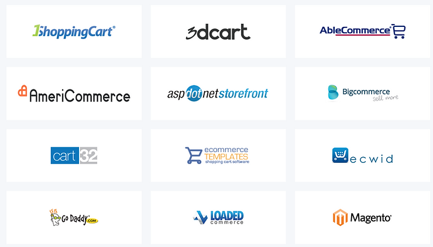
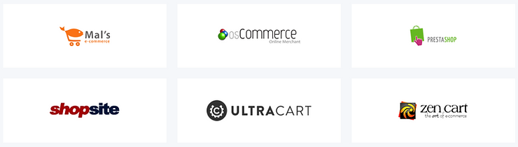

# List of PayPal E-Commerce Solutions

This post lists the links PayPal gives to integrate each e-commerce solution with PayPal.

 

**Links (you'll need to log in to PayPal)** 

[1shoppingcart](http://www.paypal.com/businessdocs/inappdocs/pps#carts/1shoppingcart)

[3dcart](http://www.paypal.com/businessdocs/inappdocs/pps#carts/3dcart)

[ablecommerce](http://www.paypal.com/businessdocs/inappdocs/pps#carts/ablecommerce)

[americommerce ](http://www.paypal.com/businessdocs/inappdocs/pps#carts/americommerce)

[aspdotnetstorefront](http://www.paypal.com/businessdocs/inappdocs/pps#carts/aspdotnetstorefront)

[bigcommerce](http://www.paypal.com/businessdocs/inappdocs/pps#carts/bigcommerce)

[cart32](http://www.paypal.com/businessdocs/inappdocs/pps#carts/cart32)

[ecommercetemplates](http://www.paypal.com/businessdocs/inappdocs/pps#carts/ecommercetemplates)

[ecwid](http://www.paypal.com/businessdocs/inappdocs/pps#carts/ecwid)

[godaddy](http://www.paypal.com/businessdocs/inappdocs/pps#carts/godaddy)

[loadedcommerce](http://www.paypal.com/businessdocs/inappdocs/pps#carts/loadedcommerce)

[magento](http://www.paypal.com/businessdocs/inappdocs/pps#carts/magento)

[malsecommerce](http://www.paypal.com/businessdocs/inappdocs/pps#carts/malsecommerce)

[oscommerce](http://www.paypal.com/businessdocs/inappdocs/pps#carts/oscommerce)

[prestashop](http://www.paypal.com/businessdocs/inappdocs/pps#carts/prestashop)

[shopsite](http://www.paypal.com/businessdocs/inappdocs/pps#carts/shopsite)

[ultracart](http://www.paypal.com/businessdocs/inappdocs/pps#carts/ultracart)

[zencart](http://www.paypal.com/businessdocs/inappdocs/pps#carts/zencart)

 

 

**Logos**

 

