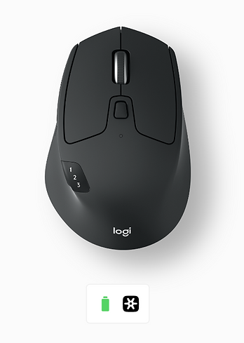
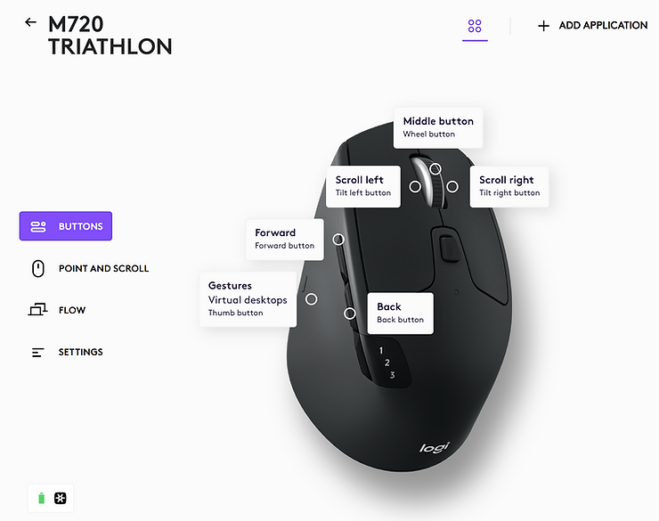
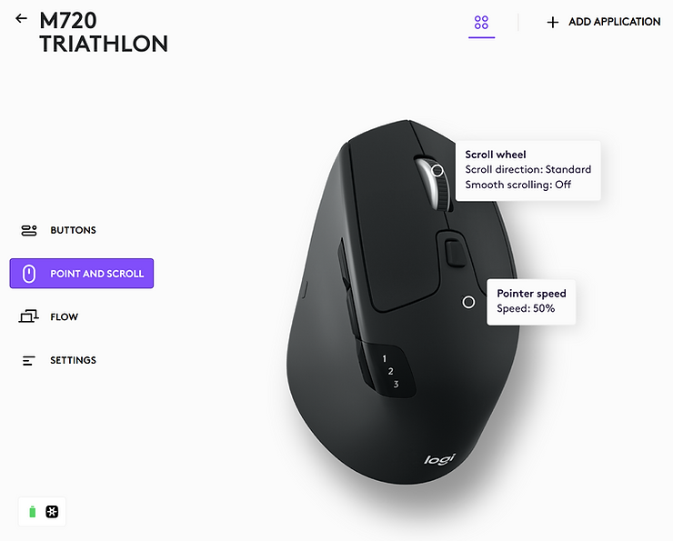

# Logitech M720 At-A-Glance

This post is a Logitech M720 at-a-glance. It includes links to get support.

#### M720 At-A-Glance

###### Buttons

###### Point and Scroll

###### Logitech M720 Triathlon Product Overview

https://www.logitech.com/en-us/products/mice/m720-triathlon.910-004790.html 

###### Software Downloads

Windows 10 Logi: Options+, Firmware Update Tools, and Logitech Options Downloads

https://support.logi.com/hc/en-us/articles/360024698414--Downloads-M720-Triathlon-Multi-Device-Mouse 

###### Specs & Details

## Dimensions

## Mouse

-   **Height**: 4.53 in (115 mm)
    
-   **Width**: 2.91 in (74 mm)
    
-   **Depth**: 1.78 in (45 mm)
    
-   **Weight (with batteries)**: 4.76 oz (135 g), with AA battery
    

## Logitech Unifying receiver

-   **Height**: 0.74 in (18.7 mm)
    
-   **Width**: 0.57 in (14.4 mm)
    
-   **Depth**: 0.24 in (6.1 mm)
    
-   **Weight**: 0.06 oz (1.8 g)
    

## Technical Specifications  

## Sensor Technology

-   High Precision Optical Tracking
    
-   **DPI (Min/Max)**: 1000±
    

## Buttons

-   **Number of Buttons**: 8
    

## Scrolling

-   Hyper-Fast Scrolling Wheel
    
-   **Scroll Wheel**: Yes, Rubber
    
-   **Tilt Wheel**: Yes, with middle click
    

## Battery

-   Battery life: 24 months <u>1</u>Battery life may vary based on user and computing
    
-   **Batteries Details**: 1 x AA (included)
    

## Connectivity

-   **Connection Type**: 2.4 GHz wireless connection and Bluetooth Low Energy Technology
    
-   **Wireless range**: 33 ft (10 m) (Wireless range may vary based on user, environmental and computing conditions.)
    
-   Easy-Switch, 3 channels
    

## Customization app

-   Supported by Logi Options+ on Windows and macOS <u>(</u>Available on Windows and macOS at [<u>logitech.com/optionsplus</u>](http://logitech.com/optionsplus) )
    

## Sustainability

-   **Product carbon footprint**: 5.08 kg CO2e
    
-   Certified carbon neutral
    

## Warranty Information

-   1-Year Limited Hardware Warranty  
    

## Part Number

-   910-004790
    

## Compatibility

## Logitech Unifying receiver

-   Required : Available USB port
    
-   Windows® 10,11 or later
    
-   macOS 10.5 or later
    
-   ChromeOS
    
-   Linux® kernel 2.6+
    

## Bluetooth

-   Required: Bluetooth Low Energy Technology
    
-   Windows 10,11 or later
    
-   macOS 10.5 or later
    
-   ChromeOS
    
-   Linux® kernel 2.6+
    
-   Android 5.0 or later
    
-   iPadOS 13.4 or later
    

## In the Box

-   Wireless mouse
    
-   Unifying receiver
    
-   1 AA Batteries
    
-   User documentation
    

###### Reference

Picture from Logi Options+ version 1.56.474970