# LoRaWAN - Connecting Your Device To The Things Network

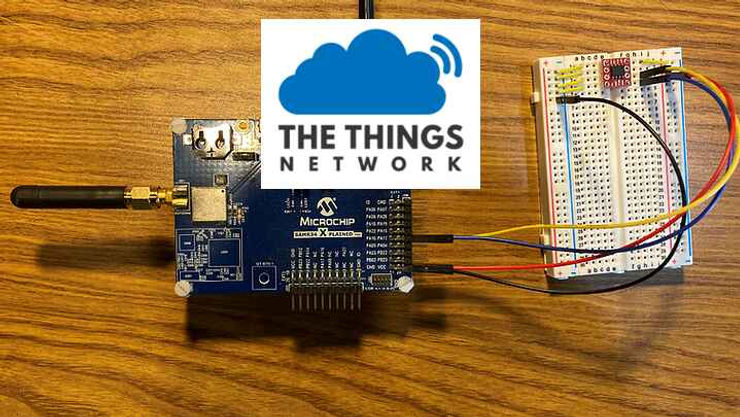

This post shows how to connect a LoRaWAN device to The Things Network (TTN). It expands on the earlier post, [**LoRaWAN On ATSAMR34 Platform and External I2C EEPROM with Device EUI**](https://www.centennialsoftwaresolutions.com/post/lorawan-on-atsamr34-platform-and-external-i2c-eeprom-with-device-eui). 

## **<u>Introduction</u>**

The Things Network (TTN) provides a set of open tools and an open network to build your IoT application. Using the TTN we will demonstrate how to connect your LoRaWAN device to a global IoT network and send data.

We use our LoRaWAN device from the earlier post, [**LoRaWAN On ATSAMR34 Platform and External I2C EEPROM with Device EUI**](https://www.centennialsoftwaresolutions.com/post/lorawan-on-atsamr34-platform-and-external-i2c-eeprom-with-device-eui).  We also need a LoRaWAN gateway to forward the LoRa packets over the backhaul to the Internet and the TTN network.

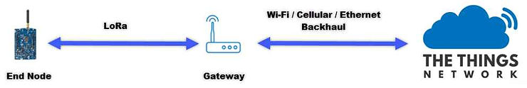

The following steps are used to connect to the TTN.

**<u>Step 1:</u>** Create your TTN account.

**<u>Step 2:</u>** Register your Gateway on TTN.

**<u>Step 3:</u>** Add your Application.

**<u>Step 4:</u>** Register your Device.

**<u>Step 5:</u>** Join with Over The Air Authentication (OTAA).

**<u>Step 6:</u>** Send data from your device to your TTN application.

## **<u>Materials and Tools</u>**

This demonstration was created and run using the following OS environment, tools, and materials.  Please refer to the earlier post, [**LoRaWAN On ATSAMR34 Platform and External I2C EEPROM with Device EUI**](https://www.centennialsoftwaresolutions.com/post/lorawan-on-atsamr34-platform-and-external-i2c-eeprom-with-device-eui), for details on setting up your device for this example.

-   MultiTech Conduit MTCDT-L4N1-246A-915-US LoRaWAN / LTE Gateway

-   **<u>Materials/Tools from the earlier post [</u>**[**<u>link</u>**](https://www.centennialsoftwaresolutions.com/post/lorawan-on-atsamr34-platform-and-external-i2c-eeprom-with-device-eui)**<u>] are listed below:</u>**

    -   Windows 10 Pro, Version 10.0.19041 Build 19041SAM R34 Xplained Pro Evaluation Kit (DM32011) \[[link](https://www.microchip.com/DevelopmentTools/ProductDetails/dm320111)\] **Note:** This post does not require connection to The Things Network. However, you may be interested in testing the LoRaWAN capability of the board by following the kit’s Quick Start Guide \[[link](https://ww1.microchip.com/downloads/en/DeviceDoc/30010200A.pdf)\]
        
    -   Tera Term, Version 4.105 \[[link](https://osdn.net/projects/ttssh2/releases/)\]
        
    -   Microchip’s 24AA025E64 EEPROM, 8-pin SOIC \[[link](https://www.microchip.com/wwwproducts/en/24AA025E64)\]
        
    -   Spark Fun’s 8-Pin SOIC to DIP adapter. This tiny PCB adapter and instruction guidelines and materials to mount the 24AA025E64 to the adapter can be found here \[[link](https://learn.sparkfun.com/tutorials/8-pin-soic-to-dip-adapter-hookup-guide?_ga=2.150190390.1037117880.1606680306-2016783257.1598037336&_gac=1.115759476.1606680306.Cj0KCQiAqo3-BRDoARIsAE5vnaJQCsx0WossOA6U7ry-2oneJXFEFonztYYO1IqUNQw3VuF-Qk8nE3UaAhotEALw_wcB)\]
        
    -   Microchip Studio for AVR and SAM Devices, Version 7.0.2542 \[[link](https://www.microchip.com/mplab/microchip-studio)\]
        
    -   Atmel (Microchip) ASF, version 3.49.1 **Note:** The ASF is part of the Microchip Studio installation
        

## **<u>Step 1:</u>** Create Your TTN Account

A) Go to The Things Network homepage [https://www.thethingsnetwork.org/] and select SignUp from the menu options.

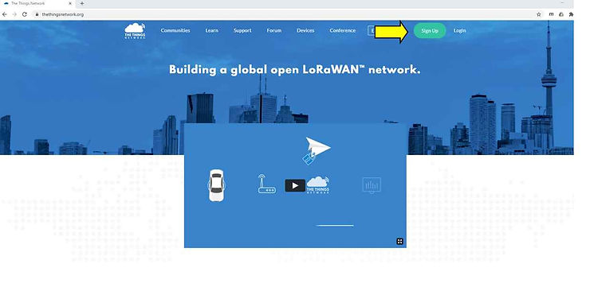

B) Enter your information to set up the account.

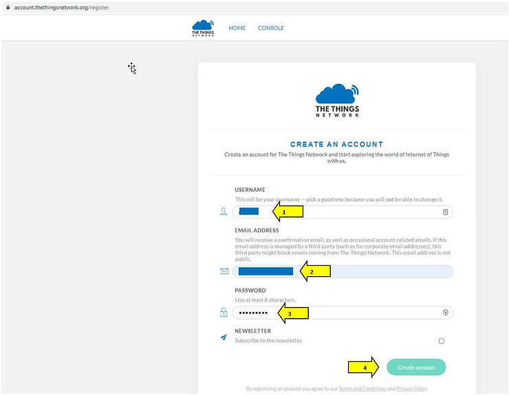

C) TTN will email you an account activation. Activate your account by clicking the Activate account button in the email.

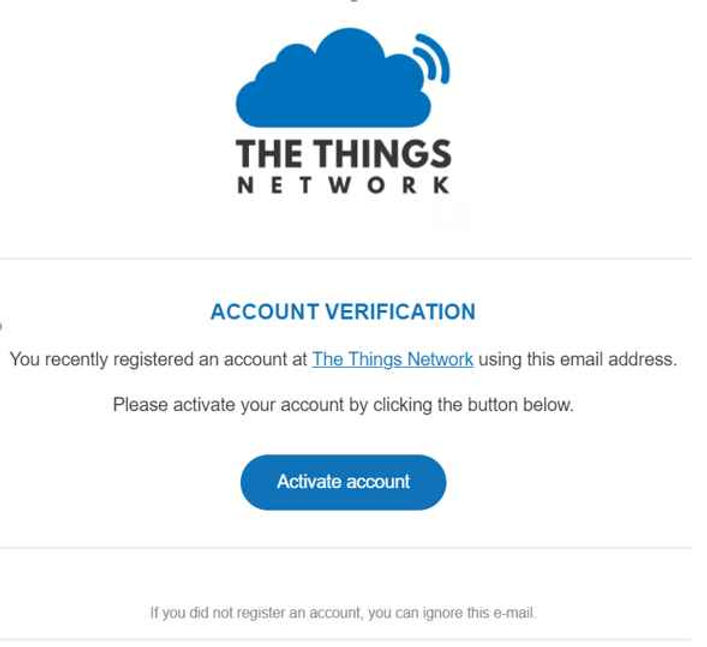

D) Enter the TTN Console to proceed to the next step.

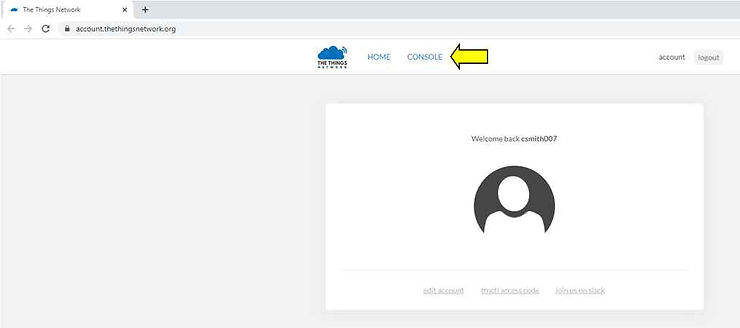

## **<u>Step 2:</u>** Register your Gateway

There are many choices and manufacturers for LoRaWAN Gateway hardware. A list of gateways can be found here \[[<u>link</u>](https://www.thethingsnetwork.org/docs/gateways/start/list.html)\]. We use a MultiTech Conduit gateway with a cellular backend as a Legacy Packet Forwarder with TTN configuration instructions here \[[<u>link</u>](https://www.thethingsnetwork.org/docs/gateways/multitech/)\]. Follow the manufacturer's instructions from your gateway’s manual to configure it to forward packets to TTN. The Things Network has configuration instructions here \[[<u>link</u>](http://www.thethingsnetwork.org/docs/gateways/registration.html)\].

A) Select the “Gateways” to register your gateway.

B) Provide your gateway’s information to register it on TTN. This demonstration configures the gateway as a legacy packet forwarder, so this checkbox is selected.

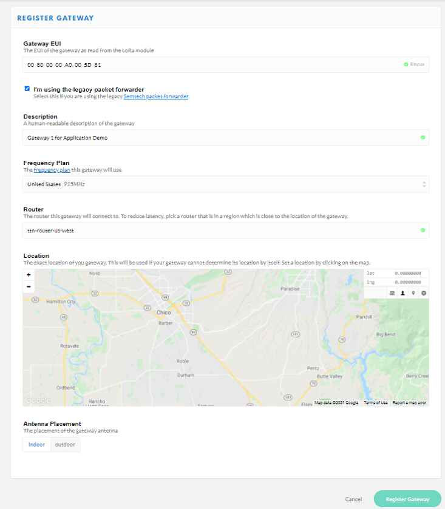

The TTN uses the gateway's Extended Unique Identifier (EUI) to register gateways that are operating as a legacy packet forwarder. This information can be accessed from your gateway's WebUI as shown below for our Multitech gateway.

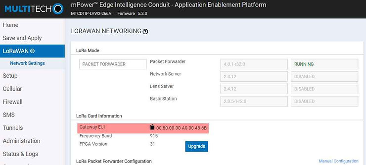

## **<u>Step 3:</u>** Add your Application

The following steps will show how to hook your device's data packets to a TTN application that you register. _Note: A follow-up post will expand on building applications for the TTN._

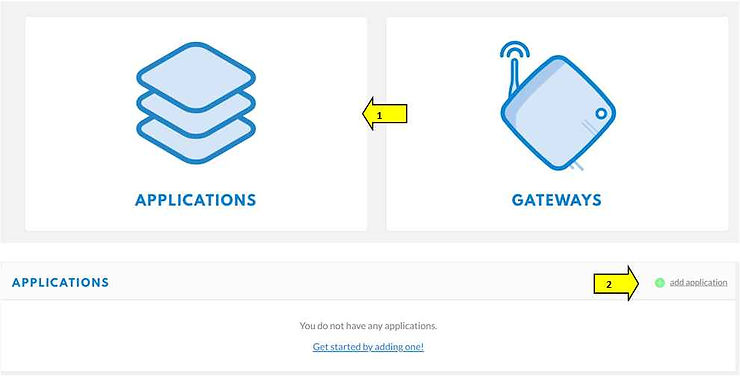

B) Enter a unique Application ID and a Description for the application as shown below. Select the handler depending on your region. Finish by clicking the **_Add application_** button.

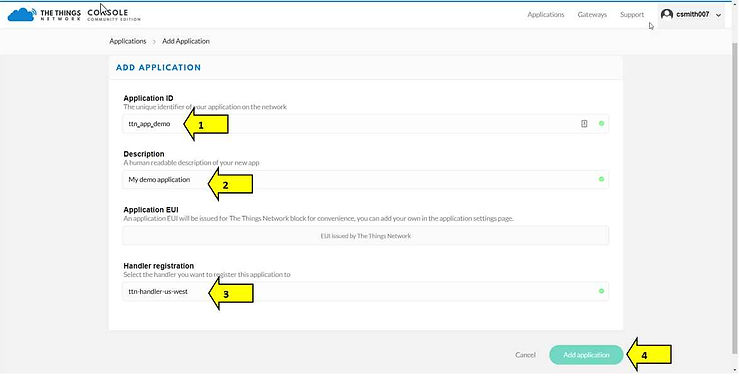

C) TTN Console registers your application and assigns it a unique Application EUI.

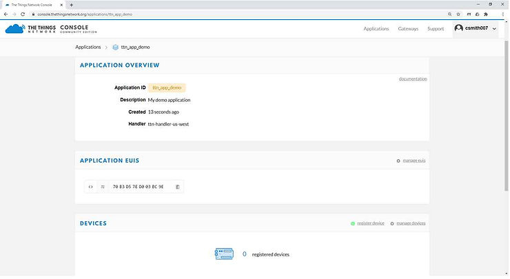

## **<u>Step 4</u>**: Register your device

A) Select the **_register device_** link to register your device. This enables your device to send data to your application.

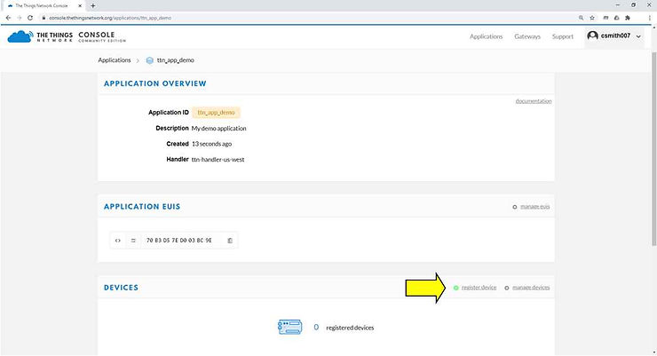

B) The TTN provides the screen shown below to register our device.

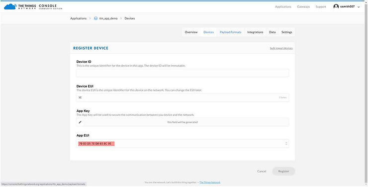

Device registration requires the user to enter a unique device identifier of our choice and the Device EUI of our device. The Application EUI and Key of our TTN application are stored in the device.

C) Before filling in this information we return to our ATSAMR34 device used in the earlier post, [**<u>LoRaWAN On ATSAMR34 Platform and External I2C EEPROM with Device EUI</u>**](https://www.centennialsoftwaresolutions.com/post/lorawan-on-atsamr34-platform-and-external-i2c-eeprom-with-device-eui). Remember in this device application, the Device EUI from external EEPROM is displayed and the user is prompted to enter the Application (Join) EUI and Application Key.

Below is the Tera Term printout of the device. Here we see our Device EUI is **0004a30b000527fa**.

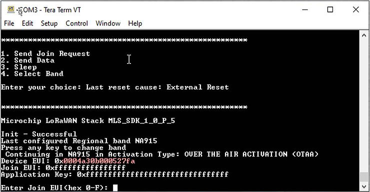

D) Copy the Device EUI to the TTN Device registration page along with a unique device identification, we’ll use **ttn\_demo\_01**. Finish by clicking the **Register** button.

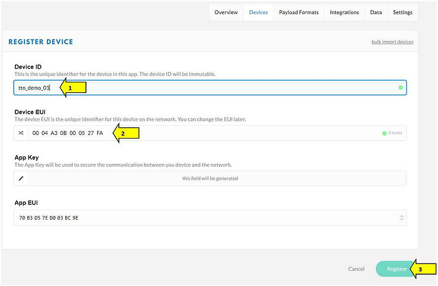

TTN registers the device to this application and provides an Application Key that is unique between this TTN application and our device. This information will be added to the device in the next step.

## **<u>Step 5:</u>** Join with Over The Air Authentication (OTAA)

Now that our device is registered in our TTN application we can add the Application EUI and Key information to our device and proceed with joining via OTAA.

Note below that TTN has provided a convenient way to copy the EUI and Key to the clipboard by clicking the icon on the right.

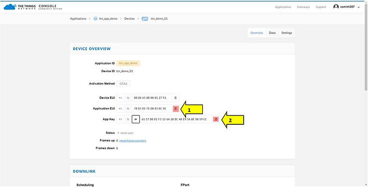

A) Copy the App EUI and Key to your device at the Tera Term prompts as shown below.

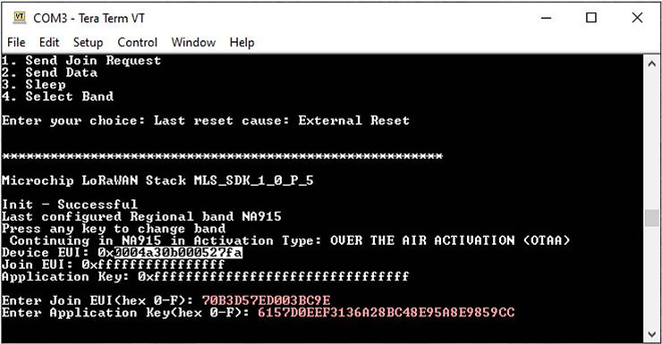

B) Move to the Data tab on the TTN devices page. This page displays LoRaWAN activity from this registered device.

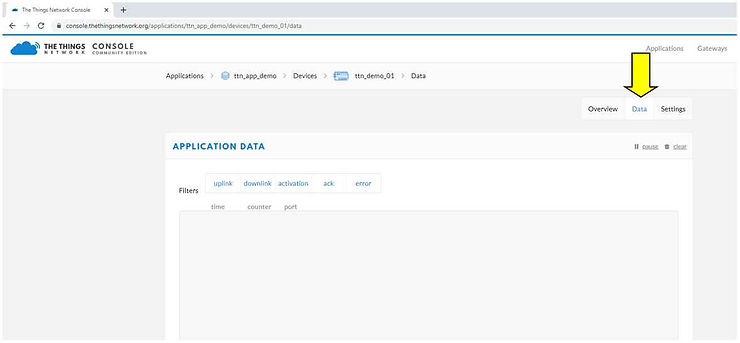

C) In our example, we’re using the NA915 Band, sub-band 2. _Select the appropriate frequency plan for your location \[_[_<u>link</u>_](https://www.thethingsnetwork.org/docs/lorawan/frequencies-by-country.html)_\]._ In Tera Term Select **4** for **Select Band.** We then select **2** for **NA915** then **2** for sub-band. The device will then send an OTAA Join request to the example application on TTN.

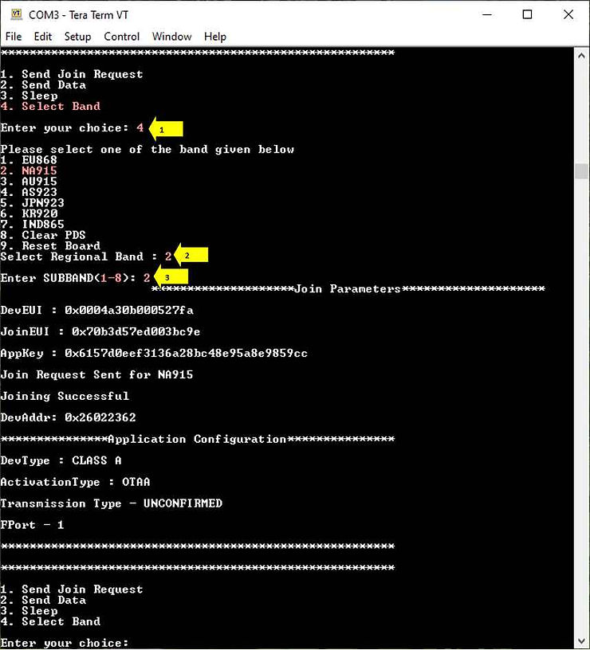

D) Note the successful join in the device's Tera Term terminal output (above), along with the Join packet displayed on the TTN’s registered device (below).

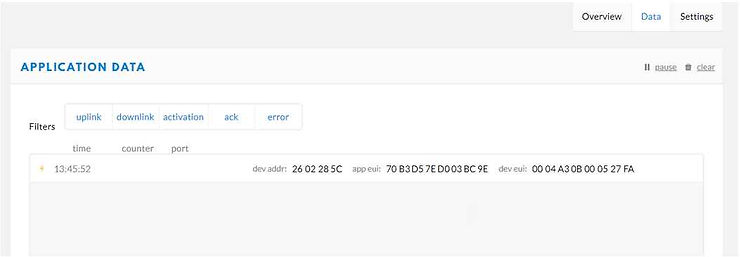

## **<u>Step 6:</u>** Send data from your device to your TTN application

After the device has successfully joined we can send LoRaWAN data packets to our TTN application.

A) Select **2** for **Send Data** in Tera Term. Repeat the selection to send more packets.

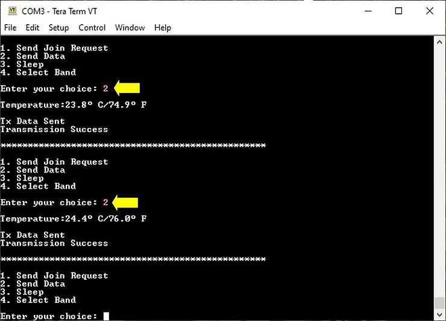

B) The data packets can be seen following the OTAA Join Request packet on TTN.

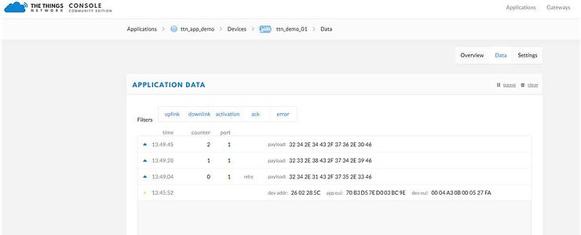

## **<u>Summary</u>**

In this post, we've shown how to use The Things Network for your IoT device testing. Using the ATSAMR34 device we created from the earlier post \[[<u>link</u>](https://www.centennialsoftwaresolutions.com/post/lorawan-on-atsamr34-platform-and-external-i2c-eeprom-with-device-eui)\], we registered this device on TTN then demonstrated the OTAA join and successful transmission of LoRaWAN packets. A follow-up post will expand on building applications for the TTN.