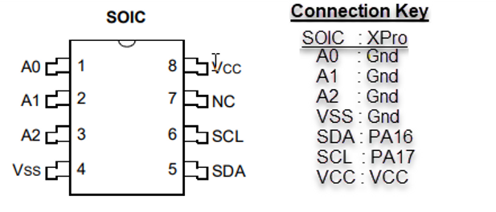

# LoRaWAN On ATSAMR34 Platform and External I2C EEPROM with Device EUI


This post shows how to store LoRaWAN device-specific information on an external EEPROM for the ATSAMR34 platform. It also demonstrates the use of I2C drivers provided by Microchip's Advanced Software Framework (ASF).

## **<u><span>Introduction</span></u>**

The ATSAMR34 SiP by Microchip provides an ultra-low power platform that is an excellent choice for IoT solutions using LoRaWAN. The SiP includes an ARM Cortex-M0 microcontroller with a UHF transceiver and various peripherals. One necessary item in developing an IoT LoRaWAN device solution will be the device’s 8-byte EUI (Extended Unique Identifier). LoRaWAN network server device registration requires a EUI. The ATSAMR34 SiP does not come with a Device EUI, so developers using the SAMR34 will either need to apply for a block of EUIs or design in an inexpensive external chip with one.

This post demonstrates how to work with the tiny EEPROM from Microchip, the 24AA025E64, that contains a device EUI. The SAMR34 communicates to the 24AA025E64 over I2C. We will show how to read and write the LoRaWAN device registration information from EEPROM using the I2C drivers provided by the Microchip/Atmel Software Framework (ASF).

We will go through the following steps to take you through the process:

**<u><span>Step 1:</span></u>** Show how to set up an example project on Microchip Studio (previously ATMEL Studio 7) and connect to the ATSAMR34 Xplained Pro development board (XPRO) over its embedded debugger port.

**<u><span>Step 2:</span></u>** Add the code for the I2C EEPROM demonstration.

This code includes:

-   The overhead to allow the EEPROM demonstration to occur within the example code.
    
-   Functions that read and write the external EEPROM over I2C using the I2C drivers.
    
-   Ability to read the Device EUI from EEPROM and write Application EUI and Key for registering your device on a LoRaWAN network server such as TheThingsNetwork (TTN).
    

**<u><span>Step 3:</span></u>** Hook up the Microchip 24AA025E64 EEPROM peripheral chip to the XPRO.

**<u><span>Step 4:</span></u>** Run the code, read the Device EUI from, and write the App EUI and Key to the EEPROM.

**<u><span>Step 5:</span></u>** Summarize the use of the I2C drivers provided by the ASF stack.

## **<u><span>Materials and Tools</span></u>**

This demonstration was created and run using the following OS environment, tools, and materials:

-   Windows 10 Pro, Version 10.0.19041 Build 19041
    
-   SAM R34 Xplained Pro Evaluation Kit (DM32011) \[[link](https://www.microchip.com/DevelopmentTools/ProductDetails/dm320111)\] **Note:** This post does not require connection to The Things Network. However, you may be interested in testing the LoRaWAN capability of the board by following the kit’s Quick Start Guide \[[link](https://ww1.microchip.com/downloads/en/DeviceDoc/30010200A.pdf)\]
    
-   Tera Term, Version 4.105 \[[link](https://osdn.net/projects/ttssh2/releases/)\]
    
-   Microchip’s 24AA025E64 EEPROM, 8-pin SOIC \[[link](https://www.microchip.com/wwwproducts/en/24AA025E64)\]
    
-   Spark Fun’s 8-Pin SOIC to DIP adapter. This tiny PCB adapter and instruction guidelines and materials to mount the 24AA025E64 to the adapter can be found here \[[link](https://learn.sparkfun.com/tutorials/8-pin-soic-to-dip-adapter-hookup-guide?_ga=2.150190390.1037117880.1606680306-2016783257.1598037336&_gac=1.115759476.1606680306.Cj0KCQiAqo3-BRDoARIsAE5vnaJQCsx0WossOA6U7ry-2oneJXFEFonztYYO1IqUNQw3VuF-Qk8nE3UaAhotEALw_wcB)\]
    
-   Microchip Studio for AVR and SAM Devices, Version 7.0.2542 \[[link](https://www.microchip.com/mplab/microchip-studio)\]
    
- Atmel (Microchip) ASF, version 3.49.1 **Note:** The ASF is part of the Microchip Studio installation

  **Note:** The ASF is part of the Microchip Studio installation

## **<u><span>Step 1:</span></u>** Set Up Example Project and Connect to the ATSAMR34 XPRO

A) Download and install Microchip/Atmel Studio IDE \[[<u><span>link</span></u>](https://www.microchip.com/mplab/microchip-studio)\] and scroll down to Downloads.


B) Follow the as-installer-<version>.exe installer instructions, using the default installation package. Install any device drivers if requested to do so.

C) Launch Atmel Studio

D)Connect the EDBG USB port on the XPRO board to your computer.


E) The host will recognize the connected SAM R34 Xplained Pro board and display its start page.


F) Select an example project from Advanced Software Framework (ASF).


G) Select Device Family --> SAMR34 and allow the IDE time to load the examples specific to this device. Expand the examples list and select the _Serial Provisioning of LoRaWAN Mote Application example, then click OK._


H) Accept the license agreements and continue. The new example project for APPS\_ED\_DEMO\_SER\_NWK\_PROVISION will be loaded and displayed in the Solution Explorer.


## **<u><span>Step 2:</span></u>** Add the code for the I2C EEPROM demonstration.

Now we add our external EEPROM code to the program. This involves modifying the two application files from the **_src_** directory: **enddevice\_demo.c** and **enddevice\_demo.h**. These modifications provide the following:

1\. Wrapper code to allow the EEPROM demonstration to occur within the example code.

2\. Functions that read and write the external EEPROM over I2C using the ASF I2C drivers.

3\. Ability to read the Device EUI from EEPROM and write Application EUI and Key for registering your device on a LoRaWAN network server such as TheThingsNetwork (TTN).

A) **<u><span>Insert 1:</span></u>** In enddevice\_demo.h, add state "EEPROM\_DEMO\_STATE" to the AppTaskState\_t enumeration as highlighted:

```
typedef enum _AppTaskState_t
{
    RESTORE_BAND_STATE,
    DEMO_APP_CONFIG,
    DEMO_CERT_APP_STATE,
    DEMO_APP_STATE,
    JOIN_SEND_STATE,
    EEPROM_DEMO_STATE
}AppTaskState_t;
```

B) **<u><span>Insert 2:</span></u>** In enddevice\_demo.c, add the our main EEPROM demo code right above the displayTask() function:

```
// EEPROM-Demo Start
bool rems_readwriteEUI(uint8_t adr, uint8_t *buf, uint8_t size, bool read);
static void displayAppConfig(void);
void eeprom_demo_init(void);
static void displayEepromApp(void);

/*************************/
/********* I2C ***********/
/*************************/
#define EEPROM_READ         1
#define EEPROM_WRITE        0
//Device EUI is pre-programmed here in the 24AA025E64 EEPROM
#define EEPROM_DEVEUI_ADR   0xf8    
// Application EUI is written here in the 24AA025E64 EEPROM
#define EEPROM_APPEUI_ADR   0x00    
// Application Key is written here in the 24AA025E64 EEPROM
#define EEPROM_APPKEY_ADR   0x10    
// The top nibble, 5, is the read/write command. Low nibble is chip's // I2C slave address of 0
#define SLAVE_ADDRESS       0x50    
// Loop timeout count for I2C reads/writes
#define TIMEOUT             1000    

/************************** GLOBAL VARIABLES  ************************/
struct i2c_master_module i2c_master_instance;
struct i2c_master_packet master_packet;

/*********************************************************************//**\brief    Configures the I2C module as Master
**********************************************************************/
void eeprom_demo_init(void)
{
    appTaskState = EEPROM_DEMO_STATE;
    appPostTask(DISPLAY_TASK_HANDLER);
}

static void displayAppConfig(void)
{
    uint8_t i = 0;
    printf("Activation Type: OVER THE AIR ACTIVATION (OTAA)\r\n");
    printf("Device EUI: 0x");
    for (i=0;i<8;i++) printf("%02x",demoDevEui[i]);
    printf("\r\n");
    printf("Join EUI: 0x");
    for (i=0;i<8;i++) printf("%02x",demoJoinEui[i]);
    printf("\r\n");
    printf("Application Key: 0x");
    for (i=0;i<16;i++) printf("%02x",demoAppKey[i]);
    printf("\r\n");
}

static void displayEepromApp(void)
{
    if(rems_readwriteEUI(EEPROM_DEVEUI_ADR, &demoDevEui[0], 8, 1) == true)
    {
        rems_readwriteEUI(EEPROM_APPEUI_ADR, &demoJoinEui[0], 8, 1);
        rems_readwriteEUI(EEPROM_APPKEY_ADR, &demoAppKey[0], 16, 1);
        displayAppConfig();
        printf("\r\nEnter Join EUI(hex 0-F): ");
        serial_read_appConfig(demoJoinEui, 8);
        printf("\r\nEnter Application Key(hex 0-F): ");
        serial_read_appConfig(demoAppKey, 16);
        printf("\r\n");
        
        // Write the App EUI and Key to EEPROM
        rems_readwriteEUI(EEPROM_APPEUI_ADR, &demoJoinEui[0], 8, 0);
        rems_readwriteEUI(EEPROM_APPKEY_ADR, &demoAppKey[0], 16, 0);
        demoJoinActivationType = OVER_THE_AIR_ACTIVATION;
        
        rems_readwriteEUI(EEPROM_APPEUI_ADR, &demoJoinEui[0], 8, 1);
        rems_readwriteEUI(EEPROM_APPKEY_ADR, &demoAppKey[0], 16, 1);
        printf("\r\n\nKey Data Read from EEPROM:\r\n");
        displayAppConfig();
    }
    // Flush the UART
    while ((-1) != sio2host_getchar_nowait());          
    demoJoinActivationType = OVER_THE_AIR_ACTIVATION;
    devEuiSelectionDone = joinTypeSelection = keyConfigSelection = verifyDemoConfigSelection = true;
    
    appTaskState = DEMO_APP_CONFIG;
    appPostTask(DISPLAY_TASK_HANDLER);
}
/*********************************************************************//*\brief      rems_readwriteEUI - Read/Write to EEPROM over I2C
 \param[in]  adr  - EEPROM memory start address to access 
 \param[in]  *buf - storage for read/write operation
 \param[in]  size - Number of bytes to read or write
 \param[in]  read - true for read operation, false for write op
 
 \return     true, if read/write operation was successful
             false, otherwise
 **********************************************************************/
bool rems_readwriteEUI(uint8_t adr, uint8_t *buf, uint8_t size, bool read)
{
    uint8_t wbuf[32];       // Write buffer
    wbuf[0] = adr;          // Place 

    /* Create and initialize I2C config structure for Master Operation 
       - Initialize the configuration struct with the driver defaults.
       - Adjust I2C Clock and Data pins to PA17 and PA16 resp.
    */
    struct i2c_master_config config_i2c;
    i2c_master_get_config_defaults(&config_i2c);
    
    /* Change pins to use SERCOM1 */
    config_i2c.pinmux_pad0  = PINMUX_PA16C_SERCOM1_PAD0;  // I2C_SDA
    config_i2c.pinmux_pad1  = PINMUX_PA17C_SERCOM1_PAD1;  // I2C_SCL
    
    /* Initialize and enable I2C device as a master with config */
    i2c_master_init(&i2c_master_instance, SERCOM1, &config_i2c);
    
    i2c_master_enable(&i2c_master_instance);
    uint32_t timeout = 0;
    bool bret = true;

    memcpy(&wbuf[1], buf, size);
    
    if(read)
    {
        // The write packet
        master_packet.address         = SLAVE_ADDRESS;
        master_packet.data_length     = 1;
        master_packet.data            = &adr;
        master_packet.ten_bit_address = false;
        master_packet.high_speed      = false;
        master_packet.hs_master_code  = 0x0;
    
        /* Generate the Random Read sequence for the 24AA025E64 EEPROM (see datasheet) This first write will write the address we want to access but not produce the stop bit.  This sets us up for the remainder of the sequential read or write at eeprom's memory location specified by the calling fcn.
        */
        while (i2c_master_write_packet_wait_no_stop(&i2c_master_instance, &master_packet) != STATUS_OK) {
            /* Increment timeout counter and check if timed out. */
            if (timeout++ == TIMEOUT) {
                break;
            }
        }
        // Set the address and size for the upcoming read/write
        master_packet.data_length     = size;
        master_packet.data            = buf;
        while (i2c_master_read_packet_wait(&i2c_master_instance, &master_packet) !=
        STATUS_OK) {
            /* Increment timeout counter and check if timed out. */
            if (timeout++ == TIMEOUT) {
                bret = false;
                break;
            }
        }   
    }
    else
    {
        master_packet.data_length = size + 1;
        master_packet.data = wbuf;
        while (i2c_master_write_packet_wait(&i2c_master_instance, &master_packet) !=
        STATUS_OK) {
            /* Increment timeout counter and check if timed out. */
            if (timeout++ == TIMEOUT) {
                bret = false;
                break;
            }
        }   
    }
    i2c_master_disable(&i2c_master_instance);
    return bret;    
}
// EEPROM-Demo End
```

C) **<u><span>Insert 3:</span></u>** In enddevice\_demo.c, add the EEPROM\_DEMO\_STATE state to the displayTask() function as shown in bold:

```
/*********************************************************************//**
\brief Calls appropriate functions based on state variables
*************************************************************************/
static SYSTEM_TaskStatus_t displayTask(void)
{
 switch(appTaskState)
 {
 case RESTORE_BAND_STATE:
   displayRunRestoreBand();
   break;
 case DEMO_APP_CONFIG:
   displayAppConfigMenu();
   break;
 case DEMO_CERT_APP_STATE:
   displayRunDemoCertApp();
   break;
 case DEMO_APP_STATE:
   displayRunDemoApp();
   break;
 case JOIN_SEND_STATE:
   displayJoinAndSend();
   break;
 case EEPROM_DEMO_STATE:
   displayEepromApp();
   break;
 default:
   printf("Error STATE Entered\r\n");
   break;
 }

 return SYSTEM_TASK_SUCCESS;
}
```

D) **<u><span>Insert 4:</span></u>** In enddevice\_demo.c, add the call to function **eeprom\_demo\_init();** at the end of **mote\_demo\_init()**, so that it gets called during the mote demo initialization. This call will cause the application to run our EEPROM demo first.

```
void mote_demo_init(void)
{
    bool status = false;
    /* Initialize the resources */
    resource_init();
    startReceiving = false;
    /* Initialize the LORAWAN Stack */
    LORAWAN_Init(demo_appdata_callback, demo_joindata_callback);
    printf("\n\n\r****************************************\n\r");
    printf("\n\rMicrochip LoRaWAN Stack %s\r\n",STACK_VER);
    printf("\r\nInit - Successful\r\n");

    status = PDS_IsRestorable();
    if(status)
    {
        static uint8_t prevBand = 0xFF;
        uint8_t prevChoice = 0xFF;
        PDS_RestoreAll();
        LORAWAN_GetAttr(ISMBAND,NULL,&prevBand);
        for (uint32_t i = 0; i < sizeof(bandTable) -1; i++)
        {
            if(bandTable[i] == prevBand)
            {
                prevChoice = i;
                break;
            }
        }
        memset(rxchar,0,sizeof(rxchar));
        sio2host_rx(rxchar,10);
        printf ("Last configured Regional band    %s\r\n",bandStrings[prevChoice]);
        printf("Press any key to change band\r\n Continuing in %s in ", bandStrings[prevChoice]);

        SwTimerStart(demoTimerId,MS_TO_US(1000),SW_TIMEOUT_RELATIVE,(void *)demoTimerCb,NULL);
    }
    else
    {
	appTaskState = DEMO_APP_CONFIG;
        appPostTask(DISPLAY_TASK_HANDLER);
    }
    eeprom_demo_init();		// Added for EEPROM demo 
}
```

E) Select **_Build --> Rebuild Solution_** to verify the application builds successfully.


## **<u><span>Step 3:</span></u>** Hook up the Microchip 24AA025E64 EEPROM peripheral chip to the XPRO.

Refer to the instructions in the previous Spark Fun \[[<u><span>link</span></u>](https://www.wix.com/dashboard/a179d95d-2df5-4900-a517-bff1f7bcca1f/blog/5fd6bbb35b405b002d5651c2/edit#Spark_Fun_Adapter)\], and mount the 24AA025E64 EEPROM to the 8-Pin SOIC to DIP adapter.

Connect the 24AA025E64 EEPROM to the EXT1 pins on the XPRO board using the pinout key indicated below. _Note that the EEPROM’s address pins are all connected to ground, providing an I2C address of zero._




The finished result:


## **<u><span>Step 4:</span></u>** Run the code, read the Device EUI from, and write the App EUI and Key to the EEPROM

A) Now we are ready to run the code. The XPRO provides a virtual serial port through its USB connection. Use your desired serial terminal program to connect to this virtual COM port. This example shows Tera Term connected to the virtual port at COM3. Set the port speed to 115200, 8-N-1 via **_Setup-> Serial port_**. Set the terminal new-line to CR via **_Setup-> Terminal_**.


B) Select the **_Start-Without-Debugging_** from the menu tray (below) or hit Ctrl+Alt+F5. The IDE builds and writes the program to the XPRO board.


C) The EEPROM program now reads and displays the pre-programmed Device EUI from the 24AA025E64 EEPROM and displays it in Tera Term. It also reads the initially unprogrammed Application (Join) EUI and Key and allows the user to write the correct Application information for your registered LoRaWAN device.


D) Enter or copy and paste your desired Application’s 16-byte Key and 8-byte EUI using ‘0-F’ keys from your keyboard. The input is parsed as two key entries (nibbles) per byte.


**Note:** Once the key data is entered the demo program proceeds with the original demo application using a LoRaWAN OTAA join.

## **<u><span>Step 5: </span></u>** Summarize the use of the I2C drivers provided by the ASF stack

We will now discuss how we use the ASF I2C drivers, with the SAMR34 operating as I2C master and the 24AA025E64 EEPROM as I2C slave.

The I2C driver structures and functions used for our EEPROM access are listed here:

```
// Master driver software device instance structure
struct i2c_master_module i2c_master_instance;  
// Structure to be used when transferring I2C master packets.
struct i2c_master_packet master_packet; 
// Configuration structure for master device 
struct i2c_master_config config_i2c;
// Gets the master I2C default configuration
i2c_master_get_config_defaults(&config_i2c);
// Initialize and enable I2C device as a master with config
i2c_master_init(&i2c_master_instance, SERCOM1, &config_i2c);
// Enables the I2C module	
i2c_master_enable(&i2c_master_instance);
// Writes data packet to slave without sending a stop condition
i2c_master_write_packet_wait_no_stop();
// Reads data packet from slave, non-blocking
i2c_master_read_packet_wait();
// Writes data packet to slave, non-blocking
i2c_master_write_packet_wait();
// Disables the I2C module
i2c_master_disable();
```

Our EEPROM memory chip can be accessed using our high-level function, rems\_readwriteEUI(). The rems\_readwriteEUI() function prototype is listed below, followed by a description that delves into this function's use of the I2C driver functions.

```
/*********************************************************************
 \brief rems_readwriteEUI - Read/Write to EEPROM over I2C
 \param[in] adr - EEPROM memory start address to access 
 \param[in] *buf - storage for read/write operation
 \param[in] size - Number of bytes to read or write
 \param[in] read - true for read operation, false for write op
 
 \return true, if read/write operation was successful
 false, otherwise
**********************************************************************/
bool rems_readwriteEUI(uint8_t adr, uint8_t *buf, uint8_t size, bool read);
```

EEPROM memory access definitions include the locations of the Device and Application EUIs and Application Key. The EEPROM is accessed over the serial I2C bus using the SLAVE\_ADDRESS value of 0x50, where the top 4 serial bits represent a read/write command to the EEPROM, followed by the 4-bit I2C device address of 0.

```
// Device EUI is pre-programmed here in the 24AA025E64 EEPROM
#define EEPROM_DEVEUI_ADR 0xf8 
// Application EUI is written here in the 24AA025E64 EEPROM
#define EEPROM_APPEUI_ADR 0x00 
// Application Key is written here in the 24AA025E64 EEPROM 
#define EEPROM_APPKEY_ADR 0x10 
// The top nibble, 5, is the read/write command. 
// Low nibble is chip's I2C slave address of 0
#define SLAVE_ADDRESS 0x50 
```

rems\_readwriteEUI() starts by configuring the I2C driver to serial port peripheral, SERCOM1, on the SAMR34 as a master, using PA16 and PA17 pins as I2C Data and Clock respectively. Driver defaults are used for I2C rate, clock generator, and other miscellaneous I2C timing.

```
struct i2c_master_config config_i2c;
i2c_master_get_config_defaults(&config_i2c);
 
 /* Change pins to use SERCOM1 */
 config_i2c.pinmux_pad0 = PINMUX_PA16C_SERCOM1_PAD0; // I2C_SDA
 config_i2c.pinmux_pad1 = PINMUX_PA17C_SERCOM1_PAD1; // I2C_SCL
 
 /* Initialize and enable I2C device as a master with config */
 i2c_master_init(&i2c_master_instance, SERCOM1, &config_i2c);
```

rems\_readwriteEUI() next enables the I2C master.

```
 i2c_master_enable(&i2c_master_instance);
```

**<u><span>Read Operation:</span></u>** When rems\_readwriteEUI() is called for a read operation we must first write the address we want to access without producing a stop bit, using the I2C driver function i2c\_master\_write\_packet\_wait\_no\_stop(). This sets us up for the remainder of the sequential read from the desired EEPROM's memory location using the I2C driver function i2c\_master\_read\_packet\_wait().

```
master_packet.address = SLAVE_ADDRESS;
master_packet.data_length = 1;
master_packet.data = &adr;
master_packet.ten_bit_address = false;
master_packet.high_speed = false;
master_packet.hs_master_code = 0x0;

/* Generate the Random Read sequence for the 24AA025E64 EEPROM (see datasheet)  This first write will write the address we want to access but not produce the stop bit. This sets us up for the remainder of the sequential read or write at eeprom's memory location specified by the calling fcn. */

while (i2c_master_write_packet_wait_no_stop(&i2c_master_instance, 
&master_packet) != STATUS_OK) {
    if (timeout++ == TIMEOUT) {
         break;
    }
}
// Set the address and size for the upcoming read/write
master_packet.data_length = size;
master_packet.data = buf;
while (i2c_master_read_packet_wait(&i2c_master_instance, &master_packet) != STATUS_OK) {
    if (timeout++ == TIMEOUT) {
        bret = false;
        break;
    }
}
```

**<u><span>Write Operation:</span></u>** When rems\_readwriteEUI() is called for a write operation, it performs a write packet consisting of the write address byte, followed by the bytes to write.

```
master_packet.data_length = size + 1;
master_packet.data = wbuf;
while (i2c_master_write_packet_wait(&i2c_master_instance, &master_packet) != STATUS_OK) {
    /* Increment timeout counter and check if timed out. */
    if (timeout++ == TIMEOUT) {
        bret = false;
        break;
    }
}
```

rems\_readwriteEUI() ends the operation by disabling the I2C module.

```
i2c_master_disable(&i2c_master_instance);
```

## **<u><span>Summary</span></u>**

We've shown how to use an external EEPROM with the ATSAMR34 platform to store device-specific information for registration on a LoRaWAN network. Taking an example program provided for the ATSAMR34 XPRO development platform, we've added code to read our external EEPROM's Device EUI and store the Application Key and Application EUI. We've shown how to hook up the Microchip 24AA025E64 EEPROM to the I2C bus and reviewed our use of the ASF's I2C drivers to access it. In a future post, we will take you through the process of registering our device on The Things Network and joining the network using the OTAA process.