# MachineQ Gateway Setup

This post shows how to set up a MachineQ gateway, specifically, a Multi-Tech MultiConnect® Conduit™ Access Point.

**<u>Hardware</u>**

The gateway a.k.a. the Multi-Tech MultiConnect® Conduit™ Access Point

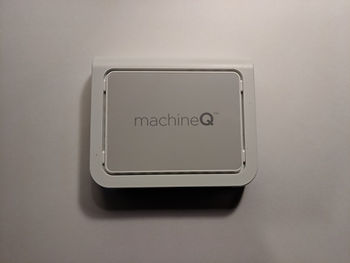

Power Supply, U.S. Plug Adapter and Ethernet Cable

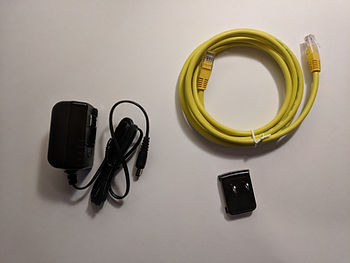

A close up of the power supply (Output: 5V, 2.5A):

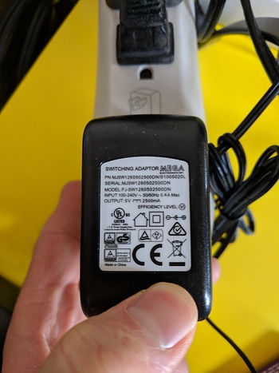

Xfinity Dual-Band WiFi 802.11ac XB3 Cable Modem

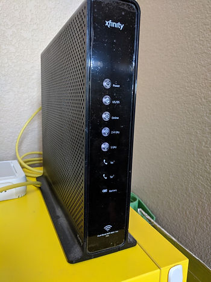

**<u>Setup the Hardware</u>**

1\. Attach the U.S. plug to the power supply

I. Lay the U.S. adapter into the power supply

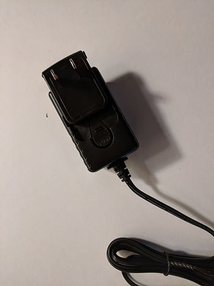

II. Push down on the adapter until it clicks

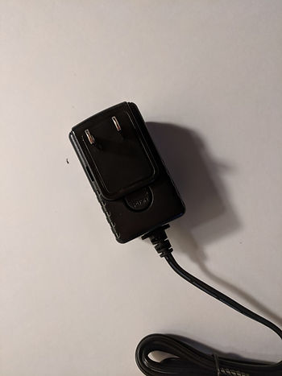

2\. Take a picture of the back of the gateway

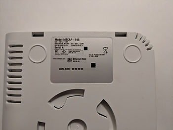

3\. Plug one end of the Ethernet cable into the gateway

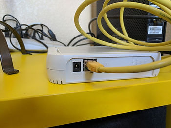

4\. Plug the other end of the cable into an Ethernet port of the cable modem

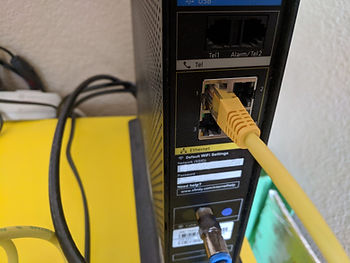

5\. Plug the power supply into the gateway

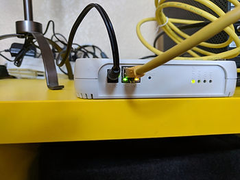

Here's the gateway blinking:

(video unavailable)

...the cable modem blinking:

(video unavailable)

...and the front of the cable model blinking:

(video unavailable)

Setup the Gateway through MQCentral

1\. Goto to [https://mqcentral.machineq.net/] 

2\. Click **LOG IN**

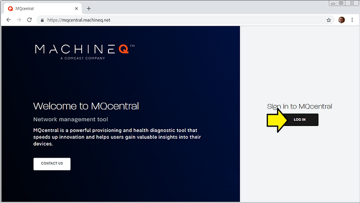

3\. Enter your **Username** and **Password** and click **SUBMIT**

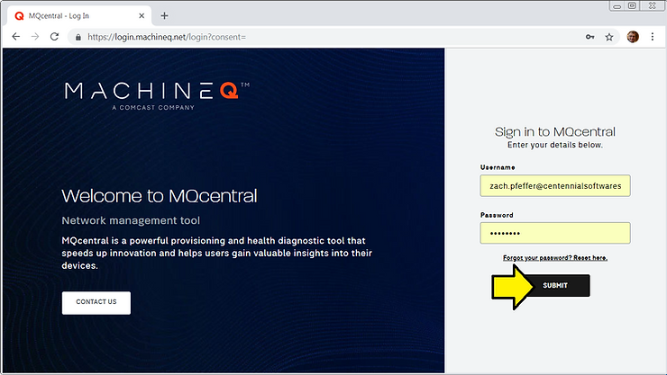

You'll see:

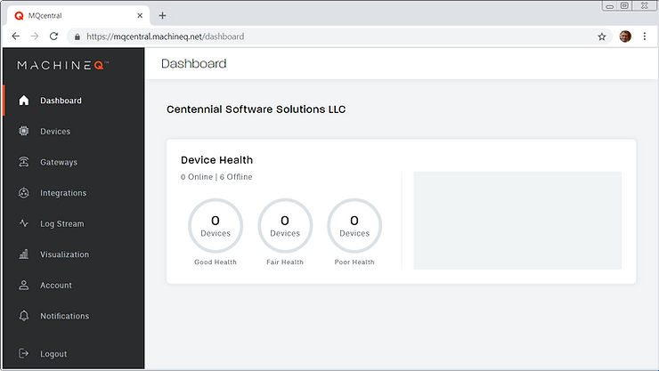

4\. Click **Gateways**

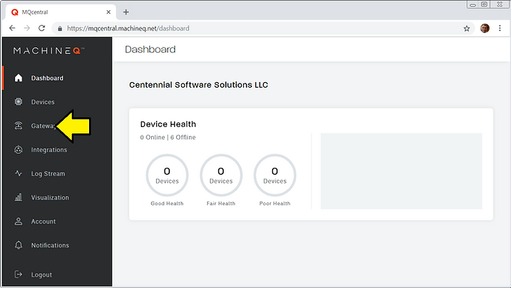

You should see something like (some numbers have been erased):

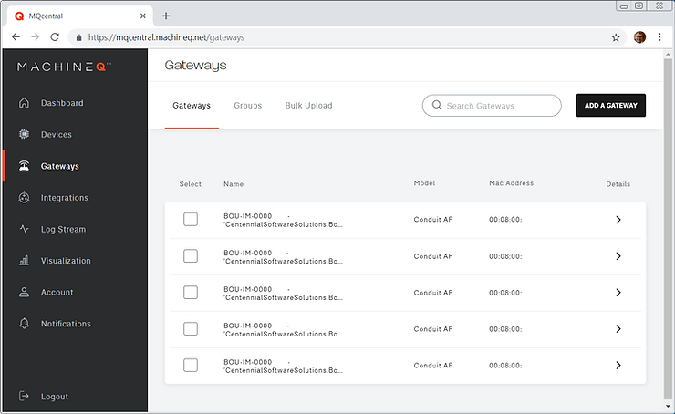

5\. Find the MAC Address of the gateway using the picture you took and click Details:

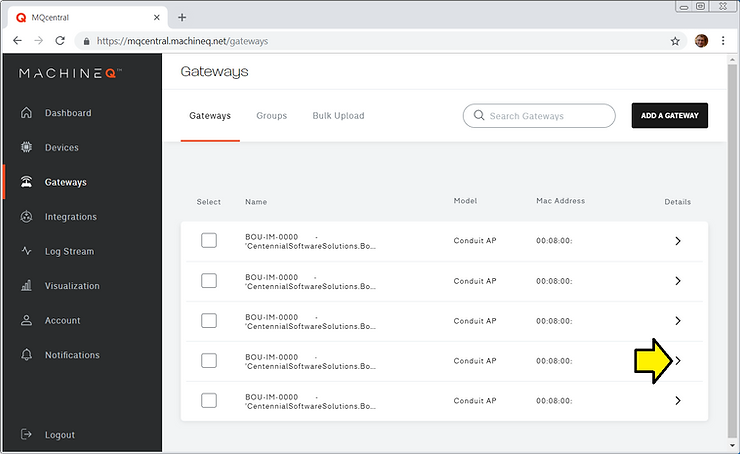

You should see it **Connected**:

