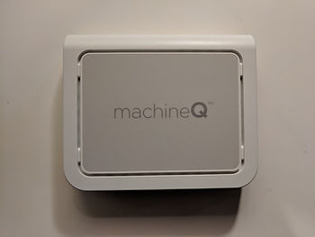
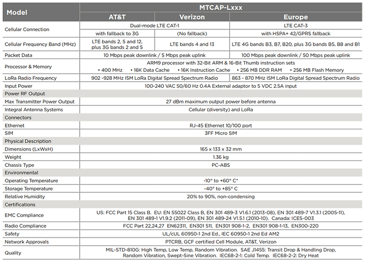
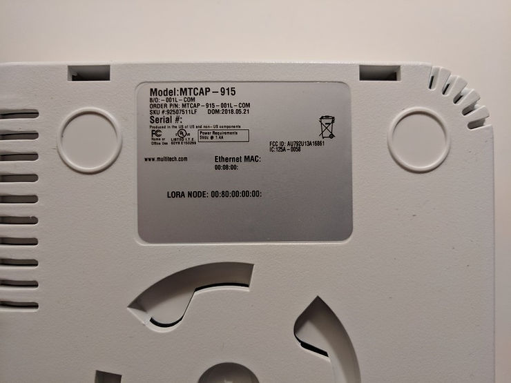
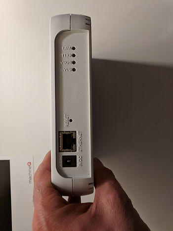

# machineQ Multi-Tech MultiConnect® Conduit™ Access Point

This post lists pictures and documentation for the machineQ Multi-Tech MultiConnect® Conduit™ Access Point: Model: MTCAP-915, B/O: -001L-COM, Order P/N: MTCAP-915-001L-COM \[[link](https://www.multitech.com/models/92507510LF)\], SKU #:92507511LF.

**Multi-Tech's Description and Doc Links**

From Multi-Tech's website at \[[link](https://www.multitech.com/models/92507510LF)\]

MultiConnect® ConduitTM AP

MTCAP-915-001L

92507510LF

Ethernet mLinux Programmable Access Point for LoRa Technology w/US Accessory Kit

Includes power supply with NAM blade, 6 ft. Ethernet cable, mounting bracket and Quick Start Guide (note: I did not get a Quick Start Guide in my kit. I got a piece of paper that said to go to [machineQ.com/develop](https://machineq.com/develop/)).

Data sheet at \[[link](https://www.multitech.com/documents/publications/data-sheets/86002187.pdf)\]

MultiConnect® ConduitTM AP MTCAP for mLinux Quick Start manual at \[[link](https://www.multitech.com/documents/publications/quick-start-guides/82102373L.pdf)\]

MultiConnect® ConduitTM Access Point MTCAP User Guide for North America manual at \[link\]

**machineQ's Description and Doc Links** are available at [machineQ.com/develop](https://machineq.com/develop/) after logging in.

**More Details on the MTCAP-915-001L from the Data Sheet**

From the **data sheet**, the MTCAP-915-001L is an **Ethernet mLinux Programmable Access Point w/US Accessory Kit**.

**mLinux** from MultiTech is documented \[[here](http://www.multitech.net/developer/software/mlinux/)\].

<u>Software Specification</u>

-   mLinux
    
-   Open source embedded Linux distro based on the **Yocto Project**
    
-   Tool chain for creating custom images
    
-   WAN connection via Ethernet or cellular
    
-   Cellular PPP, DHCP client and server
    
-   Firewall configuration via iptables
    
-   Out of the box support for C, C#, C++, Java, Perl, Python, Javascript, Node.js, Ruby
    
-   Lighttpd web server
    
-   opkg package manager with limited package feed
    
-   Basic router functionality built-in with Linux
    
-   Four configurable LEDs
    

<u>Hardware Specification</u>

From the data sheet:

**Pictures**

