# machineQ Starter Kit with an ST LoRa Dev Kit Part Summary and Unboxing

This post presents an unboxing of the $199 machineQ Starter Kit.

**<u>Overview of the Kit</u>**

From \[[link](https://store.machineq.com/store/products/machineq-starter-kit)\] (login required):

Quickly prototype your IoT ideas using the machineQ Starter Kit. Included with the machineQ Starter Kit is:

1 MultiConnect Conduit AP gateway

1 Dev Kit - Spark OR **ST LoRa Dev Kit**

3 Months Free machineQ Software License

The MultiConnect® Conduit™ Access Point provides deep in-building connectivity for network operators and enterprises connecting IoT assets using the LoRaWAN™ protocol.

The Spark is a plug-and-play development kit designed as a USB module. It's perfect for those looking to rapidly prototype of IoT solutions. It comes with a Dev Board and four different Grove sensors that measure temperature, sound, distance, and orientation & speed.

**ST LoRa Dev Kit** is a versatile and quick-to-market prototyping option for your next innovative solution. Combined with the recommended expansion board, the ST LoRa Dev Kit is ideal for the more advanced embedded developer who may be building IoT sensors from scratch.

**<u>Name / Part Number / [Link] Summary</u>**

-   STM32 LoRa and Sigfox Discovery kit / B-L072Z-LRWAN1 / \[[link](https://www.st.com/en/evaluation-tools/b-l072z-lrwan1.html)\]
    
-   Motion MEMS and environmental sensor expansion board for the STM32 Nucleo / X-NUCLEO-IKS01A2 / \[[link](https://www.st.com/en/ecosystems/x-nucleo-iks01a2.html)\]
    
-   Multi-Tech MultiConnect® Conduit™ Access Point (LoRa gateway) / MTCAP-915-001L-COM \[[link](https://www.multitech.com/models/92507510LF)\]
    

**<u>Unboxing</u>**

<u>The Box</u>

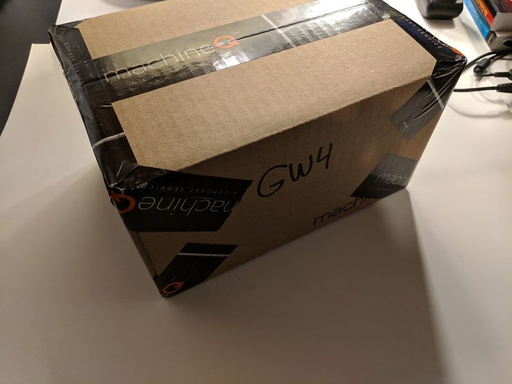

<u>Opened</u>

[machineQ.com/develop](http://machineq.com/develop)

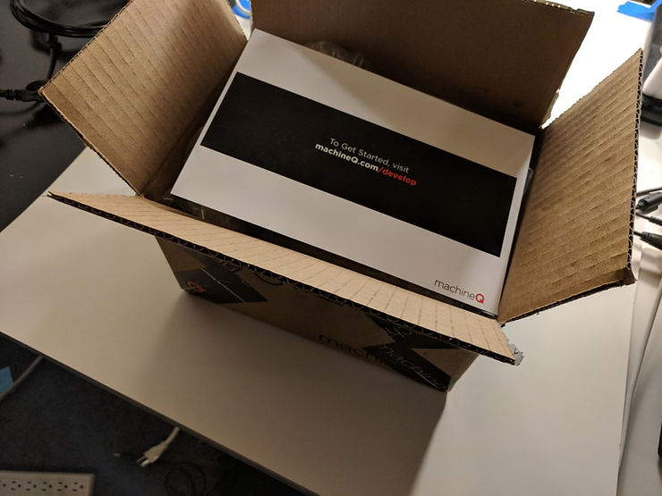

<u>Contents</u>

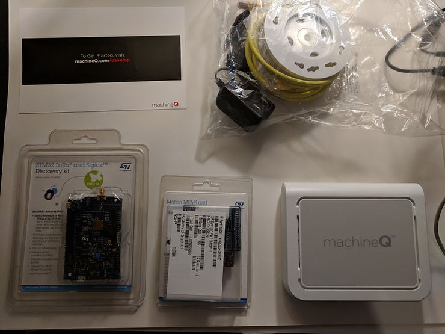

...flipped

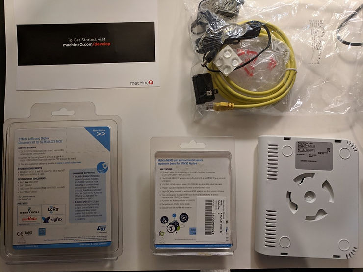

<u>The STM32 LoRa and Sigfox discovery kit</u>

[www.st.com/stm32app-discovery](http://www.st.com/stm32app-discovery)

Part number: B-L072Z-LRWAN1 \[[link](https://www.st.com/en/evaluation-tools/b-l072z-lrwan1.html)\]

...flipped:

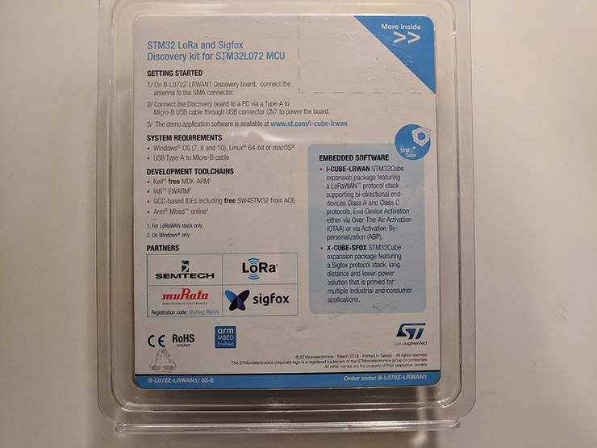

<u>The motion MEMS and environmental sensor expansion board for the STM32 Nucleo</u>

Part Number: X-NUCLEO-IKS01A2 \[[link](https://www.st.com/en/ecosystems/x-nucleo-iks01a2.html)\]

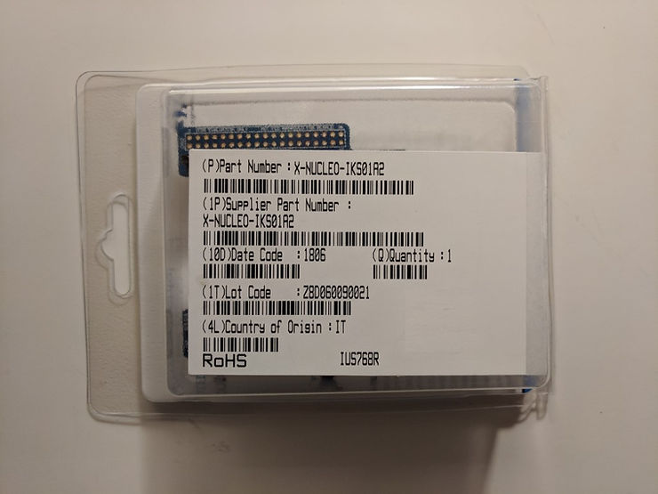

...flipped:

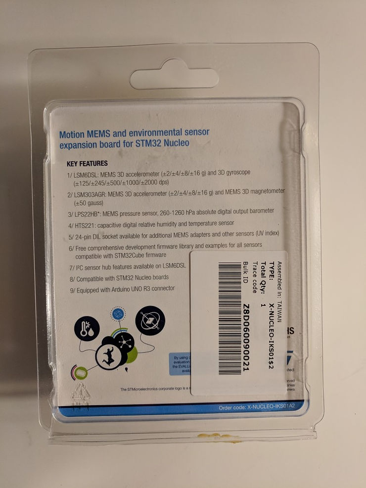

<u>The Multi-Tech MultiConnect® Conduit™ Access Point</u> \[[about](https://www.multitech.com/about-us/global-locations)\]\[[link](https://www.multitech.com/)\]

Model: MTCAP-915

B/O: -001L-COM

Order P/N: MTCAP-915-001L-COM \[[link](https://www.multitech.com/models/92507510LF)\]

SKU #:92507511LF

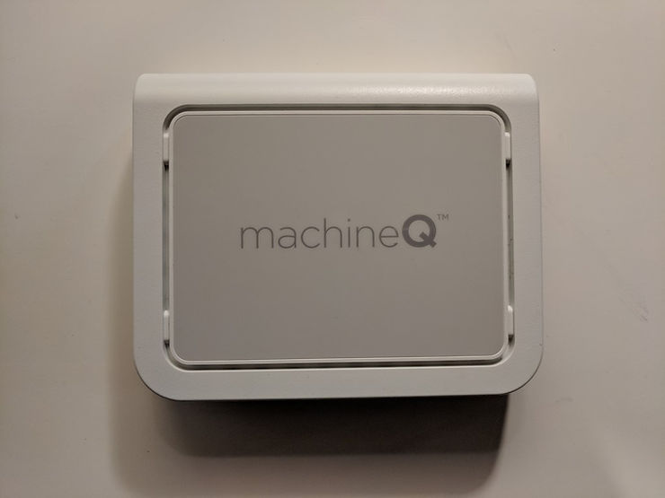

...and back

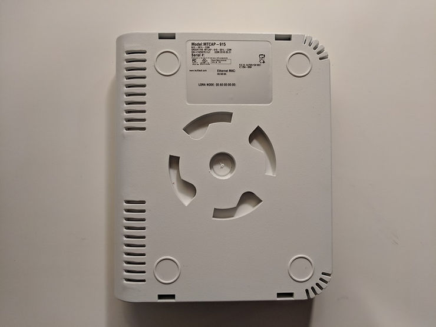

...magnified:

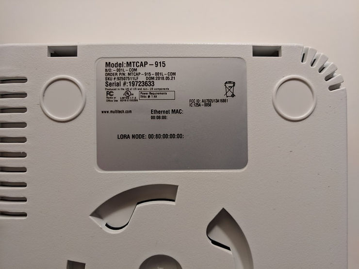

...and side:

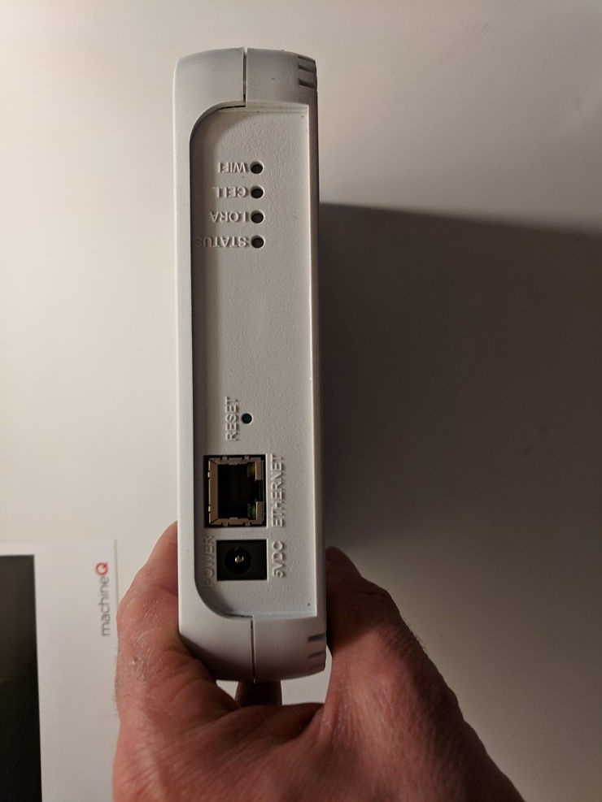

<u>The Rest</u>

-   RJ45 CAT5 Ethernet cable
-   Round clear bumpon set
-   Switching Adapter from Mega Electronics International PN: MJSW1260502500DN/01005020L
-   5V 2.5A Change Blade

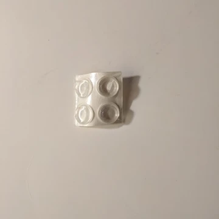

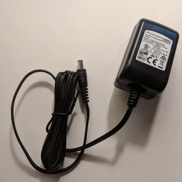

**<u>References</u>**

-   machineQ logo from \[[link](https://machineq.com/)\]