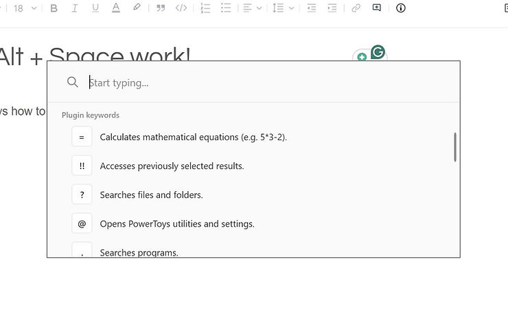
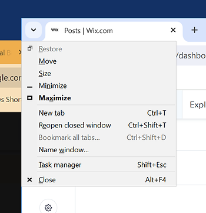
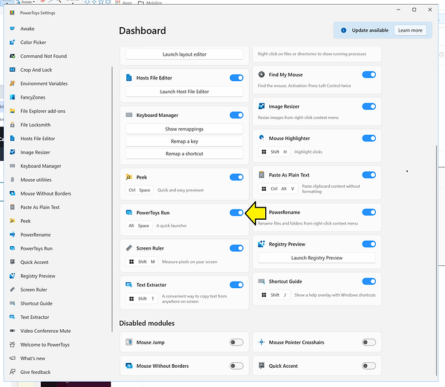
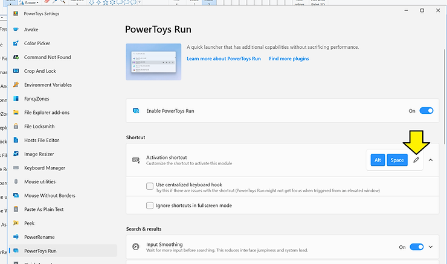
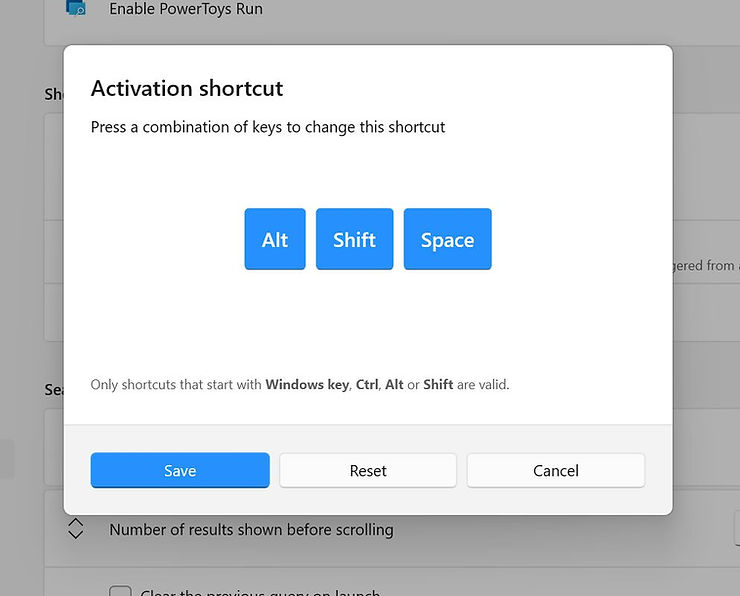

# Make Alt + Space work!

This post shows how to "make Alt + Space work!" For this post, "work" means "display the **window menu**" after installing PowerToys. I needed this to move windows with the keyboard after I had installed PowerToys.

## Make Alt + Space work!: The Problem

If you see this pop-up when you type Alt + Space:

...instead of the **window menu** (aka **system menu**)...

**...the problem is an Alt+Space keystroke collision with PowerToys Run and window menu display**. To fix the collision, **Disable PowerToys Run** or change the PowerToys Run binding from Alt + Space to something else (Alt + Shift + Space).

More info about the window menu can be found at \[ [<u>link</u>](https://learn.microsoft.com/en-us/windows/win32/menurc/about-menus#the-window-menu) \] \[ [<u>pdf </u>](https://learn.microsoft.com/pdf?url=https%3A%2F%2Flearn.microsoft.com%2Fen-us%2Fwindows%2Fwin32%2Fmenurc%2Ftoc.json) \] \[ [<u>cached</u>](https://drive.google.com/file/d/1-GHC3LFA1rqVcP8irDrKigi6b6-Q11Ze/view?usp=sharing) \]

## Steps to Update PowerToys Run Shortcut, aka Binding

[#1](https://www.centennialsoftwaresolutions.com/blog/hashtags/1) Click **PowerToys Run**

[#2](https://www.centennialsoftwaresolutions.com/blog/hashtags/2) Change the shortcut from Alt+Space...

...to something else (like **Alt + Shift + Space**):

