# Make Sure the ZC706 Hardware is Working

This post shows how to ensure the ZC706 hardware is working by running the Built-In Self-Test.

It follows UG961, the ZC706 Getting Started Guide, adding links and pictures to make it easier for others to "check-out" the board quickly.

**Hardware Needed**

All of these items are included in the ZC706 Kit.

-   ZC706 evaluation board with the Zynq-7000 XC7Z045 FFG900-2 AP SoC part
    
    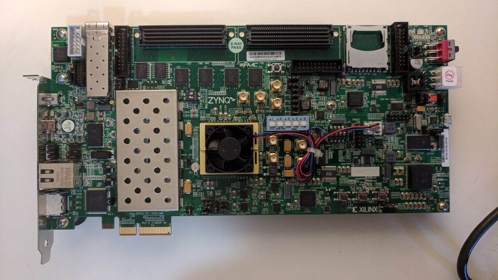
    
    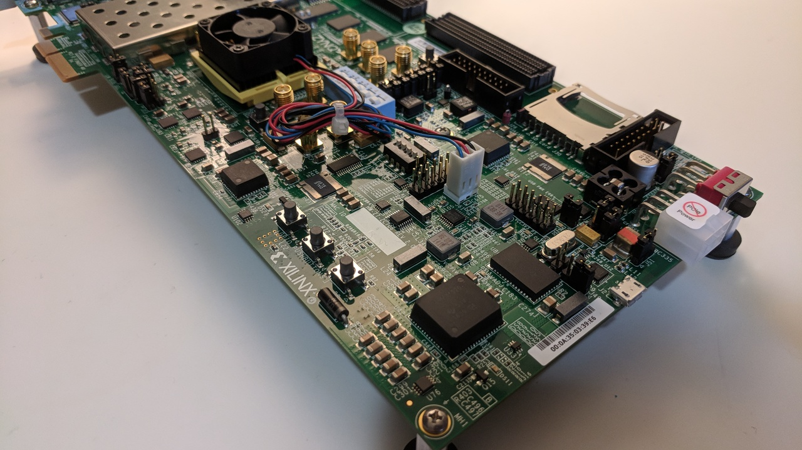
    
    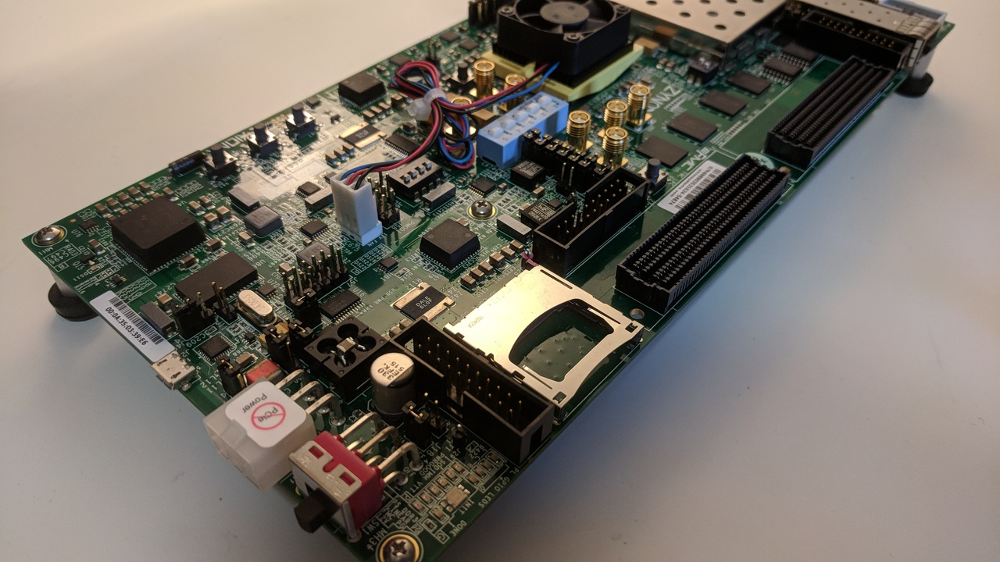
    
    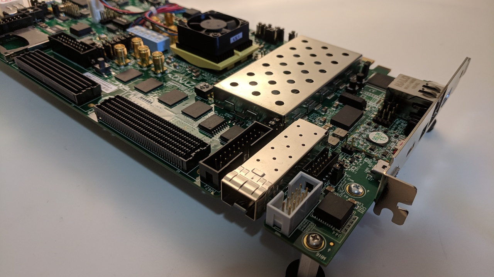
    
    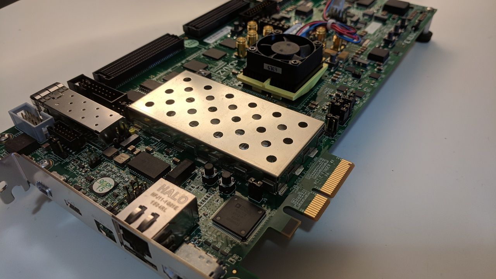
    
-   USB to Type-A to Mini-B cable (for UART)
    
    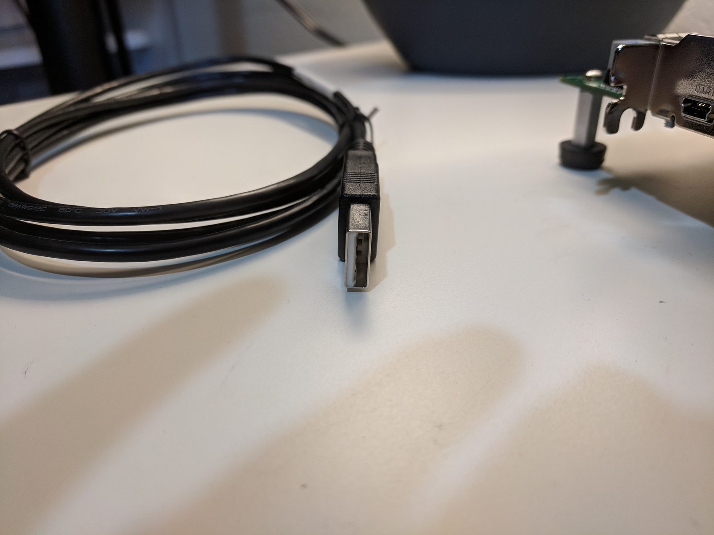
    
    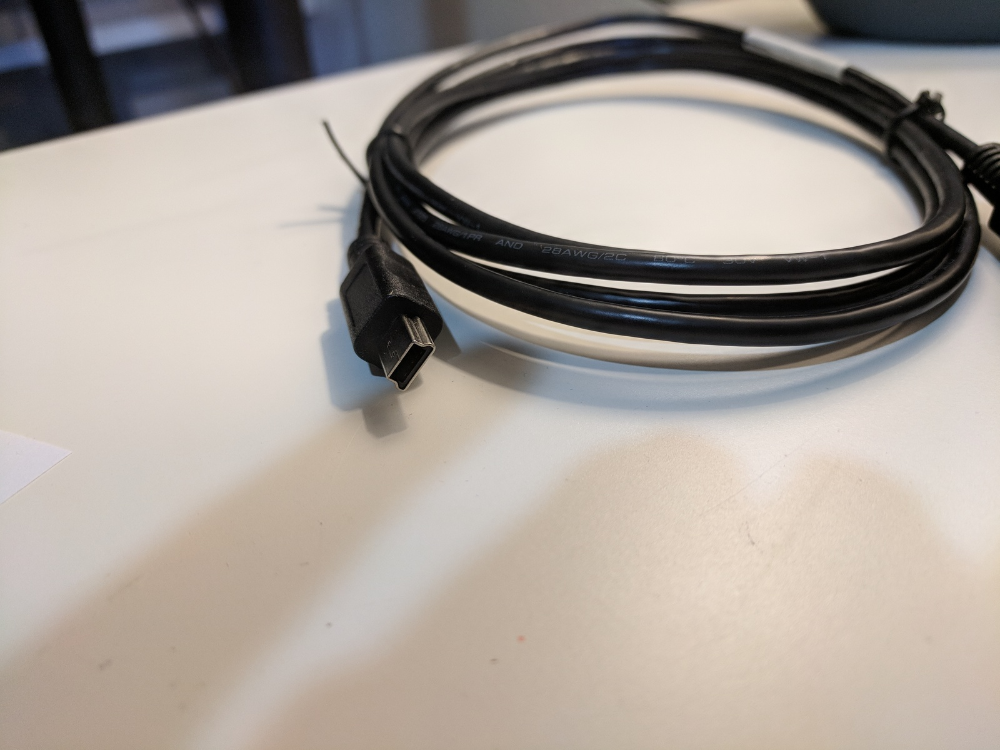
    
    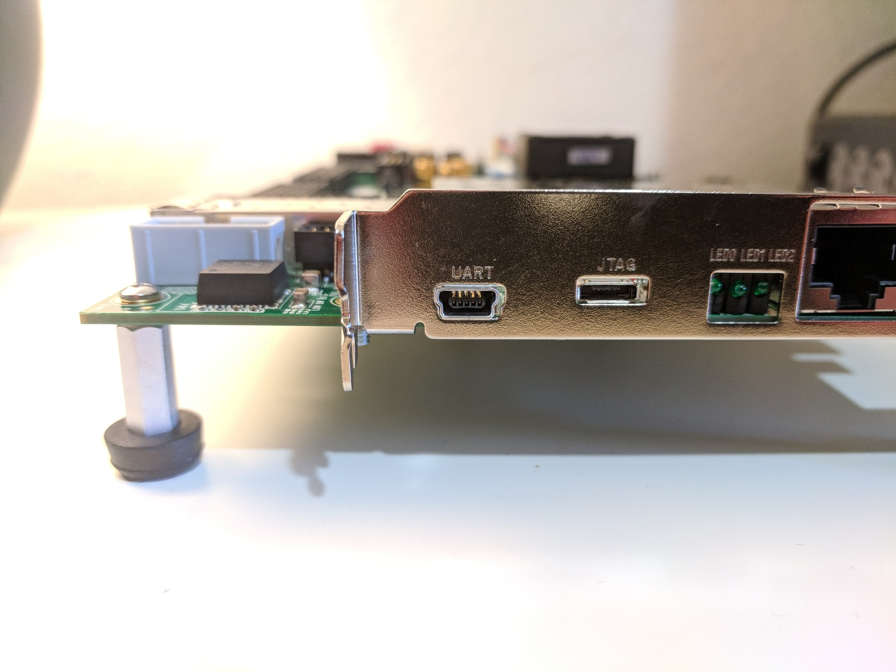
    
-   Digilent JTAG USB Type-A to Micro-B cable
    

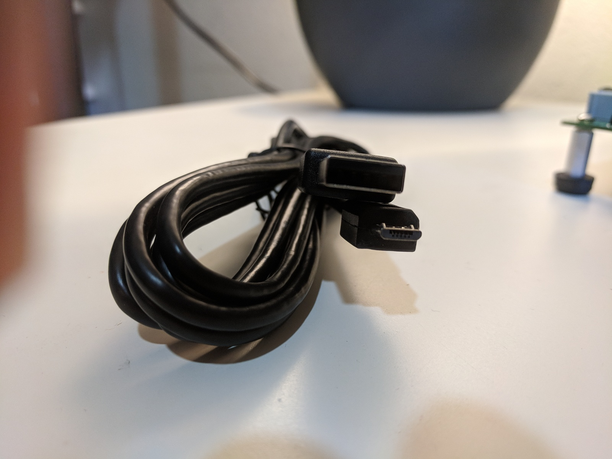

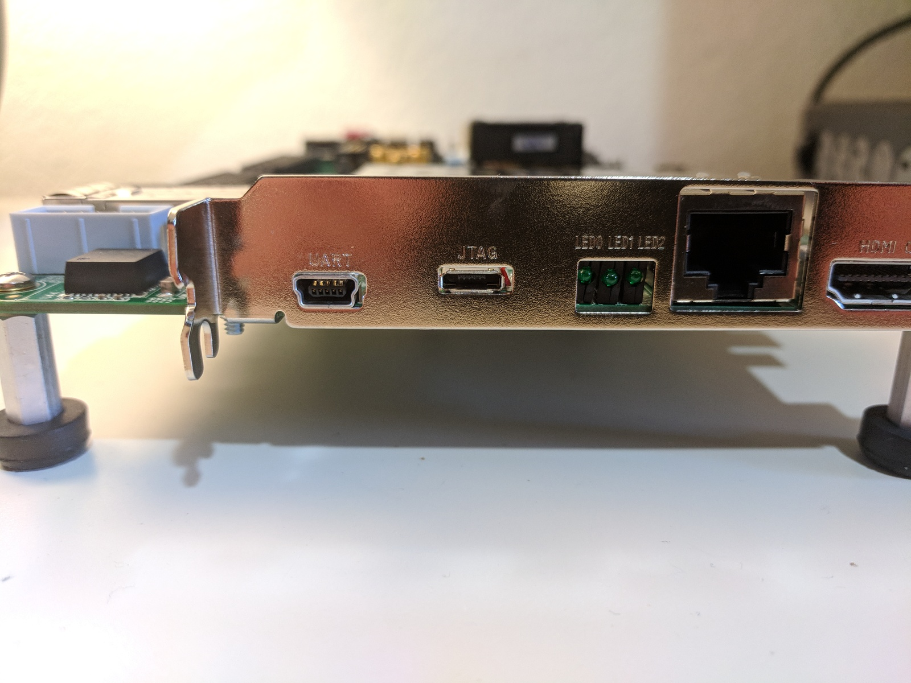

TODO: is there something special about this cable?

-   AC power adapter (12 VDC)
    

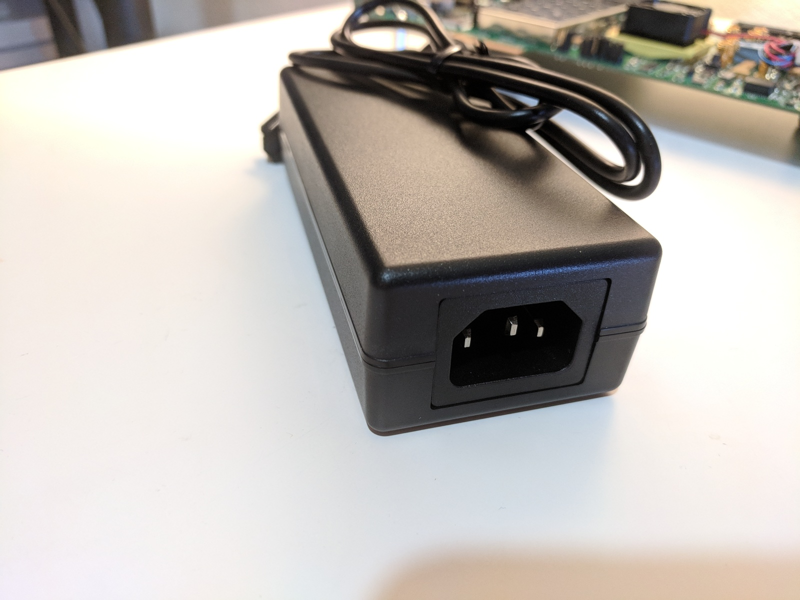

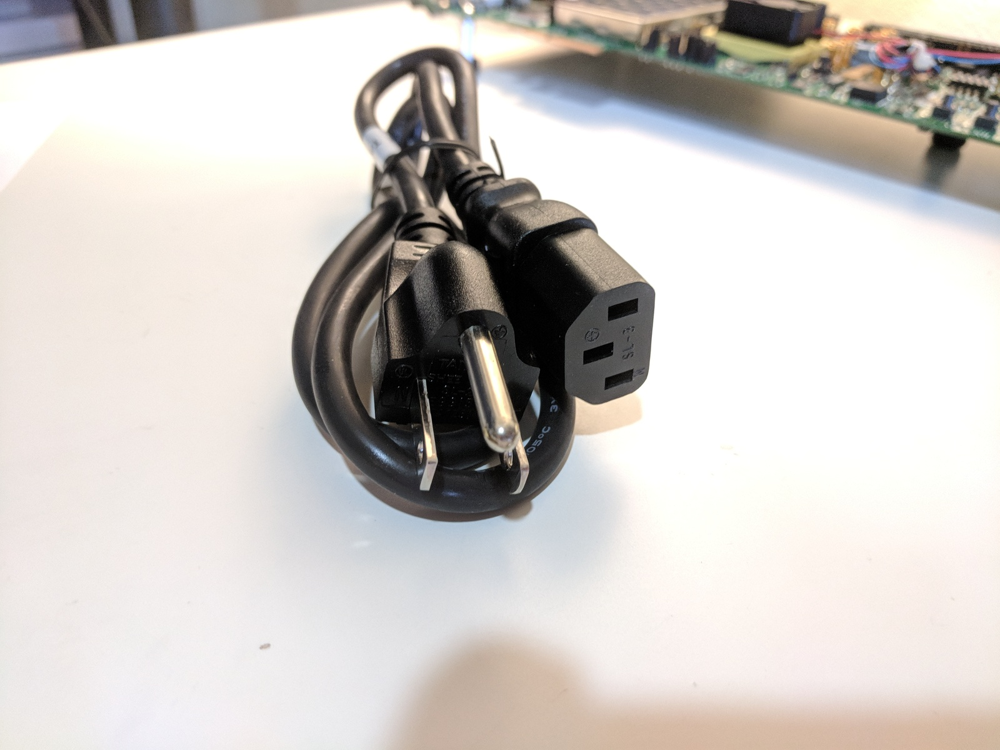

-   TeraTerm Pro terminal or alternative
    

TeraTerm is available at \[[<u>link</u>](https://osdn.net/projects/ttssh2/)\]. Version 4.99 was used in this post. Its available at \[[<u>link</u>](https://osdn.net/projects/ttssh2/downloads/69613/teraterm-4.99.exe/)\]. I selected the **Standard install**. This installed:

Destination location:

C:\\Program Files (x86)\\teraterm

Setup type:

Standard installation

Selected components:

Tera Term & Macro

TTSSH

CygTerm+

TTProxy

Additional Plugins

TTXResizeMenu (VT-Window size can be changed from preset)

TTXttyrec (ttyrec format record data can be recorded or playback)

Start Menu folder:

Tera Term

Additional tasks:

Create Tera Term shortcut to Desktop

Create Tera Term shortcut to Quick Launch

**Note**: When I tried to download Tera Term Pro from the link listed in the Getting Started Guide \[[<u>link</u>](http://www.ayera.com/teraterm/)\] from Ayera Technologies on July 4th 2018 (Version 3.1.3) I got the following error:

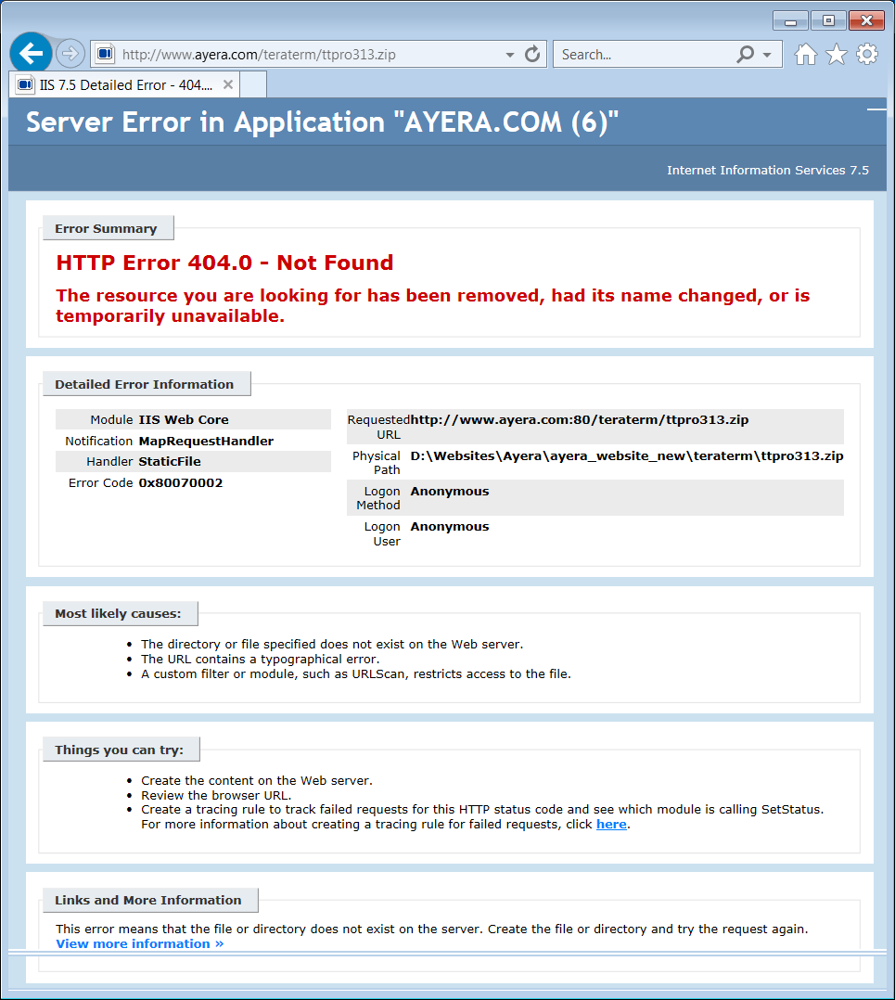

-   USB-UART drivers from Silicon Labs
    

More to come...

**Reference**

ZC706 Getting Started Guide, UG961 (v6.0.1) January 28, 2015 \[[<u>link</u>](https://www.xilinx.com/support/documentation/boards_and_kits/zc706/2014_4/ug961-zc706-GSG.pdf)\]