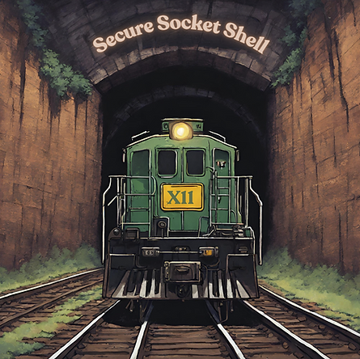

# Mastering Remote Access: Secure GUI Solutions through SSH Tunneling

Welcome to my latest blog post, "Mastering Remote Access: Secure GUI Solutions through SSH Tunneling." In today's increasingly remote and digital workspace, accessing a graphical user interface (GUI) on a remote computer securely is not just a convenience—it's a necessity. Whether you're a system administrator managing servers, a developer working on a remote machine, or need to access your office computer from home, the ability to interact with a remote desktop environment securely and efficiently can greatly enhance productivity and workflow. **This post delves into remote GUI access, focusing on robust and secure methods utilizing SSH tunneling.** From the simplicity of X11 forwarding to the comprehensive capabilities of VNC and RDP, we'll guide you through the best practices and tools to master remote GUI access securely and efficiently. Join us as we explore these technologies' ins and outs, helping you integrate them into your remote working toolkit seamlessly.

###### Secure GUI Solutions Through SSH Tunneling

Using SSH tunneling to access a GUI securely on a remote computer is a reliable and secure method. There are a few options you can consider:

1\. [**<u>X11</u>**](https://en.wikipedia.org/wiki/X_Window_System) **Forwarding:**

-   X11 forwarding with SSH allows you to run graphical applications on a remote machine and forward the display to your local machine.
    
-   To use X11 forwarding, you need an X server on your local machine. On Linux, this is typically already present. You can use Xming or VcXsrv on Windows and macOS, XQuartz.
    
-   To enable X11 forwarding, connect to the remote machine using **ssh -X \[username\]@\[host\]** or **ssh -Y \[username\]@\[host\]** (the **\-Y** option is for trusted X11 forwarding).
    
-   Once connected, you can launch GUI applications from the command line, which will be displayed on your local machine.
    

2. **Virtual Network Computing (**[**<u>VNC</u>**](https://en.wikipedia.org/wiki/Virtual_Network_Computing)**) over** [**<u>SSH</u>**](https://en.wikipedia.org/wiki/Secure_Shell)**:**

-   VNC is a popular choice for remote desktop access. It can be made secure by tunneling it through SSH.
    
-   First, set up a VNC server on the remote machine. Tools like [<u>TightVNC</u>](https://www.tightvnc.com/), [<u>TigerVNC</u>](https://tigervnc.org/), or [<u>RealVNC </u>](https://www.realvnc.com/en/) can be used.
    
-   On your local machine, establish an SSH tunnel to the remote host by running **ssh -L 5901:localhost:5901 -C -N -l \[username\] \[remote\_host\]**, assuming the VNC server is running on display **:1**.
    
-   Then, use a VNC client on your local machine to connect to **localhost:5901**. The VNC session will be secured through the SSH tunnel.
    

3\. **Remote Desktop Protocol (**[**<u>RDP</u>**](https://en.wikipedia.org/wiki/Remote_Desktop_Protocol)**) over SSH:**

-   RDP is mainly used for Windows machines but can be installed on Linux systems using [<u>xrdp</u>](https://www.xrdp.org/).
    
-   Like VNC, you can tunnel RDP sessions through SSH for added security.
    
-   The process involves forwarding the appropriate port (usually 3389 for RDP) through SSH and then connecting to the local port with an RDP client.
    

4\. **NoMachine (**[**<u>NX</u>**](https://en.wikipedia.org/wiki/NX_technology)**) over SSH:**

-   NoMachine is a powerful and efficient remote desktop software that provides a smooth and responsive GUI experience, even over slow network connections.
    
-   It can also be tunneled through SSH for secure connections.
    

5\. **Secure Web-based Solutions:**

-   Tools like [<u>Apache Guacamole</u>](https://en.wikipedia.org/wiki/Apache_Guacamole) provide web-based remote desktop access. It supports VNC, RDP, and SSH and can be configured to run securely over [<u>HTTPS</u>](https://en.wikipedia.org/wiki/HTTPS).
    

Each method has advantages and suitability depending on the network environment, the operating systems in use, and the level of graphical performance needed. X11 forwarding is generally good for individual applications, while VNC and RDP are better for a full desktop experience. NoMachine offers a balance between performance and ease of setup. Guacamole is ideal for accessing remote desktops from within a web browser without client software installation.

###### Additional Secure GUI Solutions Through SSH Tunneling

Here are some additional options:

-   **6. Remote Desktop Gateway aka** [**RD Gateway**](https://en.wikipedia.org/wiki/Remote_Desktop_Services)**:**
    - This server is a gateway between external devices and the internal network's remote desktop servers. It uses the Remote Desktop Protocol (RDP) alongside HTTPS for secure communication.

- [**7. TeamViewer**](https://www.teamviewer.com/en-us/) **or** [**AnyDesk**](https://anydesk.com/en)**:**
  - These are commercial remote desktop applications known for their ease of use and strong security features. They are suitable for individual and enterprise use, offering encrypted, stable remote connections.

- [**8. Parsec**](https://parsec.app/)**:**
  - Originally designed for game streaming, Parsec also offers high-performance remote desktop access. It's known for its low latency and high-quality video, making it suitable for graphics-intensive applications.

- [**9. Chrome Remote Desktop**](https://remotedesktop.google.com/)**:**
  - A simple and easy-to-use solution for remotely accessing your desktop from another machine via the Chrome browser or a Chromebook. It's secure and works across different platforms.

- [**10. CyberArk Alero**](https://www.cyberark.com/products/remote-access/?prevItm=609325398&prevCol=6824667&ts=7442)**:**
  - Specifically designed for secure remote access to critical systems, it's used in enterprise environments where security is paramount.

- [**11. Jump Desktop**](https://www.jumpdesktop.com/)**:**
  - A secure and reliable remote desktop application that supports RDP and VNC. It is known for its simplicity and ease of use.

- [**12. ThinLinc**](https://www.cendio.com/thinlinc/download/)**:**
  - A remote desktop server solution that is particularly effective for Linux/Unix servers and clients. It uses SSH for secure communication.

- [**13. HP Remote Graphics Software (RGS)**](https://support.hp.com/us-en/product/setup-user-guides/hp-remote-graphics-software-rgs/7275919)**:**
  - Aimed at professionals needing high-end graphics capabilities remotely, HP RGS is a robust solution for graphic-intensive applications.

Each of these additional options caters to different needs and setups. While some are more suited for individual and casual use, others are designed for enterprise environments with stringent security requirements. Your choice will depend on factors like the nature of the tasks, the required performance level, the security needs, and the ease of setup and use.