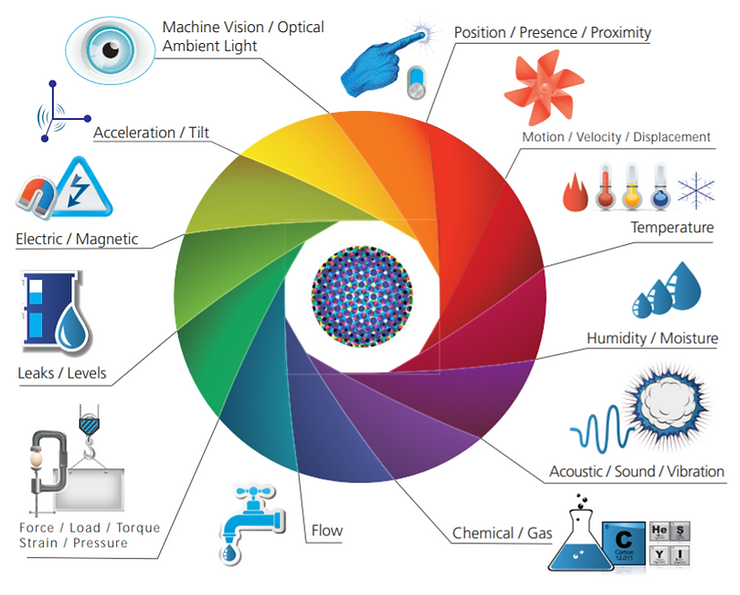

# Mobile Networks for IoT

This post lists some of the wireless networks that can support IoT and links to additional resources. The list is not exhaustive.

**<u>Legacy Cellular (may be shut down)</u>**

-   2G GSM quad-band
    
-   3G UMTS / HSDPA
    

**<u>Current Cellular</u>**

-   4G LTE CAT-M1
    

**<u>Future Cellular</u>**

-   5G (devices sending 10's Gigabytes/month)
    

**<u>Cellular IoT Low Power Wide Area Network (LPWAN)</u>**

-   NB-IoT (LTE Cat NB1 & LTE Cat NB2; 250 kbits/s downlink uplink; indoor coverage, low cost, long battery life, and high connection density)
    
-   LTE-M (1 Mbit/s)
    

**<u>Unregulated Band LPWAN</u>** - Optimized for Many Devices Sending Small Amounts of Data per Month (0.1 KB to 1 MB), listed lowest data rate to highest

-   Sigfox - 0.1 kbps
    
-   LoRa/LoRaWAN™ (low bit rate, super low power) - 9.6 kbps/0.3 kbps
    
-   Z-Wave - 9.6 kbps & 40 kbps
    
-   DASH7 (multi-year [battery life](https://en.wikipedia.org/wiki/Battery_(electricity)#Battery_lifetime), range of up to 2 km, low latency for connecting with moving things, a very small open source [protocol stack](https://en.wikipedia.org/wiki/Protocol_stack), AES 128-bit shared key encryption support) - 9.6 kbps &166 kbps
    
-   ANT+ - 20kbps to 60 kbps
    
-   ZigBee - 256 kbps
    
-   WirelessHART
    
-   Bluetooth Low Energy (BLE) - 125 kbit/s,1 Mbit/s, 2 Mbit/s
    
-   6LoWPAN/Thread - IPv6 over LPWAN / protocol over 6LoWPAN (IEEE 802.15.4 - [Zigbee](https://en.wikipedia.org/wiki/Zigbee),[\[2\]](https://en.wikipedia.org/wiki/IEEE_802.15.4#cite_note-Zigbee-2) [ISA100.11a](https://en.wikipedia.org/wiki/ISA100.11a),[\[3\]](https://en.wikipedia.org/wiki/IEEE_802.15.4#cite_note-ISA100-3) [WirelessHART](https://en.wikipedia.org/wiki/WirelessHART), [MiWi](https://en.wikipedia.org/wiki/MiWi), [6LoWPAN](https://en.wikipedia.org/wiki/6LoWPAN), [Thread](https://en.wikipedia.org/wiki/Thread_(network_protocol)) and [<u>SNAP</u>](https://en.wikipedia.org/wiki/Subnetwork_Access_Protocol) sit on 802.15.4 as well) - 256 kbps?
    

**<u>New Unregulated Spectrum</u>**

-   Sony's Low-Power Wide Area \[[link](https://www.sony-semicon.co.jp/products_en/eltres/usecase.html)\]\[[link](https://www.engadget.com/2019/05/28/sony-built-an-iot-chip-with-a-60-mile-range/?guccounter=1&guce_referrer=aHR0cHM6Ly9zbGFzaGRvdC5vcmcv&guce_referrer_sig=AQAAAFd1KMPyzLovqEgZHdjFLjhn9s2jP228RURhmbLD3ywn5pYmuRvJT7n7iw2EgOQhoX2Ls8IW4gYQAx_apUSUQcbujmwMhsSuZpZ9sfabTcGo8iZEGySfEonEyZ76RYbnzOFd9S4Mev30Hn-0fBw3uQvBaagsMPV9NWaAi2cLT0de)\]
    

**<u>References</u>**

-   GSM / 3G / 4G (LTE) - Which One to Choose for Your IoT Project? @ \[[link](https://1ot.mobi/blog/gsm-3g-4g-lte-which-one-to-choose-for-your-iot-project)\]
    
-   3GPP Narrowband Cellular Standards (LTE Cat 1, LTE-M, NB-IoT, EC-GSM-IoT) @ \[[link](https://en.wikipedia.org/wiki/Narrowband_IoT)\]
    
-   Wireless Carriers and Mobile Network Operators @ \[[link](https://www.frequencycheck.com/carriers/)\]
    
-   Network Coverage @ \[[link](https://www.gsmarena.com/network-bands.php3)\]
    
-   NB-IoT @ \[[link](https://en.wikipedia.org/wiki/Narrowband_IoT)\]
    
-   LPWAN @ \[[link](https://en.wikipedia.org/wiki/LPWAN)\]
    
-   6LoWPAN @ \[[link](https://en.wikipedia.org/wiki/6LoWPAN)\]
    
-   6LoWPAN demystified @ \[[link](http://www.ti.com/lit/wp/swry013/swry013.pdf)\]
    
-   What exactly is the "Internet of Things"? @ \[[link](https://s3.amazonaws.com/postscapes/IoT-Harbor-Postscapes-Infographic.pdf)\]
    
-   Overview LP-WAN @ \[[link](https://fr.slideshare.net/MaartenWeyn1/overview-of-low-power-wide-area-networks)\]
    
-   Z-Wave @ \[[link](https://en.wikipedia.org/wiki/Z-Wave)\]
    
-   DASH7 @ \[[link](https://en.wikipedia.org/wiki/DASH7)\]
    
-   ZigBee @ \[[link](https://en.wikipedia.org/wiki/Zigbee)\]
    
-   ANT+ @ \[[link](https://en.wikipedia.org/wiki/ANT_(network))\]
    
-   WirelessHART @ \[[link](https://en.wikipedia.org/wiki/WirelessHART)\]
    
-   Bluetooth Low Energy (BLE) @ \[[link](https://en.wikipedia.org/wiki/Bluetooth_Low_Energy)\]
    
-   IEEE 802.15.4 @ \[[link](https://en.wikipedia.org/wiki/IEEE_802.15.4)\]