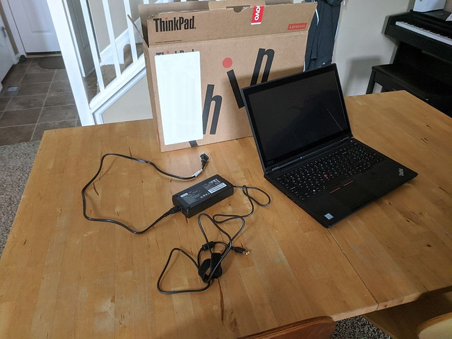
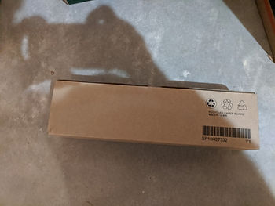
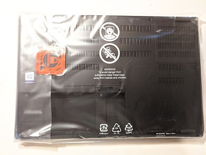
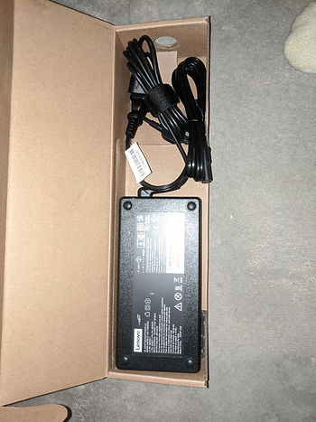
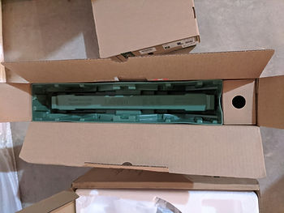
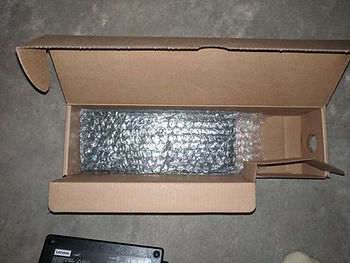
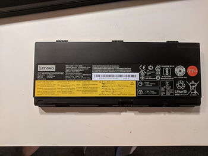

# New Lenovo P52 Thinkpad System Information

This post lists the configuration details, system information, links to documentation, and the cost of a 20MAS87F00 ThinkPad P52 Mobile Workstation I bought to augment my T460 \[[link](http://www.zachpfeffer.com/single-post/2017/01/28/New-T460-System-Information)\]. It is intended to act as a reference for future HOWTOs, to help me easily find docs for it, and for anyone who may find this information useful.

**Configuration Details**

| Processor          | 8th Generation Intel® Core™ i9-8950HK Processor (2.90 GHz, up to 4.80 GHz with Turbo Boost, 6 Cores, 12 Threads, 12 MB Cache) |
| :----------------- | :----------------------------------------------------------- |
| Operating System   | Windows 10 Pro 64                                            |
| Display Type       | 15.6" 4K UHD (3840 x 2160) WVA, anti-glare, touchscreen, 400 nits |
| Memory             | 32 GB DDR4 2400MHz (2 x 16 GB)                               |
| Hard Drive         | 1 TB PCIe SSD                                                |
| Warranty           | 3 Year Depot or Carry-in                                     |
| AC Adapter         | 170W                                                         |
| Graphics           | NVIDIA® Quadro® P3200 6GB                                    |
| Battery            | 6 Cell Li-Ion 90Wh                                           |
| Camera             | IR & 720p HD                                                 |
| Fingerprint Reader | Fingerprint Reader                                           |
| Keyboard           | Backlit with Number Pad - US English                         |
| Wireless           | Intel® 9560 802.11AC (2 x 2) & Bluetooth® 5.0                |

**System Information**

Note: find by typing "System Information" into the **Type here to search** box in Windows 10

| OS Name                                               | Microsoft Windows 10 Pro                                     |
| :---------------------------------------------------- | :----------------------------------------------------------- |
| Version                                               | 10.0.18362 Build 18362                                       |
| Other OS Description                                  | Not Available                                                |
| OS Manufacturer                                       | Microsoft Corporation                                        |
| System Name                                           | LAPTOP-3MCNKKJO                                              |
| System Manufacturer                                   | LENOVO                                                       |
| System Model                                          | 20MAS87F00                                                   |
| System Type                                           | x64-based PC                                                 |
| System SKU                                            | LENOVO_MT_20MA_BU_Think_FM_ThinkPad P52                      |
| Processor                                             | Intel(R) Core(TM) i9-8950HK CPU @ 2.90GHz, 2904 Mhz, 6 Core(s), 12 Logical Processor(s) |
| BIOS Version/Date                                     | LENOVO N2CET53W (1.36 ), 5/11/2020                           |
| SMBIOS Version                                        | 3.1                                                          |
| Embedded Controller Version                           | 1.16                                                         |
| BIOS Mode                                             | UEFI                                                         |
| BaseBoard Manufacturer                                | LENOVO                                                       |
| BaseBoard Product                                     | 20MAS87F00                                                   |
| BaseBoard Version                                     | SDK0T08861 WIN                                               |
| Platform Role                                         | Mobile                                                       |
| Secure Boot State                                     | On                                                           |
| PCR7 Configuration                                    | Elevation Required to View                                   |
| Windows Directory                                     | C:\Windows                                                   |
| System Directory                                      | C:\Windows\system32                                          |
| Boot Device                                           | \Device\HarddiskVolume1                                      |
| Locale                                                | United States                                                |
| Hardware Abstraction Layer                            | Version = "10.0.18362.329"                                   |
| User Name                                             | LAPTOP-3MCNKKJO\Zach Pfeffer                                 |
| Time Zone                                             | Pacific Daylight Time                                        |
| Installed Physical Memory (RAM)                       | 32.0 GB                                                      |
| Total Physical Memory                                 | 31.7 GB                                                      |
| Available Physical Memory                             | 25.9 GB                                                      |
| Total Virtual Memory                                  | 36.7 GB                                                      |
| Available Virtual Memory                              | 29.7 GB                                                      |
| Page File Space                                       | 5.00 GB                                                      |
| Page File                                             | C:\pagefile.sys                                              |
| Kernel DMA Protection                                 | Off                                                          |
| Virtualization-based security                         | Not enabled                                                  |
| Device Encryption Support                             | Elevation Required to View                                   |
| Hyper-V - VM Monitor Mode Extensions                  | Yes                                                          |
| Hyper-V - Second Level Address Translation Extensions | Yes                                                          |
| Hyper-V - Virtualization Enabled in Firmware          | Yes                                                          |
| Hyper-V - Data Execution Protection                   | Yes                                                          |

**Documentation**

-   ThinkPad P52 User Guide \[[link](http://drive.google.com/file/d/1U_D6c23XAg5HGfSKXEptRSS8BckYEGFr/view?usp=sharing)\]
    
-   ThinkPad P52 Hardware Maintenance Manual \[[link](http://drive.google.com/file/d/1xdKgR5ywl4Pcc9cBkGfMPm1G8HlRoVBC/view?usp=sharing)\]
    
-   ThinkPad P52 Platform Specifications \[[link](http://drive.google.com/file/d/19ur6ky5mefXZA1yvwYx5stq7DjYGstup/view?usp=sharing)\] (had to email Lenovo support for this one)
    
-   Lenovo documentation \[[link](http://pcsupport.lenovo.com/us/en/products/laptops-and-netbooks/thinkpad-p-series-laptops/thinkpad-p52-type-20m9-20ma/manuals/um500689)\]
    
-   Intel Core i9-8950HK Processor \[[link](http://ark.intel.com/content/www/us/en/ark/products/134903/intel-core-i9-8950hk-processor-12m-cache-up-to-4-80-ghz.html)\]
    

**Cost**

$2,192.20

Note: this was marked down from over $4,000 (I failed to note down the original cost)

**Some Unboxing Photos**

**References**

-   Tables built with Tables Generator at \[[link](http://www.tablesgenerator.com/html_tables)\]